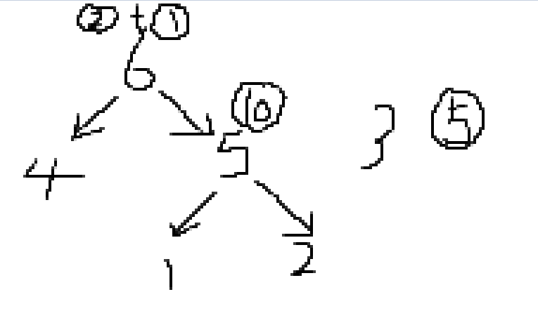

[活动 - AcWing](https://www.acwing.com/activity/content/19/)


### 整数拼接


#### 思路


```
我的思路是就认为要(aj*10^i+ai)%k=0,则(aj或10^i)和ai必定为k的倍数,只要统计原序列中是k的倍数的个数,和每个情况10^i是否是k的倍数就行..但忘记了可能它们三个都不是,但a[j]和a[i]之间的因子相乘后变成了k的倍数....
```


```
本题暴力的话会错,因为1e9拼接1e9,会超过ll的范围......

题意转换为求有几组ai,aj.使得图片的式子能整除k.

我们枚举每个ai,ai固定的,ki也就是固定的(ki就是ai的位数,与下面的除数k无任何关系...),我们现在只要求一个ai有几个对应的aj,使得这个式子能整除k. k | aj * 10^ki+aj=>aj * 10^ki+aj≡0 (mod m)=> aj * 10^ki≡-ai(mod k)

预处理:
因为最大就1e9,指数最大为10,我们开一个哈希表(数组),存储 指数i从0~10的每个ai * 10^i对题目所给k的余数(t) 的个数,cnt[i][t]. t就是余数. 

然后我们遍历题目所给a数组,求一下每个ai,算出对k的余数:t1,并且求出位数s,答案res+=cnt[s][t1].记住,要是这个ai本身也在我们现在所查的哈希表里(意思就是ai拼接上ai也能整除k),我们必须要减掉,因为题目要求不能对同一个数进行拼接

复杂度也就O(11n+n)

此题的亮点在于预处理
```


#### 代码

```c++
#include <iostream>
#include <cstring>
#include <algorithm>

using namespace std;

typedef long long LL;
const int N = 100010;

int n, m;
int a[N], s[11][N];

int main()
{
     scanf("%d%d", &n, &m);
     for (int i = 0; i < n; i++)
          scanf("%d", &a[i]);
     for (int i = 0; i < n; i++)
     {
          LL t = a[i] % m;
          for (int j = 0; j < 11; j++)
          {
               s[j][t]++;
               t = t * 10 % m;
          }
     }

     LL res = 0;
     for (int i = 0; i < n; i++)
     {
          LL t = a[i] % m;
          int len = to_string(a[i]).size();//求a[i]位数
          res += s[len][(m - t) % m];

          LL r = t;
          while (len--)//判断这个a[i]会不会拼接上它本身
               r = r * 10 % m;
          if (r == (m - t) % m)//原来是(-t)%m,但因为这是负数,所以要(m+(-t))%m
               res--;
     }

     printf("%lld\n", res);

     return 0;
}

```


```c++
错误代码
#include <bits/stdc++.h>
using namespace std;
const int N = 1e5 + 10;
typedef long long ll;
int a[N];

int main()
{
     ll n, k;
     cin >> n >> k;
     ll cnt = 0, cnt1 = 0;
     for (int i = 0; i < n; i++)
          cin >> a[i];

     for (int i = 0; i < n; i++)
     {
          if (a[i] % k == 0)
               cnt++;
          }

     for (int i = 0; i < n; i++)
     {
          if (a[i] % k == 0)
          {
               ll t = a[i];
               ll s = 0;
               while (t)
               {
                    s++;
                    t /= 10;
               }
               ll x = pow(10, s);

               if (x % k == 0)
               {
                    cnt1 += n - 1;
               }
               else
               {
                    cnt1 += cnt - 1;
               }
          }
     }
     cout << cnt1;
}
```


### 网络分析

#### 思路

```
并查集

刚开始想的就是,出现1,就合并集合,出现2就dfs遍历这个集合,给每个点赋上权值(或者把2操作所对应的权值赋给所给点的祖宗节点x,遍历1~n号点,每个点的祖宗节点为x的都加上这个赋值),而这操作显而易见会超时.我们不可能没出现一个2,就遍历一边集合,这样重复的点太多了...

建树!
看网友题解,是每出现一个1,我们并不合并这两个集合,而是建一个新的根节点(root),连接这两个集合的祖宗节点(单向边,用于之后dfs遍历),并且这个根节点成为这两个祖宗节点的父节点.然后出现一个2(连通块累加操作),就把权值赋值在题目所给点的祖宗节点上(只需要向集合的根节点(祖宗节点)加一个值即可)

最后进行m次操作结束,只要遍历每个点,对每个祖宗节点是自己的点进行dfs遍历(这些点只可能是我们自己建的root,或者一个没有任何连线的单独的点),把它的值不断赋给下面的子节点...
每个题目所给节点只会遍历一遍,一个连通块里遍历过之后,这个点就不可能在另一个连通块出现
时间复杂度:O(n+m)(n点的个数,m是操作数(假设每个操作都是产生一个新节点))

如下图就是按照所给样例,建成的一棵树.6,5都是我们自己建的新root.6节点的值是3,遍历的时候,3这个值传给4和5,五号节点就变成13,然后再把13传给1和2号点..

然后发现y总的思路好像差不多,但代码不太一样,没有dfs遍历,以下还没写...
```





#### 代码

```c++
//网友题解
 int main()
{
     memset(h, -1, sizeof h);

     scanf("%d%d", &n, &m);
     for (int i = 1; i <= n * 2; i++)
          p[i] = i;

     int root = n + 1;
     while (m--)
     {
          int op, a, b;
          scanf("%d%d%d", &op, &a, &b);
          if (op == 1)
          {
               if (find(a) != find(b))
               {
                    a = p[a], b = p[b];//这里必须把原本的a,b的祖宗节点拎出来,因为下面这个add要连接的是a,b原本的祖宗节点.要是
                    p[a] = p[b] = root;//这一行写成p[p[a]]=p[p[b]],上一行去掉,那么我们就找不出a,b的原本的祖宗节点了.

                    add(root, a);
                    add(root, b);
                    root++;
               }
          }
          else
          {
               a = find(a);
               f[a] += b;
          }
     }

     for (int i = n + 1; i < root; i++)
          if (p[i] == i)
               dfs(i, 0);
     cout << 'a';
     for (int i = 1; i <= n; i++)
          printf("%d ", f[i]);
     return 0;
}
 
```


```c++
//自己敲的

#include <bits/stdc++.h>
using namespace std;
const int N = 200010, M = N << 1;
vector<int> v[N];

int n, m;
int p[N];
int find(int x)
{
     if (p[x] != x)
          p[x] = find(p[x]);
     return p[x];
}

int w[N];

void dfs(int u)
{
     for (auto t : v[u])
     {
          w[t] += w[u];
          dfs(t);
     }
}

int main()
{
     cin >> n >> m;

     for (int i = 0; i < 2 * n; i++)
          p[i] = i;
     int root;
     root = n + 1;
     for (int i = 0; i < m; i++)
     {
          int z, b, a;

          cin >> z >> a >> b;
          if (z == 1)
          {
               a = find(a), b = find(b);
               if (a != b)
               {
                    p[a] = p[b] = root;
                    v[root].push_back(a);
                    v[root].push_back(b);
                    root++;
               }
          }
          else
          {
               a = find(a);
               w[a] += b;
          }
     }
     for (int i = n + 1; i < root; i++)
     {
          if (p[i] == i)
               dfs(i);
     }

     for (int i = 1; i <= n; i++)
          printf("%d ", w[i]);
}
```


### 超级胶水

#### 思路

```
有点简单...

我随便设了三个值a,b,c,发现无论按什么顺序取,它的答案都一样..从而k推广到n个数,无论怎么取,答案都不会变


```

#### 代码

```c++
#include <bits/stdc++.h>
using namespace std;
const int N = 1e5 + 10;
typedef long long ll;
int a[N];
ll w, sum;
int main()
{
     int n;
     cin >> n;
     for (int i = 0; i < n; i++)
     {
          cin >> a[i];
          if (i == 0)
               w = a[i];
          if (i >= 1)
          {
               sum += a[i] * w;
               w += a[i];
          }
     }
     cout << sum;
}
```


