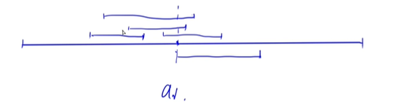

### 完全平方数

[3491. 完全平方数 - AcWing题库](https://www.acwing.com/problem/content/3494/)


#### 题目

一个整数 a 是一个完全平方数，是指它是某一个整数的平方，即存在一个整数 b，使得 a=b^2^。

给定一个正整数 n，请找到最小的正整数 x，使得它们的乘积是一个完全平方数。


输入格式

输入一行包含一个正整数 n。

输出格式

输出找到的最小的正整数 x。


数据范围

对于 30%的评测用例，1≤n≤1000，答案不超过 1000。对于 60% 的评测用例，1≤n≤10^8^，答案不超过 10^8^。对于所有评测用例，1≤n≤10^12^，答案不超过 10^12^。


输入样例1：

```
12
```

输出样例1：

```
3
```

输入样例2：

```
15
```

输出样例2：

```
15
```


#### 题意

```
	
	1e12,直接枚举n的话会超时.
	
	n*x=m,m是完全平方数,则m里面出现的每个质因子的次数都一定是偶数,只有这样才能使m平均分成两份(被开平方).所以我们只要算出n的质因子,哪些只出现奇数次的,再乘一个变偶数次,自己乘上去的那些累计起来就变成了x
	
	分解质因数在基础课数论也有讲.
	
```


#### 代码

```c++

#include <bits/stdc++.h>
using namespace std;
typedef long long ll;
int main()
{
     ll n;
     cin >> n;
     ll res = 1;

     //分解质因数
     for (ll i = 2; i * i <= n; i++)
     {
          if (n % i == 0) 
          {
               ll cnt = 0;
               while (n % i == 0)
               {
                    cnt++;
                    n /= i;
               }
               if (cnt & 1)
                    res *= i;
          }
     }

     res *= n;//乘最后剩下的那个

     cout << res;
}

```


### 负载均衡(模拟堆)

[3492. 负载均衡 - AcWing题库](https://www.acwing.com/problem/content/3495/)


#### 题目

有 nn 台计算机，第 i 台计算机的运算能力为 vi。

有一系列的任务被指派到各个计算机上，第 ii 个任务在 aiai 时刻分配，指定计算机编号为 bi，耗时为 ci 且算力消耗为 di。

如果此任务成功分配，将立刻开始运行，期间持续占用 bi 号计算机 di 的算力，持续 ci 秒。

对于每次任务分配，如果计算机剩余的运算能力不足则输出 −1，并取消这次分配，否则输出分配完这个任务后这台计算机的剩余运算能力。


输入格式

输入的第一行包含两个整数 n,m，分别表示计算机数目和要分配的任务数。

第二行包含 nn 个整数 v1,v2,⋅⋅⋅vn，分别表示每个计算机的运算能力。

接下来 m 行每行 4 个整数 ai,bi,ci,di，意义如上所述。数据保证 ai 严格递增，即 ai<ai+1。

输出格式

输出 m 行，每行包含一个数，对应每次任务分配的结果。

数据范围

对于 20%20% 的评测用例，n,m≤200。对于 40%40% 的评测用例，n,m≤2000。
对于所有评测用例，1≤n,m≤200000，1≤ai,ci,di,vi≤109，1≤bi≤n


输入样例：

```
2 6
5 5
1 1 5 3
2 2 2 6
3 1 2 3
4 1 6 1
5 1 3 3
6 1 3 4
```

输出样例：

```
2
-1
-1
1
-1
0
```

样例解释

时刻 1，第 1 个任务被分配到第 1 台计算机，耗时为 5，这个任务时刻 6 会结束，占用计算机 1 的算力 3。

时刻 2，第 2 个任务需要的算力不足，所以分配失败了。

时刻 3，第 1 个计算机仍然正在计算第 1 个任务，剩余算力不足 3，所以失败。

时刻 4，第 1 个计算机仍然正在计算第 1 个任务，但剩余算力足够，分配后剩余算力 1。

时刻 5，第 1 个计算机仍然正在计算第 1,4 个任务，剩余算力不足 4，失败。

时刻 6，第 1 个计算机仍然正在计算第 4 个任务，剩余算力足够，且恰好用完。


#### 题意

```

	本来是想题目给一次任务分配,讨论一下,判断所用的机器有没有到时间和有没有剩余算力.可结果发现一个机器可以同时开多个任务,一个任务好了就会把占用的算力还回去,在以时间i遍历的时候,无法清楚表示多个任务同时做,每个任务时间到了,相继归还算力的过程
	
	结果看了y总,是每讨论一次任务分配,都要先讨论这台机器的任务列表里有没有已经到时见的任务,到了先把它踢掉,把占用的算力加回去.再讨论这次任务这台机器有没有算力去支持,没有的话输出-1,有的话减去这部分算力,把这个任务加入列表.
	
	每一个计算机都可以用一个堆(如优先队列)来维护,如以下,一个计算机在执行4个任务,在ai这个时间,又有新任务了,我们先看看ai之前有没有任务已经做完,发现有一个区间,所以我们把这个区间删了.(优先队列按照每个任务的结束时间升序排序)
	
```




```
	但是对这道题的时间复杂度有点疑问
```


#### 代码

```c++

#include <bits/stdc++.h>
using namespace std;
const int N = 2e5 + 10;
typedef pair<int, int> pii;
priority_queue<pii, vector<pii>, greater<pii>> q[N];//优先队列
int a[N];

int main()
{
     int n, m;
     cin >> n >> m;
     for (int i = 1; i <= n; i++)
          cin >> a[i];

     while (m--)
     {
          int b, c, d, e;
          cin >> b >> c >> d >> e;
          while (q[c].size() && q[c].top().first <= b)//把已经完成的任务清空
          {
               a[c] += q[c].top().second;
               q[c].pop();
          }
          if (a[c] < e)
               puts("-1");
          else
          {
               q[c].push({b + d, e});
               a[c] -= e;
               cout << a[c] << endl;
          }
     }
}
```

