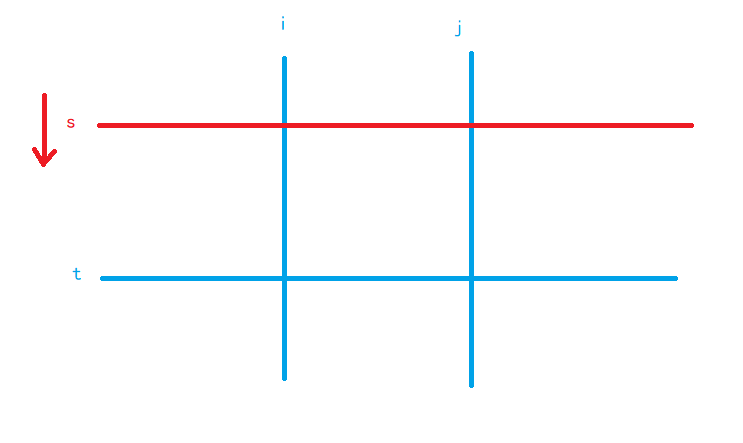

[13届 省赛B组](https://www.acwing.com/activity/content/punch_the_clock/19/)


## 统计子矩阵

**题目:**

​	给定一个 N×M 的矩阵 A，请你统计有多少个子矩阵 (最小 1×1，最大 N×M 满足子矩阵中所有数的和不超过给定的整数 K?

1≤N,M≤500;0≤Aij≤1000;1≤K≤2.5×108


**思路:**

如果直接用 前缀和 + 暴力，复杂度将是O(n^4^)，必须优化

优化的方法是：(利用双指针,orz)
1）枚举子矩阵的 左边界i 和 右边界j，
2）用 快指针t 枚举 子矩阵的下边界，慢指针s 维护 子矩阵的上边界 (s <= t)
3）如果得到的子矩阵的权值和 大于 k，则慢指针s 前进，而子矩阵和必将单调不增
4）慢指针s 继续前进（如图），直到 子矩阵的和 不大于k，慢指针没必要前进了，因为该子矩阵的所有宽度为 j - i + 1 的子矩阵（总共 t - s + 1 种）一定满足要求，更新该情况对答案的贡献 t - s + 1；反之，如果慢指针s越界（s > t），则不操作，直接进入下层循环

双指针(O(n)) * 前缀和(O(n^2^))





**code**

```c++

#include <iostream>
using namespace std;

typedef long long ll;
const int N = 5e2 + 3;
int n, m, k;
int a[N][N];

int main()
{
     ios::sync_with_stdio(false);
     cin >> n >> m >> k;
     for (int i = 1; i <= n; i++)
     {
          for (int j = 1; j <= m; j++)
          {
               cin >> a[i][j];
               a[i][j] += a[i - 1][j] + a[i][j - 1] - a[i - 1][j - 1];
          }
     }

     ll ans = 0;
     for (int i = 1; i <= m; i++)
     {
          for (int j = i; j <= m; j++)
          {
               for (int s = 1, t = 1; t <= n; t++)
               {
                    while (s <= t && a[t][j] - a[s - 1][j] - a[t][i - 1] + a[s - 1][i - 1] > k)
                         s++;
                    if (s <= t)
                         ans += t - s + 1;
               }
          }
     }

     cout << ans << '\n';
}

```


## 积木画

**题意:**

​	小明最近迷上了积木画，有这么两种类型的积木，分别为 I 型（大小为 2 个单位面积）和 L 型（大小为3 个单位面积）：


同时，小明有一块面积大小为 2×N 的画布，画布由 2× 个 1×1 区域构成。

小明需要用以上两种积木将画布拼满，他想知道总共有多少种不同的方式？

积木可以任意旋转，且画布的方向固定。


**思路**

​	线性dp+滚动数组优化。

​	蒙德里安的简单版本。但不易想到这么设dp方程....

用 f[i]\[j] 表示画布画满前 i 列，第 i 列状态为  j  的方案数。

状态转移方程:

+ f[i]\[0]=(f[i−1]\[0]+f[i−1]\[3]

+ f[i]\[1]=(f[i−1]\[0]+f[i−1]\[2])

+ f[i]\[2]=(f[i−1]\[0]+f[i−1]\[1])

+ f[i]\[3]=f[i−1]\[0]+f[i−1]\[1]+f[i−1]\[2]

  

注意 f[i]\[3] 需要前面三个状态相加，取模时前两个的和先取模，最后再取一次模。

N 过大，可以考虑采用滚动数组，只需要将原先的第一维与 1 相与，将数组第一维开到2即可。

时间复杂度为 O(n ，空间复杂度为 O(n) 。（采用滚动数组空间复杂度为 O(1)）。


思路2：

​	矩阵快速幂


**code**

```c++

#include <iostream>

using namespace std;

const int mod = 1e9 + 7;
long long dp[2][3]; // dp[i][j]表示前i列填满并且填了第i+1列j个位置的方案

int main()
{
     int n;
     cin >> n;
     dp[1][0] = 1; // 一个长条竖着放
     dp[1][1] = 2; // 一个L型竖着放（可以上下翻转所以是两种）
     dp[1][2] = 1; // 两个长条横着放
     for (int i = 2; i <= n; i++)
     {
          // 这一列长条竖着放 + 前一列占满
          dp[i & 1][0] = (dp[i - 1 & 1][0] + dp[i - 1 & 1][2]) % mod;
          // 一个L型竖着放（上下翻转*2） + 这一列被占一个再横着放一个长条
          dp[i & 1][1] = (dp[i - 1 & 1][0] * 2 + dp[i - 1 & 1][1]) % mod;
          // 这一列两个长条横着放 + 一个L型摆成7字形
          dp[i & 1][2] = (dp[i - 1 & 1][0] + dp[i - 1 & 1][1]) % mod;
     }
     cout << dp[n & 1][0];
     return 0;
}

```


## 扫雷


**思路:**

​	图的遍历+哈希法存储点


## 李白打酒加强版


**题意:**

​	一个人刚出门的时候拿了两斗酒,他一路上碰到了n家花店和m加酒馆，碰到花店他就和一斗，碰到酒馆它酒壶里的酒就过了一倍，已经知道他最后一次碰到的是花店，并且酒刚好喝完。问一路上花店和酒店有多少种摆法。

1≤N,M≤100，并且答案可能会很大，模 1000000007的结果


**思路**

​	正常的三维dp思维，数据范围也很小，但之前没想....

​	dp[i]\[j]\[k]：李白路上遇到i家酒店,j家花店,且此时酒壶里还剩下k斗酒。（ps：注意这里k最多也就100，因为超过100的话，李白根本不可能到最后把酒喝完）


状态转移:

```
    if (k % 2 == 0)
          dp[i][j][k] = (dp[i - 1][j][k / 2] + dp[i][j - 1][k + 1]) % mod;
    else
          dp[i][j][k] = (dp[i][j - 1][k + 1]) % mod;
```

​	


**code**

```c++
#include <bits/stdc++.h>
using namespace std;
const int N = 200 + 10;
int dp[N][N][N];
const int mod = 1000000007;
int main()
{

     int n, m;
     cin >> n >> m;
     m--;

     //对i,j带0的进行初始化!
     dp[0][0][2] = 1;
     dp[1][0][4] = 1;
     dp[0][1][1] = 1;
     dp[0][2][0] = 1;
     int e = 4;
     for (int i = 1; i <= n; i++)
     {
          dp[i][0][e] = 1;
          e *= 2;
          if (e > 100)
               break;
     }

     for (int i = 1; i <= n; i++)
          for (int j = 1; j <= m; j++)
               for (int k = 0; k <= 100; k++)
               {
                    if (k % 2 == 0)
                         dp[i][j][k] = (dp[i - 1][j][k / 2] + dp[i][j - 1][k + 1]) % mod;
                    else
                         dp[i][j][k] = (dp[i][j - 1][k + 1]) % mod;
               }

     cout << dp[n][m][1];
}
```


