## 背包问题

[第五章 动态规划（一） - AcWing](https://www.acwing.com/video/34/)


(题库前十二题讲了所有的背包问题)

y总有一套自己的理解方式,不同于网上啥的最优子结构.

dp是没有模板的,它只是一个思想,但会给你一个可以走下去的步骤.

(个人感觉dp和递推思想差不多)


### 01背包

#### 介绍

给你n个物品,和容量是V的背包.每个物品体积Vi,价格Wi,每件物品最多用一次.我们挑几件物品,放入背包,我们能挑出的总价值最大是多少?(不一定要装满背包)

(特点:每件物品最多用一次)


#### 例子

##### 题目

有 N 件物品和一个容量是 V 的背包。每件物品只能使用一次。

第 i 件物品的体积是 vi，价值是 wi。

求解将哪些物品装入背包，可使这些物品的总体积不超过背包容量，且总价值最大。
输出最大价值。


输入格式

第一行两个整数，N，V，用空格隔开，分别表示物品数量和背包容积。

接下来有 N 行，每行两个整数 vi,wi，用空格隔开，分别表示第 ii 件物品的体积和价值。

输出格式

输出一个整数，表示最大价值。


数据范围

0<N,V≤10000<N,0<vi,wi≤10000

输入样例 

```
4 5
1 2
2 4
3 4
4 5
```

输出样例：

```
8
```


##### 题意


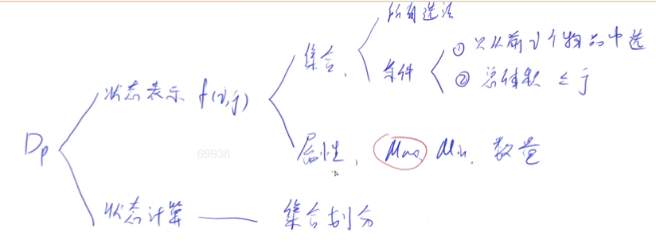


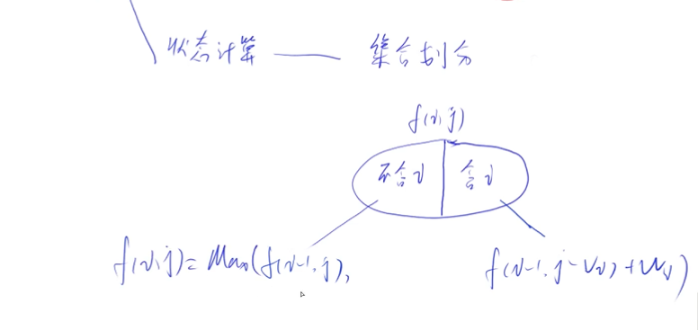


以上为y式dp理解在01背包的应用.dp在y总眼中可以分为两块,状态表示和状态计算.状态表示是本题用n维来组成(考虑哪几个方面),它的集合里包括着本题的所有选法,这些选法满足的条件是从前i个物品里选,总体积<=j.而通过属性我们确定了唯一的一种选法,(本题的属性是求最大值).这时候就要开始计算了,计算其实就是集合的划分.分为两块,方案里不包含第i个物品(等价于求f(i-1,j)),

包括第i个物品(等价于求f(i-1,j-vi)+wi.这一步的意思是,我们这半边的每个选法都包括第i个,我们就可以先假设把第i个物品都去掉,这样子最大的方案还是不会变的,我们在最后再加上第i个物品的价值+wi,因为最多也就选1个,所以加一个wi就好了)

而dp的优化我们也一般是在最朴素的写完后,进行对代码和计算方程的等价变形,所以朴素的写法也重要.


##### 代码

```c++

#include <bits/stdc++.h>
using namespace std;
const int N = 1e3 + 10;
int v[N], w[N];
int dp[N][N];
int main()
{
     int n, m;
     cin >> n >> m;
     for (int i = 1; i <= n; i++)
          cin >> v[i] >> w[i];
    
    
    //把所有都枚举一遍,保留每种情况的最值
     for (int i = 1; i <= n; i++)
          for (int j = 1; j <= m; j++)	
       //一个一个的枚举,从选前1个物品,体积不超过1开始(其实真正开始赋值操作的是从前1个物品,体积不超过v[1]开始,那时候的dp[1][v[i]]就等于w[i],然后不断往后讨论)
          {
               dp[i][j] = dp[i - 1][j];
               if (j >= v[i])	
       //判断第二部分的时候,可能是空集.我们还要判断总容量j是不是>=第i个物品的体积
                    dp[i][j] = max(dp[i][j], dp[i - 1][j - v[i]] + w[i]);
          }
    
    
     cout << dp[n][m] << endl;	//最后只要输出选前n种物品,总体积<=m的时候的答案就可以了
     return 0;
}
```


优化(二维转一维,采用滚动数组)

(滚动数组这个名词视频也有,45:32,但实际操作其实就是下面)

```c++

//前面我们发现,对dp[i][j]的讨论,其实就用到了dp[i-1]这一层,之前的都是没什么用的,并且我们真正开始讨论的体积也是从v[i]开始的.

#include <bits/stdc++.h>
using namespace std;
const int N = 1e3 + 10;
int v[N], w[N];
int dp[N];
int main()
{
     int n, m;
     cin >> n >> m;
     for (int i = 1; i <= n; i++)
          cin >> v[i] >> w[i];
    
  //   for (int i = 1; i <= n; i++)
      //    for (int j = 1; j <= m; j++)	
        //  {
            //  dp[i][j] = dp[i - 1][j];去掉后变成dp[j]=dp[j],直接删
    
            //   if (j >= v[i])	,删掉这个判别语句,直接从v[i]开始讨论
            //      dp[i][j] = max(dp[i][j], dp[i - 1][j - v[i]] + w[i]);   
    
        //  }

    
    
     //for (int i = 1; i <= n; i++)
     //   for (int j = v[i]; j <= m; j++)	
     // {
     //         dp[j] = max(dp[j], d[j - v[i]] + w[i]);
     	
    //但这时候这条式子却不等价了,因为这里的d[j - v[i]] + w[i]等价于上面的dp[i][j - v[i]] + w[i],而不是dp[i - 1][j - v[i]] + w[i];(正确的是从i-1层转移过来的,而这里却是从i层转移过来),所以为了防止覆盖,我们j从后往前讨论
    
     //}
    
    
    //最终优化方案
    for (int i = 1; i <= n; i++)
          for (int j = m; j >= v[i]; j--)
              dp[j]=max(dp[j], d[j - v[i]] + w[i]);
                 
    
     cout << dp[n][m] << endl;
     return 0;
}

```


逆序的原因:

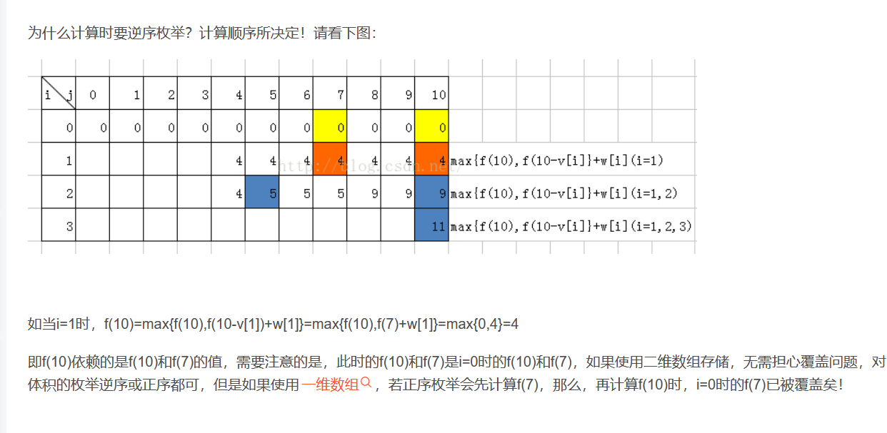


### 完全背包

#### 介绍

与01背包的区别就是,每种物品能拿的个数没有限制


#### 例子

##### 题目

有 N 种物品和一个容量是 V 的背包，每种物品都有无限件可用。

第 i 种物品的体积是 vi，价值是 wi。

求解将哪些物品装入背包，可使这些物品的总体积不超过背包容量，且总价值最大。
输出最大价值。


输入格式

第一行两个整数，N，V，用空格隔开，分别表示物品种数和背包容积。

接下来有 N 行，每行两个整数 vi,wi用空格隔开，分别表示第 i 种物品的体积和价值。

输出格式

输出一个整数，表示最大价值。

数据范围

0<N,V≤1000,0<vi,wi≤1000


输入样例

```
4 5
1 2
2 4
3 4
4 5
```

输出样例：

```
10
```


##### 题意

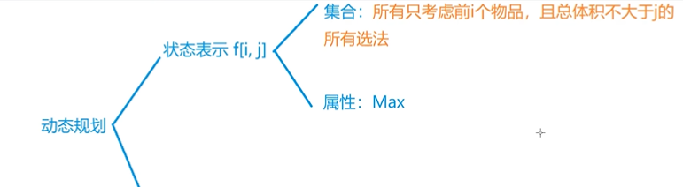


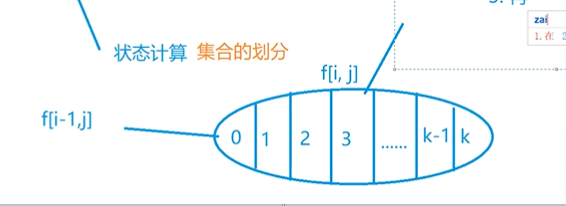


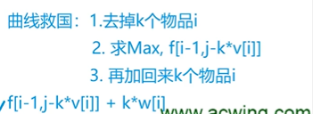

和上一个类似,但这里我们集合的划分是用第i个物品选了多少个来划分.0的话就是第i个物品一个都没选,直接f(i-1,j),而后面的话采取和上道题类似的做法,假设选了k个物品i,我们都先去掉k个物品i,就等价于求`f(i-1,j-k*v[i] )`,最后再加会k个物品i的价值,得出朴素写法的表达式`f(i-1,j-k*v[i]+k*w[i])`,这个式子也囊括了k=0的时候.


#### 代码

朴素版

```c++
//三重循环,容易超时
#include <iostream>
#include <algorithm>
using namespace std;
const int N = 1e3 + 10;
int n, m;
int v[N], w[N];
int f[N][N];

int main()
{
     cin >> n >> m;
     for (int i = 1; i <= n; i++)
          cin >> v[i] >> w[i];
          
     for (int i = 1; i <= n; i++)
          for (int j = 0; j <= m; j++)
               for (int k = 0; k * v[i] <= j; k++)
               {
                    f[i][j] = max(f[i][j], f[i - 1][j - v[i] * k] + w[i] * k);
               }
               
     cout << f[n][m] << endl;
}

```


优化版本

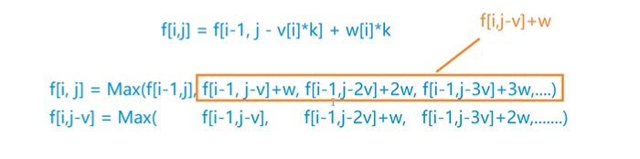

将朴素写法的表达式进行拆分,不选第i个物品,选1个第i个物品,选两个第i个物品…把它与f[i,j-v]进行对比,我们发现f(i,j)的后面部分(除了不选第i个物品剩下的的部分),就是f(i,j-v)加上一个w,所以我们就可以直接省略k项.三维变两维

```c++
#include <iostream>
#include <algorithm>
using namespace std;
const int N = 1e3 + 10;
int n, m;
int v[N], w[N];
int f[N][N];

int main()
{
     cin >> n >> m;
     for (int i = 1; i <= n; i++)
          cin >> v[i] >> w[i];
          
     for (int i = 1; i <= n; i++)
          for (int j = 0; j <= m; j++)
          {
               f[i][j] = f[i - 1][j];
               if (j >= v[i])
                    f[i][j] = max(f[i][j], f[i][j - v[i]] + w[i]);
          }
          
     cout << f[n][m] << endl;
}
```


再优化

优化成一维和01背包类似的优化.

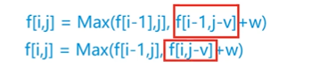

把它和01背包的方程对比一下,一个i-1,一个就是i.而因为我们这里就是要从第i层转移过来,所以j也不用从后往前讨论

```c++
#include <iostream>
#include <algorithm>
using namespace std;
const int N = 1e3 + 10;
int n, m;
int v[N], w[N];
int f[N];

int main()
{
     cin >> n >> m;
     for (int i = 1; i <= n; i++)
          cin >> v[i] >> w[i];

     for (int i = 1; i <= n; i++)
          for (int j = v[i]; j <= m; j++)
          {
               f[j] = max(f[j], f[j - v[i]] + w[i]);
          }

     cout << f[m] << endl;
}
```


### 多重背包

#### 介绍

每个物品有Si个,(不是最多能拿一个,也不是能拿无线个)


#### 例子

##### 题目

有 N 种物品和一个容量是 V 的背包。

第 i 种物品最多有 si 件，每件体积是 vi，价值是 wi。

求解将哪些物品装入背包，可使物品体积总和不超过背包容量，且价值总和最大。
输出最大价值。


输入格式

第一行两个整数，N，V，用空格隔开，分别表示物品种数和背包容积。

接下来有 N 行，每行三个整数 vi,wi,si，用空格隔开，分别表示第 i 种物品的体积、价值和数量。

输出格式

输出一个整数，表示最大价值。


数据范围

0<N,V≤100,0<vi,wi,si≤100

输入样例

```
4 5
1 2 3
2 4 1
3 4 3
4 5 2
```

输出样例：

```
10
```


##### 题意

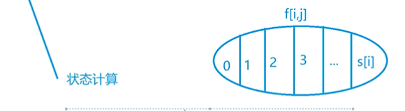

朴素版本的状态转移方程和完全背包相同:

`f[i][j]=max(f[i-1][j-k*v[i]]+k*w[i]);k=0,1,2,....s[i]`


##### 代码

针对100的数据,还是可以过的

```c++
#include <iostream>
#include <algorithm>
using namespace std;
const int N = 1e2 + 10;
int n, m;
int v[N], w[N],s[N];
int f[N][N];

int main()
{
     cin >> n >> m;
     for (int i = 1; i <= n; i++)
          cin >> v[i] >> w[i]>>s[i];
    
     for (int i = 1; i <= n; i++)
          for (int j = 0; j <= m; j++)
               for (int k = 0; k<=s[i] && k * v[i] <= j; k++)
               {
                    f[i][j] = max(f[i][j], f[i - 1][j - v[i] * k] + w[i] * k);
               }
    
     cout << f[n][m] << endl;
}

```


但如果把数据改成1000,就必须要优化代码

可以采用完全背包的优化方式,看看能不能优化,发现不能,因为

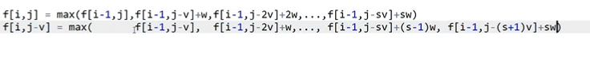

我们发现还多了最后一项,而为什么完全背包却没有多呢?因为这里考虑的是第i个物品选了0个,选了1个,选了2个…选了s个,多重背包给出了明确的最多个数,而下面把j变为j-v,其他什么都没变,自然项数应该和上面一样,它比较长只不过是往后移了一格,方便观看罢了,而完全背包是没有个数限制的(近似无穷)可以直接当上面和下面项数一样来处理.

而多出的这一项就导致我们无法再进行转换,因为即使我们知道了n个物品的最大值,也不可能知道前n-1个物品的最大值,我们要换个方式优化.

二进制枚举!

加入第i个物品有1023个,我们真的要对要选几个i从0~1023一个个枚举讨论过去吗?这里我们可以引用二进制枚举优化.`0~1023里的每个数`,我们都可以用1 2 4 8 16 32 64 128 512这些数相加来表示(每个数字用一次).(参考二进制表示十进制数,七位二进制能表示0~2^8^-1里的任意一个数)这要原本1024个数我们现在只要用log1024个数就可以表示了.但如果不是1023这种2的整数次幂,而是200呢?我们就可以用1 2 4 8 16 32 64到这就够了,不能再128了,加上128后他们能组成的数就超出了200,1 2 4 8 16 32 64能组成到127,只要再补一个73,我们就可以用1 2 4 8 16 32 64 73来组成0~200这所有的组合,而且最多也只能组成200.

这样我们就想到了一个方法,采取"打包"的措施,打破整道题的限定,如给你63个a物品,每个单价为t1,体积为t2,31个b物品,每个单价为m.我们就对他进行打包操作,`v[1]=1*t1, v[2]=2*t1, v[3]=4*t1, v[4]=8*t1, v[5]=16*t1, v[6]=32*t1`,到这就够了,我们已经把原本的63个物品a打成了6个包,每个包你只能选择一次(v数组里存着打成的包的体积).(b物体也进行同样的操作,`v[7]=1*t2...一直到v[11]=32*t2`),这样我们就把原问题有 2 种物品每个有 si 件，每件体积是 vi，价值是 wi,求怎么放价值最大转变成了我们有11种物品,每种物品体积是vi,价值是wi求怎么放价值最大的01背包问题(每个包裹只能选一次).(不用再考虑怎么选每件物品的数目了,因为在选择包裹的时候,就等效于遍历了所有选数目的方案)

```c++

#include <iostream>
#include <algorithm>

using namespace std;

const int N = 12010, M = 2010;//1000*log1000约等于12000,可以最多打12000个包

int n, m;
int v[N], w[N];
int f[M];

int main()
{
     cin >> n >> m;

     int cnt = 0;
     for (int i = 1; i <= n; i++)
     {
          int a, b, s;
          cin >> a >> b >> s;	//下面进行打包操作
          int k = 1;	
          while (k <= s)	
          {
               cnt++;
               v[cnt] = a * k;
               w[cnt] = b * k;
               s -= k;
               k *= 2;
          }
          if (s > 0)
          {
               cnt++;
               v[cnt] = a * s;
               w[cnt] = b * s;
          }
     }

     n = cnt;

     for (int i = 1; i <= n; i++)		//01背包问题
          for (int j = m; j >= v[i]; j--)
               f[j] = max(f[j], f[j - v[i]] + w[i]);

     cout << f[m] << endl;

     return 0;
}

```


### 分组背包

#### 介绍

有n组物品,每一组里只能选一种物品(有水果组,蔬菜组,你水果组选了苹果,就不能再选其他水果了),在这种限制下,问你选取的最大价值是多少


#### 例子

有 N 组物品和一个容量是 V 的背包。

每组物品有若干个，同一组内的物品最多只能选一个。
每件物品的体积是 vij，价值是 wij，其中 i 是组号，j 是组内编号。

求解将哪些物品装入背包，可使物品总体积不超过背包容量，且总价值最大。

输出最大价值。

输入格式

第一行有两个整数 N，V，用空格隔开，分别表示物品组数和背包容量。

接下来有 N 组数据：

- 每组数据第一行有一个整数 Si，表示第 ii 个物品组的物品数量；
- 每组数据接下来有 Si 行，每行有两个整数 vij,wij，用空格隔开，分别表示第 i 个物品组的第 j 个物品的体积和价值；


输出格式

输出一个整数，表示最大价值。

数据范围

0<N,V≤100,0<Si≤100,0<vij,wij≤100


输入样例

```
3 5
2
1 2
2 4
1
3 4
1
4 5
```

输出样例：

```
8
```


##### 题意

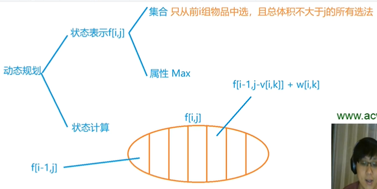

和完全背包类似,只不过这里是叫第i组物品选哪个.


##### 代码

```c++

#include <iostream>
#include <algorithm>

using namespace std;

const int N = 110;

int n, m;
int v[N][N], w[N][N], s[N];
int f[N];

int main()
{
    cin >> n >> m;

    for (int i = 1; i <= n; i ++ )
    {
        cin >> s[i];
        for (int j = 0; j < s[i]; j ++ )
            cin >> v[i][j] >> w[i][j];
    }

    for (int i = 1; i <= n; i ++ )
        for (int j = m; j >= 0; j -- )
            for (int k = 0; k < s[i]; k ++ )
                if (v[i][k] <= j)
                    f[j] = max(f[j], f[j - v[i][k]] + w[i][k]);

    cout << f[m] << endl;

    return 0;
}

```

