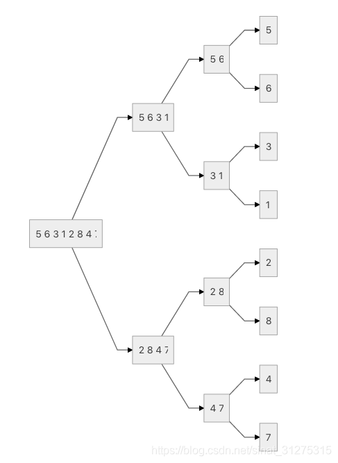
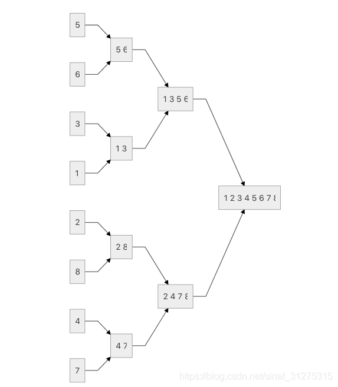

##  lesson_1


### 排序

#### 1：快速排序

##### 主要思想：

   分治思想

给你一组数据
1：在这组数据中随便找到一个分界点x（中间值，最左值，最右值）
2：调整区间，使得左边的数都<=x,右边的数都>x。
3：递归上面的操作。

其中的核心代码是第二步，以下有两种代码思路
1：
暴力求解，定义两个空数组，扫描原数组所有数据，>=x的放第一个a数组，<=x的放第二个b数组，最后把a数组先放入q数组里面，再把b数组放入q数组里面。
2：
用两个指针，第一个指针i指向最左边，j指向最右边。i和j都向中间移。i先动，找到一个>=x的数停下来，再动j找到一个<=x的数停下来，最后交换指针指向的两个数的位置。继续循环，知道两个指针重合。


##### 快排函数模板：

```c++
void quick_sort(int q[], int l, int r)
{
    if (l >= r) return;

    int i = l - 1, j = r + 1, x = q[l + r >> 1];
    //但有些情况取左值和右值的时候，下边的quick_sort里参数(边界）要变一下
    while (i < j)
    {
        do i ++ ; while (q[i] < x);
        do j -- ; while (q[j] > x);
        if (i < j) swap(q[i], q[j]);
    }
    quick_sort(q, l, j), quick_sort(q, j + 1, r);
}

```


#### 2：归并排序

##### 主要思想：

   分治

有三个步骤：
1：以数组中间点为界限，将数组分成左右两边
2：不断递归排序左右两边
3：归并两个数组

其中第三步是核心步骤。里面其实是一个双指针算法。
如有a，b两个有序数组，i，j两个指针。i和j刚开始都指向a，b两个数组的最小值。如果i指向的值比j小，那就把这个值放到第三个空数组c里面，再i指向a的下一个，如果比j指的大，则把j的放入c，j指向下一个。。最后直到i or j指完自己的数组，把剩下的全部按原来的顺序放入c，这时候c就已经是a，b两个数组所有数的有序排列。

而第二步的递归排序，就是把初始的数组（序列）分解到每个序列只有1个数为止，再一行一行进行第三步归并操作，变成2个，4个。。。且合到一起的数是有序的`（*P109）`

复杂度：
需要`logn`趟归并，每次归并要n次比较，总共`nlog n`时间复杂度。需要一个空数组，空间复杂度是O(n)

递归：



归并：




##### 归并函数模板：

```c++
void merge_sort(int q[], int l, int r)
{
    if (l >= r) //或者l==r。当前区间只有1个数的话不用排序，也就是此时排序好了。然后再归并成2个，四个。。。。
        return;

    int mid = l + r >> 1;  //mid就是中值
    merge_sort(q, l, mid);
    merge_sort(q, mid + 1, r);  //不断递归

    
    int k = 0, i = l, j = mid + 1;
    while (i <= mid && j <= r)  //归并
        if (q[i] <= q[j]) //i和j是两个指针
            tmp[k++] = q[i++]; //放入空数组tmp
        else
            tmp[k++] = q[j++];
    
    
    while (i <= mid)  //左半边没循环完（还有剩）
        tmp[k++] = q[i++];
    while (j <= r)   //右半边没有循环完
        tmp[k++] = q[j++];

    
    for (i = l, j = 0; i <= r; i++, j++)
        q[i] = tmp[j]; //把这一趟归并好的全部放入q数组
}

```


#### 例题：

给定你一个长度为 *n*的整数数列。请你使用快速排序对这个数列按照从小到大进行排序。并将排好序的数列按顺序输出。

输入格式

输入共两行，第一行包含整数 *n*。第二行包含 *n*个整数（所有整数均在 1∼109 范围内），表示整个数列。

输出格式

输出共一行，包含 *n*个整数，表示排好序的数列。

数据范围

1≤*n*≤100000

输入样例：

```
5
3 1 2 4 5
```

输出样例：

```
1 2 3 4 5
```


```c++
快排：
    
#include <bits/stdc++.h>
using namespace std;
int const N = 1e6 + 10;
int n;
int q[N];
void quick_sort(int q[], int l, int r)
{
    if (l >= r)
        return;

    int i = l - 1, j = r + 1, x = q[l + r >> 1];
    while (i < j)
    {
        do
            i++;
        while (q[i] < x);
        do
            j--;
        while (q[j] > x);
        if (i < j)
            swap(q[i], q[j]);
    }
    quick_sort(q, l, j), quick_sort(q, j + 1, r);
    //根据取的x（是左值还是右值），自定义函数里所给的值也要变化。
}

int main()
{
    scanf("%d", &n);
    for (int i = 0; i < n; i++)
        scanf("%d", &q[i]);
    quick_sort(q, 0, n - 1);
    for (int i = 0; i < n; i++)
        printf("%d ", q[i]);
    return 0;
}

归并：
    
#include <bits/stdc++.h>
using namespace std;
int const N = 1e6 + 10;
int n;
int q[N], tmp[N];
void merge_sort(int q[], int l, int r)
{
    if (l >= r)
        return;

    int mid = l + r >> 1;
    merge_sort(q, l, mid);
    merge_sort(q, mid + 1, r);

    int k = 0, i = l, j = mid + 1;
    while (i <= mid && j <= r)
        if (q[i] <= q[j])
            tmp[k++] = q[i++];
        else
            tmp[k++] = q[j++];

    while (i <= mid)
        tmp[k++] = q[i++];
    while (j <= r)
        tmp[k++] = q[j++];

    for (i = l, j = 0; i <= r; i++, j++)
        q[i] = tmp[j];
}
int main()
{
    scanf("%d", &n);
    for (int i = 0; i < n; i++)
        scanf("%d", &q[i]);
    merge_sort(q, 0, n - 1);
    for (int i = 0; i < n; i++)
        printf("%d ", q[i]);
    return 0;
}
```


### 二分查找

#### 1：整数二分

#####  主要思想：

二分思想简单，但在

二分的本质并不是单调性，有单调性可以二分，但可以二分的题目不一定要单调性。

我们定义了某种性质，这种性质左半边不满足而右半边是满足的，因为是整数，两个半边没有交点（如定义数轴右半边>=3,左半边则都是小于3的，因为都是整数，这两个区间没有交点，2 3）

找一个中间值，判断其是否满足这个性质。满足的话，就在右半边找，不满足的话再在左半边找。以此类推。

而整数二分有两种情况，这是因为在除以2的时候没有整除，mid=x.5，我们决定这个mid取左边还是右边的情况。当我们就是用l+r>>1,来表示每次的二分，但实际上每次取不尽的时候，我们向下取整了。根据题目，每次算出mid后会分为两种情况，r=mid,l=mid-1或r=mid-1,l=mid。但在第二种情况，我们不能像前一种单纯向下取整了，可能会陷入死循环，如只剩两个数l=2 r=3,mid=l=2，我们再运行程序，它会一直卡在l=mid，死循环，为了防止这种情况，我们选择向上取整，l+r+1>>1。而第一种情况


可以参考：https://www.acwing.com/solution/content/3338/，一个同学在acwing的例题的题解


##### 整数二分模板

（两种情况）

```c++
bool check(int x)
{ 
    /* ... */
} // 这部用来检查x是否满足某种性质

// 区间[l, r]被划分成[l, mid]和[mid + 1, r]时使用：
int bsearch_1(int l, int r)
{
    while (l < r)
    {
        int mid = l + r >> 1;
        if (check(mid))
            r = mid; // check()判断mid是否满足性质
        else
            l = mid + 1;
    }
    return l;
}

// 区间[l, r]被划分成[l, mid - 1]和[mid, r]时使用：
int bsearch_2(int l, int r)
{
    while (l < r)
    {
        int mid = l + r + 1 >> 1; //让每次除数是小数的时候，向后取整。如原本值是(l+r)/2=4.5,我们在某种情况下不能取4，要取5，就用mid = l + r + 1。
        if (check(mid))
            l = mid;
        else
            r = mid - 1;
    }
    return l;
}
```

##### 例题

给定一个按照升序排列的长度为 *n* 的整数数组，以及 *q*个查询。对于每个查询，返回一个元素 *k*的起始位置和终止位置（位置从 0开始计数）。如果数组中不存在该元素，则返回 `-1 -1`。输入格式第一行包含整数 *n*和 *q*，表示数组长度和询问个数。第二行包含 *n*个整数（均在 1∼10000 范围内），表示完整数组。接下来 *q*行，每行包含一个整数 *k*，表示一个询问元素

输出格式

共 *q*行，每行包含两个整数，表示所求元素的起始位置和终止位置。如果数组中不存在该元素，则返回 `-1 -1`。

数据范围

1≤*n*≤100000
1≤*q*≤10000
1≤*k*≤10000

输入样例：

```
6 3
1 2 2 3 3 4
3
4
5
```

输出样例：

```
3 4
5 5
-1 -1
```


```c++
#include <bits/stdc++.h>
using namespace std;
const int N = 100010;
int n, m;
int q[N];
int main()
{
    scanf("%d%d", &n, &m);
    for (int i = 0; i < n; i++)
        scanf("%d", &q[i]);
    while (m--)
    {
        int x;
        scanf("%d", &x);
        int l = 0, r = n - 1;
        while (l < r) //确定第一个出现在哪(起始位置)
        {
            int mid = l + r >> 1;//直接>>1
            if (q[mid] >= x)
                r = mid;
            else
                l = mid + 1;
        }
        if (q[l] != x)
            cout << "-1 -1" << endl;
        else //确定最后一个出现在哪。重新定义性质为<=x（左边符合条件，右边不符合），就能找到最后的数字。
        {
            cout << l << ' ';
            int l = 0, r = n - 1;
            while (l < r) //找终止位置
            {
                int mid = l + r + 1 >> 1; //没了+1,程序里终止位置就会一直报不出来
                if (q[mid] <= x)
                    l = mid;     
                else
                    r = mid - 1;
            }
            cout << l << endl;
        }
    }
    return 0;
}

```


#### 2：浮点数二分

##### 主要思想：

浮点数二分和整数二分类似。但没有整除这个东西，每次都可以准确的缩小一半，所以不用考虑边界。

##### 浮点数二分模板：

```c++
bool check(double x) {/* ... */} // 检查x是否满足某种性质

double bsearch_3(double l, double r)
{
    const double eps = 1e-6;   
   // eps 表示精度，取决于题目对精度的要求。浮点数总是有误差的。一般题目保留四位小数，就-6次，五位就-7次
    while (r - l > eps) //比这个精度小，则就可以类似为r和l为相同的数值了。
    {
        double mid = (l + r) / 2;
        if (check(mid)) r = mid;
        else l = mid;
    }
    return l;
}
```

##### 例题：

给定一个浮点数 *n*，求它的三次方根。

输入格式

共一行，包含一个浮点数 *n*。

输出格式

共一行，包含一个浮点数，表示问题的解。注意，结果保留 6位小数。

数据范围

−10000≤*n*≤10000

输入样例：

```
1000.00
```

输出样例：

```
10.000000
```


```c++
#include <iostream>
using namespace std;
double n;

int main()
{
    cin >> n;
    double l = -10000, r = 10000;
    while (r - l >= 1e-8)
    {
        double mid = (r + l) / 2;
        if (mid * mid * mid >= n)
            r = mid;
        else
            l = mid;
    }
    printf("%.6lf", l);
}
```

