深搜和宽搜都可以对整个空间进行搜索，搜索的过程都是像一颗树一样。但搜索的顺序不一样。

+ DFS，它使用的数据结构是栈，使用的空间和高度(深度)成正比,O(h)

+ BFS，它使用的数据结构是队列，使用的空间是指数级别的，比dfs要大。但由于它是一层一层扩展，所以有一个最短路的概念(如果每条边的权值为1，则第一次碰到的点的距离一定是最短距离)(最小步数，最短路径，最少操作次数)


## 深度优先搜索

dfs

### 定义

每次搜索都会尽量往深处搜，搜到尽头就会回溯(原路返回，找到上一个岔路口)，再进行搜索。

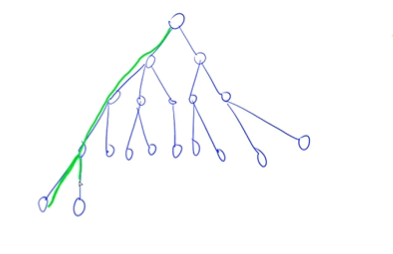


dfs其中有两个重要概念：回溯与剪枝。


由于比较多变，将模板过于抽象，所以直接在例子中讲解

### 题目


#### 排列数字

给定一个整数 n，将数字 1∼n 排成一排，将会有很多种排列方法。

现在，请你按照字典序将所有的排列方法输出。


输入格式

共一行，包含一个整数 n。

输出格式

按字典序输出所有排列方案，每个方案占一行。

数据范围

1≤n≤7


输入样例：

```
3
```

输出样例：

```
1 2 3
1 3 2
2 1 3
2 3 1
3 1 2
3 2 1
```


```
如何来用dfs来做？dfs最重要的要考虑的就是顺序。dfs俗称暴搜，我们要用一个什么样的顺序，来遍历所有方案。
dfs的搜索是以一个树的形式，写题目时可以画树来帮助理解

这里的搜索顺序是这样的，假设有n个空位，n=3。它有三个分支，分别对应第一格的三种情况，取第一个分支为例，1__，然后它往下走12_,再往下走就是123，它走不下去了，只能回溯，所以第二层又多了一个分支13_。....这就是递归。注意，我们回溯的时候，一定要恢复现场。
```

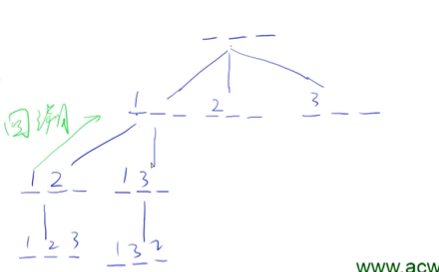


```c++
#include <iostream>
using namespace std;
const int N = 10;
int n;
int path[N]; //存储状态，方案
bool st[N];  //看这个点有没有被用过
void dfs(int u)
{
    if (u == n) //结束这次dfs的条件是格子被填满了
    {
        for (int i = 0; i < n; i++)
            printf("%d", path[i]);
        puts("");
        return;
    }
    for (int i = 1; i <= n; i++)
        if (!st[i])
        {
            path[u] = i;
            st[i] = true;
            dfs(u + 1);    //递归，就是不断向下探索
            st[i] = false; //到头，回溯时，恢复现场。path不用恢复为0，可以直接覆盖.为什么这里要恢复,因为他这每个数字只能出现一次
        }
}
int main()
{
    cin >> n;
    dfs(0);
    return 0;
}
```


#### n皇后问题


n−皇后问题是指将 n 个皇后放在 n×n 的国际象棋棋盘上，使得皇后不能相互攻击到，即任意两个皇后都不能处于同一行、同一列或同一斜线上。

现在给定整数 n，请你输出所有的满足条件的棋子摆法。


输入格式

共一行，包含整数 n。

输出格式

每个解决方案占 n 行，每行输出一个长度为 n 的字符串，用来表示完整的棋盘状态。

其中 `.` 表示某一个位置的方格状态为空，`Q` 表示某一个位置的方格上摆着皇后。

每个方案输出完成后，输出一个空行。


**注意：行末不能有多余空格。**

输出方案的顺序任意，只要不重复且没有遗漏即可。

数据范围

1≤n≤9


输入样例：

```
4
```

输出样例：

```
.Q..
...Q
Q...
..Q.

..Q.
Q...
...Q
.Q..
```


```
n皇后问题有很多搜索方式。
顺序1：像全排列一样搜。因为它同一行同一列只能放一个皇后，看第一列，放哪个位置，第二列放哪个位置.....但这里还要注意剪枝，同一斜线上都不能有皇后。如134______，发现走到这一路的时候，冲突了，在同一斜线上了，这样就要直接回溯。(剪枝)
但这时间复杂度时n*n!，说是n超过15就超时了
//每个方案循环n遍,赋值给结果
```

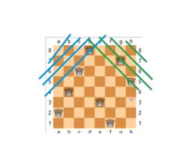


```c++
#include <iostream>
using namespace std;
const int N = 20; //对角线个数为2n-1，所以设为20
int n;
char g[N][N];
bool col[N], dg[N], udg[N]; //一列，正对角线，反对角线
void dfs(int u)
{
    if (u == n) //找到一种方案的时候，输出
    {
        for (int i = 0; i < n; i++)
            puts(g[i]);
        puts(""); //空行
        return;
    }
    for (int i = 0; i < n; i++)
        if (!col[i] && !dg[i + u] && !udg[n - u + i]) //这一列,正对角线，反对角线有没有放过皇后
        {
            g[u][i] = 'Q';
            col[i] = dg[u + i] = udg[n - u + i] = true;
            dfs(u + 1);                                  //递归
            col[i] = dg[u + i] = udg[n - u + i] = false; //到头，回溯时，恢复现场。
            g[u][i] = '.';
        }
}
int main()
{
    cin >> n;
    for (int i = 0; i < n; i++)
        for (int j = 0; j < n; j++)
            g[i][j] = '.';
    dfs(0);
    return 0;
}
```


能用dg[i + u] 和 udg[n - u + i]来表示正对角线和反对角线得原因：

对角线：b=y-x; 反对角线：b=y+x

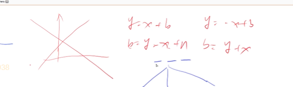


```
顺序2：
更加原始，顺序1时已经在每一行只有一个皇后的前提下开始dfs，只有三个判断。而现在，我们一个棋盘，对每个格子都进行讨论，放与不放两个分支，放的话下一个怎么走，不放的话该怎么走....这种方法必须dfs，否则空间会爆。时间复杂度时2的n方次方,而且这效率比第一个要差一些。
```

2^n^^2^

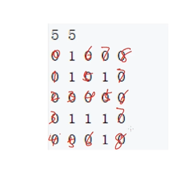


```c++
#include <iostream>
using namespace std;
const int N = 20; //对角线个数为2n-1，所以设为20
int n;
char g[N][N];
bool row[N], col[N], dg[N], udg[N]; //一列，正对角线，反对角线

void dfs(int x, int y, int s)       // s放的皇后个数
{
    if (y == n) //到了棋盘的边界了，换下一行第一个
    {
        y = 0;
        x++;
    }
    if (x == n)
    {
        if (s == n)
        {
            for (int i = 0; i < n; i++)
                puts(g[i]);
            puts("");
        }
        return;
    }
    //判断每一格要不要放皇后
    
    //不放皇后
    dfs(x, y + 1, s);
    
    //放
    if (!row[x] && !col[y] && !dg[x + y] && !udg[x - y + n])
    {
        row[x] = col[y] = dg[x + y] = udg[x - y + n] = true;
        dfs(x, y + 1, s + 1);
        row[x] = col[y] = dg[x + y] = udg[x - y + n] = false;
        g[x][y] == '.';
    }
}

int main()
{
    cin >> n;
    for (int i = 0; i < n; i++)
        for (int j = 0; j < n; j++)
            g[i][j] = '.';
    dfs(0, 0, 0);
    return 0;
}
```


## 宽度优先搜索

bfs

### 定义

眼观六路。它是一层一层的搜索,一层搜完了，才会搜索下一层。可以用于最短路问题。(把所有距离为1的点先搜到，再把所有距离为2的点再搜到……当然，这要求每条边权值都为1)

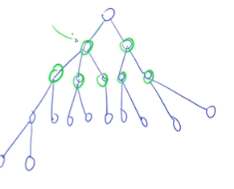


不是所有最短路问题都可以用bfs，只有当边的权重都为1的时候才行，一般最短路问题都有专门的最短路算法，dp问题不能用这些算法来写，dp时间复杂度较低。

后面会讲dp问题和最短路问题是互通的，最短路问题包含dp问题，dp问题没有环儿。


### 题目

#### 走迷宫


给定一个 n×m 的二维整数数组，用来表示一个迷宫，数组中只包含 0 或 1，其中 0 表示可以走的路，1 表示不可通过的墙壁。

最初，有一个人位于左上角 (1,1) 处，已知该人每次可以向上、下、左、右任意一个方向移动一个位置。

请问，该人从左上角移动至右下角 (n,m) 处，至少需要移动多少次。

数据保证 (1,1)处和 (n,m) 处的数字为 0，且一定至少存在一条通路。


输入格式

第一行包含两个整数 n 和 m。

接下来 n 行，每行包含 m 个整数（0 或 1），表示完整的二维数组迷宫。

输出格式

输出一个整数，表示从左上角移动至右下角的最少移动次数。


数据范围

1≤n,m≤100

输入样例：

```
5 5
0 1 0 0 0
0 1 0 1 0
0 0 0 0 0
0 1 1 1 0
0 0 0 1 0
```

输出样例：

```
8
```

| 难度：**简单**       |
| -------------------- |
| 时/空限制：1s / 64MB |
| 总通过数：23163      |
| 总尝试数：41150      |
| 来源：模板题         |
| 算法标签             |

------


```
第一层就是坐标为(0,0)的点，第二层就是距离0,0是1的点，只有1,0，然后再到2,0，然后距离它为1的点是3,0和2,1，然后从这两个点分别向外衍生
```

每个数字代表是第几层被扩展到的。


bfs含有队列，先把起始点存入队列，进入while循环，条件是队列不空，然后把队头元素给t，再不断扩展队头元素

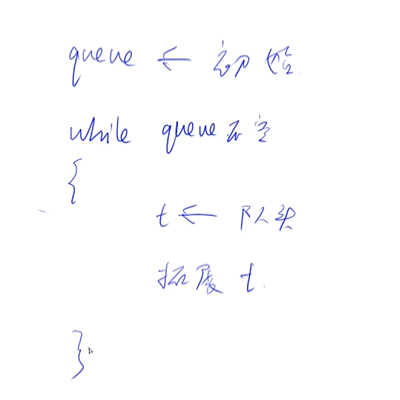


```c++
#include <iostream>
#include <algorithm>
#include <bits/stdc++.h>
#include <queue> //bfs内有队列
using namespace std;
const int N = 100 + 10;
typedef pair<int, int> PII;
int n, m;
int g[N][N];
int d[N][N]; //存每个点到原点的距离
PII q[N * N];
PII pre[N][N]; //这个数组可以用来输出走最短路时的路径
int bfs()
{
    int hh = 0, tt = 0;
    q[0] = {0, 0};
    memset(d, -1, sizeof d);
    d[0][0] = 0;
    int dx[4] = {-1, 0, 1, 0}, dy[4] = {0, 1, 0, -1};
    
    while (hh <= tt) //此题采用的是数组模拟队列，防止一些语言没有队列库
    {
        auto t = q[hh++]; // t从0,0开始。把队列这个初始状态给t，初始为0,0
        for (int i = 0; i < 4; i++)
        {
            int x = t.first + dx[i], y = t.second + dy[i];
            if (x >= 0 && x < n && y >= 0 && y < m && g[x][y] == 0 && d[x][y] == -1) //这里的d判断是不是第一次搜到
            {
                d[x][y] = d[t.first][t.second] + 1;
                pre[x][y] = t;//x,y这个点是从t过来的
                q[++tt] = {x, y}; //拓展队列
            }
        }
    }
    
    //以下while循环是用于额外输出所走最短路的路径，
   
    /*
    int x = n - 1, y = m - 1;//从最后一个点开始，往前倒
    while (x || y)
    {
        cout << x << ' ' << y << endl;//第一个输出的就是目的地，也就是4,4
        auto t = pre[x][y];
        x = t.first, y = t.second;
    }
    */

    return d[n - 1][m - 1];
    
}
int main()
{
    cin >> n >> m;
    for (int i = 0; i < n; i++)
        for (int j = 0; j < m; j++)
            cin >> g[i][j];
    cout << bfs() << endl;
}
```


输出的路径，从下往上看，0,0到1,0再到2,0…最后到4,4

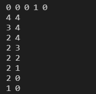


#### 八数码


## 树与图的存储


树是一种特殊的图，是无环连通图。

图分为两种(想知道链式向前星是什么)

+ 有向图(a->b),告诉你方向

  + 邻接矩阵

    就是开一个二维数组，`g[a][b]`,存储a->b的信息。如保留边的权重，没有权重的话，g可以是个布尔值，代表这条边存不存在。用的比较少，浪费空间n^2^。比较适合存储稠密图，不适合稀疏图。

  + 邻接表

    是单链表，n个点就是n个单链表，每个点就是一条单链表(和拉链法同)。单链表存的是这个点可以走到哪几个点。如果存储完之后想再在图里面插入一个点，2->3,则3这个点插如在链表的前面。存邻接表也可以用vector存，但效率比数字模拟差一些(感觉看别人的题解,大部分都用vector了: G[a].push_back(b))

    

    

  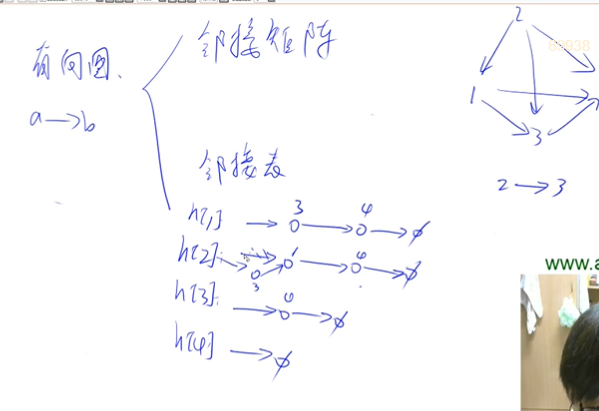

  

  

  

  

+ 无向图(a-b)，要是题目是无向图，建两条边就行了(a->b,b->a)


### 模板

邻接表:

```c++
// 对于每个点k，开一个单链表，存储k所有可以走到的点。h[k]存储这个单链表的头结点
int h[N], e[N], ne[N], idx;//idx代表这个点在链表里的序号，不代表它本身的数值，一个链表的序号是唯一的，代表这个点是第几个进入链表的

// 添加一条边a->b
void add(int a, int b)
{
    e[idx] = b, ne[idx] = h[a], h[a] = idx ++ ;//一个h就是一个链表,在一个链表里插入的数都是从前面插入。如h[1]->2->3。在题目的意义的点1指向了点2和点3，而点2此时在链表里idx=1，点3的idx是0。 而h[a] = idx代表着链表的头指着哪个序号，不断地插入，不断地更新
}

int main
{
// 初始化
idx = 0;
memset(h, -1, sizeof h);
.....
}
```


先存储了，再遍历。


## 树与图的深度优先遍历

一个顶点走到黑。

深度和宽度优先遍历每个点都只遍历一次O(n+m)，所以一般是建一个bool数组给他标记一下


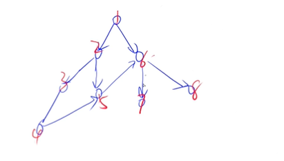


### 模板

```c++
int dfs(int u)
{
    st[u] = true; // st[u] 表示点u已经被遍历过

    for (int i = h[u]; i != -1; i = ne[i])
    {
        int j = e[i]; //按照h[1]->2->3里的顺序，如果跟着for循环走，e[i]先等于2，再等于3
        if (!st[j]) dfs(j);
    }
}
```


### 题目

#### 树的重心

给定一颗树，树中包含 n 个结点（编号 1∼n）和 n−1 条无向边。

请你找到树的重心，并输出将重心删除后，剩余各个连通块中 点数的最大值。

重心定义：重心是指树中的一个结点，如果将这个点删除后，剩余各个连通块中 点数的最大值最小，那么这个节点被称为树的重心。


输入格式

第一行包含整数 n，表示树的结点数。

接下来 n−1 行，每行包含两个整数 a 和 b，表示点 a 和点 b 之间存在一条边。

输出格式

输出一个整数 m，表示将重心删除后，剩余各个连通块中点数的最大值。


数据范围

1≤n≤105

输入样例

```
9
1 2
1 7
1 4
2 8
2 5
4 3
3 9
4 6
```

输出样例：

```
4
```

| 难度：**简单**       |
| -------------------- |
| 时/空限制：1s / 64MB |
| 总通过数：19979      |
| 总尝试数：35006      |
| 来源：模板题         |
| 算法标签             |

------


```
	题意是删除树里不同的点，会产生不同的连通块的点数最大值，再在这些最大值里找一个最小的。连通块就是删除这个点后，剩下的还连在一起的那几块，所以问题转化成:如何快速求把每个点删除后的连通块里点数的最大值。
	这时候就要用dfs遍历，因为它有一个特点，在遍历的同时，能求出子树的大小。它不需要特定输入哪个结点，因为无论输入哪个结点，它都会遍历一整棵树(是双向边)，遍历过程中能得出以每一个点为根的子树大小，我们只要每次都进行比较就行，题目也是只让我们输出连通块的大小。

	假如删除节点4，那么它的每个子节点就都是分别的一个连通块，往上是另外一个块。它的各个子节点产生的块的大小，都能通过dfs直接返回回来，而上边的那一块的点数就可以用总点数-以4为根的子树大小来得出。

	这是一个无向图，所以建边的时候，每条边要建立两条相反方向的边。
树和图的宽度和深度优先遍历每个点都是只遍历一次的，都是O(n+m)

```

删除4后的连通块

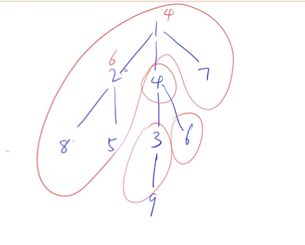


```
dfs回溯，不一定每次都要恢复原本的状态，比如在搜索过程中，8这个点已经遍历过了(st[8]=true)，你回溯到2，再想往右边搜索的时候，不用把st[8]设置成false，不像前面数的排列一样，要把排列过的数收回来。
```


```c++
#include <iostream>
#include <algorithm>
#include <cstring>
using namespace std;
const int N = 100010, M = 2 * N;
int n;
bool st[N];
int h[N], e[M], ne[M], idx; //注意，这里存储图的时候，用的是2倍的N，因为idx代表的是边，这是无向题，两条边
int ans = N;                //记录答案,最大值的最小值
void add(int a, int b)
{
    e[idx] = b, ne[idx] = h[a], h[a] = idx++; //把值附上，如ne[3]=h[2],h[2]=3;idx++
}

//以u为根的点的数量
int dfs(int u)
{
    st[u] = true;
    int sum = 1, res = 0;                  // sum是点的数量，res是删了这个点之后连通块的最大值
    for (int i = h[u]; i != -1; i = ne[i]) //遍历一下u的所有初边.(和链表类似)
    {
        int j = e[i]; // j存储链表里的点对应图里的点的编号
        
        if (!st[j])
        {
            int s = dfs(j);  // s表示这个等式里的j为根的子树的大小，就是每次返回的sum值
            
            res = max(res, s);//当前子树也是一种删除某点(根)后产生的连通块，所以与res取一个max。要是删除这个点产生多个子树，这时候for循环就起到了作用
            
            sum += s;//以u的儿子为根节点的子树是以u为根节点子树的一部分，所以sum加上s，遍历完for循环后，sum就是以u为根节点的树的大小
        }
    }
    res = max(res, n - sum); //n-sum是为了求出上面一块(最后一块)的连通块大小，sum在这就是以u为根的子树的大小。最后与前面所求的下面的最大的连通块比较取最大值给res
    
    ans = min(res, ans);//取各个res的最小值
    return sum; //返回sum，是dfs迭代需要
}

int main()
{
    memset(h, -1, sizeof h);
    cin >> n;
    for (int i = 0; i < n - 1; i++) // n个点，n-1条
    {
        int a, b;
        cin >> a >> b;
        add(a, b), add(b, a); //因为这里无向，加入两条边
    }
    dfs(1); //不一定从1号点开始搜，随便哪个点都行
    cout << ans << endl;
    return 0;
    
}
```


```
每一个dfs(a)返回的都是以a为根的树的大小，s表示删除a结点后产生的连通块大小(如果a是由分叉的，则表示产生的其中之一的连通块大小，另一个连通块大小会在for的下一个循环中得出)

	整个函数dfs这样遍历，如果u先等于4(dfs(4))，则先标记4结点用过，j=3，再dfs(3)，则先标记3结点用过，j=9，再dfs(9),标记9结点用过，发现for循环进不去，i=-1，运行res=max(res,n-sum),此时sum=1(这样也就相当于算出了删除9这个结点后的最大连通块的大小，这就是后面主函数dfs可以任意写哪个点都行的原因，因为在dfs遍历的时候，都会算一遍)，再运行ans=min，为了得出删除各个点后产生的最大连通块的最小值，这时候就还只算了删除9结点这一个情况，ans=n-sum。dfs(9)完成后退回到dfs(3)，发现s=return sum=1，这里的s就等同于删除3结点产生的连接块大小。(记住，这时候dfs(3)里的sum已经重新刷新为1了),下一步res = max(res, s)，这是为了与删除3这个点后产生的子树的大小(9)比较，再sum+=s变为了2，代表着以3为根的子树大小。
	...这样退回到4结点(dfs(4))，返回的s就是2，意思就是删除4结点产生的一个连通块的大小，但注意，这里的4是由分支的，所以此时for循环就起到了作用，当结束sum += s后，它会向6移动，j=6，然后再运行dfs(6)返回了s=dfs(6)=1，这时候sum+=s，就等于4了，代表以4结点为根的整棵树的大小。
```


## 树与图的宽度优先遍历

一层层的搜


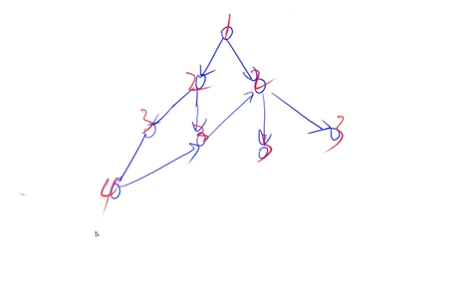


### 模板

```c++
queue<int> q;
st[1] = true; // 表示1号点已经被遍历过
q.push(1);

while (q.size())
{
    int t = q.front();
    q.pop();

    for (int i = h[t]; i != -1; i = ne[i])
    {
        int j = e[i];
        if (!st[j])
        {
            st[j] = true; // 表示点j已经被遍历过
            q.push(j);
        }
    }
}
```


### 题目

#### 图中点的层次

给定一个 n 个点 m 条边的有向图，图中可能存在重边和自环。

所有边的长度都是 1，点的编号为 1∼n。

请你求出 1 号点到 n 号点的最短距离，如果从 1 号点无法走到 n 号点，输出 −1。


输入格式

第一行包含两个整数 n 和 m。

接下来 m 行，每行包含两个整数 a 和 b，表示存在一条从 a 走到 b 的长度为 1 的边。

输出格式

输出一个整数，表示 1 号点到 n 号点的最短距离。


数据范围

1≤n,m≤105

输入样例：

```
4 5
1 2
2 3
3 4
1 3
1 4
```

输出样例：

```
1
```


```
自环就是一个点有一条边，自己指向自己.重边就是2个点之间有多条相同的边(重复了)

从边的长度为1，可以看出可以用宽搜求最短路
```


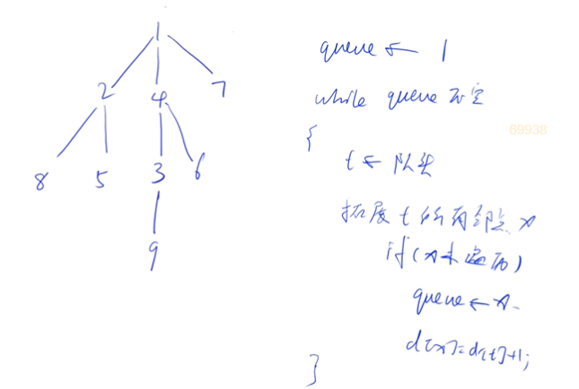


```c++
#include <iostream>
#include <algorithm>
#include <cstring>
using namespace std;
const int N = 100010;
int n, m;
int h[N], e[N], ne[N], idx;
int d[N], q[N]; // d是距离，q是队列
void add(int a, int b)
{
    e[idx] = b, ne[idx] = h[a], h[a] = idx++;
}
int bfs()
{
    int hh = 0, tt = 0;
    q[0] = 1;
    memset(d, -1, sizeof d);
    d[1] = 0;
    while (hh <= tt)//队列空的时候，就是bfs结束的
    {
        int t = q[hh++];//在队列里代表着弹出队头元素
        for (int i = h[t]; i != -1; i = ne[i])//刚开始i=h[队头元素]
        {
            int j = e[i]; //e[i]就是对应到图(题目)的那个点是多少，i是那个点存入链表里的序号
            if (d[j] == -1)
            {
                d[j] = d[t] + 1;
                q[++tt] = j;
            }
        }
    }
    return d[n];
}
int main()
{
    cin >> n >> m;
    memset(h, -1, sizeof h);
    for (int i = 0; i < m; i++)
    {
        int a, b;
        cin >> a >> b;
        add(a, b);
    }
    cout << bfs() << endl;
    return 0;
}
```


## 拓扑排序

图的宽搜的经典应用:拓扑序

这是针对有向图来说的。

拓扑排序的所有点对应的边都是从前指向后的。

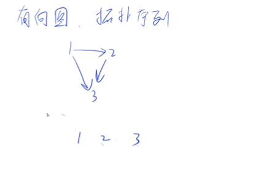

如1 2 3这个排序就是个拓扑排序，1->2,2->3,1->3。

而只要存在一个环，(如题目不是1->3，是3->1),就一定不存在拓扑排序。所以有向无环图就是拓扑图

在图论中，如果一个[有向图](https://baike.baidu.com/item/有向图)无法从某(任意)个顶点出发经过若干条边回到该点，则这个图是一个**有向无环图**（DAG图）。

还有一个度的概念

+ 入度:一个点的入度就是有几个点指向自己。

+ 出度；同类意思。

所有入度为0的点，都可以当作起点(先放入队列)。


### 模板

```c++
bool topsort()
{
    int hh = 0, tt = -1;

    // d[i] 存储点i的入度
    for (int i = 1; i <= n; i ++ )
        if (!d[i])
            q[ ++ tt] = i;

    while (hh <= tt)
    {
        int t = q[hh ++ ];

        for (int i = h[t]; i != -1; i = ne[i])
        {
            int j = e[i];
            if (-- d[j] == 0)
                q[ ++ tt] = j;
        }
    }

    // 如果所有点都入队了，说明存在拓扑序列；否则不存在拓扑序列。
    return tt == n - 1;
}
```

环图，是不可能所有点的入度都减为0的，一个有向无环图，一定存在至少一个入度为0的点。


### 题目


#### 有向图的拓扑序列


给定一个 n 个点 m 条边的有向图，点的编号是 1 到 n，图中可能存在重边和自环。

请输出任意一个该有向图的拓扑序列，如果拓扑序列不存在，则输出 −1。

若一个由图中所有点构成的序列 A 满足：对于图中的每条边 (x,y)，x 在 A 中都出现在 y 之前，则称 A 是该图的一个拓扑序列。


输入格式

第一行包含两个整数 n 和 m。

接下来 m 行，每行包含两个整数 x 和 y，表示存在一条从点 x 到点 y 的有向边 (x,y)。

输出格式

共一行，如果存在拓扑序列，则输出任意一个合法的拓扑序列即可。

否则输出 −1。

数据范围

1≤n,m≤105


输入样例：

```
3 3
1 2
2 3
1 3
```

输出样例：

```
1 2 3
```

| 难度：**简单**       |
| -------------------- |
| 时/空限制：1s / 64MB |
| 总通过数：18212      |
| 总尝试数：28167      |
| 来源：模板题         |
| 算法标签             |

------


```
	在给每个点建立边的时候，把每个点的入度也存入数组d。在拓扑排序函数里，首先把入度为0的点都从队尾存入队列，然后看入度不为0的
```

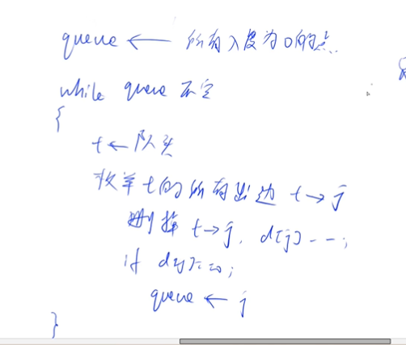


```c++
#include <iostream>
#include <algorithm>
#include <cstring>
using namespace std;
const int N = 100010;
int n, m;
int h[N], e[N], ne[N], idx;
int d[N], q[N]; // d是点的入度，q是队列

void add(int a, int b)
{
    e[idx] = b, ne[idx] = h[a], h[a] = idx++;
}
bool topsort()
{
    int hh = 0, tt = -1;

    // d[i] 存储点i的入度
    for (int i = 1; i <= n; i++)
    {
        if (!d[i]) //入度为0的点插入队列
            q[++tt] = i;//队尾进，对头出
        //这里是tt=-1,++tt,因为之前手动直接赋值q[0]，初始化好了。这里没有初始化，y总之前的课都是tt=-1
    }

    while (hh <= tt)
    {
        int t = q[hh++];//在队列里代表弹出队头元素
        
        for (int i = h[t]; i != -1; i = ne[i])
        {
            int j = e[i]; //枚举出一个指向j的，就删除一个j的入度
            if (--d[j] == 0) //这个点的入度已经为0了
                q[++tt] = j;
        }//一个初始就是入度为0的点找完了，再弹出队列的另一个初始就入度为0的点
    }
    
    // 如果所有点都入队了，说明存在拓扑序列；否则不存在拓扑序列。
    return tt == n - 1; //如果相等的话，代表所有的点都曾进入队列了
}
int main()
{
    cin >> n >> m;
    memset(h, -1, sizeof h);
    for (int i = 0; i < m; i++)
    {
        int a, b;
        cin >> a >> b;
        add(a, b);
        d[b]++;
    }
    if (topsort())
    {
        for (int i = 0; i < n; i++)
            printf("%d ", q[i]);
    }
    else
        puts("-1");
}
```

