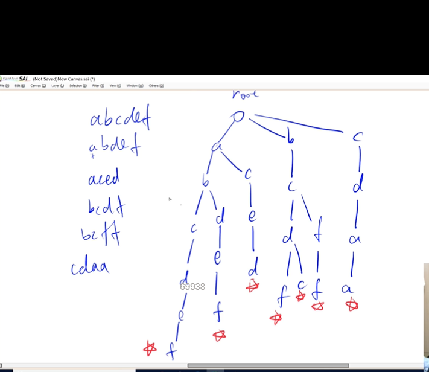
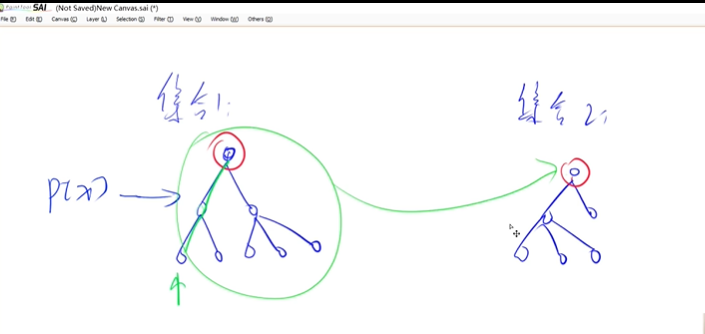
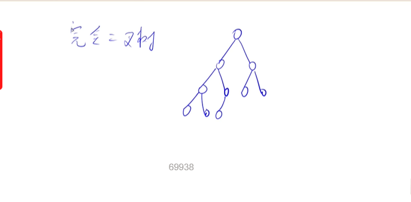
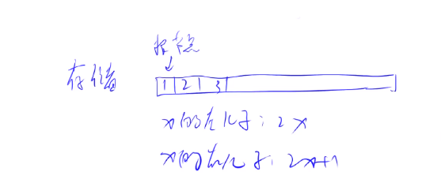
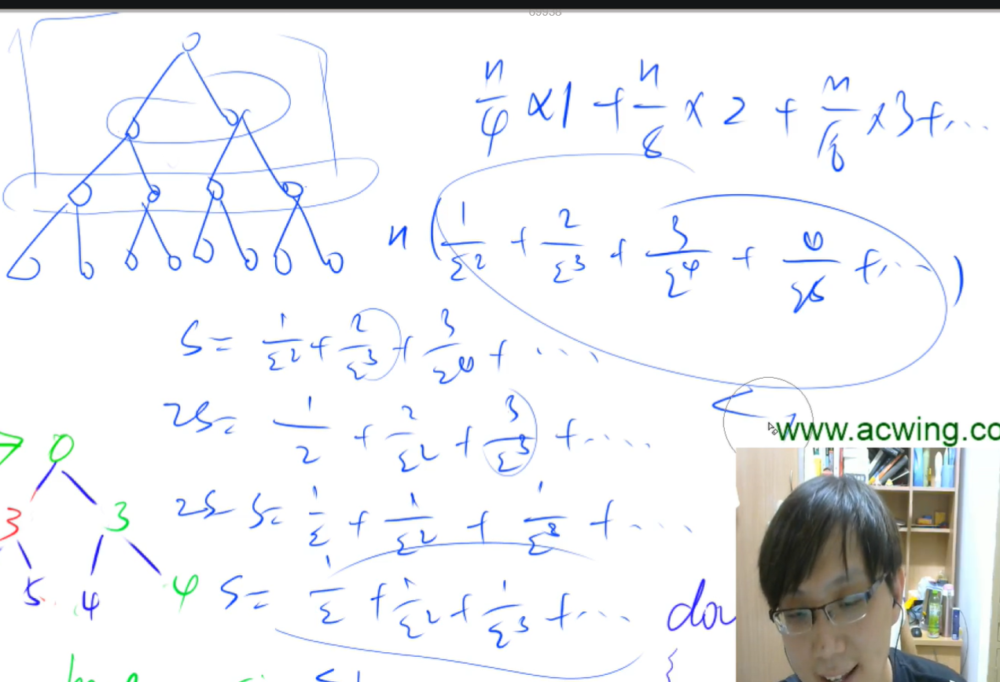
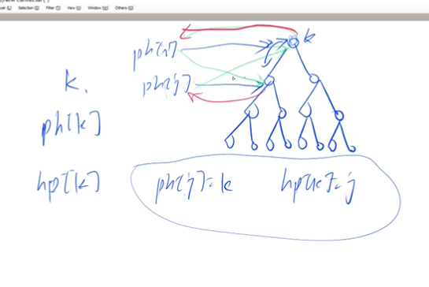

## Trie 树

### 定义

一个简单的数据结构。

它可以用来快速高效存储和查找字符串集合。


```
如想要存储这坨字符串
abcdef
abdef
aced
bcdf
bcff
cdaa
我们首先创立一个根节点(root)，并且在存储的时候，会给每个字符串结尾打个标记,方便查找有没有字符串是到这结尾的。如存储完上面这坨字符串，我们现在给出abcd这个字符串，想查查上面这坨有没有。我们根据路径，找到了abcd，但d这没有没有标记，代表没有。
```




### 模板

```c++
int son[N][26], cnt[N], idx;
// 0号点既是根节点，又是空节点
// son[][]存储树中每个节点的子节点
// cnt[]存储以每个节点结尾的单词数量

// 插入一个字符串
void insert(char *str)
{
    int p = 0;
    for (int i = 0; str[i]; i ++ )
    {
        int u = str[i] - 'a';
        if (!son[p][u]) son[p][u] = ++ idx;
        p = son[p][u];
    }
    cnt[p] ++ ;
}

// 查询字符串出现的次数
int query(char *str)
{
    int p = 0;
    for (int i = 0; str[i]; i ++ )
    {
        int u = str[i] - 'a';
        if (!son[p][u]) return 0;
        p = son[p][u];
    }
    return cnt[p];
}

```


### 题目

维护一个字符串集合，支持两种操作：

1. `I x` 向集合中插入一个字符串 *x*；
2. `Q x` 询问一个字符串在集合中出现了多少次。

共有 *N* 个操作，输入的字符串总长度不超过 *105*，字符串仅包含小写英文字母。


输入格式

第一行包含整数 *N*，表示操作数。

接下来 *N* 行，每行包含一个操作指令，指令为 `I x` 或 `Q x` 中的一种。

输出格式

对于每个询问指令 `Q x`，都要输出一个整数作为结果，表示 *x* 在集合中出现的次数。

每个结果占一行。


数据范围

*1≤N≤2∗104*

输入样例：

```
5
I abc
Q abc
Q ab
I ab
Q ab
```

输出样例：

```
1
0
1
```


```c++
//算法题里如果使用trie树，一定限制了字符的种类26个或52个这些(52个内涵大小写)...，不会特别多的（不是汉字有几万种）
#include <iostream>
using namespace std;
const int N = 100010;
char str[N]; //把str定义成全局变量
int son[N][26], cnt[N], idx;//刚开始idx=0，是root空结点
//son数组最多N个子节点，每个子节点最多向外连接26条边，
// cnt存储的是以当前这个点结尾的串有几个。idx和单链表里的是同个意思，当前用到哪个下标
//下标是0的点，既是根节点，又是空结点(一个点没有子节点的话，也让他指向0)

void insert(char str[]) //存储(创建trie树).插入字符串str
{
    int p = 0;
    for (int i = 0; str[i]; i++) // c++里字符串结尾是\0，可以用str[i]判断
    {
        int u = str[i] - 'a';
        if (!son[p][u]) //如果当前点不存在这个字母的话，就把它创建出来.(p这个结点不存在u这个儿子的话)
            son[p][u] = ++idx;//存储字符串里的字符，并不是直接真的把字符放入树里的这个位置。这个位置有数值，就代表这个字母存在,而u就是把字母以数字的形式的表现
        p = son[p][u];
    }
    cnt[p]++; //做字符串结尾的标记
}

int query(char str[]) //查找
{
    int p = 0;
    for (int i = 0; str[i]; i++)
    {
        int u = str[i] - 'a';
        if (!son[p][u])//发下并没有存储这个字符的数值
            return 0;
        p = son[p][u];
    }
    return cnt[p];
}

int main()
{
    int n;
    scanf("%d", &n);
    while (n--)
    {
        char op[2];
        scanf("%s%s", op, str);
        if (op[0] == 'I')
            insert(str);
        else
            printf("%d\n", query(str));
    }
    return 0;
}
```


## 并查集

### 定义

面试和比赛都会考的数据结构

可以用来快速处理两个集合合并和询问两个元素是否在一个集合当中。

(可以找数，如abc 228的D题)

并查集可以在近乎O(1)的时间完成这两步。


```
	有两个集合，以树的形态进行分布，集合的编号用根节点的值来表示。再建立一个数组p[x]，用来存储x结点的父节点是多少。而只有根节点，才会使得p[x]=x。
  	而想求x的所在集合的编号，就可以一路往上走，找到p[x]=x的这个值，
  	(while(p[x]!=x ) x=p[x]。
  	
  而且当我们要合并两个集合，可以直接把集合2的根节点连入(指向)集合1的某个点。(p[x]=y)
 而且，并查集还有一个很厉害的优化，就是这步，大大缩短了时间复杂度。一个点在找到了根节点后，我们就直接把路径上的所有点直接指向根结点(p)。(路径压缩)
```




### 模板

```c++
(1)朴素并查集：

    int p[N]; //存储每个点的祖宗节点

    // 返回x的祖宗节点
    int find(int x)
    {
        if (p[x] != x) p[x] = find(p[x]);
        return p[x];
    }

    // 初始化，假定节点编号是1~n
    for (int i = 1; i <= n; i ++ ) p[i] = i;

    // 合并a和b所在的两个集合：
    p[find(a)] = find(b);


(2)维护size的并查集：

    int p[N], size[N];
    //p[]存储每个点的祖宗节点, size[]只有祖宗节点的有意义，表示祖宗节点所在集合中的点的数量

    // 返回x的祖宗节点
    int find(int x)
    {
        if (p[x] != x) p[x] = find(p[x]);
        return p[x];
    }

    // 初始化，假定节点编号是1~n
    for (int i = 1; i <= n; i ++ )
    {
        p[i] = i;
        size[i] = 1;
    }

    // 合并a和b所在的两个集合：
    size[find(b)] += size[find(a)];
    p[find(a)] = find(b);


(3)维护到祖宗节点距离的并查集：

    int p[N], d[N];
    //p[]存储每个点的祖宗节点, d[x]存储x到p[x]的距离

    // 返回x的祖宗节点
    int find(int x)
    {
        if (p[x] != x)
        {
            int u = find(p[x]);
            d[x] += d[p[x]];
            p[x] = u;
        }
        return p[x];
    }

    // 初始化，假定节点编号是1~n
    for (int i = 1; i <= n; i ++ )
    {
        p[i] = i;
        d[i] = 0;
    }

    // 合并a和b所在的两个集合：
    p[find(a)] = find(b);
    d[find(a)] = distance; // 根据具体问题，初始化find(a)的偏移量


```


### 题目


#### 1:合并集合


一共有 n个数，编号是 1∼n，最开始每个数各自在一个集合中。

现在要进行 mm 个操作，操作共有两种：

1. `M a b`，将编号为 a 和 b 的两个数所在的集合合并，如果两个数已经在同一个集合中，则忽略这个操作；
2. `Q a b`，询问编号为 a和 b 的两个数是否在同一个集合中；


输入格式

第一行输入整数 n和 m。

接下来 m 行，每行包含一个操作指令，指令为 `M a b` 或 `Q a b` 中的一种。

输出格式

对于每个询问指令 `Q a b`，都要输出一个结果，如果 a 和 b 在同一集合内，则输出 `Yes`，否则输出 `No`。

每个结果占一行。


数据范围

1≤n,m≤10^5^

输入样例：

```
4 5
M 1 2
M 3 4
Q 1 2
Q 1 3
Q 3 4
```

输出样例：

```
Yes
No
Yes
```


```c++
#include <iostream>
using namespace std;
const int N = 100010;
int p[N]; //定义多个集合
int find(int x)
{
    if (p[x] != x)
        p[x] = find(p[x]);
    /*
    经上述可以发现,每个集合中只有祖宗节点的p[x]值等于他自己,即:
    p[x]=x;

    return p[x];
    //找到了便返回祖宗节点的值
    */
}

int main()
{
    int n, m;
    scanf("%d%d", &n, &m);
    for (int i = 1; i <= n; i++)
        p[i] = i;
    while (m--)
    {
        char op[2];
        int a, b;
        scanf("%s%d%d", op, &a, &b);
        if (*op == 'M')
            p[find(a)] = find(b); //集合合并操作
        else if (find(a) == find(b))
            //如果祖宗节点一样,就输出yes
            printf("Yes\n");
        else
            printf("No\n");
    }
    return 0;
}
```


#### 2：连通块中点的数量


给定一个包含 n 个点（编号为 1∼n）的无向图，初始时图中没有边。

现在要进行 mm 个操作，操作共有三种：

1. `C a b`，在点 a 和点 b 之间连一条边，a 和 b 可能相等；
2. `Q1 a b`，询问点a 和点 b 是否在同一个连通块中，a 和 b 可能相等；
3. `Q2 a`，询问点 a 所在连通块中点的数量；


输入格式

第一行输入整数 n 和 m。

接下来 mm 行，每行包含一个操作指令，指令为 `C a b`，`Q1 a b` 或 `Q2 a` 中的一种。

输出格式

对于每个询问指令 `Q1 a b`，如果 a 和 b 在同一个连通块中，则输出 `Yes`，否则输出 `No`。

对于每个询问指令 `Q2 a`，输出一个整数表示点 a 所在连通块中点的数量每个结果占一行。

数据范围

1≤n,m≤1051≤n,m≤105


输入样例：

```
5 5
C 1 2
Q1 1 2
Q2 1
C 2 5
Q2 5
```

输出样例：

```
Yes
2
3
```


```c++
#include <iostream>
using namespace std;
const int N = 100010;
int p[N], sie[N]; // size是每个集合点的数量.后改成sie,因为size这个名字与std里的重名了
int find(int x)
{
    if (p[x] != x)
        p[x] = find(p[x]);
    /*
    经上述可以发现,每个集合中只有祖宗节点的p[x]值等于他自己,即:
    p[x]=x;

    return p[x];
    //找到了便返回祖宗节点的值
    */
}
int main()
{
    int n, m;
    scanf("%d%d", &n, &m);
    for (int i = 1; i <= n; i++)
    {
        p[i] = i;
        sie[i] = 1;
    }
    while (m--)
    {
        char op[5];
        int a, b;
        scanf("%s", op);
        if (op[0] == 'C')
        {
            scanf("%d%d", &a, &b);
            if (find(a) == find(b)) //当a和b已经在一个集合里面,就不需要操作
                continue;
            sie[find(b)] += sie[find(a)];
            p[find(a)] = find(b);
        }
        else if (op[1] == '1')
        {
            scanf("%d%d", &a, &b);
            if (find(a) == find(b))
                puts("Yes");
            else
                puts("No");
        }
        else
        {
            scanf("%d", &a);
            printf("%d\n", sie[find(a)]);
        }
    }
}
```


3：食物链

：维护每个点到根节点的距离


## 堆

和stl不同，这是手写堆，并且 stl 里面堆不支持删除和修改任意一个元素的操作，但手写堆不同。

### 定义


堆是一棵二叉树的二叉树(完全二叉树)，长得非常平衡。除了最后一层结点之外，上面所有结点都是非空的，而最后一层是从左到右排列的。 有n个节点，最多log(n)层




如 小根堆：每个点都<=左右儿子。所以根节点就是最小的点。


堆的存储和链表的存储不一样，一种全新的存储方式。

用一维数组进行存储，1号点是根结点，第二格就是它的左儿子，第三格就存储右儿子。这样以后左儿子就是 2x，右儿子就是 2x+1.




基本操作：

down(x) : 点往下调整(如在小根堆里，一个点变大了，就要把它往下调整，与它的两个儿子中较小的那个交换)

up(x) :  点往上移动（如在小根堆里，一个点变小了，要把它与父节点进行比较，判断是否要上移）

（下面五个操作都可以用这两个操作表示）


`size表示大小，heap表示堆`

+ 插入一个数  `heap[++size]=x;up[size]`

     在整个堆的最后一个位置插入一个x，然后在不断往上移

+ 求集合当中的最小值 (heap[1])

    

+ 删除最小值    `heap[1]=heap[size];size--;down(1)` //down 1号点

    把堆的最后一个元素，覆盖掉堆顶元素，再size—–，然后再把堆顶元素(一号点)down下去。(因为我们存储在一个一维数组里面，处理头节点比较困难，但处理最后一个元素比较简单)

  

+ 删除任意一个元素  `heap[k]=heap[size];size--;down(k);up(k);`

   直接两个都写上去，up和down总有一个会执行

  

+ 修改任意一个元素  `heap[k]=x;down(k);up[k]`

  

  (后面两个在stl里面实现不了)


### 模板

```c++
// h[N]存储堆中的值, h[1]是堆顶，x的左儿子是2x, 右儿子是2x + 1
// ph[k]存储第k个插入的点在堆中的位置
// hp[k]存储堆中下标是k的点是第几个插入的
int h[N], ph[N], hp[N], size;

// 交换两个点，及其映射关系
void heap_swap(int a, int b)
{
    swap(ph[hp[a]],ph[hp[b]]);
    swap(hp[a], hp[b]);
    swap(h[a], h[b]);
}

void down(int u)
{
    int t = u;
    if (u * 2 <= size && h[u * 2] < h[t]) t = u * 2;
    if (u * 2 + 1 <= size && h[u * 2 + 1] < h[t]) t = u * 2 + 1;
    if (u != t)
    {
        heap_swap(u, t);
        down(t);
    }
}

void up(int u)
{
    while (u / 2 && h[u] < h[u / 2])
    {
        heap_swap(u, u / 2);
        u >>= 1;
    }
}

// O(n)建堆
for (int i = n / 2; i; i -- ) down(i);

```


### 题目


#### 1：堆排序

输入一个长度为 n 的整数数列，从小到大输出前 m 小的数。


输入格式

第一行包含整数 n 和 m。

第二行包含 n 个整数，表示整数数列。

输出格式

共一行，包含 m 个整数，表示整数数列中前 m 小的数。

数据范围

1≤m≤n≤10^5^
1≤数列中元素≤10^9^


输入样例：

```
5 3
4 5 1 3 2
```

输出样例：

```
1 2 3
```


堆排序，与快排，归并类似，全新的排序。把整个数组建立成堆，每次把堆顶输出，这里堆顶就是最小的数。有n个节点，最多log(n)层

```c++

//输出堆顶，删除堆顶两个操作...
#include <iostream>
#include <algorithm>
#include <bits/stdc++.h>
using namespace std;
const int N = 100010;
int n, m;
int h[N], sie; // size 换成sie
void down(int u)
{
    int t = u;
    if (u * 2 <= sie && h[u * 2] < h[t]) //判断有没有左儿子，和大不大于左儿子
        t = u * 2;                       // t等于左儿子
    if (u * 2 + 1 <= sie && h[u * 2 + 1] < h[t])
        t = u * 2 + 1;
    if (u != t) // u不等于t的话，说明根节点不是最小值
    {
        swap(h[u], h[t]);
        down(t);
    }
}
// down函数的复杂度，log(n),求最小值是O(1)

void up(int u)//往上走
{
    while (u / 2 && h[u / 2] > h[u])//有父节点，并且父节点比当前结点大
    {
        swap(h[u / 2], h[u]);
        u /= 2;
    }
}
int main()
{
    scanf("%d%d", &n, &m);
    for (int i = 1; i <= n; i++)
        scanf("%d", &h[i]);
    sie = n;

    //建堆
    //一个个往里面插的时间复杂度是 nlogn。还有一个O(n)的建堆方式
    for (int i = n / 2; i; i--)
        down(i); //从2/n down到1.
    while (m--)
    {
        printf("%d ", h[1]); //输出堆顶元素
        //输出堆顶，然后再删掉
        h[1] = h[sie];
        sie--;
        down(1);
    }
    return 0;
}
```


错位相减法,2*S-S,随意最后建堆最后时间复杂度为O(n)




#### 2:模拟堆

维护一个集合，初始时集合为空，支持如下几种操作：

1. `I x`，插入一个数 x；
2. `PM`，输出当前集合中的最小值；
3. `DM`，删除当前集合中的最小值（数据保证此时的最小值唯一）；
4. `D k`，删除第 k 个插入的数；
5. `C k x`，修改第 k 个插入的数，将其变为 x；

现在要进行 N 次操作，对于所有第 2个操作，输出当前集合的最小值。


输入格式

第一行包含整数 N。

接下来 N 行，每行包含一个操作指令，操作指令为 `I x`，`PM`，`DM`，`D k` 或 `C k x` 中的一种。

输出格式

对于每个输出指令 `PM`，输出一个结果，表示当前集合中的最小值。

每个结果占一行。


数据范围

1≤N≤105
−109≤x≤109
数据保证合法。


输入样例：

```
8
I -10
PM
I -10
D 1
C 2 8
I 6
PM
DM
```

输出样例：

```
-10
6
```


```
麻烦的地方在于，删除和修改第k个元素，所以我们就要存一个映射进去(he,ph)

带映射版的堆不是很常用(heap_swap复杂的交换)，但是迪杰斯它算法要用到
```




```c++
#include <iostream>
#include <algorithm>
#include <string.h>
using namespace std;
const int N = 100010;
int n, m;
int h[N], ph[N], hp[N], sie;
// ph存的是第k个插入的数的在堆里的下标是什么。hp存的是堆里面的点是第几个插入的点
//若ph[k]=j 则 hp[j]=k
//ps：p大多数时候，表示下标

void heap_swap(int a, int b)
//写一个swap函数，因为我们这里为了删除和修改堆里的值，引入了hp和ph，当我们在交换堆里的点的 时候，也要把hp和ph的对应关系给换了
{
    swap(ph[hp[a]], ph[hp[b]]);
    swap(hp[a], hp[b]);
    swap(h[a], h[b]);
}
void down(int u)
{
    int t = u;
    if (u * 2 <= sie && h[u * 2] < h[t]) //判断有没有左儿子，和大不大于左儿子
        t = u * 2;                       // t等于左儿子
    if (u * 2 + 1 <= sie && h[u * 2 + 1] < h[t])
        t = u * 2 + 1;
    if (u != t) // u不等于t的话，说明根节点不是最小值
    {
        heap_swap(u, t);
        down(t);
    }
}
// down函数的复杂度，log(n),求最小值是O(1)

void up(int u) //往上走
{
    while (u / 2 && h[u / 2] > h[u]) //有父节点，并且父节点比当前结点大
    {
        heap_swap(u / 2, u);
        u /= 2;
    }
}
int main()
{
    int n, m = 0;
    scanf("%d", &n);
    while (n--)
    {
        char op[10];
        int k, x;
        scanf("%s", op);
        if (!strcmp(op, "I")) //插入
        {
            scanf("%d", &x);
            sie++;
            m++;
            ph[m] = sie, hp[sie] = m;
            h[sie] = x;
            up(sie);
        }
        else if (!strcmp(op, "PM")) //输出最小值
        {
            printf("%d\n", h[1]);
        }
        else if (!strcmp(op, "DM")) //删除最小值
        {
            heap_swap(1, sie);
            sie--;
            down(1);
        }
        else if (!strcmp(op, "D")) //删除第k个插入的数
        {
            scanf("%d", &k);
            k = ph[k];
            heap_swap(k, sie);
            sie--;
            down(k), up(k);
        }
        else //修改第k个插入的数
        {
            scanf("%d%d", &k, &x);
            k = ph[k];
            h[k] = x;
            down(k), up(k);
        }
    }
    return 0;
}
```


## 


