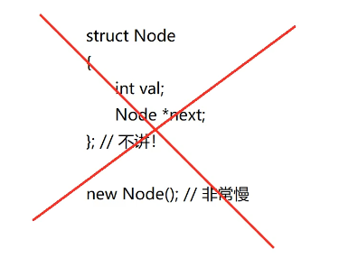
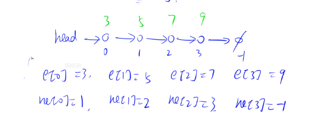
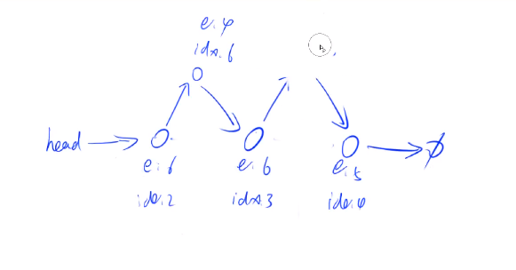
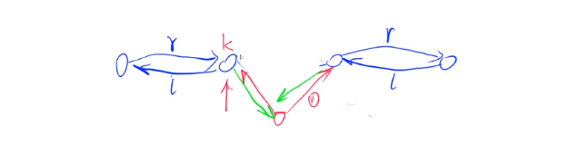

## 链表	队列	KMP

本课程介绍如何用数组来模拟链表和栈与队列。

还有一种是用结构体加指针的方式来模拟，这类型在面试题里比较多，但笔试题里不多，因为每次创建一个新链表(新节点)的时候，用new函数(c++的,与malloc相近)的时候这个操作非常慢，而题目中一般都是10万到百万级别的链表，很延误时间。因此，平时笔试时不用这种动态链表的方式.静态链表(数组表示)比较块。但工程里要用动态链表，可以free释放内存。



### 链表与邻接表

#### 概念

+ 用数组模拟单链表

  这部分用的最多的时邻接表(n个链表)，用来存储图和树

  

+ 用数组模拟双链表

  优化某些题

#### 单链表

##### 概念

用数组的时候，注意表示(定义)其中的head头结点，value(习惯用e[n]表示),用ne[n]表示某个点后面一个点的数组下标是多少(和next同)，e和ne可以用下标来关联,idx表示当前所讨论的位置。(-1可以代表链表为空，没有填充的时候)

绿色的数字代表数值



##### 模板

```c
int head, e[N], ne[N], idx;
void init() //初始化
{
    head = -1; //刚开始空数组
    idx = 0;
}
//把x插入到第一个数，就是原本head的那个位置
void add_to_head(int x)
{
    e[idx] = x;     //x存入e里面
    ne[idx] = head; //设置把想插入的那个数的指针指向原本head指向的值
    head = idx;     //head指向想插入的那个值
    idx++;          //这个位置已经被使用过了
}
//把x这个点插入到下标为k的点的后面
void add(int k, int x)
{
    e[idx] = x;
    ne[idx] = ne[k];
    ne[k] = idx;
    idx++;
}

```

##### 例子

实现一个单链表，链表初始为空，支持三种操作：

1. 向链表头插入一个数；
2. 删除第 k 个插入的数后面的数；
3. 在第 k个插入的数后插入一个数。

现在要对该链表进行 MM 次操作，进行完所有操作后，从头到尾输出整个链表。

**注意**:题目中第 k 个插入的数并不是指当前链表的第 k 个数。例如操作过程中一共插入了 n 个数，则按照插入的时间顺序，这 n个数依次为：第 1 个插入的数，第 2 个插入的数，…第 n 个插入的数。


输入格式

第一行包含整数 M，表示操作次数。

接下来 M 行，每行包含一个操作命令，操作命令可能为以下几种：

1. `H x`，表示向链表头插入一个数 xx。
2. `D k`，表示删除第 k 个插入的数后面的数（当 k为 0 时，表示删除头结点）。
3. `I k x`，表示在第 k 个插入的数后面插入一个数 x（此操作中 k均大于 0）。

输出格式

共一行，将整个链表从头到尾输出。


数据范围

1≤M≤100000所有操作保证合法。

输入样例：

```
10
H 9
I 1 1
D 1
D 0
H 6
I 3 6
I 4 5
I 4 5
I 3 4
D 6
```

输出样例：

```
6 4 6 5
```

例题过程大概如下图所示：




```c
#include <iostream>
using namespace std;
const int N = 100010;
//head表示头节点的下标
//e[i]表示节点的值，ne[i]表示节点的next的指针(下一个点的位置)
//idx表示当前在设置的哪个店
int head, e[N], ne[N], idx;
void init() //初始化
{
    head = -1; //刚开始空数组
    idx = 0;
}
//把x插入到第一个数，就是原本head的那个位置
void add_to_head(int x)
{
    e[idx] = x;     //x存入e里面
    ne[idx] = head; //设置把想插入的那个数的指针指向原本head指向的值
    head = idx;     //head指向想插入的那个值
    idx++;          //这个位置已经被使用过了
}
//把x这个点插入到下标为k的点的后面
void add(int k, int x)
{
    e[idx] = x;
    ne[idx] = ne[k];
    ne[k] = idx;
    idx++;
}

//将下标为k的点后面的点删掉
//直接让前一个点指到后一个点
void remove(int k)
{
    ne[k] = ne[ne[k]];
}

//但想找一个点的前面那个数，只能从头开始遍历
int main()
{
    int m;
    cin >> m;
    init();//初始化
    while (m--)
    {
        int k, x;
        char op;
        cin >> op;
        if (op == 'H')
        {
            cin >> x;
            add_to_head(x);
        }
        else if (op == 'D')
        {
            cin >> k;
            if (!k) //如果k=0的话，head指向后一个点
                head = ne[head];
            remove(k - 1); //数组从下标0开始的
        }
        else
        {
            cin >> k >> x;
            add(k - 1, x); //从0开始的
        }
    }
    for (int i = head; i != -1; i = ne[i])
        cout << e[i] << ' ';
    cout << endl;
}
```


#### 双链表

##### 概念

单链表是每个点有一个指针，指向后面的一个值。而双链表是每个节点有两个指针，一个指向前，一个指向后。所以我们在用数组定义的时候，要用l[N],r[N]。同样要有个e[N],表示现在这个值是多少。

##### 模板

```cpp
// e[]表示节点的值，l[]表示节点的左指针，r[]表示节点的右指针，idx表示当前用到了哪个节点
int e[N], l[N], r[N], idx;

// 初始化
void init()
{
    //0是左端点，1是右端点.0的右端点是1,1的左端点是0
    r[0] = 1, l[1] = 0;
    idx = 2;
}

// 在节点a(a代表位置)的右边插入一个数x
void insert(int a, int x)
{
    e[idx] = x;//先把值赋好.e数组存储每个位置
    l[idx] = a, r[idx] = r[a];//idx的左边是a,右边是原本a点的右边
    l[r[a]] = idx, r[a] = idx ++ ;//先改了r[a],再才能改l[r[a]]
}
//想要在a左边插入一个点的话，就直接insert(l(a),x)


// 删除节点a
void remove(int a)
{
    l[r[a]] = l[a];
    r[l[a]] = r[a];
}

/*
以下是删除节点用结构体表示(感觉这里的y总结构体方法不是用指针)。(发现显得有点长)
struct Node
{
int e,l,r;
}nodes[N];

nodes[nodes[a].r].l=nodes[a].l;
nodes[nodes[a].l].r=nodes[a].r;
*/

```

在a右边插入x:




##### 例子

实现一个双链表，双链表初始为空，支持 5 种操作：

1. 在最左侧插入一个数；
2. 在最右侧插入一个数；
3. 将第 k 个插入的数删除；
4. 在第 k个插入的数左侧插入一个数；
5. 在第 k个插入的数右侧插入一个数

现在要对该链表进行 M 次操作，进行完所有操作后，从左到右输出整个链表。

**注意**:题目中第 k 个插入的数并不是指当前链表的第 k 个数。例如操作过程中一共插入了 n个数，则按照插入的时间顺序，这 n 个数依次为：第 1 个插入的数，第 2个插入的数，…第 n 个插入的数。


输入格式

第一行包含整数 M，表示操作次数。

接下来 M 行，每行包含一个操作命令，操作命令可能为以下几种：

1. `L x`，表示在链表的最左端插入数 x。
2. `R x`，表示在链表的最右端插入数 x。
3. `D k`，表示将第 k个插入的数删除。
4. `IL k x`，表示在第 k 个插入的数左侧插入一个数。
5. `IR k x`，表示在第 k 个插入的数右侧插入一个数。

输出格式

共一行，将整个链表从左到右输出。


数据范围

1≤M≤100000
所有操作保证合法。

输入样例：

```
10
R 7
D 1
L 3
IL 2 10
D 3
IL 2 7
L 8
R 9
IL 4 7
IR 2 2
```

输出样例：

```
8 7 7 3 2 9
```

`1s/64mb`


```c++
#include <iostream>

using namespace std;

const int N = 100010;

int m;
int e[N], l[N], r[N], idx;

// 在节点a的右边插入一个数x
void insert(int a, int x)
{
    e[idx] = x;
    l[idx] = a, r[idx] = r[a];
    l[r[a]] = idx, r[a] = idx ++ ;
}

// 删除节点a
void remove(int a)
{
    l[r[a]] = l[a];
    r[l[a]] = r[a];
}

int main()
{
    cin >> m;

    // 0是左端点，1是右端点
    r[0] = 1, l[1] = 0;
    idx = 2;

    while (m -- )
    {
        string op;
        cin >> op;
        int k, x;
        if (op == "L")
        {
            cin >> x;
            insert(0, x);
        }
        else if (op == "R")
        {
            cin >> x;
            insert(l[1], x);
        }
        else if (op == "D")
        {
            cin >> k;
            remove(k + 1);
        }
        else if (op == "IL")
        {
            cin >> k >> x;
            insert(l[k + 1], x);
        }
        else
        {
            cin >> k >> x;
            insert(k + 1, x);
        }
    }

    for (int i = r[0]; i != 1; i = r[i]) cout << e[i] << ' ';
    cout << endl;

    return 0;
}


```


### 邻接表

就是一堆单链表。

会在第三章图论里重点讲。


### 栈与队列

后面的课会单讲stl。现在用数组模拟，能加深对数据结构的映像，且能用stl写的，数组一定可以写。

下面的单调栈和单调队列较为抽象，但它们题型很少。

#### 栈

##### 概念

+ 先进后出

##### 模板（栈，单调栈）

栈：

```c++
// tt表示栈顶
int stk[N], tt = 0;

// 向栈顶插入一个数
stk[ ++ tt] = x;//后++

// 从栈顶弹出一个数
tt -- ;

// 栈顶的值
stk[tt];

// 判断栈是否为空
if (tt > 0)
{

}
```


单调栈：

```c++
常见模型：给定一个序列，找出每个数左边离它最近的比它大/小的数
int tt = 0;
for (int i = 1; i <= n; i ++ )
{
    while (tt && check(stk[tt], i)) tt -- ;
    stk[ ++ tt] = i;
}
```


##### 例子（栈，单调栈）


​	单调栈：

给定一个长度为 N 的整数数列，输出每个数左边第一个比它小的数，如果不存在则输出 −1。


输入格式

第一行包含整数 N，表示数列长度。

第二行包含 N个整数，表示整数数列。

输出格式

共一行，包含 N 个整数，其中第 i 个数表示第 i 个数的左边第一个比它小的数，如果不存在则输出 −1。

数据范围

1≤N≤105
1≤数列中元素≤109


输入样例：

```
5
3 4 2 7 5
```

输出样例：

```
-1 3 -1 2 2
```

| 难度：**简单**       |
| -------------------- |
| 时/空限制：1s / 64MB |
| 总通过数：25024      |
| 总尝试数：34339      |
| 来源：模板题         |
| 算法标签             |

```c++
/*
暴力做法：
写两个循环，第一个是从左往右遍历，第二个循环是从这个数开始往左找，发现比它小的就读入
*/
/*
寻找其中规律，看看能不能减少判断次数。
随着i往右走，用一个栈存储i左边的所有元素，如果存在Ax>Ay(x,y是数组下标的意思),且x<y这样的逆序关系，就可以直接把Ax这个数给删掉了，因为有了Ay，则Ax肯定不是我们要找的数。(当然，Ax，Ay都在给定数的左边)。这样子剩下的元素就是上升序列了,而因为删除元素的原因，比较次数大幅度减少
*/

```

```c++
#include <iostream>
using namespace std;
const int N = 100010;
int stk[N], tt; //tt表示下标，stk表示栈。
//这里tt初始值为0
int n;
int main()
{
    ios:sync_with_stdio(false);
    cin >> n;//或者直接用scanf
    for (int i = 0; i < n; i++)
    {
        int x;
        cin >> x;
        while (tt && stk[tt] >= x) //stk[tt]表示栈顶元素
        {
            tt--;//如果栈顶>=要存入的元素,就可以把栈顶元素直接删掉，这样剩下来的所有点就是单调上升的
        }
        if (tt)//没被删光
            cout << stk[tt] << ' ';
        else
            cout << -1 << ' ';
        stk[++tt] = x;//元素存入栈
        //此时的意思是stk[1]=x。(先算方框里面的)
    }
}
/*
每个元素进站一次，出栈一次，加在一块也就2n。
算法复杂度为O(n)  (O(2n))
*/
/*
要知道这里的tt是都在变化的，当我们遇到了栈顶元素比要插入的值大的时候，我们会弹出栈顶元素(数组往左走),直到找到比要插入的元素小的数，这个数就是答案。最精彩的地方是，当再继续读入另一个x时，这时候stl数组的元素已经比原本x左边序列的数要少了，这样会不断减少比较次数。如 1 3 4要插入2，当2比到1(stl[1])时停止while循环，输出1，且此时2就自然而然的成为stl[2],不再是原本的stl[4]了，为后续的比较节省很多时间。(而这里能删除3,4就是单调栈的思想，(如果连2都不是答案，3,4绝对不可能是答案))。
并且这里数组下标的移动和再填充，就是再模拟栈顶元素的弹出过程。
*/
```


#### 队列

##### 概念

+ 先进先出

##### 模板（队列，循环队列，单调队列)

普通队列：

```c++
// hh 表示队头，tt表示队尾
int q[N], hh = 0, tt = -1;//初始从0开始，从-1开始看个人习惯。y总喜欢栈用0，队列用-1

// 向队尾插入一个数
q[ ++ tt] = x;

// 从队头弹出一个数
hh ++ ;

// 队头的值
q[hh];
//队尾的值
q[tt]
// 判断队列是否为空
if (hh <= tt)//成立的话就不是空的
{

}
```


循环队列：

```c++
// hh 表示队头，tt表示队尾的后一个位置
int q[N], hh = 0, tt = 0;

// 向队尾插入一个数
q[tt ++ ] = x;
if (tt == N) tt = 0;

// 从队头弹出一个数
hh ++ ;
if (hh == N) hh = 0;

// 队头的值
q[hh];

// 判断队列是否为空
if (hh != tt)
{

}
```


单调队列：

```c++
常见模型：找出滑动窗口中的最大值/最小值
    在模拟普通队列
int hh = 0, tt = -1;
for (int i = 0; i < n; i ++ )
{
    while (hh <= tt && check_out(q[hh])) hh ++ ;  // 判断队头是否滑出窗口
    while (hh <= tt && check(q[tt], i)) tt -- ;
    q[ ++ tt] = i;
}
```


##### 例子

单调队列：

###### 	滑动窗口

给定一个大小为 n≤106 的数组。

有一个大小为 k 的滑动窗口，它从数组的最左边移动到最右边。

你只能在窗口中看到 k个数字。

每次滑动窗口向右移动一个位置。

以下是一个例子：

该数组为 `[1 3 -1 -3 5 3 6 7]`，k 为 3。

| 窗口位置            | 最小值 | 最大值 |
| :------------------ | :----- | :----- |
| [1 3 -1] -3 5 3 6 7 | -1     | 3      |
| 1 [3 -1 -3] 5 3 6 7 | -3     | 3      |
| 1 3 [-1 -3 5] 3 6 7 | -3     | 5      |
| 1 3 -1 [-3 5 3] 6 7 | -3     | 5      |
| 1 3 -1 -3 [5 3 6] 7 | 3      | 6      |
| 1 3 -1 -3 5 [3 6 7] | 3      | 7      |

你的任务是确定滑动窗口位于每个位置时，窗口中的最大值和最小值。


输入格式

输入包含两行。

第一行包含两个整数 n 和 k，分别代表数组长度和滑动窗口的长度。

第二行有 n 个整数，代表数组的具体数值。

同行数据之间用空格隔开。

输出格式

输出包含两个。

第一行输出，从左至右，每个位置滑动窗口中的最小值。

第二行输出，从左至右，每个位置滑动窗口中的最大值。


输入样例：

```
8 3
1 3 -1 -3 5 3 6 7
```

输出样例：

```
-1 -3 -3 -3 3 3
3 3 5 5 6 7
```

| 难度：**简单**                     |
| ---------------------------------- |
| 时/空限制：1s / 64MB               |
| 总通过数：26375                    |
| 总尝试数：51149                    |
| 来源：《算法竞赛进阶指南》, 模板题 |
| 算法标签                           |


```
这个滑动窗口里面的数，可以放入队列进行维护。
假如一个窗口规定有3个值，先队尾依次插入，直到队列有三个值的时候，接着队尾插入，队首弹出
暴力做法：
遍历队列所有元素。时间复杂度为O(k)(假如一个窗口有k个元素),而总共有n个数据，所以时间复杂度为O(kn).
单调队列:
一个滑动窗口有k个数，假如要找里面的最小值，若有两个数字存在Ax>Ay,x<y的逆序关系，则可以直接删除Ax，因为有Ay在，Ax永远不可能是答案，它又比Ax小，又在窗口里的时间比Ay长。
```


```c++
#include <iostream>
using namespace std;
const int N = 1000010;
int n, k;
int a[N], q[N];
int main()
{
    scanf("%d%d", &n, &k);//总共几个数，每个窗口里有几个数
    for (int i = 0; i < n; i++)//i表示数组下标
        scanf("%d", &a[i]);//读入数，a数组存入原序列，a数组在程序中永远不变化，变化的是代表队列的q数组，不断的读入值，或者数组下标回退，再读入一遍覆盖原来的值
   
    int hh = 0, tt = -1;
    for (int i = 0; i < n; i++) //打印最小值
    {
        //判断队头是否已经滑出窗口
        if (hh <= tt && i - k + 1 > q[hh])//判断队首元素是否要滑出窗口了
            hh++;//是的话，队首元素往右移动一格
        
        while (hh <= tt && a[q[tt]] >= a[i])
             tt--;
            //队列已经有一个元素(下标)的前提下，队列里的元素比要插入的数大开始while循环。
            //且如果tt减到0的时候(队列只剩一个元素)，还没有找到比a[i]小的数，while也退出了，因为tt=-1了，已经不满足第一个条件。如1 3 -1 -3 5，i遍历到-1的时候，-1的数组下标是2，q[0]=2(1,3已经全部被优化删掉了)           
        
        
         q[++tt] = i;//数组下标存入队列
      
        
        if (i >= k - 1)//i是从0开始的数组下标，当>=k-1的时候,表示窗口已经满了，可以开始输出答案了。
      //(如只有当窗口里已经有3个数组下标时，才能输出此时的最小值)
            printf("%d ", a[q[hh]]);//因为筛选过(删过数)的原因，此时的队列是个单调递增的队列，只要输出队首元素，就是最小值
    }
    puts("");
   
    //以下输出最大值，和上面基本一样
    hh = 0, tt = -1;
    for (int i = 0; i < n; i++) 
    {
        //判断队头是否已经滑出窗口
        if (hh <= tt && i - k + 1 > q[hh])
            hh++;
        while (hh <= tt && a[q[tt]] <= a[i]) //唯一改变的地方，打印最大值
            tt--;
        q[++tt] = i;
        if (i >= k - 1)
            printf("%d ", a[q[hh]]);
    }
    puts("");
}

```


### kmp

#### 概念

   这是一个字符串匹配算法(可以在一长串字符串里面快速寻找到与所给模板串相同的子串，)，对暴力的那种一一比对的方法进行了优化，使时间复杂度大大降低


#### 模板

```c++
// s[]是长文本，p[]是模式串，n是s的长度，m是p的长度
求模式串的Next数组，给next数组赋值：
for (int i = 2, j = 0; i <= m; i ++ )
{
    while (j && p[i] != p[j + 1]) j = ne[j];
    if (p[i] == p[j + 1]) j ++ ;
    ne[i] = j;
}

// kmp匹配
for (int i = 1, j = 0; i <= n; i ++ )
{
    while (j && s[i] != p[j + 1]) j = ne[j];//j已经退无可退或者相等，while结束循环，
    if (s[i] == p[j + 1]) j ++ ;
    if (j == m)
    {
        j = ne[j];
        // 匹配成功后的逻辑
    }
}

```


#### 例子

给定一个模式串 S，以及一个模板串 P，所有字符串中只包含大小写英文字母以及阿拉伯数字。

模板串 P在模式串 S 中多次作为子串出现。

求出模板串 P 在模式串 SS 中所有出现的位置的起始下标。


输入格式

第一行输入整数 N，表示字符串 P 的长度。

第二行输入字符串 P。

第三行输入整数 M，表示字符串 S 的长度。

第四行输入字符串 S。

输出格式

共一行，输出所有出现位置的起始下标（下标从 0开始计数），整数之间用空格隔开。

数据范围

1≤N≤105
1≤M≤106


输入样例

```
3
aba
5
ababa
```

输出样例：

```
0 2
```


```

```

