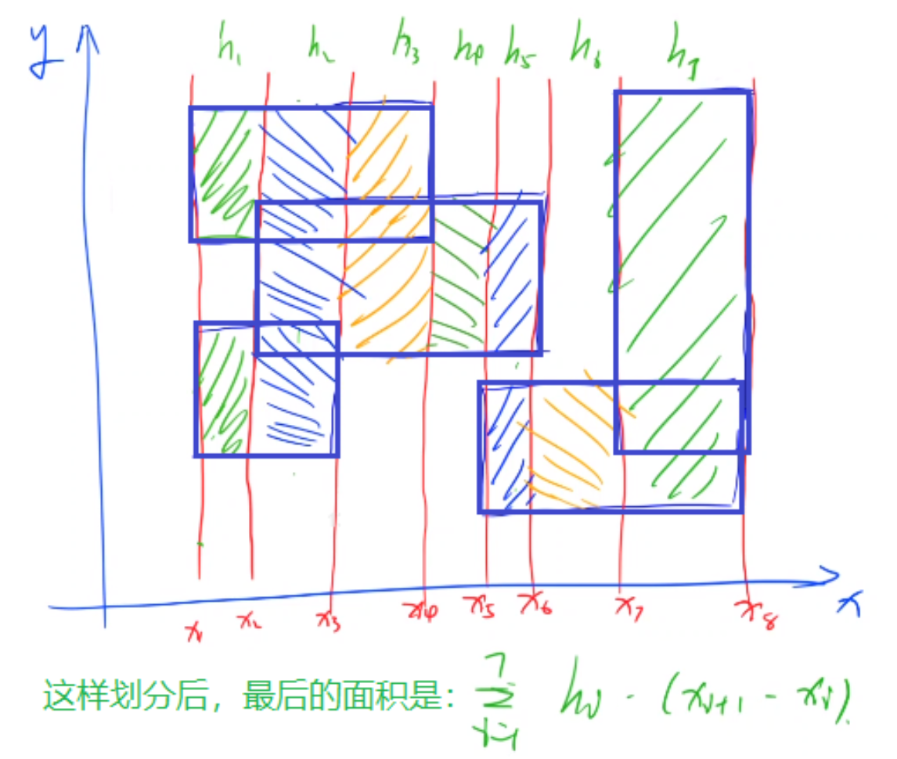

### 890: 能被整除的数(容斥原理)

#### 题目

[890. 能被整除的数 - AcWing题库](https://www.acwing.com/problem/content/892/)


### 3068:扫描线

#### 题目:

[3068. 扫描线 - AcWing题库](https://www.acwing.com/problem/content/description/3071/)


#### 思路:

扫描线求相交矩形的并面积,用到割裂成小矩形再相加的思想.

这里将出现的所有矩形以横坐标为分割线划分成一个个竖直的长条，计算每个长条的面积，相加就可以得到答案.




先将每个矩形的左上端点和右下端点的x值存入v数组,进行排序,然后遍历v数组,将数个矩形组成的大面积分割成一小条一小条来看.

每个长条内部都是一堆等宽的小矩形，我们求出这些矩形在竖直方向上的长度，然后乘以宽度就是这个长条的面积。

如何求解每个长条竖直方向上的长度之和呢？首先遍历所有矩形，找到这个长条中所有的线段，然后使用区间合并即可。

关于区间合并可以参考：[803. 区间合并 - AcWing题库](https://www.acwing.com/problem/content/805/)

本题的时间复杂度是：O(n^2^×log(n))。


#### 代码:

```c++
#include <iostream>
#include <cstring>
#include <vector>
#include <algorithm>

#define x first
#define y second

using namespace std;

typedef long long LL;
typedef pair<int, int> PII;

const int N = 1010;

int n;
PII l[N], r[N]; // 存储矩形左下角和右上角坐标
PII q[N];       // 存储每个竖直长条中线段

// 计算一个竖直长条的面积
LL range_area(int a, int b)
{

     // 求出此时需要合并的所有区间
     int cnt = 0;
     for (int i = 0; i < n; i++)
          if (l[i].x <= a && r[i].x >= b)
               q[cnt++] = {l[i].y, r[i].y};
     if (!cnt)
          return 0;

     // 以下是区间合并代码
     sort(q, q + cnt);
     LL res = 0;
     int st = q[0].x, ed = q[0].y;
     for (int i = 1; i < cnt; i++)
          if (q[i].x <= ed)
               ed = max(ed, q[i].y);
          else
          {
               res += ed - st;
               st = q[i].x, ed = q[i].y;
          }
     res += ed - st;

     return res * (b - a);
}

int main()
{

     scanf("%d", &n);
     vector<int> xs;
     for (int i = 0; i < n; i++)
     {
          scanf("%d%d%d%d", &l[i].x, &l[i].y, &r[i].x, &r[i].y);
          xs.push_back(l[i].x), xs.push_back(r[i].x);//存入左上端点和右下端点的横坐标
     }

     sort(xs.begin(), xs.end());

     LL res = 0;
     for (int i = 0; i + 1 < xs.size(); i++)
          if (xs[i] != xs[i + 1])
               res += range_area(xs[i], xs[i + 1]);

     printf("%lld\n", res);

     return 0;
}

```


### 842:排列数字(dfs)


#### 题目


#### 思路

就正常的求1-n所有数字的排列组合,只不过这里的写法和y总视频课的写法不太一样,这里还加上了一点二进制压缩


#### 代码

```c++
#include <iostream>

using namespace std;

const int N = 10;

int n;
int path[N];

void dfs(int u, int state)//当前第u位,state是一串二进制码,假如0010,代表1-4这几个数字里面,2已经用过了.有了二进制这步,就不用用数组标记数字有无使用过了,代码变得简短
{
     if (u == n)
     {
          for (int i = 0; i < n; i++)
               printf("%d ", path[i]);
          puts("");

          return;
     }

     for (int i = 0; i < n; i++)
          if (!(state >> i & 1))//判断第i+1个数字有没有用过
          {
               path[u] = i + 1;
               dfs(u + 1, state + (1 << i));
          }
}

int main()
{
     scanf("%d", &n);
     dfs(0, 0);
     return 0;
}
```

