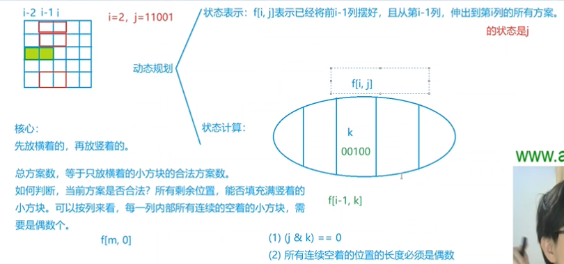

## 背包问题


### 01背包问题

#### 代码

```c++
#include <bits/stdc++.h>
using namespace std;
const int N = 1e3 + 10;
int v[N], w[N];
int dp[N][N];
int main()
{
     int n, m;
     cin >> n >> m;
     for (int i = 1; i <= n; i++)
          cin >> v[i] >> w[i];
     for (int i = 1; i <= n; i++)
          for (int j = 1; j <= m; j++)
          {
               dp[i][j] = dp[i - 1][j];
               if (j >= v[i])
                    dp[i][j] = max(dp[i][j], dp[i - 1][j - v[i]] + w[i]);
          }
     cout << dp[n][m] << endl;
     return 0;
}
```


### 完全背包

#### 代码

```

```


## 状压dp


### 蒙德里安的梦想

#### 思路


难~
	
	经典状压dp问题
	
	摆放方块的时候,都先只考虑横着放,所有横着摆放的方案数考虑好了,竖着放的自然也就固定了(往空的地方嵌)
	所以题意转换为统计只摆横方块的合法方案数!(重点).合法:横着摆完之后,剩余空的位置能放得下竖的小方块.我们直接按列来看,只要每一列连续空着的小方块是偶数个,代表合法.
	
	我们通过0 1组成的二进制来表示第i列的状态.状态表示:f(i,j):前i-1列已经摆好,且从i-1列的横方块延伸到第i列形成的状态j的方案数.第i列还没有摆放就被第i-1列放的方块给填了,就是1,还是空着,就是0.如图片的例子,i=2(i从0开始),此刻j就是11001,它的第一行,第二行,最后一行都已经被第i-1列放的方框给占据了位置,第三行第四行还是空着的(j就是前i-1列摆好后,第i列的状态).因为最多有n行,所以每一列的j最多有2^n种.(状态表示就是用某一个状态表示一类东西,化零为整)
	
	相对的来说,状态计算就是化整为零,对f(i,j)这个集合(椭圆)进行划分,要使得每一部分都要被计算到(转移得到). 划分依据可以是抓住最后一个不同点.按照之前i-2列延伸到i-1列形成的状态k进行划分(i-2列延伸到i-1列产生的不同状态k才导致了i-1列延伸到第i列的不同状态),f(i,j)肯定都是由这些状态转移得到的,所以这个划分就是不重不漏的.我们只要把每一部分的数量(f(i-1,k))加起来,就是f(i,j).
	
	现在要讨论的是对于每一种k,什么样的j与之组合会形成合法方案?
	1:状态k和状态j里不能有任何一个1在同一位置.如下图,i-1列的第三行的方格已经被i-2列的方格占据,那么讨论f(i,j)的时候,这个j就不可能在第三个位置有1了(意思就是第i列的第3行不可能会被第i-1列的方格所占据!!)( (j & k) == 0) ,等于0代表没有1在同一位置)
	2:每一列连续空着的位置长度必须是偶数,这样才能放下竖着的方块
	
	最后答案就是输出f(m,0)!
	为了节省时间,直接预处理出所有可能的合法方案.





#### 代码

```c++
//所谓的状态压缩DP，就是用二进制数保存状态。为什么不直接用数组记录呢？因为用一个二进制数记录方便作位运算(抄自他人笔记)
#include <cstring>
#include <iostream>
#include <algorithm>
#include <vector>

using namespace std;

typedef long long LL;

const int N = 12, M = 1 << N;

int n, m;
LL f[N][M];
vector<int> state[M]; //记录合法的状态
bool st[M];

int main()
{
     while (cin >> n >> m, n || m) // n是行,m是列
     {
          //第一部分：预处理1
          //对于每种状态，先预处理每列不能有奇数个连续的0
          for (int i = 0; i < 1 << n; i++) //每一列最多2^n种状态,用十进制数表示二进制状态,降低复杂度,不然要用好几位来存储一个j.
          {
               int cnt = 0;
               bool is_valid = true;
               for (int j = 0; j < n; j++)
                    if (i >> j & 1) // i>>j位运算，表示i（i在此处是一种状态）的二进制数的第j位;&1为判断该位是否为1，如果为1进入if
                    {
                         if (cnt & 1) //这一位为1，看前面连续的0的个数，如果是奇数（cnt &1为真）则该状态不合法
                         {
                              is_valid = false;
                              break;
                         }
                         cnt = 0;
                    }
                    else
                         cnt++;
               if (cnt & 1)
                    is_valid = false;

               st[i] = is_valid;
          }

          //第二部分：预处理2
          // 经过上面每种状态 连续0的判断，已经筛掉一些状态。
          //下面来看进一步的判断：看第i-2列伸出来的和第i-1列伸出去的是否冲突
          for (int i = 0; i < 1 << n; i++) //对于第i列所有状态
          {
               state[i].clear();                   //清空上次操作遗留的状态。
               for (int j = 0; j < 1 << n; j++)    //对于第i-1列所有状态
                    if ((i & j) == 0 && st[i | j]) // 第i-2列伸出来的 和第i-1列伸出来的不冲突(不在同一行)
                         //解释一下st[j | k](不能只考虑第i-2列的横方块延伸到i-1这列的,因为我们现在讨论到第i列了,i-1列还要放横方块)
                         //已经知道st[]数组表示的是这一列没有连续奇数个0的情况，
                         //我们要考虑的是第i-1列（第i-1列是这里的主体）中从第i-2列横插过来的，还要考虑自己这一列（i-1列）横插到第i列的
                         //比如 第i-2列插过来的是k=10101，第i-1列插出去到第i列的是 j =01000，
                         //那么合在第i-1列，到底有多少个1呢？自然想到的就是这两个操作共同的结果：两个状态或。 j | k = 01000 | 10101 = 11101
                         //这个 j|k 就是当前 第i-1列的到底有几个1，即哪几行是横着放格子的

                         state[i].push_back(j);
          }

          //第三部分：dp开始
          memset(f, 0, sizeof f); //全部初始化为0，因为是连续读入，这里是一个清空操作。类似上面的state[j].clear()
          f[0][0] = 1;
          for (int i = 1; i <= m; i++)          //遍历每一列:第i列合法范围是(0~m-1列)
               for (int j = 0; j < 1 << n; j++) //遍历当前列（第i列）所有状态j
                    for (auto k : state[j])     // 遍历第i-1列的状态k，如果“真正”可行，就转移
                         f[i][j] += f[i - 1][k];

          cout << f[m][0] << endl;
     }

     return 0;
}

```


## 树形dp


### 没有上司的舞会

#### 思路


#### 代码

```c++
#include <bits/stdc++.h>
using namespace std;
const int N = 6010;
vector<int> v[N];
int a[N];
int dp[N][2]; // dp[u][1]代表要u这个点,dp[u][0]代表不要这个点
int in[N];
int dfs(int u, int fa)
{
     dp[u][1] = a[u];
     for (auto t : v[u])
     {
          if (t == fa)
               continue;
          else
          {
               dfs(t, u);
               dp[u][1] += dp[t][0]; //状态转移方程
               dp[u][0] += max(dp[t][0], dp[t][1]);
          }
     }
}

int main()
{
     int n;
     cin >> n;
     for (int i = 1; i <= n; i++)
     {
          cin >> a[i];
     }
     for (int i = 1; i <= n - 1; i++)
     {
          int x, y;
          cin >> x >> y;
          v[y].push_back(x);
          in[x]++; //对根节点进行dfs遍历
     }
     int root;
     for (int i = 1; i <= n; i++)
     {
          if (in[i] == 0) //对根节点进行dfs遍历
          {
               dfs(i, -1);
               root = i;
          }
     }
     cout << max(dp[root][1], dp[root][0]);
}
```


## 记忆化搜索


### 滑雪

#### 思路

感觉和dfs暴搜差不多,只不过是走过的点就不走第二遍,导致时间复杂度控制在O(n*m)

为什么本题dp[x][y]有值了可以直接跳过讨论呢.因为当我们第一次讨论(x,y)这个点,给dp[x][y]值时,一定是已经把它的上下左右都走了一遍了,讨论了所有的可能性,dp[x][y]已经是最大了.等以后再走到(x,y)这个点就不用再重复讨论了


#### 代码

```c++
#include <bits/stdc++.h>
using namespace std;
const int N = 310;
int a[N][N];
int dir[4][2] = {1, 0, -1, 0, 0, 1, 0, -1};
int dp[N][N];
int vis[N][N];
int n, m;
int dfs(int x, int y)
{
     if (dp[x][y] != 0)
          return dp[x][y];
     for (int i = 0; i < 4; i++)
     {
          int x1 = x + dir[i][0];
          int y1 = y + dir[i][1];
          /*   if (vis[x1][y1])
                 continue; 不用这一步了,上面已经判过重了*/
          if (a[x1][y1] < a[x][y] && x1 >= 1 && x1 <= n && y1 >= 1 && y1 <= m)
               dp[x][y] = max(dfs(x1, y1) + 1, dp[x][y]);
         //dfs(x1, y1) + 1,返回子树大小
     }
     return dp[x][y];
}

int main()
{
     ios::sync_with_stdio(false);
     cin >> n >> m;

     for (int i = 1; i <= n; i++)
          for (int j = 1; j <= m; j++)
          {
               cin >> a[i][j];
          }
     int Max = 0;
     for (int i = 1; i <= n; i++)
          for (int j = 1; j <= m; j++)
          {
               Max = max(Max, dfs(i, j));
          }
     cout << Max + 1;
}
```

