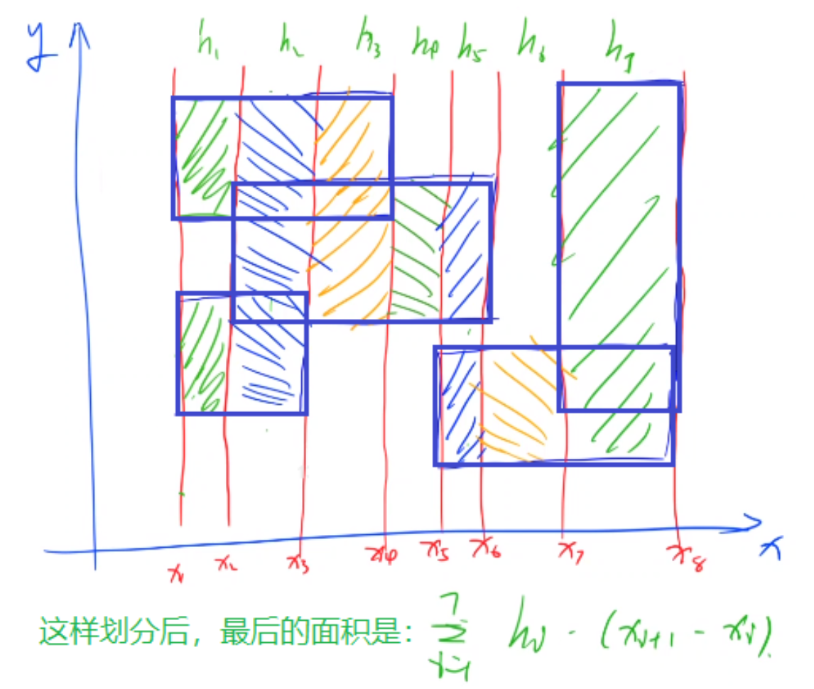
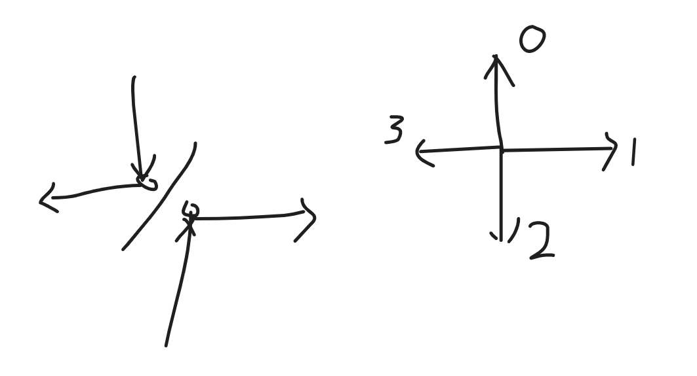
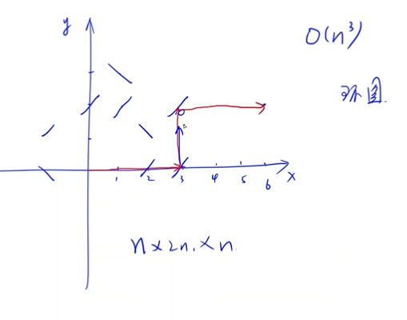

### 牛年(圆圈题)

[3370. 牛年 - AcWing题库](https://www.acwing.com/problem/content/3373/)


#### 思路

圆圈题,记住倒着数是(idx+len-i)%len 正着数是(idx+i)%len

把Bessie的年龄看为0,可以推出其他所有人的年龄和他的差值.


#### 代码

```c++
#include <bits/stdc++.h>
using namespace std;
string an[13] = {"Ox", "Tiger", "Rabbit", "Dragon", "Snake", "Horse", "Goat", "Monkey", "Rooster", "Dog", "Pig", "Rat"};
map<string, int> m, m1;
map<string, string> m2;
int main()
{
     string a, b, c, d;
     int n;
     cin >> n;
     m["Bessie"] = 0;
     m2["Bessie"] = "Ox";
     for (int i = 0; i < 12; i++)
          m1[an[i]] = i;

     for (int i = 0; i < n; i++)
     {
          cin >> a >> b >> b >> b >> c >> d >> d >> d;//这个读法使得a d存的是人名,b是next/previous c是生肖
          if (b == "previous")
          {
               int idx = m[d];
               int idx1 = m1[m2[d]]; // m2[d]存储每个人的生肖.m1[]存储这个生肖对应的an数组里的第几个

               for (int j = 1; j <= 12; j++)
               {

                    if (an[(idx1 + 12 - j) % 12] == c) //循环公式
                    {
                         m2[a] = c;
                         m[a] = idx - j;
                    }
               }
          }
          else if (b == "next")
          {
               int idx = m[d];
               int idx1 = m1[m2[d]];
               for (int j = 1; j <= 12; j++)
               {
                    if (an[(idx1 + j) % 12] == c)
                    {
                         m2[a] = c;
                         m[a] = idx + j;
                    }
               }
          }
     }
     cout << abs(m["Bessie"] - m["Elsie"]);
}
```


```c++
//别人的题解,看这好短~

#include <bits/stdc++.h>
using namespace std;
long long n, i, j, x;
string a, b, c, d;
string an[13] = {"Ox", "Tiger", "Rabbit", "Dragon", "Snake", "Horse", "Goat", "Monkey", "Rooster", "Dog", "Pig", "Rat"}; //初始化
map<string, long long> year;
int main()
{
     year["Bessie"] = 0; 
     cin >> n;
     for (i = 1; i <= n; i++)
     {
          cin >> a >> b >> b >> b >> c >> d >> d >> d; 
          if (b == "previous")
          {
               for (j = year[d] - 1;; j--)
                    if (an[(j % 12 + 12) % 12] == c)
                         break; //查找年份（(j%12+12)%12是怕有负数，特判，有必要理解一下）
               year[a] = j;
          }
          else
          {
               for (j = year[d] + 1;; j++)
                    if (an[(j % 12 + 12) % 12] == c)
                         break; //查找年份（(j%12+12)%12是怕有负数，特判，有必要理解一下）
               year[a] = j;
          }
     }
     cout << abs(year["Elsie"]);
     return 0;
}


```


### 过度种植(扫描线 容斥原理)

#### 题目

[2032. 过度种植 - AcWing题库](https://www.acwing.com/problem/content/description/2034/)


#### 思路

这是一道扫描线模板题，但由于 n≤10，可以把最多 2^n^≤1024 个交集面积全部算出来，根据容斥原理：

总面积 = 所有一个矩形的面积 - 所有两个矩形相交的面积 + 所有三个矩形相交的面积 - ...


##### 	扫描线

扫描线求相交矩形的并面积,用到割裂成小矩形再相加的思想.

这里将出现的所有矩形以横坐标为分割线划分成一个个竖直的长条，计算每个长条的面积，相加就可以得到答案.




先将每个矩形的左上端点和右下端点的x值存入v数组,进行排序,然后遍历v数组,将数个矩形组成的大面积分割成一小条一小条来看.

每个长条内部都是一堆等宽的小矩形，我们求出这些矩形在竖直方向上的长度，然后乘以宽度就是这个长条的面积。

如何求解每个长条竖直方向上的长度之和呢？首先遍历所有矩形，找到这个长条中所有的线段，然后使用区间合并即可。

关于区间合并可以参考：[803. 区间合并 - AcWing题库](https://www.acwing.com/problem/content/805/)

本题的时间复杂度是：O(n^2^×log(n))。


##### 	容斥原理


1、矩形面积怎么求（已知左上点和右下点）

int count(plc a)
{
    return (a.x2 - a.x1) * (a.y1 - a.y2);
}


2、两个矩形交集怎么求(已知两矩形左上点和右下点)

bool mul(plc &a, plc b)
{
    //没有交集
    if (a.x1 >= b.x2 || a.x2 <= b.x1 || a.y1 <= b.y2 || a.y2 >= b.y1) return false;
    //有交集
    int x1 = max(a.x1, b.x1), y1 = min(a.y1, b.y1);
    int x2 = min(a.x2, b.x2), y2 = max(a.y2, b.y2);
    //存储两矩形的交集
    a = {x1, y1, x2, y2};
    return true;
}


3、容斥原理

```
总面积 = 所有一个矩形的面积 - 所有两个矩形相交的面积 + 所有三个矩形相交的面积 - ...
```

因为要枚举所有种可能(二进制枚举),判断这种可能下,矩形有没有相交,从而求出所有两个矩形相交的面积,所有三个矩形相交的面积....


容斥原理模板题:[890. 能被整除的数 - AcWing题库](https://www.acwing.com/problem/content/892/)


#### 代码

```c++
扫描线:

#include <bits/stdc++.h>
#define x first
#define y second

using namespace std;

typedef pair<int, int> PII;
const int N = 12;
PII l[N], r[N];
int n, res;
vector<int> xs;

int get_area(int a, int b)
{
     vector<PII> nums;
     int res = 0;

     for (int i = 0; i < n; i++)
          if (l[i].x <= a && r[i].x >= b)
               nums.push_back({r[i].y, l[i].y});

     if (nums.empty())
          return 0;
     sort(nums.begin(), nums.end());

     int st = nums[0].x, ed = nums[0].y;
     for (int i = 1; i < nums.size(); i++)
          if (nums[i].x <= ed)
               ed = max(ed, nums[i].y);
          else
               res += ed - st, st = nums[i].x, ed = nums[i].y;

     res += ed - st;
     return res * (b - a);
}

int main()
{
     scanf("%d", &n);

     for (int i = 0; i < n; i++)
     {
          scanf("%d%d%d%d", &l[i].x, &l[i].y, &r[i].x, &r[i].y);
          xs.push_back(l[i].x), xs.push_back(r[i].x);
     }

     sort(xs.begin(), xs.end());

     for (int i = 0; i < xs.size() - 1; i++)
          if (xs[i] != xs[i + 1])
               res += get_area(xs[i], xs[i + 1]);

     cout << res << endl;

     return 0;
}

```


```c++
容斥原理
    
#include <iostream>
#include <cstring>
#include <algorithm>

using namespace std;

const int N = 15, INF = 1e5;

int n;
struct Rect
{
     int x1, y1, x2, y2;
} rect[N];

int get(int state)
{
     int x1 = -INF, y1 = -INF, x2 = INF, y2 = INF;
     int cnt = 0;
     for (int i = 0; i < n; i++)
          if (state >> i & 1)
          {
               cnt++;
               x1 = max(x1, rect[i].x1);
               y1 = max(y1, rect[i].y1);
               x2 = min(x2, rect[i].x2);
               y2 = min(y2, rect[i].y2);
          }

     int area = max(x2 - x1, 0) * max(y2 - y1, 0);//求相交区域的面积,可能存在没有相交的情况,那就是0
     if (cnt % 2 == 0)//奇数的话要-,偶数的话要+
          area *= -1;
     return area;
}

int main()
{
     cin >> n;
     for (int i = 0; i < n; i++)
     {
          int x1, y1, x2, y2;
          cin >> x1 >> y2 >> x2 >> y1;
          rect[i] = {x1, y1, x2, y2};
     }

     int res = 0;
    
     //容斥原理模板
     for (int i = 1; i < 1 << n; i++)
          res += get(i); //枚举每一种情况,看在此题中有无相交

     cout << res << endl;
     return 0;
}

```


### 错字(括号序列)

#### 题目

[2004. 错字 - AcWing题库](https://www.acwing.com/problem/content/2006/)


##### 思路

一道考察括号合法性的题目,可以用数据结构-栈进行维护,只要一有合法的括号对,就把它从栈中删去.最后剩下的就是非法括号.找到最后一个非法括号的位置,如果是‘)’,就往前遍历,碰到')'的都可以修改,如果是‘(’就往后遍历,但凡碰到‘(’都可以修改.(本题要么本就合法输出0,要么修改一个符号就必会产生合法括号序列)


#### 代码

```c++

#include <bits/stdc++.h>
using namespace std;

int res;
string s;
stack<int> st;

int main()
{

     cin >> s;
     int n = s.size();

     if (n & 1)
     {
          cout << 0 << endl;
          return 0;
     }

     for (int i = 0; i < n; i++)
     {
          if (st.empty())
               st.push(i);
          else if (s[st.top()] == '(' && s[i] == ')')
               st.pop();
          else
               st.push(i);
     }

     if (st.size() >= 2)
     {
          int pos = st.top();
          st.pop();

          if (s[pos] == ')')
          {
               for (int i = 0; i < pos; ++i)
                    if (s[i] == ')')
                         res++;
          }
          else
          {
               for (int i = pos; i < n; ++i)
                    if (s[i] == '(')
                         res++;
          }
     }
     cout << res << endl;
     return 0;
}

```


### 三题线(dfs,二进制枚举)

#### 题目


#### 思路

这道题dfs的方法debug了超级久,wwww. 总结出小规律:碰到一个结点有几种可能,用for循环来表示.(如排列数字那道题的每一位 都有几种数字可以填, 这道题的每一个点,有两种类型的横线可以经过)


dfs:由于本题数据量较小,可以采用dfs的方法.碰到一个点,先判断一下这个点有没有线已经经过了,要是有,就直接讨论下一个点.要是没有,就讨论两种情况:经过这个点的线是横着的还是竖着的(每个节点两个分叉).	


二进制枚举:直接刚开始就暴力出枚举所有横线的可能方向,共八种情况,时间复杂度就是 O(8×3n)


#### 代码

```c++
dfs返回的是bool的写法

#include <bits/stdc++.h>
using namespace std;
const int N = 5e4 + 10;
typedef pair<int, int> pii;
pii cow[N];
int n;
map<int, int> col, row;
bool flag = 0;
bool dfs(int e, int d) //当前有几条线,到了第几个点
{

     if (e > 3)
          return 0;
     if (d == n+1)
          return 1;
     
    
     if (row[cow[d].second] || col[cow[d].first])
          return dfs(e, d + 1);
     else
     {
          row[cow[d].second] = 1;
          if (dfs(e + 1, d + 1))//要是d==n+1了,返回一个1,则所有的dfs都直接返回1,不用讨论,因为已经出现了符合题意的情况
               return 1;
          row[cow[d].second] = 0;
          
          col[cow[d].first] = 1;
          if (dfs(e + 1, d + 1))
               return 1;
          col[cow[d].first] = 0;
     }
     return 0;//最后是return 0
}
int main()
{

     cin >> n;
     for (int i = 1; i <= n; i++)
     {
          int x, y;
          cin >> x >> y;
          cow[i] = {x, y};
     }
     cout<<dfs(0, 1);
     
}
```


```c++
dfs无返回值,而是用一个变量标记是否出现符合题意的情况

#include <bits/stdc++.h>
using namespace std;
const int N = 5e4 + 10;
typedef pair<int, int> pii;
pii cow[N];
int n;
map<int, int> col, row;
bool flag = 0;
void dfs(int e, int d) //当前是有几条线,到了第几个点
{

     if (flag)
          return;
     if (e > 3)
          return;
     if (d == n + 1)
     {
          flag = 1;
          return;
     }
     if (row[cow[d].second] || col[cow[d].first])
          dfs(e, d + 1);
     else
     {
          row[cow[d].second] = 1;
          dfs(e + 1, d + 1);
          row[cow[d].second] = 0;
          col[cow[d].first] = 1;
          dfs(e + 1, d + 1);
          col[cow[d].first] = 0;
     }
}
int main()
{

     cin >> n;
     for (int i = 1; i <= n; i++)
     {
          int x, y;
          cin >> x >> y;
          cow[i] = {x, y};
     }
     dfs(0, 1);
     if (flag == 1)
          cout << 1 << endl;
     else
          cout << 0 << endl;
}
```


```c++
y总dfs写法

#include <iostream>
#include <cstring>
#include <algorithm>
#include <unordered_set>

#define x first
#define y second

using namespace std;

typedef pair<int, int> PII;

const int N = 50010;

int n;
PII q[N];
unordered_set<int> row, col;

int dfs(int u, int cnt)
{
     if (cnt > 3)
          return 0;
     if (u == n)
          return 1;

     if (row.count(q[u].y) || col.count(q[u].x))
          return dfs(u + 1, cnt);

     row.insert(q[u].y);
     if (dfs(u + 1, cnt + 1))
          return 1;
     row.erase(q[u].y);

     col.insert(q[u].x);
     if (dfs(u + 1, cnt + 1))
          return 1;
     col.erase(q[u].x);

     return 0;
}

int main()
{
     scanf("%d", &n);
     for (int i = 0; i < n; i++)
          scanf("%d%d", &q[i].x, &q[i].y);
     printf("%d\n", dfs(0, 0));

     return 0;
}
```


```c++
二进制枚举

#include <cstring>
#include <iostream>

#define x first
#define y second
#define N 50010

using namespace std;

int n, cnt, nxt;
bool st[N];
pair<int, int> q[N];

bool cover(int d)
{
     int a = nxt;
     for (int i = 1; i <= n; i++)
          if (!st[i])
               if (d == 0 && q[a].x == q[i].x ||
                   d == 1 && q[a].y == q[i].y)
                    st[i] = 1, cnt++;
               else
                    nxt = i;

     return cnt == n;
}

int main()
{
     scanf("%d", &n);
     for (int i = 1; i <= n; i++)
          scanf("%d%d", &q[i].x, &q[i].y);

     for (int i = 0; i < 8; i++)
     {
          nxt = 1;
          for (int j = 0; j < 3; j++)
               if (cover(i >> j & 1))
               {
                    puts("1");
                    return 0;
               }
          cnt = 0;
          memset(st, 0, sizeof st);
     }

     puts("0");

     return 0;
}

```


### 连接奶牛(全排列,状压dp)


#### 题目

每天农夫约翰都会去巡视农场，检查他的 N 头奶牛的健康状况。

每头奶牛的位置由二维平面中的一个点描述，而约翰从原点 (0,0) 出发。

**所有奶牛的位置互不相同，且都不在原点。**

为了使自己的路线更有趣，农夫约翰决定只沿平行于坐标轴的方向行走，即只能向北，向南，向东或向西行走。

此外，他只有在到达奶牛的位置时才能改变行进方向（如果需要，他也可以选择通过奶牛的位置而不改变方向）。

在他改变方向时，可以选择转向 90 或 180 度。

约翰的行进路线必须满足在他访问完所有奶牛后能够回到原点。

如果他在每头奶牛的位置处**恰好转向一次**，请计算出约翰访问他的 N 头奶牛可以采取的不同路线的数量。

允许他在**不改变方向**的情况下通过任意奶牛的位置**任意次数**。

同一几何路线正向走和反向走算作两条不同的路线。


输入格式

第一行包含整数N。

接下来 N 行，每行包含两个整数 (x,y)(x,y) 表示一个奶牛的位置坐标。

输出格式

输出不同路线的数量。

如果不存在有效路线，则输出 0。


数据范围

1≤N≤10,−1000≤x,y≤1000


输入样例：

```
4
0 1
2 1
2 0
2 -5
```

输出样例：

```
2
```

样例解释

共有两条不同路线 1−2−4−3 和 3−4−2−1。


#### 思路

本题n<=10,所以可以采用dfs(全排列)这种写法,O(n*n!). 要是到20,则要用状压dp了(O(2^n^n^3^))

全排列枚举出每一种(如1324),那这就是一种走法:先从(0,0)走到第一头牛,然后走到第三头牛,再走到第二头牛,第四头牛,最后走回到(0,0).

我们接下来就是判断这种走法符不符合题意,符合的话,ans++.

全排列复杂度 O(n!)O，检测复杂度 O(n)，总时间复杂度 O(n*n!)≤4×107, n≤10

全排列请回顾 [AcWing 842. 排列数字 - AcWing](https://www.acwing.com/activity/content/problem/content/905/)
	判断下个点是否在特定方向请回顾每日一题 [AcWing 1986. 镜子 - AcWing](https://www.acwing.com/activity/content/problem/content/6873/)


#### 代码

```c++
#include <bits/stdc++.h>
using namespace std;
const int N = 3e3;
typedef pair<int, int> pii;
pii cow[N];
#define x first
#define y second
int q[N];

int path[N];

int check(pii a, pii b)//返回的0,1,2,3代表一种方向,而要是返回-1,就代表根本走不到下一个地点
{
     if (a.x != b.x && a.y != b.y)
          return -1;
     if (a.x == b.x)
          if (b.y > a.y)
               return 0;
          else
               return 2;
     if (b.x > a.x)
          return 1;
     return 3;
}

int main()
{
     int n;
     cin >> n;
     for (int i = 1; i <= n; i++)
     {
          q[i] = i;
          int x1, y1;
          cin >> x1 >> y1;
          cow[i] = {x1, y1};
     }
     cow[0] = {0, 0};
     int res = 0;
     do
     {
          int last = check(cow[0], cow[q[1]]);
          if (last == -1)
               continue;

          for (int i = 2; i <= n + 1; i++)
          {
               int d = check(cow[q[i - 1]], cow[q[i]]);

               if (d == -1 || d == last)
               {
                    last = -1;
                    break;
               }
               last = d;
          }

          if (last != -1)
               res++;

     } while (next_permutation(q + 1, q + n + 1));
    
     cout << res << endl;
}


/*
y总的全排列dfs写法(二进制压缩版本,和原版思路一致,只不过不用再把数组从1变0,从0变1)
 void dfs(int u, int state)
{
    if (u == n)
    {
        for (int i = 0; i < n; i ++ ) printf("%d ", path[i]);
        puts("");

        return;
    }

    for (int i = 0; i < n; i ++ )
        if (!(state >> i & 1))
        {
            path[u] = i + 1;
            dfs(u + 1, state + (1 << i));
        }
}
*/

```


```c++
状压dp
    
#include <iostream>
#include <cstring>
#include <algorithm>

#define x first
#define y second

using namespace std;

typedef pair<int, int> PII;

const int N = 10, M = 1 << N;

int n;
PII q[N];
int f[M][N][4];
int dx[4] = {0, 1, 0, -1}, dy[4] = {1, 0, -1, 0};

int getd(PII a, PII b)
{
    if (a.x != b.x && a.y != b.y) return -1;
    if (a.x == b.x)
        if (a.y > b.y) return 0;
        else return 2;
    else
        if (a.x > b.x) return 1;
        else return 3;
}

int main()
{
    cin >> n;
    for (int i = 0; i < n; i ++ ) cin >> q[i].x >> q[i].y;

    PII zero(0, 0);
    for (int i = 0; i < n; i ++ )
    {
        int d = getd(zero, q[i]);
        if (d != -1)
            f[1 << i][i][d] ++ ;
    }

    for (int i = 1; i < 1 << n; i ++ )
        for (int j = 0; j < n; j ++ )
            if (i >> j & 1)
                for (int k = 0; k < 4; k ++ )
                    for (int u = 0; u < n; u ++ )
                        if (!(i >> u & 1))
                        {
                            int d = getd(q[j], q[u]);
                            if (d != -1 && d != k)
                                f[i | (1 << u)][u][d] += f[i][j][k];
                        }

    int res = 0;
    for (int i = 0; i < n; i ++ )
        for (int j = 0; j < 4; j ++ )
        {
            int d = getd(q[i], zero);
            if (d != -1 && d != j)
                res += f[(1 << n) - 1][i][j];
        }

    cout << res << endl;

    return 0;
}

作者：yxc

```


### 镜子(环图,模拟题)


#### 题目

[1986. 镜子 - AcWing题库](https://www.acwing.com/problem/content/description/1988/)


农夫约翰的奶牛在农场周围造成了太多麻烦，因此约翰希望对它们保持更密切的关注。

通过在农场的各个位置安装 NN 个反光围栏，他希望能够从 (0,0) 位置的房子看到 (a,b) 位置的牛棚。

在约翰农场的二维平面图中，围栏 ii 表示为以整数位置坐标 (xi,yi) 为中心的倾斜 45 度（如 `/` 或 `\`）的短线段。

每个围栏（以及牛棚的位置）位于不同的位置。

(0,0) 和 (a,b) 处无围栏。

约翰计划坐在他的房屋 (0,0)处，并直接向右（沿 +x 方向）看。

当他的目光从农场的一些反光围栏上反射出来时，他希望能够看到点 (a,b)。

不幸的是，他认为其中一个反光围栏的摆放朝向不对，例如应该为 `/`，却摆成了 `\`。

请输出给定反光围栏中，第一个能够通过改变其朝向使得约翰成功看到点 (a,b) 的围栏的顺序编号。

如果约翰不需要切换任何围栏的朝向就已经可以看到点 (a,b) 则输出 0。

如果约翰无法通过切换单个围栏的朝向使自己看到点 (a,b) 则输出 −1。


输入格式

第一行包含三个整数 N,a,b。

接下来 N行，其中第 i 行描述第 i 号围栏的位置和朝向。首先包含两个整数 xi,yi 表示其中心点位置，然后包含一个字符 `/` 或 `\` 表示围栏朝向。

围栏编号从 11 开始。

输出格式

输出第一个能够通过改变其朝向使得约翰成功看到点 (a,b) 的围栏的顺序编号。

如果约翰不需要切换任何围栏的朝向就已经可以看到点 (a,b) 则输出 0。

如果约翰无法通过切换单个围栏的朝向使自己看到点 (a,b) 则输出 −1。


数据范围

1≤N≤200,−10^6^≤xi,yi,a,b≤10^6^

输入样例：

```
5 6 2
3 0 /
0 2 /
1 2 /
3 2 \
1 3 \
```

输出样例：

```
4
```


样例解释

农场的平面图如下所示，其中 HH 表示约翰的房子，B表示牛棚：

```
3 .\.....
2 //.\..B
1 .......
0 H../...
  0123456
```

通过改变 (3,2) 处的围栏朝向，就可以使约翰看到点 (a,b)，如下所示：

```
3 .\.....
2 //./--B
1 ...|...
0 H--/...
  0123456
```


#### 思路

改变每一面镜子的方向,然后判断此时能否走到终点,可以的话输出这是第几面镜子。

镜子的题目之前类似的做过(镜子田地)，把一面镜子当作两个点，根据镜子反射的规律(每个点的度最多为二)，它形成的一定是一个环图(由若干环和链组成)。而判断这条线路有没有在环里面的方法就是，看他经过的点的个数是不是>=2(n+1),因为最多就2(n+1)个点(包括了起点终点),一个点经过了两遍，就一定是在环里面了，直接false。要是到了第(n+1)个点，代表到终点了，就输出true。




和镜子田地同，采用d来表示方向，用异或的方式来表示光碰到镜子后方向的改变。


复杂度就是O(n^3^)




#### 代码

```c++

#include <bits/stdc++.h>
using namespace std;
const int N = 200 + 10;
int n;
struct Mirror //结构体存点
{
     int x, y;
     char c;
} q[N];

void change(char &c) //翻转镜子
{
     if (c == '\\')
          c = '/';
     else
          c = '\\';
}
int dir[4][2] = {0, 1, 1, 0, 0, -1, -1, 0}; //方向要注意，和d要联系好，并且这里是坐标轴，和平时的行和列不太一样
bool check()
{
     int d = 1, k = 0; //刚开始的方向朝右,d为1。 k刚开始等于代表是起点,=i时就是代表到了第i面镜子
     for (int i = 1; i <= 2 * (n + 1); i++)//最多走2 * (n + 1)个点
     {
          int len = 0x3f3f3f3f, id = -1;
          for (int j = 1; j <= n + 1; j++) //找到d这个方向上,离所在点最近的那个点
          {
               if (j == k)
                    continue;
               if (q[k].x + abs(q[j].x - q[k].x) * dir[d][0] != q[j].x)
                    continue;
               if (q[k].y + abs(q[j].y - q[k].y) * dir[d][1] != q[j].y)
                    continue;
               int t = abs(q[j].y - q[k].y) + abs(q[j].x - q[k].x);
               if (t < len)
                    len = t, id = j;
          }
          if (id == -1)
               return 0;
          if (id == n + 1) //要是这个最近的点是第n+1个点,代表到了出口
               return 1;
          if (q[id].c == '/') //方向的转换
               d ^= 1;
          else
               d ^= 3;
          k = id;
     }
     return 0;
}

int main()
{

     cin >> n;
     cin >> q[n + 1].x >> q[n + 1].y;//输入终点
     for (int i = 1; i <= n; i++)
          cin >> q[i].x >> q[i].y >> q[i].c;

     if (check())
          puts("0");
     else
     {
          for (int i = 1; i <= n; i++)
          {
               change(q[i].c);
               if (check())
               {
                    cout << i << endl;
                    return 0;
               }
               change(q[i].c);
          }
          puts("-1");
     }
}

```

