把题目中的意思抽象成模型.


### 岛(枚举,思维,离散化)

链接

https://www.acwing.com/problem/content/2016/

#### 题目

每当下雨时，农夫约翰的田地总是被洪水淹没。

由于田地不是完全水平的，所以一些地方充满水后，留下了许多被水隔开的“岛”。

约翰的田地被描述为由 N 个连续高度值 H1,…,HN 指定的一维场景。

假设该场景被无限高的围墙包围着，请考虑暴雨期间发生的情况：

最低处首先被水覆盖，形成一些不连贯的岛，随着水位的不断上升，这些岛最终都会被覆盖。

一旦水位等于一块田地的高度，那块田地就被认为位于水下。


上图显示了一个示例：在左图中，我们只加入了刚好超过 1 单位的水，此时剩下 4 个岛（最大岛屿剩余数量），而在右图中，我们共加入了 7 单位的水，此时仅剩下 2 个岛。

请计算，暴风雨期间我们能在某个时间点看到的最大岛屿数量。

水会一直上升到所有田地都在水 下。


输入格式

第一行包含整数 N。

接下来 N 行，每行包含一个整数表示 Hi。

输出格式

输出暴风雨期间我们能在某个时间点看到的最大岛屿数量。


数据范围

1≤N≤105,1≤Hi≤109

输入样例：

```
8
3
5
2
3
1
4
2
3
```

输出样例：

```
4
```


#### 题意

```
	题目给出n个数据,代表每块石头的高度,起初,这些石头连成了一块岛.但随着下雨,水慢慢的没过较矮石头,岛的数量逐渐多了起来(如三块石头的高度分别为324,他们刚开始是一座到,如果水没过2的石头后,他们就成了两座岛).题目问什么时候,岛的数量达到最大值.
	1e5的数据,可以采用nlogn的时间复杂度.遍历数O(n),排序(logn).
	
	
```


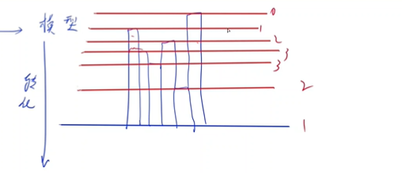

把题目抽象成模型,最简便的思路,就是随着水的上涌,每到达一个石块高度,就遍历所有石块,求得此时小岛的数量,最后返回最大值.但这种方法的时间复杂度是n^2^.所以我们要去想着优化.我们发现水上涨后,我们只需要考虑变化的部分,(考虑水淹没过这块石头和没淹没这块石头时它产生的变化,不需要考虑其他一直在水面上的或一直在水面下的),这样每个高度的石头都只会被考虑一次.这样我们就要去考虑石头从没被淹没到被淹没会对答案产生怎样的影响,发现有四种情况:

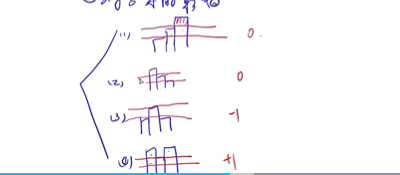

而如果题目给出的相邻两块石头的高度是相等的,我们直接当一块石头来算,用去重函数.(这里去重的知识相邻两块高度相等的石头,不相邻的但高度相等的不去掉)

用sort函数,从低到高进行遍历(水是从下往上涨的).


#### 代码

```c++
//y总代码,离散化+枚举 思维题
#include <bits/stdc++.h>
using namespace std;
typedef pair<int, int> pii;
const int N = 1e5 + 10;
int n;
int h[N];
pii q[N];
int main()
{
    
     scanf("%d", &n);
     for (int i = 1; i <= n; i++)
          scanf("%d", &h[i]);
    
     n = unique(h + 1, h + n + 1) - h - 1;
     //判重.返回去掉相邻重复元素后的个数
     h[n + 1] = 0; // 后续代码可能会用到第n + 1个位置，需要把第n + 1个位置清空
     //用unique去重的话，h[n+1]的值是不确定的，可能对于最右边的岛有影响

    
     for (int i = 1; i <= n; i++)
          q[i] = {h[i], i};
    
     sort(q + 1, q + n + 1); //对q进行排序. pair默认对first升序，当first相同时对second升序
     //这里排序为了模仿水从下往上淹的.等一下考虑情况的时候,从最矮的一块开始判断.

    
     int res = 1, cnt = 1;
     for (int i = 1; i <= n; i++)
     {
          int k = q[i].second;
          if (h[k - 1] < h[k] && h[k + 1] < h[k])
               cnt--;		//第三种情况
          else if (h[k - 1] > h[k] && h[k + 1] > h[k])
               cnt++;
          if (q[i].first != q[i + 1].first) //防止前后出现相同高度的岛屿多次影响答案
               res = max(res, cnt);
     }

    
     cout << res << endl;
     return 0;
}

```


```c++
//贴吧代码,离散化+差分
//https://www.acwing.com/solution/content/82099/

#include <iostream>
#include <cstring>
#include <algorithm>
#include <map>

typedef long long LL;

using namespace std;
const int N = 100005, M = 1e9 + 1;
int a[N];
map<int, int> b;
int n;
int main()
{
     cin >> n;

     for (int i = 1; i <= n; i++)
     {
          cin >> a[i];
          if (a[i] > a[i - 1])
          {
               //数的大小在[a[i-1],a[i]-1]之间的所有数大小都+1
               b[a[i - 1]]++, b[a[i]]--;
          }
     }
    
     LL sum = 0, res = 0;
     for (auto i : b)
     {
          //求前缀和
          sum += i.second;
          res = max(res, sum);
     }
    
     cout << res;
}
```


### 打乱字母(贪心+二分)

链接

https://www.acwing.com/problem/content/1998/


#### 题目

农夫约翰将按字典序排列的 N 头奶牛的名字列表贴在了牛棚的门上。

每个奶牛的名字都由一个长度介于 1 到 20 之间的由小写字母构成的唯一字符串表示。

麻烦制造者贝茜将列表中的奶牛名字重新排序打乱了列表。

此外，她还对每头奶牛的名字中的字母顺序进行了重新排列（也可能保持不变）。

给定修改过后的列表，请帮助约翰确定列表中的每个名字可能出现在原始列表中的最低和最高位置。


输入格式

第一行包含整数 N。

接下来 N 行，按照修改过后列表的顺序，给出了修改过后的奶牛的名字。

输出格式

共 N行，第i 行输出给定的第 i 个字符串在原始列表中可能的最低和最高位置。


数据范围

1≤N≤50000

输入样例：

```
4
essieb
a
xzy
elsie
```

输出样例：

```
2 3
1 1
4 4
2 3
```

样例解释

无论如何，字符串 “a” 必然出现在原始列表中第一个，类似的，字符串 “xzy” 必然出现在原始列表中的最后一个。

而字符串 “essieb” 和 “elsie” 都有可能位于原始列表的第 2 位或第 3 位，这取决于它们的原始字母顺序。

例如，”bessie” 和 “elsie” 分别位于 2,3 位，”sisbee” 和 “ilees” 分别位于 3,23,2 位。


#### 思路

​	给你多个字符串,按照字典序给每个字符串排列好了位置(字符串之间是有序的,但每个字符串的字符不一定有序).可是后来这些排列好的字符串却被人打乱了顺序,并且更可恶的是字符串里的字符也被搞乱了顺序.现在给你打乱了顺序的字符串,问你它之前可能在原排列中出现的最低位置和最高位置.
​	
​	本题采用贪心+二分的方法来写.什么情况下这个字符串能尽可能排的较前呢?肯定是要使其他字符串都尽可能的大,而这个字符串本身尽可能的小,这样在给每个字符串排位置的时候,他就会被放在前面.(这个在y总的视频里被认为是直觉判断,y总有对这个贪心思想的给详细的逻辑证明).尽可能排的较后也是这个道理.
​	(我们用二分的目的就是为了知道我们已经调到最小的这个字符串,在其他几个调大的字符串中,能排到第几个,而这个位置,就是它能出现的最最最前位置了)
​	
​	(在代码中,通过为了知道b数组里第一个>=a[i]的位置,通过这个判断使用哪种二分).
​	
​	


#### 代码

```c++
#include <iostream>
#include <cstring>
#include <algorithm>

using namespace std;

const int N = 50010;

int n;
string a[N], b[N], c[N];

int main()
{
     cin >> n;
     for (int i = 1; i <= n; i++)
     {
          cin >> a[i];
          b[i] = c[i] = a[i];
          sort(b[i].begin(), b[i].end(), greater<char>()); //字符串里的字符从大到小排
          sort(c[i].begin(), c[i].end());                  //字符串里的字符从大到小排
     }
    
    
	//对字符串数组里的多个字符串进行升序排序,为了能够进行二分.
     sort(b + 1, b + n + 1); 
     sort(c + 1, c + n + 1);

     for (int i = 1; i <= n; i++)
     {
          sort(a[i].begin(), a[i].end()); //把a字符串里的字符从小到大
          int l = 1, r = n;
          //查找b字符串数组里第一个>=a[i]的字符串的位置.
          while (l < r)
          {
               int mid = l + r >> 1;
               if (b[mid] >= a[i])
                    r = mid;
               else
                    l = mid + 1;
          }
          cout << r << ' ';//输出l也没关系
         
         
          reverse(a[i].begin(), a[i].end());//把a字符串里的字符从大到小
          //查找c字符串数组里第一个<=a[i]的字符串的位置.输出l也没关系
          l = 1, r = n;
          while (l < r)
          {
               int mid = l + r + 1 >> 1;
               if (c[mid] <= a[i])
                    l = mid;
               else
                    r = mid - 1;
          }
          cout << r << endl;
     }

    
     return 0;
}

```


### 奶牛选美(bfs)

链接

https://www.acwing.com/problem/content/2062


#### 题目:

听说最近两斑点的奶牛最受欢迎，约翰立即购进了一批两斑点牛。

不幸的是，时尚潮流往往变化很快，当前最受欢迎的牛变成了一斑点牛。

约翰希望通过给每头奶牛涂色，使得它们身上的两个斑点能够合为一个斑点，让它们能够更加时尚。

牛皮可用一个 N×MN×M 的字符矩阵来表示，如下所示：

```
................
..XXXX....XXX...
...XXXX....XX...
.XXXX......XXX..
........XXXXX...
.........XXX....
```

其中，XX 表示斑点部分。

如果两个 XX 在垂直或水平方向上相邻（对角相邻不算在内），则它们属于同一个斑点，由此看出上图中恰好有两个斑点。

约翰牛群里**所有的牛都有两个斑点**。

约翰希望通过使用油漆给奶牛尽可能少的区域内涂色，将两个斑点合为一个。

在上面的例子中，他只需要给三个 .. 区域内涂色即可（新涂色区域用 ∗∗ 表示）：

```
................
..XXXX....XXX...
...XXXX*...XX...
.XXXX..**..XXX..
........XXXXX...
.........XXX....
```

请帮助约翰确定，为了使两个斑点合为一个，他需要涂色区域的最少数量。


输入格式

第一行包含两个整数 N 和 M。

接下来 N 行，每行包含一个长度为 M 的由 X 和 . 构成的字符串，用来表示描述牛皮图案的字符矩阵。

输出格式

输出需要涂色区域的最少数量。


数据范围

1≤N,M≤50

输入样例：

```
6 16
................
..XXXX....XXX...
...XXXX....XX...
.XXXX......XXX..
........XXXXX...
.........XXX....
```

输出样例：

```
3
```


#### 思路

​	本题真正目的其实就是为了求两大块X中最近的那两个点X的之间的距离(横坐标之差+纵坐标之差)
​	
​	由于数据量很小,可以直接bfs遍历两大块X,把第一大块的所有X存入动态数组a,第二大块存入b,然后再遍历两个vector,算出最近距离(这一步nm的复杂度)
​	


```c++
//枚举 bfs
#include <bits/stdc++.h>
using namespace std;
typedef pair<int, int> pii;
queue<pii> q;
vector<pii> a, b;
const int N = 2500 + 10;
bool st[N][N];
int n, m;
int dir[4][2] = {1, 0, -1, 0, 0, 1, 0, -1};
char ma[N][N];
int flag = 1;
void bfs(int x, int y)
{
     st[x][y] = 1;
     if (flag)
          a.push_back({x, y});
     else
          b.push_back({x, y});
     q.push({x, y});
     while (q.size())
     {
          auto t = q.front();
          q.pop();
          for (int i = 0; i < 4; i++)
          {
               int nx = t.first + dir[i][0];
               int ny = t.second + dir[i][1];
               if (nx < n && nx >= 0 && ny < m && ny >= 0 && ma[nx][ny] == 'X' && st[nx][ny] == 0)
               {
                    if (flag)
                         a.push_back({nx, ny});
                    else
                         b.push_back({nx, ny});
                    st[nx][ny] = 1;
                    q.push({nx, ny});
               }
          }
     }
}
int main()
{

     cin >> n >> m;
     for (int i = 0; i < n; i++)
          for (int g = 0; g < m; g++)
          {
               cin >> ma[i][g];
          }
     for (int i = 0; i < n; i++)
          for (int g = 0; g < m; g++)
          {
               if (ma[i][g] == 'X' && st[i][g] == 0)
               {
                    bfs(i, g);
                    if (flag)
                         flag = 0;
               }
          }
     int ans = 0x3f3f3f3f;
     for (auto k1 : a)
     {
          for (auto k2 : b)
          {
               int z = abs(k1.first - k2.first) + abs(k1.second - k2.second) - 1;
               ans = min(ans, z);
          }
     }
     cout << ans << endl;
}

```


```c++
//差不多意思的dfs,更好看一点

#include <iostream>
#include <vector>
using namespace std;
using T = pair<int, int>;

const int N = 60;

const int dr[] = { -1, 0, 1, 0 }, dc[] = { 0, 1, 0, -1 };

int n, m;
char g[N][N];
bool st[N][N];
vector<T> block[2];

void dfs (vector<T> & block, int x, int y)
{
    st[x][y] = true;
    block.push_back({x, y});
    for (int i = 0; i < 4; i ++ )
    {
        int dx = x + dr[i], dy = y + dc[i];
        if (st[dx][dy] || dx < 1 || dx > n || dy < 1 || dy > m || g[dx][dy] != 'X') continue;
        dfs(block, dx, dy);
    }
}

int main ()
{
    cin >> n >> m;
    for (int i = 1; i <= n; i ++ ) cin >> (g[i] + 1);

    for (int i = 1, which = 0; i <= n; i ++ )
        for (int j = 1; j <= m; j ++ )
            if (!st[i][j] && g[i][j] == 'X') dfs(block[which ++], i, j);

    int dist = 1e9 + 10;
    for (T & a : block[0])
        for (T & b : block[1])
            dist = min(abs(a.first - b.first) + abs(a.second - b.second), dist);

    cout << dist - 1 << endl;
    return 0;
}


```


### 干草堆 (差分)

链接:

[2041. 干草堆 - AcWing题库](https://www.acwing.com/problem/content/description/2043/)


#### 题目:

贝茜对她最近在农场周围造成的一切恶作剧感到抱歉，她同意帮助农夫约翰把一批新到的干草捆堆起来。

开始时，共有 N 个空干草堆，编号 1∼N。

约翰给贝茜下达了 K 个指令，每条指令的格式为 `A B`，这意味着贝茜要在 A..B范围内的每个干草堆的顶部添加一个新的干草捆。

例如，如果贝茜收到指令 `10 13`，则她应在干草堆 10,11,12,13中各添加一个干草捆。

在贝茜完成了所有指令后，约翰想知道 N 个干草堆的中值高度——也就是说，如果干草堆按照高度从小到大排列，位于中间的干草堆的高度。

方便起见，N 一定是奇数，所以中间堆是唯一的。

请帮助贝茜确定约翰问题的答案。


输入格式

第一行包含 N 和 K。

接下来 K 行，每行包含两个整数 A,B，用来描述一个指令。

输出格式

输出完成所有指令后，N 个干草堆的中值高度。


数据范围

1≤N≤106,1≤K≤25000,1≤A≤B≤N


输入样例：

```
7 4
5 5
2 4
4 6
3 5
```

输出样例：

```
1
```

样例解释

贝茜完成所有指令后，各堆高度为 0,1,2,3,3,1,0。

将各高度从小到大排序后，得到 0,0,1,1,2,3,3，位于中间的是 1。


#### 题意

​	对一个区域的数整体加或整体减,采用差分的方法,降低时间复杂度.(详情看基础算法二)


#### 代码

```c++
//自己仿着差分的例子写的

#include <bits/stdc++.h>
using namespace std;
const int N = 1e6 + 10;
int a[N], b[N];
void insert(int l, int r, int val)
{
     b[l] += val;
     b[r + 1] -= val;
}
int main()
{
     int n, m;
     cin >> n >> m;
    
    
     for (int i = 0; i < m; i++)
     {
          int x, y;
          cin >> x >> y;
          insert(x, y, 1); 
         //从题中发现,都是加一的操作.初始化b值,转换成b1=a[1],b[2]=a[2]-a[1]....这样的形式
     }
    
    
     for (int i = 1; i <= n; i++)
          b[i] += b[i - 1]; //对差分数组求一遍前缀和。算出改变后的a[i].(原本a[i]都为0)
    
    
     sort(b + 1, b + n + 1);
    
    
     cout << b[(1 + n) / 2];
}
```


```c++
//简化后的代码

#include <iostream>
#include <cstring>
#include <algorithm>

using namespace std;
const int N=1e6+10;

int b[N];

int main()
{
    int n, k;
    cin >> n >> k;
    for (int i = 1; i <= k; i ++)
    {
        int l, r;
        cin >> l >> r;
        b[l] ++;
        b[r + 1] --;
    }
    for(int i = 1; i <= n; i ++) b[i] += b[i - 1];
    sort (b + 1, b + n + 1);
    cout << b[(n + 1) >> 1];
    return 0;
}

```


```c++
//第一遍写超时了的代码,没用差分.感觉是n*m的复杂度


#include<bits/stdc++.h>
using namespace std;
int n,m;
const int N=1e6+10;
int a[N];
int x,y;

int main()
{
    cin>>n>>m;
  
    for(int i=0;i<m;i++)
    {
        cin>>x>>y;
        
        for(int g=x;g<=y;g++)
            a[g]++;
    }
    
    sort(a,a+n);
    
    cout<<a[(0+n-1)/2];
}
```


```
	//还有一种方法,二分后不用sort排序求中值,而是用快速选择算法(算法介绍看算法基础课第一节习题第k个数)

```


### 笨拙的手指(暴力枚举)


#### 题目


奶牛贝茜正在学习如何在不同进制之间转换数字。

但是她总是犯错误，因为她无法轻易的用两个前蹄握住笔。

每当贝茜将数字转换为一个新的进制并写下结果时，她总是将其中的某一位数字写错。

例如，如果她将数字 14 转换为二进制数，那么正确的结果应为 1110，但她可能会写下 0110 或 1111。

贝茜不会额外添加或删除数字，但是可能会由于写错数字的原因，写下包含前导 0 的数字。

给定贝茜将数字 N 转换为二进制数字以及三进制数字的结果，请确定 N 的正确初始值（十进制表示）。


输入格式

第一行包含 N 的二进制表示，其中一位是错误的。

第二行包含 N 的三进制表示，其中一位是错误的。

输出格式

输出正确的 N 的值。


数据范围

0≤N≤109，且存在唯一解。

输入样例：

```
1010
212
```

输出样例：

```
14
```


样例解释

1414 在二进制下的正确表示为 11101110，在三进制下的正确表示为 112112。


#### 题意

```
	
	看了一下题目,不会做.最后发现可以暴力求解.因为原十进制的数就1e9,转换成二进制,也就最多30位,而三进制也30位差不多.我们直接遍历所给二进制的每一位,把0变成1,把1变成0,把产生的所有十进制可能放入一个集合里.然后三位数也同样的方法,它每一位可以有两种变化,也就最多六十种可能.因为题目要求只有唯一解.所以两个集合里只有一个交集,这个交集,就是答案.
		
		即使再算上每个数变化后转换成十进制的复杂度,也就最多再乘一个30.整个程序也就近千的运算量.
	
	判断一个集合里是否有这个数,可以用哈希表来存(也就是set或unordered_set).当然,这里用数组也没问题,复杂度允许.(视频里有讲)
```


#### 代码

```c++
#include <iostream>
#include <cstring>
#include <algorithm>
#include <unordered_set>

using namespace std;


int get(string s, int b) // 将b进制的数转化成十进制
{
     int res = 0;
     // 秦九韶算法
     for (auto c : s)
          res = res * b + c - '0';
     return res;
}


int main()
{
     string a, b;
     cin >> a >> b;

     unordered_set<int> S;

    
     for (auto &c : a)
     {
          c ^= 1;
          S.insert(get(a, 2));
          c ^= 1;
     }

    
     for (auto &c : b)
     {
          char t = c;
          for (int i = 0; i < 3; i++)
               if (i + '0' != t)
               {
                    c = i + '0';
                    int x = get(b, 3);
                    if (S.count(x)) //返回元素在集合中出现的次数(也就只能返回0/1)
                    {
                         cout << x << endl;
                         return 0;
                    }
               }
          c = t;
     }
     return 0;
}
```


```c++
//自己仿着写的

#include <bits/stdc++.h>
using namespace std;
set<int> s;
int get(string s, int b)
{
     int res = 0;
     for (auto &c : s)
     {
          res = res * b + c - '0';
     }
     return res;
}
int main()
{
     string a, b;
     cin >> a >> b;
     for (auto &c : a)
     {
          c ^= 1;
          int k = get(a, 2);
          s.insert(k);
          c ^= 1;
     }
     for (auto &c : b)
     {
          for (int i = 0; i <= 2; i++)
          {
               if (c == '0' + i)
                    continue;
               else
               {
                    char t = c;
                    c = '0' + i;
                    int k = get(b, 3);
                    if (s.count(k))
                    {
                         cout << k << endl;
                         return 0;
                    }
                    c = t;
               }
          }
     }
}
```


### 粉刷栅栏(差分 离散化)

[1987. 粉刷栅栏 - AcWing题库](https://www.acwing.com/problem/content/1989/)

#### 题目

农夫约翰发明了一种绝妙的方法来粉刷牛棚旁边的长栅栏（把栅栏想象成一维的数轴）。

他只需要在他最喜欢的奶牛贝茜身上挂一个刷子，然后在一旁悠闲的喝凉水就行了。

贝茜沿着栅栏来回走动时，会将她走过的栅栏部分涂上油漆。

贝茜从栅栏上的位置 00 处开始，共进行 N 次移动。

移动可能形如 `10 L`，表示向左移动 1010 单位距离，也可能形如 `15 R`，表示向右移动 1515 单位距离。

给定贝茜的 N 次移动列表，约翰想知道至少被涂抹了 2 层油漆的区域的总长度。

整个行进过程中，贝茜距离出发地的距离不会超过 109。


输入格式

第一行包含一个整数 N。

接下来 N 行，每一行包含一个行动指令，诸如 `10 L` 或 `15 R`。

输出格式

输出至少被涂抹了 22 层油漆的区域的总长度。


数据范围

1≤N≤105

整个行进过程中，贝茜距离出发地的距离不会超过 109。
每次指令移动距离的取值范围是 [1,2×109][1,2×109]。


输入样例：

```
6
2 R
6 L
1 R
8 L
1 R
2 R
```

输出样例：

```
6
```


样例解释

共有 6 单位长度的区域至少被涂抹 2 层油漆。

这些区域为 (−11,−8),(−4,−3),(0,2)。


#### 题意

(解释的可能不太清楚,可以再看一下视频)


​	差分用于快速求一个段的数的加或减.只要对原数组的差分数组的首尾两个点进行操作,再进行前缀和操作,就能求得变动后的原数组


​	采用差分的方法,但这里和正常的差分不一样,首先他会来回走,而且由于贝茜走过的总距离很大(10e9)，所以不可能每走长度为 1 的距离就判断一下，因为这样时间空间复杂度都可以达到 109，不能承受。(不然的话要开一个1e9的数组,遍历所有数据,计算差分数组的前缀和)
​	
​	而且它这里要求的不是走过了几个点,而是对两个点之间的段进行操作.比如[1,3]虽然有3个点,但我们要进行加减操作的不是这三个点,而是中间的2个段(从1到2,从2到3).比如一般的差分题目,我们会直接b[1]++,b[3+1]--.这样最后前缀和后a[1]=1,a[2]=1,a[3]=1,但本题真正需要+1的是段,牛这里只走过了两个段,不可能有3个数都变成了.所以一个改变就是,我们把两个点确定的一个段都有左端点来表示.如L和L+1这两个点的线就用L来称呼.所以正确的操作就是b[1]++,
b[(3-1)+1]--.
​	
​	
​	这里用还到了离散化----用map来存数据.虽然他能走动的范围很大,还包括正负数,但其实真正讨论的点却只有2e5个(1e5个区间)贝茜最多移动 105 次.
​	我们为了节省时间,根本不需要和平常一样从头到尾遍历差分数组(建一个1e9大小的b数组,遍历一遍求前缀和),空间也不允许.而是只要讨论一个大段的首尾两个点,中间所有的值都和起点是一样的.比如原点为0,先向右走了5个,所有b[0]++,b[(5-1)+1]++(这时候,求得的前缀和原数组a[0~4]都为1),然后再向左走了3格,b[5-3]++,b[5]--(这里把向左走的终点当作起点).此时b[2]=1,b[5]=0.(这时候a[2]=2,a[3]=2,a[4]=2,a[5]=1).
​	所以如图所示,只要一个大段的起点的原数值=x,起点到终点的所有值都为x.因为这一大段中间的差分数组的值都为0.(差分方法只对头尾两个点进行操作).题目要求原数值>=2的算入个数,我们就不用遍历每一个数了,因为一个大段里的数都相等,只要p2-p1就可以了.(p2和p1是位置下标)
​	
​	
​	map里查找一个数是logn.遍历map是O(n),复杂度nlogn
​	


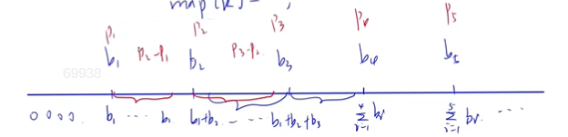


#### 代码

```c++
#include <bits/stdc++.h>
using namespace std;
const int N = 1e5 + 10;
map<int, int> b;
int now = 0;

//修改差分数组的值
void insert(int l, char c) // now一直在动态变化,奶牛当前所在的位置
{
     if (c == 'R')
     {
          b[now]++;
          b[now + l]--;
          now += l;
     }
     else
     {
          b[now - l]++;
          b[now]--;
          now -= l;
     }
}


int main()
{
     int n;
     cin >> n;
    
     while (n--)
     {
          int l;
          char c;
          cin >> l >> c;
          insert(l, c);
     }
    
    
     int res = 0, sum = 0;
     int pre;
     for (auto &[x, y] : b) 
         //遍历map.map里面自带排序,按照x从小到大排列好了(和坐标轴一样)
     {
          if (sum >= 2)
               res += x - pre;
          sum += y;//求前缀和
          pre = x;
     }
     cout << res << endl;
}

```


```c++
//第一遍写的错误代码

//不知道b数组怎么表示负数.并且自己写的这里b数组表示被染色的点((1,3)题目意思被染色的数量应该是2,2个区间段,而自己写的就成了3,3个点),而题目要求被染色的区间段的数量,
//并且1e9的数据,都一个个讨论,时间和空间都不允许

#include <bits/stdc++.h>
using namespace std;
int n;
int start = 0;
const int N = 1e9 + 10;
int b[N];
void insert(int l, char c)
{
     if (c == 'R')
     {
          b[start] += 1;
          b[start + l + 1] -= 1;
          start = start + l;
     }
     else
     {
          start = start - l;
          b[start] += 1;
          b[start + l + 1] -= 1;
     }
}
int main()
{
     cin >> n;
     while (n--)
     {
          int l;
          char c;
          cin >> l >> c;
          insert(l, c);
     }
     for (int i = 1; i <= N; i++)
          b[i] += b[i - 1];
     int cnt = 0;
     for (int i = 0; i <= N; i++)
     {
          if (b[i] >= 2)
               cnt++;
     }
     cout << cnt << endl;
}
 
```


### 奶牛过马路(前缀最值)


#### 题目


每天，农夫约翰的 N 头奶牛都会穿过农场中间的马路。

考虑约翰的农场在二维平面的地图，马路沿水平方向延伸，马路的一侧由直线 y=0描述，另一侧由直线 y=1 描述。

奶牛 i 从马路一侧的位置 (ai,0) 沿直线过马路到达另一侧的位置 (bi,1)。

所有 ai 互不相同，所有 bi 互不相同。

尽管他的奶牛们行动敏捷，他还是担心行动路径交叉的两头奶牛在过马路时发生碰撞。

约翰认为，如果一头奶牛的行动路径没有跟其他任何奶牛的行动路径相交，则该奶牛是安全的。

请帮助约翰计算安全奶牛的数量。


输入格式

第一行包含整数 N。

接下来 N 行，每行包含两个整数 ai,bi，用来描述一头牛的行动路径。

输出格式

输出安全奶牛的数量。


数据范围

1≤N≤105,−106≤ai,bi≤106

输入样例：

```
4
-3 4
7 8
10 16
3 9
```

输出样例：

```
2
```


样例解释

第一头牛和第三头牛的行动路线不与其他奶牛的路线相交。

第二头牛和第四头牛的行动路线相交。


#### 题意


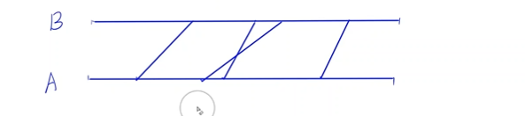


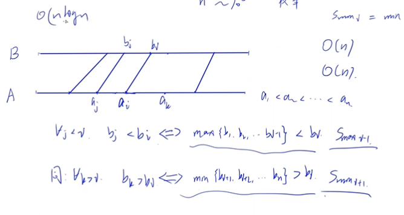


​	看了题目我就知道,要想两条线相交(如ai和aj,bi和bj组成的两条线)必须ai在bi前面,aj在bj后面才行
​	
​	刚开始的思路是把所有起点存入一个数组a,所有终点存入一个数字b,然后两个数组都进行排序,遍历a数组,从前往后找到每一个a数组里的值对应到的b数组里的那个值(起点对应的那个终点),只要在它上面的,都是会撞到的牛.但这样时间复杂度会超.并且我不知道如何找到a数组里的值对应到的b数组里的值.
​	
​	但看了视频,发现根本不用两侧都进行排序,只要排一侧就够了.如把A侧进行排序,拿出一条线ai-bi,要想没有线和他相交,只要满足对任意j<i,bj<bi,对任意大于i的k,bk>bi,就可以了.也就是求在B侧,排在bi前面的点的最大值,和排在后面的点的最小值,bi>这个最大值,小于这个最小值就行.
​	而这个求前缀最值的方法是O(n)的复杂度,加上排序,所以本题是nlogn的复杂度.


#### 代码

```c++

#include <iostream>
#include <cstring>
#include <algorithm>

#define x first
#define y second

using namespace std;

typedef pair<int, int> PII;

const int N = 100010, INF = 1e8;

int n;
PII q[N];
int smax[N], smin[N];

int main()
{
     scanf("%d", &n);

     for (int i = 1; i <= n; i++)			//用i从1开始,因为本题存在i-1,i=0的话会越界
          scanf("%d%d", &q[i].x, &q[i].y);

     sort(q + 1, q + n + 1); 				//按照a进行排序


     smax[0] = -INF, smin[n + 1] = INF;		//题目存在负值
     for (int i = 1; i <= n; i++) 			//求最大前缀值
          smax[i] = max(smax[i - 1], q[i].y);
     for (int i = n; i; i--)
          smin[i] = min(smin[i + 1], q[i].y); //求最小后缀值


     int res = 0;
     for (int i = 1; i <= n; i++)
          if (smax[i - 1] < q[i].y && smin[i + 1] > q[i].y)
               res++;

     printf("%d\n", res);
     return 0;
}


```


### 友好城市(最长上升子序列)

[1012. 友好城市 - AcWing题库](https://www.acwing.com/problem/content/1014/)


​	和上一道题的大环境基本类似,但这里是可以拒绝任意数量的航道的.而本题让你求的也是,拒绝任意条航道,使得剩下的航道都可以通行(各不相交),问你可以通行的航道最多是几条.
​	而上一道奶牛,我们不能不让奶牛过去,所以求得是有几条不与其他线相交的线.
​	
​	我在这题的思路是,在A侧进行排序,并求排完序后的B侧最长上升子序列.(此时我们遍历i~n,A侧ai是单调递增的,而B侧的bi却不是这样,此时只要b侧也是递增的点,就是可以通行的航线)
​	
​	A侧B侧这种说法,沿用了上一道题奶牛.


### 品种临近(滑动窗口)

[1969. 品种邻近 - AcWing题库](https://www.acwing.com/problem/content/1971/)

#### 题目

农夫约翰的 N 头奶牛排成一排，每头奶牛都用其品种 ID 进行描述。

如果两头相同品种的牛靠得太近，它们就会吵架。

具体的说，如果同一品种的两头奶牛在队列中的位置相差不超过 K，我们就称这是一对拥挤的牛。

请计算品种 ID 最大的拥挤奶牛对的品种 ID。


输入格式

第一行包含两个整数 N 和 K。

接下来 N 行，每行包含一个整数表示队列中一头奶牛的品种 ID。

输出格式

输出品种 ID 最大的拥挤奶牛对的品种 ID。

如果不存在拥挤奶牛队，则输出 −1−1。


数据范围

1≤N≤50000, 1≤K<N,
品种 ID 范围[0,106]。


输入样例：

```
6 3
7
3
4
2
3
4
```

输出样例：

```
4
```


样例解释

一对品种 IDID 为 33 的奶牛以及一对品种 IDID 为 44 的奶牛属于拥挤奶牛对。

所以，最大拥挤奶牛对的品种 IDID 为 44。


#### 题意

​	本题比较简单,直接用队列(滑动窗口)来形容奶牛之间的距离不超过K的才算进答案.队列里出现过的数都用vis[]++来表示,踢出队列的数就vis[]--,每一个要加入队列的值都先判断它有没有在队列里出现过,有的话和res比较,大的那个赋值给res


#### 代码

```c++
#include <bits/stdc++.h>
using namespace std;
const int N = 5e4 + 10;
const int M = 1e6 + 10; //可以存在1e6个数
int a[N];
int vis[M];
queue<int> q;
int main()
{
     int n, m;
     cin >> n >> m;
     for (int i = 0; i < n; i++)
     {
          cin >> a[i];
     }
     int res = 0;
     for (int i = 0; i < n; i++)
     {
          if (q.size() == m + 1) //队列长度已经等于题目所给范围的话,把队头踢出去
          {
               int t = q.front();
               q.pop();
               vis[t]--;
          }
          q.push(a[i]);
          if (vis[a[i]]) //这个数之前存在过的话
          {
               res = max(res, a[i]);
          }
          vis[a[i]]++;
     }
     if (res == 0)
          cout << -1;
     else
          cout << res;
}
```


### 闪烁(状态压缩,找环,位操作)

[1960. 闪烁 - AcWing题库](https://www.acwing.com/problem/content/1962/)

此状态压缩和状压dp不是同一个东西

#### 题目

农夫约翰对牛棚里昏暗的灯光感到不满，刚刚安装了一个新吊灯。

新吊灯由 N 个灯泡组成，这 N 个灯泡围成一圈，编号为 0∼N−1。

奶牛对这个新吊灯非常着迷，并且喜欢玩以下游戏：

对于第 ii 个灯泡，如果在 T−1T−1 时刻，它左侧的灯泡（当 i>0 时，为第 i−1 个灯泡；当 i=0 时，为第 N−1 个灯泡）是开着，那么在 T 时刻，就切换这个灯泡的状态。

这个游戏将持续 B 单位时间。

给定灯泡的初始状态，请确定在 B 单位时间后，它们的最终状态。


输入格式

第一行包含两个整数 N 和 B。

接下来 N 行，按顺序描述每个灯泡的初始状态，每行包含一个整数 1 （表示开）或 0（表示关）。

输出格式

共 N 行，按顺序每行输出一个灯泡的最终状态。


数据范围

3≤N≤16,1≤B≤10^15^

输入样例：

```
5 6
1
0
0
0
0
```

输出样例：

```
1
1
1
0
1
```


样例解释

灯泡状态如下：

```
时刻 T=0: 1 0 0 0 0
时刻 T=1: 1 1 0 0 0
时刻 T=2: 1 0 1 0 0
时刻 T=3: 1 1 1 1 0
时刻 T=4: 1 0 0 0 1
时刻 T=5: 0 1 0 0 1
时刻 T=6: 1 1 1 0 1
```


#### 题意

​	正常思路就是有B次讨论,每一次讨论一个最多有十六位的二进制(遍历十六次,算出变化后的新状态),但这样铁定会tle,O(NB).
​	
​	优化:我们研究发现,他有最多(2^16)-1种状态,可他却要罗列出1e15个,大于2^16,所以一定存在循环(找规律hhh).只要碰到循环的话,他的以后的状态就都会在这个环里了,就不用再一个个的算下去了.用总长度对环的长度取余就可以计算出来答案.
​	
​	而这里题目所给的01串我们可以用字符串来存,但大多数我们是用二进制来存转换为10进制来计算的.这样好处多多,如果一个16位的01串,你用字符串每一次操作就要16次运算,而用int,每一次就直接一次运算,这就是状态压缩.
​	
​	每一次操作(用i遍历B的时候)可以用数组进行存储这是第几次,这样找到环求环的长度的时候,直接当前下标-之前出现过的这个数的下标就好了.

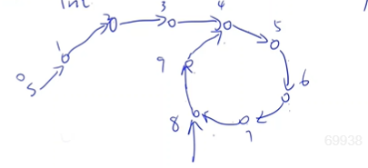


#### 代码

```c++

#include <iostream>
#include <cstring>
#include <algorithm>

using namespace std;

typedef long long LL;

const int N = 1 << 16;

int n;
LL m;
int p[N];

// |=就相当于赋值 , 原来刚开始就是十进制的0,对应的二进制每一位都是0. 0|=1等于1 , 0|=0等于0
 

int update(int state) //当前状态的灯泡
{
     int res = 0;
     for (int i = 0; i < n; i++)
     {
          int j = (i - 1 + n) % n;                    //第i位的左边那一位
          int x = state >> i & 1, y = state >> j & 1; //第i位,第j位是多少
          res |= (x ^ y) << i;                        //异或操作,1^0=0,0^1=1,把更新后的位一个个的赋给res
     }
     return res; //返回下一状态的灯泡,也是用十进制的
}


void print(int state)
{
     for (int i = 0; i < n; i++)
          cout << (state >> i & 1) << endl; //十进制转换为二进制
}


int main()
{
     cin >> n >> m;

     int state = 0;
     for (int i = 0; i < n; i++)
     {
          int x;
          cin >> x;
          state |= x << i;                //第i位是x.操作等效于state |= (x << i).快速将二进制转换成十进制,state就是转换而来十进制
     }

     memset(p, -1, sizeof p);
     p[state] = 0;

    
     for (int i = 1;; i++)
     {
          state = update(state);
          if (i == m) 					//输出答案
          {
               print(state);
               break;
          }
          else if (p[state] == -1)		//没找到环
               p[state] = i;
          else //找到环了
          {
               int len = i - p[state];	 //环的长度
               int r = (m - i) % len;    //余数
               while (r--)
                    state = update(state);
               print(state);
               break;
          }
     }

    
     return 0;
}

```


### 金发姑娘(差分,离散化)


#### 题意

​	题目抽象过来就是给你N个数,N次操作.每一个数会对应三个区间(下图有式例),每个区间都要加一个数.N次操作结束后,数轴上哪个数权值最大,就是答案. (数轴代表的就是温度,在L~R区间里的任何数,对总奶量的贡献都是+Y(所以这个区间的值就可以都写成y),小于L的,对总奶量的贡献就是+X,大于R的对总奶量的贡献就是+Z)---本题较难想到抽象成差分
​	
​	发现对应的就是差分的模型.
​	
​	但差分的时间复杂度要考虑序列长度和操作次数.这里的序列长度1e9,太大了,空间和时间都不允许.所以要离散化.因为它题目总共出现的点也就2e4个.(有map和手写离散化两种操作,map代码短,但时间长一点,手写代码长一旦,时间短一点)
​	

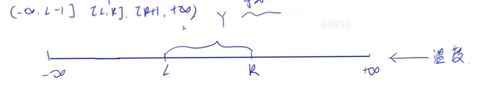


#### 代码

```c++
//map写法

#include <iostream>
#include <cstring>
#include <algorithm>
#include <map>

using namespace std;

const int INF = 2e9;

int n, x, y, z;

int main()
{
     map<int, int> b;

     scanf("%d%d%d%d", &n, &x, &y, &z);
    
     for (int i = 0; i < n; i++)
     {
          int l, r;
          scanf("%d%d", &l, &r);
         //差分操作
          b[-INF] += x;
          b[l] += y - x; //这里的b[l]是讲b[l-1+1]-=x,b[l]+=y合并了,下面b[r+1]也是一样
          b[r + 1] += z - y;
          b[INF] -= z;
         
     }

    
     int res = 0, sum = 0;
     for (auto &[k, v] : b)
     {
          sum += v;				//前缀和,求原数组的和
          res = max(res, sum);	//找最大值
     }

    
     printf("%d\n", res);
     return 0;
}

```


```c++
//手动实现离散化

//照着map来修改
#include <iostream>
#include <cstring>
#include <algorithm>
#include <vector>

using namespace std;

const int N = 20010, INF = 2e9;

int n, x, y, z;
vector<int> xs;
int l[N], r[N], b[N * 2]; // l和r是先将题目所给点对给存下来.放入xs里面(xs充当数组)

//因为已经排完序了,可以用二分.也可以用lower_bound和upper_bound
int find(int v) // find函数,用于求每个原数值映射后的值是多少,也就是这个值的下标
{
     int l = 0, r = xs.size() - 1;
     while (l < r)
     {
          int mid = l + r >> 1;
          if (xs[mid] >= v)
               r = mid;
          else
               l = mid + 1;
     }
     return r;
}

int main()
{
     scanf("%d%d%d%d", &n, &x, &y, &z);

     xs.push_back(-INF), xs.push_back(INF);
     for (int i = 0; i < n; i++)
     {
          scanf("%d%d", &l[i], &r[i]);
          xs.push_back(l[i]); //在map的写法里,用到了正负无穷,l和r+1,现在都存入xs(数轴)
          xs.push_back(r[i] + 1);
     }

     sort(xs.begin(), xs.end());                       //排序操作,map自带排序
     xs.erase(unique(xs.begin(), xs.end()), xs.end()); //判重,删除排完序后邻近相同字符.如011234,把它变成01234

     for (int i = 0; i < n; i++)
     {
          int L = find(l[i]), R = find(r[i] + 1);
          b[0] += x;
          b[L] += y - x;
          b[R] += z - y;
          b[xs.size() - 1] -= z;
     }

     int res = 0, sum = 0;
     for (int i = 0; i < xs.size(); i++)
     {
          sum += b[i];
          res = max(res, sum);
     }

     printf("%d\n", res);
     return 0;
}

```


### 奶牛棒球(枚举,二分,双指针)

[1945. 奶牛棒球 - AcWing题库](https://www.acwing.com/problem/content/1947/)


#### 题目

农夫约翰的 NN 头奶牛排成一排，每头奶牛都位于数轴中的不同位置上。

它们正在练习投掷棒球。

农夫约翰观看时，观察到一组三头牛 (X,Y,Z)(X,Y,Z) 完成了两次成功的投掷。

牛 XX 把球扔给她右边的牛 YY，然后牛 YY 把球扔给她右边的牛 ZZ。

约翰指出，第二次投掷的距离不少于第一次投掷的距离，也不超过第一次投掷的距离的两倍。

请计算共有多少组牛 (X,Y,Z)(X,Y,Z) 可能是约翰所看到的。


输入格式

第一行包含整数 NN。

接下来 NN 行，每行描述一头牛的位置。

输出格式

输出奶牛三元组 (X,Y,Z) 的数量。

(X,Y,Z) 需满足，Y 在 X 的右边，Z 在 Y 的右边，并且从 Y 到 Z 的距离在 `[XY,2XY]` 之间，其中 XY 表示从 X 到 Y 的距离。


数据范围

3≤N≤1000,奶牛所在的位置坐标范围 [0,108]。

输入样例：

```
5
3
1
10
7
4
```

输出样例：

```
4
```

样例解释

四个可能的奶牛三元组为：1−3−7,1−4−7,4−7−10,1−4−101−3−7,1−4−7,4−7−10,1−4−10。


#### 题意

​	本题要是直接暴力去做,会有n^3的复杂度,绝对会超时,所以要进行优化.
​	
​	发现本题是1e3,可以接受n^2logn的复杂度,所以想到可以用x,y代表前两个值,n^2遍历,第三个值z利用二分去查找.根据题意,z属于[2y-x,3y-2x],我们只要找到第一个大于等于2y-x的值,最后一个小于等于3y-2x的值,两个值的位置减一下+1,就是这个范围里的z的个数.
​	
​	而找小于等于3y-2x的最后一个值的位置,我们可以同意成找大于3y-2x的第一个值的位置-1.
​	
​	除了利用二分算法外,还有一个更省力的方法,双指针算法,把y和l,y和r这一部分转换成On的复杂度,然后加上x,也就On^2.利用双指针算法将n^2->n的条件是,一个指针单调向后走,另一个也只是单调的像一个方向走,不能回头.而这里y向后走的时候,l也就是2y-x这个点也必定是一直向右走的,不可能随着y的移动,它的位置会跑回前面去.同理,r也是一样.这样子我们就能找到第一个>=2y-x的数l的位置,最后一个<=3y-2x的数r的位置,求得之间的个数.
​	


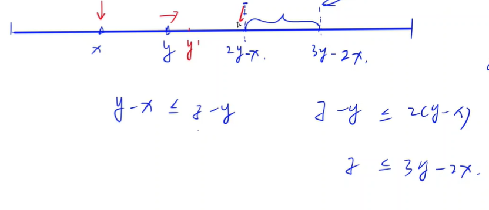


#### 代码

```c++
//利用lower_bound函数

#include <bits/stdc++.h>
using namespace std;
vector<int> v;
int main()
{
     int n;
     cin >> n;
     for (int i = 0; i < n; i++)
     {
          int x;
          cin >> x;
          v.push_back(x);
     }

     sort(v.begin(), v.end()); // v.end()等效于v+n,而数组真正有值的是v[0]~v[n-1].

     int res = 0;
     for (int i = 0; i < n; i++)
          for (int j = i + 1; j < n; j++)
          {
              
               res += upper_bound(v.begin(), v.end(), 3 * v[j] - 2 * v[i]) - lower_bound(v.begin(), v.end(), 2 * v[j] - v[i]);
    //找到第一个大于等于2y-x的数的位置,找到的一个大于3y-2x的数的位置,这个位置-1也就是最后一个<=3y-2x的数的位置.因为这里是求个数,本来还要+1,刚好和-1抵消了
              
          }

     cout << res;
}


```


```c++
//双指针算法优化


```


### 贝西放慢脚步(二路归并)

[1934. 贝茜放慢脚步 - AcWing题库](https://www.acwing.com/problem/content/description/1936/)

#### 题目

奶牛贝茜正在参加冬季哞林匹克运动会的越野滑雪比赛。

她以每秒 1 米的速度出发。

但是，随着时间的推移，她变得越来越疲倦，她开始放慢脚步。

每次放慢脚步，贝茜的速度都会降低：减速一次后，她以每秒 1/2 米的速度移动，减速两次后，则以每秒 1/3 米的速度移动，依此类推。

你将被告知何时何地贝茜会减速。

当减速信息格式为：

```
T 17
```

意味着，贝茜在某个时间点减速，本例表示比赛开始第 17 秒贝茜减速。

当减速信息格式为：

```
D 10
```

意味着，贝茜在某个地点减速，本例表示在行进 10 米处减速。

给定 NN 个减速信息，请计算贝茜滑完一千米需要多少秒。

将你的答案四舍五入到最接近的整数（ 0.5 向上舍入为 1）。


输入格式

第一行包含整数 N。

接下来 N 行，每行描述一个减速信息，格式为 `T x` 或 `D x`。

无论哪种情况，x 都是一个整数，保证所有减速都在贝茜滑完一千米前发生。

可能同时发生多次减速，那么这会使得贝茜的速度一下子变慢很多。

所有减速信息不一定按顺序给出。


输出格式

输出贝茜滑完一千米所需的总时间。

数据范围

1≤N≤10000


输入样例：

```
2
T 30
D 10
```

输出样例：

```
2970
```


样例解释

贝茜以每秒 1米的速度跑完前 10 米，耗时 10 秒。

然后她减速到每秒 1/2 米，接下来的 10 米要花 20 秒。

然后她在第 3030 秒时，再次减速到每秒 1/3 米。

滑完剩下的 980980 米需要 980×3=2940 秒。

因此，总时间是 10+20+2940=2970 秒。


#### 题意

​	本题给你多组值,到这个时间会减速,到这个距离会减速,但没有告诉你哪个会先来临,不知道会先碰到哪种情况(比如奶牛是会先到第10s呢还是先到第15m呢),所以我们就不能按照题目所给数据的顺序来写,而是要自己进行一个判断
​	
​	先将时间和路程分开存放进两个数组,进行排序.然后用两个指针i和j遍历两个数组.将这两个数组进行判断比较后归并,变成一个有序数组c,这个数组从前往后就是奶牛贝西会碰到的事情.
​	
​	这是一个二路归并模型(第一章的归并算法有讲过).还有多路归并,可以在题库里搜一下.(自己写的时候也没有觉的是什么二路归并,直接按照题意来写了hhh)
​	


#### 代码

```c++
//自己写的
#include <iostream>
#include <cstring>
#include <algorithm>
#include <vector>
using namespace std;
const int N = 1e4 + 10;
vector<int> v1;
vector<int> v2;

int main()
{
     int n;
     cin >> n;

     for (int i = 0; i < n; i++)
     {
          char x;
          cin >> x;
          int y;
          cin >> y;
          if (x == 'T')
               v1.push_back(y);
          else if (x == 'D')
               v2.push_back(y);
     }

     sort(v1.begin(), v1.end());
     sort(v2.begin(), v2.end());

    
     double nowt = 0;   // t和d都可能为小数,用double
     double nowd = 0.0; // nowd表示当前走了的距离,nowt表示当前过去的时间
     int nowv = 1;
     int i = 0, j = 0;//两个指针

    //这个循环当一个数组空了,就自动结束
     while (i < v1.size() && j < v2.size())
     {
          if ((v2[j] - nowd) * nowv > v1[i] - nowt) //先到减速时间的话
          {
               nowd += (v1[i] - nowt) / nowv; //发现就算后面有int,只要nowd是double,都会转换为double,也有可能是nowt也为double的原因,所以保险起见,以后的后后面都加上(double)
               nowt = v1[i];
               nowv++;
               i++;
          }
          else if ((v2[j] - nowd) * nowv < v1[i] - nowt) //先到减速地点的话
          {
               nowt += (v2[j] - nowd) * nowv;
               nowd = v2[j];
               nowv++;
               j++;
          }
          else//两个同时
          {
               nowt = v1[i];
               nowd = v2[j];
               nowv += 2;
               j++;
               i++;
          }
     }

     while (i < v1.size()) 
    //这种写法可以记一下,若其中队列有没有循环完的,用while.我之前想用for讨论,发现有点麻烦
     {
          nowd += (v1[i] - nowt) / nowv;
          nowt = v1[i];
          i++;
          nowv++;
     }
     while (j < v2.size())
     {
          nowt += (v2[j] - nowd) * nowv;
          nowd = v2[j];
          nowv++;
          j++;
     }

     cout << (int)(nowt + (1000 - nowd) * nowv + 0.5); //加上最后一段(距离1000米还剩多远)
}
```


```c++
//y总
#include <iostream>
#include <cstring>
#include <algorithm>
#include <vector>

using namespace std;

const int N = 10010;

int n;
vector<int> a, b;

int main()
{
    scanf("%d", &n);

    char str[2];
    int x;
    while (n -- )
    {
        scanf("%s%d", str, &x);

        if (*str == 'T') a.push_back(x);
        else b.push_back(x);
    }

    b.push_back(1000);

    sort(a.begin(), a.end());
    sort(b.begin(), b.end());

    double t = 0, s = 0, v = 1;  // v 是速度的倒数
    int i = 0, j = 0;
    while (i < a.size() || j < b.size())
        if (j == b.size() || i < a.size() && a[i] - t < (b[j] - s) * v)
        {
            s += (a[i] - t) / v;
            t = a[i];
            v ++ ;
            i ++ ;
        }
        else
        {
            t += (b[j] - s) * v;
            s = b[j];
            v ++ ;
            j ++ ;
        }

    printf("%.0lf\n", t);
    return 0;
}


```


### 镜子田地(环图,dfs)

[1929. 镜子田地 - AcWing题库](https://www.acwing.com/problem/content/1931/)


#### 题目

农夫约翰在屋子外面放了一些旧镜子，他的奶牛们像往常一样调皮地偷走了它们！

奶牛们将镜子放置在了一个矩形田地中，该田地可被划分为 N×MN×M 个方格区域。

在每个方格区域中，奶牛在其某对对角之间放置一个双面镜，因此，共有两种放法，一种为 `/` 放置（镜子连接方格左下角和右上角），另一种为 `\` 放置（镜子连接方格左上角和右下角）。

一天晚上，奶牛贝茜将激光发射器带到了该田地中。

她站在田地外面，沿着田地的行或列水平或垂直照射光束，使光束反射一定数量的镜子。

由于镜子都是沿对角线摆放，因此经反射镜反射的水平光束最终将垂直传播，反之亦然。

贝茜想知道从田地之外射入的水平或垂直光束最多可以在田地中被反射多少次。

给定镜子田地的布局，请帮助贝茜计算这个数字。


输入格式

第一行包含 N 和 M。

接下来 N 行，每行包含 M 个 `/` 或 `\` 字符，表示田地中镜子的具体摆放方式。

输出格式

输出田地之外的水平或垂直光束能够被反射的最大次数。

如果可以无限反射，则输出 −1。


数据范围

1≤N,M≤1000

输入样例：

```
3 3
/\\
\\\
/\/
```

输出样例：

```
3
```


样例解释

贝茜可以从上向下沿中间列上方发射激光。

共可以反射 3 次。


#### 题意

​	本题题意较难理解,抽象成模型.
​	
​	理解题意,我们将一面镜子放入一个格子里面,将它抽象化上下两个点.我们发现内部的点度都为2,一个入度一个出度,而边界的点的度为1或0,从外界射入直接射出为0,从外界射入反射到内部,度为1.而本题也就成了一个最长路问题,从哪里射进来所走路程最长.
​	
​	通过对度的了解,我们发现本题其实是一个环图(一个图内都是由一个个不相交的环或链组成).为什么呢,假如光从1号点射入,这个点度数为0的话,直接反射出去,这个点度数为1的话,会反射到另一个点(2号点),这个点不可能与1号点重合,然后它再反射到3号点,这样2号点的度就为2了,不可能再有别的光射向它了..以此类推,直到射到另一个边界节点(度为1的点).所以我们总结得出,图里的每一个点仅仅只能存在在一条光路中(这就是不相交的原因),而题目又说是从外界射来的,所以这个图是由一条条链路组成.图中每个点最多遍历两边(光分别从一条链的首尾两个点射入).
​	
​	这样我们这道题就可以直接采用图的遍历来做,比如dfs,而这里的dfs我们还不用分类讨论往哪个方向走,因为光从射入那一刻开始,它的每一步都是确定了的.(假如往下射的,射到'\'上,就会往右走).我们要怎么写下一步的方向呢?用四个if可以,我们也可以发现规律,采用异或的方式.
​	
​	用dfs的话,因为之前有讲,dfs可以在遍历子树的时候,返回子树的大小.
​	
​	复杂度O(nm)
​	


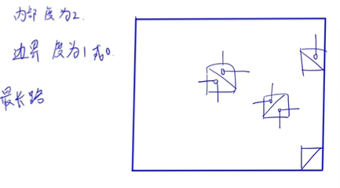


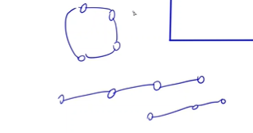


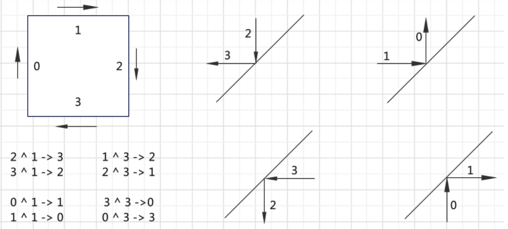


#### 代码

```c++
//自己写的
#include <iostream>
#include <cstring>
#include <algorithm>
using namespace std;
const int MAX = 1e3 + 10;
char ma[MAX][MAX];
int Max = 0;
int dir[4][2] = {-1, 0, 0, 1, 1, 0, 0, -1};
int n, m;
int ans = 1;

int dfs(int x, int y, int z)
{
     if (ma[x][y] == '/')
          z ^= 1;
     else
          z ^= 3;
     int x1 = x + dir[z][0];
     int y1 = y + dir[z][1];
     if (x1 < n && x1 >= 0 && y1 < m && y1 >= 0)
     {
          ans = dfs(x1, y1, z);
          ans++; //回退的时候,不断ans++
     }
     return ans;
}

/*y总代码

int dx[4] = {-1, 0, 1, 0}, dy[4] = {0, 1, 0, -1};

int dfs(int x, int y, int d)
{
    if (x < 0 || x >= n || y < 0 || y >= m) return 0;

    if (g[x][y] == '/') d ^= 1;
    else d ^= 3;

    return dfs(x + dx[d], y + dy[d], d) + 1;
}
*/

int main()
{
     cin >> n >> m;
     for (int i = 0; i < n; i++)
          for (int j = 0; j < m; j++)
               cin >> ma[i][j];

     int res = 0;
     for (int i = 0; i < n; i++)
     {
          res = max(res, dfs(i, 0, 1));
          ans = 1; //每次都要刷新一遍ans
          res = max(res, dfs(i, m - 1, 3));
          ans = 1;
     }

     for (int i = 0; i < m; i++)
     {
          res = max(res, dfs(0, i, 2));
          ans = 1;
          res = max(res, dfs(n - 1, i, 0));
          ans = 1;
     }

     cout << res;
}

```


```c++
//别人写的.  在dfs上多加一个参数u,来标志步数(点数)

#include <iostream>
using namespace std;
const int N = 1e3 + 5;
char g[N][N];
int n, m, ans;
int dx[] = {-1, 0, 1, 0}, dy[] = {0, 1, 0, -1}; // 上 右 下 左

void dfs(int x, int y, int d, int u) {
    ans = max(ans, u);
    if (g[x][y] == '/') {
        d = d ^ 1;
    } else {
        d = d ^ 3;
    }
    int a = x + dx[d], b = y + dy[d];
    if (a >= 1 && a <= n && b >= 1 && b <= m) {
        dfs(a, b, d, u + 1);
    }
}

int main() {
    cin >> n >> m;
    for (int i = 1; i <= n; i++) {
        for (int j = 1; j <= m; j++) {
            cin >> g[i][j];
        }
    }
    
    for (int i = 1; i <= n; i++) {
        dfs(i, 1, 1, 1); // 右
        dfs(i, m, 3, 1); // 左
    }
    for (int j = 1; j <= m; j++) {
        dfs(1, j, 2, 1); // 下
        dfs(n, j, 0, 1); // 上
    }
    
    cout << ans << endl;
    return 0;
}


```


### 懒惰的牛(差分,前缀和,双指针)

[1922. 懒惰的牛 - AcWing题库](https://www.acwing.com/problem/content/1924/)

#### 题目

这是一个炎热的夏日。

懒洋洋的奶牛贝茜想将自己放置在田野中的某个位置，以便可以在短距离内尽可能多地吃到美味的草。

贝茜所在的田野中共有 NN 片草地，我们可以将田野视作一个一维数轴。

第 i 片草地中包含 gi 单位的青草，位置坐标为 xi。

不同草地的位置不同。

贝茜想选取田野中的某个点作为她的初始位置（可能是某片草地所在的点）。

只有一片草地与她的初始位置的距离不超过 KK 时，贝茜才能吃到那片草地上的草。

如果贝茜选择最佳初始位置，请确定她可以吃到的青草最大数量。


输入格式

第一行包含两个整数 N 和 K。

接下来 N 行，每行描述一片草地，包含两个整数 gi 和 xi。

输出格式

输出如果贝茜选择最佳初始位置，则她可以吃到的青草最大数量。


数据范围

1≤N≤105,1≤gi≤10000,0≤xi≤106,1≤K≤2×106


输入样例：

```
4 3
4 7
10 15
2 2
5 1
```

输出样例：

```
11
```

样例解释

最佳初始位置选择为 x=4x=4，可以吃到 x=1,x=2,x=7x=1,x=2,x=7 处的青草。


#### 题意

​	有点激动,第一次写出来题(笑哭)
​	
​	自己的思路就是差分,把题目给的每片草的坐标往前K个单位,往后K个单位的范围都当作有gi的草,利用差分可以快速给这片区域都赋上值.完成n此操作后,遍历.求出哪里的草量最多,让贝西站在那就能吃到最多的草.O(n)
​	
​	还可以使用前缀和,前缀和的话,把考虑目标当做牛,而不是草.每头牛都可以吃到前k个位置,后k个位置,我们就把题目转换为找出和最大的长度为2k的区间.求区间和用前缀和.O(n)
​	
​	双指针算法,本题也可以用双指针算法,但要多加一个排序,复杂度比前面O(n)的要多个logn.
​	用双指针的前提是一个指针朝一个方向走,另一个也单调朝一个方向走,不能回头.我们这里以i为基准,而j就是以i为右端点,长度为2k的区间的最靠左的点.i往右走的时候,j也只能往右走

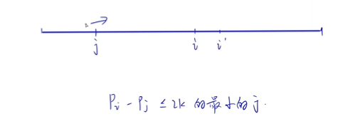


#### 代码

```c++
//自己写的,差分
#include <bits/stdc++.h>
using namespace std;
map<int, int> b;

int check(int x)  //因为坐标都是大于0的,所以当x-k是负数的时候,直接当做0来处理
{
     if (x < 0)
          return 0;
     return x;
}

int main()
{
     int n, m;
    
     cin >> n >> m;
     for (int i = 0; i < n; i++)
     {
          int x, y;
          cin >> y >> x;
          b[check(x - m)] += y;	//差分操作
          b[x + m + 1] -= y;
     }

     int res = 0, sum = 0;
     for (auto &[k, v] : b)
     {
          sum += v;
          res = max(res, sum);
     }

     cout << res;
}
```


```c++
//前缀和

#include <iostream>
#include <cstring>
#include <algorithm>

using namespace std;

const int N = 1000010;
int s[N], n, m;

int main()
{
     cin >> n >> m;
     for (int i = 0; i < n; i++)
     {
          int a, b;
          cin >> a >> b;
          s[b + 1] += a; //一般前缀和都是从下标为1开始讨论的,因为是0的话,求前缀和时0-1等于-1,不太好判断.这里把下标都+1
     }

     for (int i = 1; i < N; i++) //预处理整个坐标
          s[i] += s[i - 1];

     int res = -1;
     for (int i = 0; i < N; i++)
     {
          int l = max(1, i - m), r = min(i + m, N - 1); //如果左端点比1还小的话,当做1来写.右端点比N-1还大的话,当做N-1来写,因为只开了这么大的数组,再大会越界
          res = max(res, s[r] - s[l - 1]);              //找出最大的长度为2k的区间
     }

     cout << res;
     return 0;
}

```


```c++
//前缀和+二分
/*先按照坐标排序
然后算出以草的数量为值的前缀和
以每一棵草为基准点，草的位置在 x， 牛在 x + k，最后可以吃到的草的位置在 x + 2 * k
二分找到小于等于x + 2 * k的草的下标，然后用前缀和求出x - x + 2 * k之间草的数量*/

#include <bits/stdc++.h>
using namespace std;

int main()
{

     int n, k, ans = 0;
     cin >> n >> k;

     vector<int> d(n), pre(n + 1);
     vector<pair<int, int>> a(n);
     for (int i = 0; i < n; i++)
          cin >> a[i].second >> a[i].first; //草的数量，草的坐标

     sort(a.begin(), a.end()); //按照坐标排序
     for (int i = 0; i < n; i++)
          d[i] = a[i].first, pre[i + 1] = pre[i] + a[i].second;

     for (int i = 0; i < n; i++)
     {
          int x = d[i];                                                     //草的下标
          int len = upper_bound(d.begin(), d.end(), x + 2 * k) - d.begin(); //二分
          ans = max(ans, pre[len] - pre[i]);                                //前缀和算出区间累加
     }

     cout << ans;
     return 0;
}

```


```c++
//双指针算法,y总代码
#include <iostream>
#include <cstring>
#include <algorithm>

#define x first
#define y second

using namespace std;

typedef pair<int, int> PII;
const int N = 100010;

int n, m;
PII q[N];

int main()
{
     scanf("%d%d", &n, &m);
     for (int i = 0; i < n; i++)
          scanf("%d%d", &q[i].y, &q[i].x);
     sort(q, q + n);

     int res = 0, sum = 0;
     for (int i = 0, j = 0; i < n; i++)	//i,j两个指针
     {
          sum += q[i].y;
          while (q[i].x - q[j].x > m * 2)
               sum -= q[j++].y;//确立j点
          res = max(res, sum);
     }

     printf("%d\n", res);
     return 0;
}

```


### 公平摄影(前缀和)

[1913. 公平摄影 - AcWing题库](https://www.acwing.com/problem/content/1915/)


#### 题目

农夫约翰的 N 头奶牛站在一维长围栏的不同位置。

第 i 头牛位于位置 xi，其所属品种为 bi（根西岛牛或荷斯坦牛）。

所有奶牛的位置各不相同。

约翰想给一段连续区间内的奶牛拍摄一张照片，用来在乡村集市上展览。

但是我们希望他所有品种的奶牛都能在照片中得到公平的展示。

因此，他希望确保无论照片中出现哪些品种的奶牛，每种品种的奶牛在照片中的数量都必须相等。

例如，一张照片中只包含荷斯坦牛是可以的，包含荷斯坦牛和根西岛牛各 2727 头也没问题，但是包含 10 头荷斯坦牛和 9 头根西岛牛则不可以。

请确定，约翰可以拍下的满足以上条件的照片的最大尺寸。

照片的尺寸是指照片中奶牛最大和最小位置之间的差。

约翰最终可能只拍下一头奶牛，这种情况下，照片尺寸为 0。


输入格式

第一行包含整数 N。

接下来 N行，每行包含一个整数 xi 和一个字符 bi（H 表示荷斯坦牛，G 表示根西岛牛）。

输出格式

输出照片的最大尺寸。


数据范围

1≤N≤105,0≤xi≤109

输入样例：

```
6
4 G
10 H
7 G
16 G
1 G
3 H
```

输出样例：

```
7
```


样例解释

共 6 头牛，从左到右排列顺序为 G,H,G,G,H,G

最佳摄影方案是拍中间四头奶牛，恰好荷斯坦牛和根西岛牛各两头。


#### 题意

​	从题意上来看,符合条件的区间可以是一个区间内都是G或都是H,或者这个区间内H和G的个数相同.我们可以先算一下连续的G和连续的H最长有多长,再算H和G的个数相同的区间最长有多长,比较一下得到答案.
​	
​	本来是想遍历每个点,记录一下从头到这个点为止,G的数量和H的数量,然后算一下差值.算完这个点后,再在前面找,如果找到前面的点里记录的差值和这个点一样,那么代表这个区间里的G和H的数量一样多.我们应该尽量找前面一点的差值相同的点,这样区间才会尽可能大.想找这个差值在前面哪个位置出现过的话,可以用哈希表来存储位置,存储第一次出现这个数的下标.
​	
​	但是看别人的话是另一个思路(包括y总),把G点设成1,H点设成-1.
​	如果一个区间里H的个数和G的个数相同,也就是1和-1的个数相同,那么这个区间的和一定是0(刚开始值为0,来了一个H,+1,又来了一个G,-1,值最终还是为0,这里面H和G个数相等).
​	s[i]-s[j-1]=0(前缀和求i~j的区域和) -> s[i]=s[j-1] .也就把题意转换成找出在i下标之前,找到一个值,这个值等于s[i],这个值的下标就是j-1 . 用i下标的原值减j下标(不是j-1)的原值,就是这个区域.所以我们应该使j尽可能的出现在前面,让区域更大.
​	找一个数曾经第一次出现的位置,可以用哈希表.(如map),存储这个数第一次出现的位置.
​	
​	

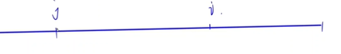

用1和-1来表示一个区间里a和b的个数是否相等


#### 代码

```c++

#include <cstring>
#include <algorithm>
#include <iostream>
#include <vector>
#include <unordered_map>
#define x first
#define y second
using namespace std;
typedef pair<int, int> pii;
const int N = 1e5 + 10;
pii a[N];
int Sum[N];
unordered_map<int, int> ma;

int main()
{
     int n;
     cin >> n;
     for (int i = 1; i <= n; i++)
     {
          cin >> a[i].x;
          char c;
          cin >> c;
          if (c == 'G')
               a[i].y = 1;
          else
               a[i].y = -1;
     }
     sort(a + 1, a + n + 1);

     int sum = 1, Max = 0, pre = 1;//一个区间一连串都是1或-1的状况
     for (int i = 1; i <= n; i++)
     {
          if (a[i].y != a[pre].y)
          {
               Max = max(Max, a[i - 1].x - a[pre].x);
               pre = i;
          }
     }
    
//一个区间1和-1个数相等的状况
     for (int i = 1; i <= n; i++)
     {
          Sum[i] = Sum[i - 1] + a[i].y;
     }

     int MAX = 0;
     ma[0] = 0;//意思是0这个数第一次出现在下标为0的位置上.也就是当j=1的时候,我们给s[j-1]手动赋值.
     for (int i = 1; i <= n; i++)
     {
          if (ma.count(Sum[i]))	
          //Sum[i]之前出现过,ma[Sum[i]]存了它第一次出现的下标(也就是j-1)
          {
               MAX = max(MAX, a[i].first - a[ma[Sum[i]] + 1].first);//这里要+1,我们算的是j下标的原值
          }
          else
               ma[Sum[i]] = i;//第一次出现,给它加上位置
     }

     cout << max(MAX, Max);
}

```


### 奶牛慢跑(思维题,栈)

[1904. 奶牛慢跑 - AcWing题库](https://www.acwing.com/problem/content/1906/)


#### 题目

奶牛们又出去锻炼蹄子去了！

有 N头奶牛在无限长的单行道上慢跑，且跑步方向为坐标值增大的方向。

每头奶牛在跑道上开始奔跑的位置互不相同，一些奶牛的奔跑速度可能相同，也可能不同。

由于跑道是单行道，十分狭窄，奶牛们无法相互超越。

当一头速度很快的牛追上另一头牛时，她必须减速至与另一头牛速度相同以免发生碰撞，并成为同一跑步小组的一员。此时，两头牛可以视为在同一点上。

最终，再也没有奶牛会撞到（追上）其他奶牛了。

约翰想知道在这种情况下，会剩下多少个跑步小组。


输入格式

第一行包含整数 N.

接下来 N 行，每行包含一头奶牛的初始位置和跑步速度。

所有奶牛的初始位置各不相同，且是按照递增顺序给出的。


输出格式

输出一个整数，表示最终剩下的小组数量。

数据范围

1≤N≤1051≤N≤105,初始位置范围 [0,109][0,109]，跑步速度范围 [1,109][1,109]


输入样例：

```
5
0 1
1 2
2 3
3 2
6 1
```

输出样例：

```
2
```


#### 题意

​	我的思路是发现要是i>j,但vj却>vi,i就一定会被追上,在i和j之间的这整个区间(无论里面有没有其他的点,速度是多少)也就一定会被浓缩成一个点.所以我们就变成讨论题目所给的数据,能被分成几个这样的区间,也就是遍历点,找到它最左边的比他小的值,但找这个值却不知道怎么找
​	
​	y总的思路是如果一个数轴,如果能被分为n个区间,那么就会有n个队长,队长就是每个区间最右边的数.所以我们只要判断一个数轴有几个队长就好了.判断是不是队长的话就是找这个这个点i的右边的点有没有比速度他小的数t,有的话则表示这个点i一定会追上t,所以i一定不是队长.->(是队长的话则表示右边区间的最小速度>vi)
​	想要求右边区间的最小速度的话,只要我们从后往前遍历数组就行了,不断更新最小值
​	

(小技巧:从后往前遍历数组)


#### 代码

```c++

#include <cstring>
#include <algorithm>
#include <iostream>
#include <vector>
#include <map>
#include <bits/stdc++.h>
using namespace std;
#define x first
#define y second
typedef pair<int, int> pii;
const int N = 1e5 + 10, INF = 2e9;
int a[N], b[N];

int main()
{
     ios_base::sync_with_stdio(false);
     cin.tie(nullptr);
     cout.tie(nullptr);

     int n;
     cin >> n;
     for (int i = 0; i < n; i++)
     {
          cin >> a[i];
          cin >> b[i];
     }

     int Min = b[n - 1];//假定现在最小值就是最后一个数
     int cnt = 1;
     for (int i = n - 2; i >= 0; i--)//从后往前遍历数组
     {
          if (b[i] <= Min)
          {
               cnt++;
               Min = b[i];
          }
     }
    
     cout << cnt;
}

```


### COW(dp)

[1884. COW - AcWing题库](https://www.acwing.com/problem/content/1886/)


#### 题目

奶牛贝茜在她最喜欢的牧场中发现了一块石碑，上面刻有神秘的碑文。

碑文的文字似乎来自一种神秘的古代语言，可看作一个只包含 C,O,W 三种字符的字符串。

尽管贝茜无法解密该文字，但是她很欣赏 C,O,W 按顺序构成她最喜欢的单词 COW。

她想知道 COWCOW 在碑文中一共出现了多少次。

她不介意 C,O,W 之间是否存在其他字符，只要这三个字符按正确的顺序出现即可。

她也不介意多个不同的 COW是否共享了一些字符。

例如，COW 在 CWOW 中只出现一次，在 CCOW中出现两次，在 CCOOWW中出现八次。

给定碑文中的文字，请帮助贝茜计算 COW 出现的次数。


输入格式

第一行包含 N。

第二行包含一个长度为 N 的字符串，其中只包含字符 C,O,W。

输出格式

输出给定字符串中 COW 作为子序列（不一定连续）的出现次数。


数据范围

1≤N≤105


输入样例：

```
6
COOWWW
```

输出样例：

```
6
```


#### 题意


​	本题采用dp来写,以下是y总思路:
​	发现这种题和背包那类的题有点不同,像背包抽象为二维:f(i,j),意思是在前i个物品选,总体积小于j.而本题的第二维很难看出来.我们可以采用状态机dp(提高课),把第二维抽象成状态机.
​    什么意思呢?我们想构造一个COW的话,我们可以定义一个初始状态,它碰到'c'就会变成第零状态,再碰到'o',就会从第零状态变为第一状态,再碰到'w',就会变为第二状态.所以本题就可以翻译成能走到第二状态的路线有几个?(状态dp都可以转换成这样的一个模式,把问题转换成状态性走法的问题,可能求数量,最小值最大值,点和边带权值就可以求最小价值最大价值)
​    我们就可以这样设函数了,f(i,j)从前往后走,走完第i个字母的情况下,走到状态j的方案数.
f(i,0),f(i,1)f(i,2).接下来就是求怎么递推的到每个状态的值.	假设第i个字母是c的话,f(i,0)的情况就能分为两大类,不包含第i个字母,和包含第i个字母(和背包类似),也就是f(i,0)=f(i-1,0)+1(1就是包含第i个字母的).	而f(i,1)就是等于f(i-1,1),因为第i个字母是c了,所以包含第i个字母的情况是不可能产生出现状态1的路线的,同理,f(i,2)=f(i-1,2).
​	而当第i个字母是o的时候,f(i,0)=f(i-1,0),f(i,1)的话就不太一样了.我们也要分为两大类,包含第i个和不包含第i个,不包含第i个的话就是f(i-1,1),包含i的话,也就是当前字母就是o了,它的这个o可以在前面的每个c后面,都是一条路线,走到状态一的路线,所以这时候的方式数是前面所有状态0的方案数,f(i,1)=f(i-1,1)+f(i-1,0)....以下同理(这里的状态机还是比较容易推导的,有些还会是与kmp一起)
​	
​	而我们发现我们每次递推的时候,fi只取决于fi-1,所以我们可以用滚动数组(滚动数组优化)来表示,也就是说不用定义数组,只要定义3个变量abc来记录数量就好了.
​	

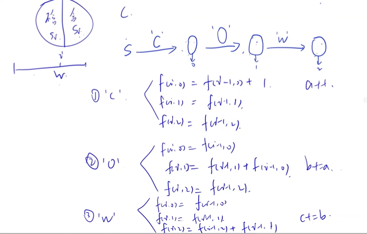


```
	而自己想这道的话,其实也有感觉的,好像之前做过(hh).你一个字符串,遍历到o的时候,假如前面有4个c了,那么这个o就能和前面4个c组合,产生4种方案,要是o后面还是o,这个o就也能与前面4个c组合,产生4种.而最后如果是w的话,前面两个o,这个w可以和前面2个4中方案结合,有8种方案,.
```


#### 代码

```c++

#include <iostream>
#include <cstring>
#include <algorithm>

using namespace std;

typedef long long LL;

const int N = 100010;

int n;
char s[N];

int main()
{
     scanf("%d", &n);
     scanf("%s", s);

     LL a = 0, b = 0, c = 0;
     for (int i = 0; i < n; i++)
          if (s[i] == 'C')
               a++;
          else if (s[i] == 'O')
               b += a;
          else
               c += b;

     printf("%lld\n", c);
     return 0;
}

```


### 贝西的报复(dfs,二进制)


#### 题意

​	dfs:
​	
​	有点惭愧,本题看到标签为dfs的时候,我有想过dfs遍历BIGOESM这个字符串的所有字符的题目给的值的排列方式,然后代入 (B+E+S+S+I+E)(G+O+E+S)(M+O+O)这个式子,算出是奇数还是偶数.但看到数据量时7个字母,每个字母的值有20种可能,20的7次是大于1e9的,所以我就放弃了...
​	
​	其实很好看出来,本题并没有让你求值,而只是让你求最终的结果是偶数有几个了,求奇偶我们也就不用细分每个字母的值是多少了,因为能影响最终结果奇偶的只有每个数是奇数还是偶数.这样就把原本每个字母可能讨论20次转换成讨论两次就好了.
​	
​	而且还要知道这个字母的给的值是奇数的有几个,是偶数的有几个. 并且将(B+E+S+S+I+E)(G+O+E+S)(M+O+O)化简一下为(B+I)*(G+O+E+S)*M(因为2S,2O这中必定是偶数,对结果没影响(奇数+偶数还是奇数,偶数加偶数还是偶数)).	
​	此时我们假如知道一种排列 :B为奇,I为奇....(全部字母都是奇数)的时候,答案是偶数,这时候我们只要再将每个字母是奇数的可能有几种乘进去就好了(假如题目所给B为2,5,7, I为1,3,5,6, G为2....我们就可以算出都为奇数的排列时,最终有几种答案为偶数:3*3*0=0(因为O没有奇数,所以乘0),在此题目所给条件下,全部为奇的时候没有为偶数的情况),再比如当M为偶其余都为奇是最终也是偶数,我们只要累乘上其他字母有几个数是奇数,再乘上题目所给M有几个数是偶数就是答案了
​	
​	所以我们就可以先dfs排列出这个字符串BIGOESM,每个字符为奇数或为偶数的所有情况就行了,再判断这种排列能否是式子为偶数
​	
​	我们以后一般写题目,想找出字母和数字的对应关系,比如记录这个字母出现几次啊,想当做几啊,都可以用map来写,更不用说这里的值是负数
​	
​	2^7次
​	


```
	看了y总的,发现这种枚举所有方案,每个元素只有两种可能的排列,不仅用dfs还可以用二进制,只不过复杂度是n*2^n,但代码短一点.总体思路差不多,只不过这里枚举所有可能的方式是以二进制的
```


#### 代码

```c++
#include <bits/stdc++.h>
using namespace std;
string s = "BIGOESM";
map<char, int> ma;		//这个map用于记录dfs循环中,我们把这个字母设置成奇数还是偶数
map<char, int> cnt[2];	//记录题目所给每个字母奇数,偶数的数量.
int sum = 0;

//我的dfs是(char c,int a),c就是s[a],然后每次dfs给s[i]赋值是奇数还是偶数,
//但在a>6的时候,当判断最终答案是偶数时,我却不知道如何把所有符合这种条件的样例都加入总样例中,因为这要再次细细讨论我给B,I,G,O...设置的哪个是偶数,哪个是奇数
//感觉有点麻烦.(如我们假设一种情况是这样:1 1 1 1 1 1 1,也就是所有字母的值都是奇数的情况,我们把满足这种条件的所有方案都加入sum,也就是讨论B为奇数的有几个值,I为奇数的有几个值,G为奇数的有几个值.....都乘起来.这时候就出现问题了,现在看起来方便,是我已经知道我这种方案就是全为奇数,但我们dfs的时候,要是想知道循环中哪个奇哪个为偶,还要再罗列一次,

//所以我看了别人的代码,而他直接在每次循环的时候,就直接把值给算上去了,递归到下次循环中,也就是当次我们在把这个字母定为奇数/偶数时,直接把其相对应的有几个数为奇数/几个数为偶数乘上去

void dfs(int ans, int a)
{
     if (a > 6)
     {
          if ((ma['B'] + ma['I'] % 2) * (ma['G'] % 2 + ma['O'] % 2 + ma['E'] % 2 + ma['S'] % 2) * ma['M'] % 2 % 2 == 0)
          {
               sum += ans;
               return;
          }
          else
               return;
     }
     ma[s[a]] = 1, dfs(ans * cnt[1][s[a]], a + 1);
     ma[s[a]] = 2, dfs(ans * cnt[0][s[a]], a + 1);
}

int main()
{
     int n;
     cin >> n;
     for (int i = 0; i < n; i++)
     {
          char a;
          int x;
          cin >> a >> x;
          cnt[abs(x) % 2][a]++; //题目所给每个字母奇数,偶数的数量.用abs是因为如果是负数,为奇数的话,%2的值是-1.
     }

     dfs(1, 0);

     cout << sum;
}
```


y总二进制:


```c++

#include <iostream>
#include <cstring>
#include <algorithm>
#include <unordered_map>

using namespace std;

int main()
{
     int n;
     cin >> n;

     unordered_map<char, int> cnt[2];
     while (n--)
     {
          char c;
          int x;
          cin >> c >> x;
          cnt[abs(x) % 2][c]++;
     }

     char str[] = "BESIGOM";

     int res = 0;
     unordered_map<char, int> v;
     for (int i = 0; i < 1 << 7; i++)//i<1^7
     {
          for (int j = 0; j < 7; j++)
               v[str[j]] = i >> j & 1;//是奇是偶取决于二进制表示上这位是0还是1

          if ((v['B'] + v['I']) * (v['G'] + v['O'] + v['E'] + v['S']) * v['M'] % 2 == 0)
          {
               int sum = 1;
               for (int j = 0; j < 7; j++)
                    sum *= cnt[i >> j & 1][str[j]];//
               res += sum;
          }
     }

     cout << res << endl;
     return 0;
}

```


### 愤怒的奶牛(bfs,dfs,二分...)


#### 题意


​	本题题目给的干草堆比较少,可以通过暴力计算起爆每个干草堆产生的总干草堆爆破数量,比较得到最大值.
​	
​	爆炸是向左右两边波及的,所以我们可以先讨论往左最多能炸到第几个干草堆l,往右最多能炸到第几个干草堆r,r-l+1得到总数
​	计算往左最多能炸到第几个干草堆时,每次爆炸有个范围,(刚开始是1,后面是2...)我们找这个范围内最靠左边的点,它就是我们产生新的爆炸范围的起爆点(要最左边的,是因为这样使得新的起爆范围最大).以此类推,直到找不到起爆点为止.
​	讨论过程中每个干草堆只找一次,n^2复杂度.
​	
​	以上是直接往左(右)一个个推过去,类似两个指针.这种题目还可以用bfs,dfs来写,暴力遍历每个点,复杂度是n^3
​	
​	而想找一个爆炸范围最左边(最右边)的干草堆,可以采用二分.但二分复杂度多了一个logn
​	


#### 代码

```c++
#include <iostream>
#include <cstring>
#include <algorithm>

using namespace std;

const int N = 110, INF = 2e9;

int n;
int p[N];

int main()
{
     cin >> n;
     p[0] = -INF, p[n + 1] = INF;
     for (int i = 1; i <= n; i++)
          cin >> p[i];
     sort(p + 1, p + n + 1);

     int res = 0;
     for (int i = 1; i <= n; i++) //引爆每个点
     {
          int l = 1, r = 1, a = i, b = i;//l是最左边那个点,r是最右边那个点
          while (p[a] - p[a - 1] <= l) //往左边
          {
               int k = a - 1;
               while (p[a] - p[k - 1] <= l) //找最靠左的那个点
                    k--;
               a = k;
               l++;
          }
          while (p[b + 1] - p[b] <= r) //往右边
          {
               int k = b + 1;
               while (p[k + 1] - p[b] <= r)
                    k++;
               b = k;
               r++;
          }

          res = max(res, b - a + 1); //求最大的个数
     }

     cout << res << endl;
     return 0;
}

```


```c++

// bfs,n^3

#include <iostream>
#include <cstring>
#include <algorithm>
#include <unordered_map>
#include <queue>
using namespace std;

unordered_map<int, int> st;
const int N = 110;
int p[N];
queue<int> q;
int num = 0, ans = 0;

int main()
{
     int n;
     cin >> n;
     for (int i = 0; i < n; i++)
     {
          cin >> p[i];
          st[p[i]] = -1;//判断这个点有没有使用过了
     }

     for (int i = 0; i < n; i++)
     {
          auto len = st; // len存爆炸半径
          len[p[i]] = 1; //每讨论引爆一个干草堆能总共爆几个时,把这个初始点的引爆半径设置为1
          q.push(p[i]);
          num++;

          while (q.size())
          {
               int x = q.front();
               q.pop();
               for (int t = -len[x]; t <= len[x]; t++)
               {
                    if (len[x + t] == -1)//因为len是从st移过来的,所以还为-1,代表x+t这个位置的点没被讨论过
                    {
                         q.push(x + t);
                         num++;
                         len[x + t] = len[x] + 1; // x+t这个点产生的爆炸半径比x多1
                    }
               }
          }

          ans = max(ans, num);
          num = 0;
     }
     cout << ans << endl;
}

```


```
//dfs


```


### 蹄子剪刀布(枚举,思维)

[1801. 蹄子剪刀布 - AcWing题库](https://www.acwing.com/problem/content/1803/)

#### 题目


你可能听说过“石头剪刀布”的游戏。

这个游戏在牛当中同样流行，它们称之为“蹄子剪刀布”。

游戏的规则非常简单，两头牛相互对抗，数到三之后各出一个表示蹄子，剪刀或布的手势。

蹄子赢剪刀，剪刀赢布，布赢蹄子。

例如，第一头牛出“蹄子”手势，第二头牛出“布”手势，则第二头牛获胜。

如果两头牛出相同的手势，则算平局。

农夫约翰的两头奶牛正在进行 N 轮“蹄子剪刀布”对抗，他看的十分入迷。

不幸的是，虽然他可以看到奶牛正在做出三种不同类型的手势，但他却无法分辨出哪一个代表“蹄子”，哪一个代表“布”以及哪一个代表“剪刀”。

不知道这三种手势的具体含义的情况下，农夫约翰给这三种手势分配了编号 1,2,3。

手势 1 可能代表“蹄子”，可能代表“剪刀”，也可能代表“布”，反正他傻傻分不清楚。

给出两头奶牛在 NN 场比赛中所做出的具体手势对应的编号，请你判断第一头奶牛最多可能赢多少盘对抗。


输入格式

第一行包含整数 N。

接下来 N 行，每行包含两个整数（1 或 2 或 3），表示两头奶牛在一轮对抗中所出的手势对应的编号。

输出格式

输出第一头奶牛可能获胜的最大场次数。


数据范围

1≤N≤100


输入样例：

```
5
1 2
2 2
1 3
1 1
3 2
```

输出样例：

```
2
```

样例解释

此样例的一种解决方案是，1 表示剪刀，2表示蹄子，3 表示布。

这样，第一头奶牛可以赢得 (1,3) 和 (3,2) 两场比赛。


#### 题意

​	数据很小，就100。
​	
​	可以直接罗列所有情况(6种,3*2*1),都进行讨论,看看第一个人在哪种情况赢的最多.
​	
​	或者在列举情况的时候,进行分析,看看能不能简化.我们发现 石头 剪刀 布的代表顺序为    1 2 3,2 3 1,3 1 2(这三种情况)的时候都是代表同一种情形(1赢2,2赢3,3赢1).
​	同样,当1 3 2,2 1 3,3 1 2也是同一种情形.所以原来总共的六种情况,变成了两种:x赢x+1和x赢x-1
​	
​	其中有一步给数据都减一,很巧妙.
​	


#### 代码

```c++

#include <iostream>
#include <cstring>
#include <algorithm>

using namespace std;

int main()
{
     int n;
     cin >> n;

     int a = 0, b = 0;
     while (n--)
     {
          int x, y;
          cin >> x >> y;
          //巧妙的剪法
          x--, y--; //不减的话,如:1能赢3,(1+2)%3=0却不等于3.

          if ((x + 2) % 3 == y)
               a++;
          else if ((x + 1) % 3 == y)
               b++;
     }

     cout << max(a, b) << endl;
     return 0;
}

```

