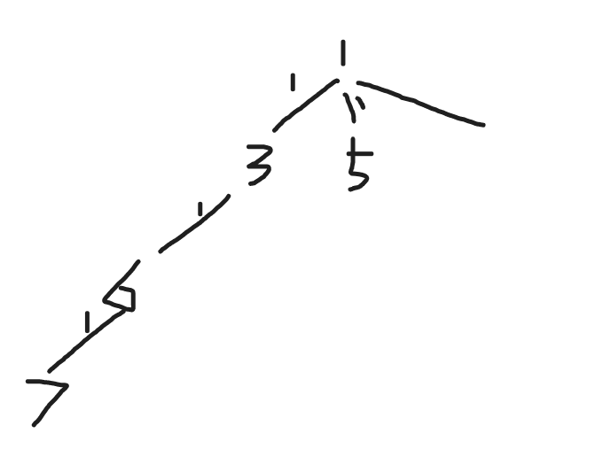

## 复杂度分析:

### 朴素版dij:  n^2^

### 堆优化dij复杂度: logn,更新m次，是mlogn, m是边数


## 单源最短路的建图方式


### 热浪


#### 思路

​	就是正常的单源最短路问题,可以采用dij和spfa来做


#### 代码

朴素版(O(n^2^))

```c++
#include<iostream>
#include<cstring>
#include<algorithm>
#include<queue>

using namespace std;

const int N=3000;

int g[N][N],dist[N];
int n,m,s,e;
bool st[N];

int dijkstra(int s,int e)
{
    memset(dist,0x3f,sizeof dist);
    dist[s]=0;
    for(int i=1;i<n;i++)
    {
        int t=-1;
        for(int j=1;j<=n;j++) if(!st[j] && (t==-1||dist[t]>dist[j]))  t=j;
        st[t]=true;
        for(int j=1;j<=n;j++)    dist[j]=min(dist[j],dist[t]+g[t][j]);
    }
    return dist[e];
}

int main()
{
    cin>>n>>m>>s>>e;
    memset(g,0x3f,sizeof g);
    for(int i=0;i<m;i++)
    {
        int a,b,w;
        scanf("%d%d%d",&a,&b,&w);
        g[a][b]=g[b][a]=min(g[a][b],w);
    }
    int t=dijkstra(s,e);
    cout<< t <<endl;
    return 0;
}

```


优化版dij:

```c++
#include <iostream>
#include <cstring>
#include <algorithm>
#include <queue>

using namespace std;

const int N = 3000, M = 20000;

typedef pair<int, int> PII;

int h[N], w[M], e[M], ne[M], idx;
bool ste[N];
priority_queue<PII, vector<PII>, greater<PII>> heap;

void add(int a, int b, int c)//或者可以用vector<>模拟,也可以直接g[][],邻接矩阵,
{
     e[idx] = b, ne[idx] = h[a], w[idx] = c, h[a] = idx++;
}

int dijkstra(int st, int ed)
{
     int dist[M];
     memset(dist, 0x3f, sizeof dist);
     dist[st] = 0;
     heap.push({0, st});
     while (heap.size())
     {
          auto t = heap.top();
          heap.pop();
          if (ste[t.second])
               continue;
          ste[t.second] = true;
          
          for (int i = h[t.second]; ~i; i = ne[i])//要是前面用邻接矩阵,这里采用: 
            /*for (int i = 1; i <= n; i++) 
          {
               if (g[ver][i])
               {
				}
          }
          时间会变慢
         */
             
          {
               int j = e[i];
               if (dist[j] > t.first + w[i])
               {
                    dist[j] = t.first + w[i];
                    heap.push({dist[j], j});
               }
          }
     }
     return dist[ed];
}

int main()
{
     int n, m, st, ed;
     cin >> n >> m >> st >> ed;
     memset(h, -1, sizeof h);
     for (int i = 0; i < m; i++)
     {
          int a, b, w;
          scanf("%d%d%d", &a, &b, &w);
          add(a, b, w), add(b, a, w);
     }
     int t = dijkstra(st, ed);
     cout << t << endl;
     return 0;
}

```


spfa O(m)
平均O(m)，最坏O(nm)

```c++
#include <iostream>
#include <cstring>
#include <algorithm>
#include <queue>

using namespace std;

const int N = 3000, M = 20000;

int h[N], w[M], e[M], ne[M], idx;
bool ste[N];

void add(int a, int b, int c)
{
     e[idx] = b, ne[idx] = h[a], w[idx] = c, h[a] = idx++;
}

int spfa(int st, int ed)
{
     int dist[M];
     memset(dist, 0x3f, sizeof dist);
     queue<int> q;
     q.push(st);
     dist[st] = 0;
     ste[st] = true;
     while (q.size())
     {
          int t = q.front();
          q.pop();
          ste[t] = false;
          for (int i = h[t]; ~i; i = ne[i])
          {
               int j = e[i];
               if (dist[j] > dist[t] + w[i])
               {
                    dist[j] = dist[t] + w[i];
                    if (!ste[j])
                    {
                         ste[j] = true;
                         q.push(j);
                    }
               }
          }
     }
     return dist[ed];
}

int main()
{
     int n, m, st, ed;
     cin >> n >> m >> st >> ed;
     memset(h, -1, sizeof h);
     for (int i = 0; i < m; i++)
     {
          int a, b, w;
          scanf("%d%d%d", &a, &b, &w);
          add(a, b, w), add(b, a, w);
     }
     int t = spfa(st, ed);
     cout << t << endl;
     return 0;
}

```


### 信使


#### 思路

稍微简化一下题意:将题意转换为求起点到其他各个点的最短路的最大值!


#### 代码

​	堆优化 mlogn 或 (n+m)logn 多个复杂度版本:

```c++
#include <bits/stdc++.h>
using namespace std;
const int N = 100 + 10;
typedef pair<int, int> pii;
vector<pair<int, int>> v[N];
int st[N];
int dist[N];
void dij()
{
     memset(dist, 0x3f, sizeof dist);
     priority_queue<pii, vector<pii>, greater<pii>> heap;
     dist[1] = 0;
     heap.push({0, 1});
     while (heap.size())
     {
          auto t = heap.top();
          heap.pop();
          if (st[t.second])
               continue;
          st[t.second] = 1;

          for (auto u : v[t.second])
          {
               if (dist[u.first] > u.second + t.first)
                    dist[u.first] = u.second + t.first;
               heap.push({dist[u.first], u.first});
          }
     }
}

int main()
{
     int n, m;
     cin >> n >> m;
     for (int i = 0; i < m; i++)
     {
          int x, y, z;
          cin >> x >> y >> z;
          v[x].push_back({y, z});
          v[y].push_back({x, z});
     }
     dij();
     int maxx = 0;
     for (int i = 1; i <= n; i++)
          maxx = max(dist[i], maxx);
     
     if (maxx == 0x3f3f3f3f)
          cout << -1 << endl;
     else
          cout << maxx;
}
```


​	spfa:

```c++
#include <iostream>
#include <cstring>
#include <algorithm>
#include <queue>
#define x first
#define y second

using namespace std;
typedef pair<int,int> PII;
const int N = 210 * 2;
int e[N],ne[N],w[N],h[N],dist[N],idx;
bool st[N];
void add(int a,int b,int c)
{
    e[++idx] = b,w[idx] = c,ne[idx] = h[a],h[a] = idx;
}
int n,m;

int spfa()
{
    queue<int> q;
    memset(dist,0x3f,sizeof dist);
    dist[1] = 0;
    q.push(1);

    while(q.size())
    {
        int t = q.front();
        q.pop();
        st[t] = false;
        for(int i = h[t]; ~i; i = ne[i])
        {
            int j = e[i];
            if(dist[j] > dist[t] + w[i])
            {
                dist[j] = dist[t] + w[i];
                if(!st[j])
                {
                    st[j] = true;
                    q.push(j);
                }
            }
        }
    }
    int res = -0x3f3f3f3f;
    for(int i = 1; i <= n; i ++)
    {
        if(dist[i] == 0x3f3f3f3f) return -1;
        res = max(res,dist[i]);

    }
    return res;


}


int main()
{

    cin >> n >> m;
    memset(h,-1,sizeof h);
    for(int i = 1;i <= m; i ++)
    {
        int a,b,c;
        cin >> a >> b >> c;
        add(a,b,c);
        add(b,a,c);
    }
    int step = spfa();
    cout << step << endl;


    return 0;
}

```


### 香甜的黄油


#### 思路

正常思路

​	枚举所有点作为特定牧场，求特定牧场到所有点的最短距离

​	点的个数p = 800，边的个数1500

​	堆优化版dijkstra 复杂度是O(n*mlogn)  nmlogn=1.2∗10^7^

​	spfa 复杂度是O(nm) 平均是2到3倍即 3∗nm=3.9∗106


#### 代码

​	堆优化:

```c++
#include <queue>
#include <cstring>
#include <iostream>
#include <algorithm>
using namespace std;
typedef pair<int, int> PII;
const int N = 1000, M = 3000, INF = 0x3f3f3f3f;
int h[N], e[M], ne[M], w[M], idx;
int dist[N], cow[N], n, m, p;
bool st[N];
void add(int a, int b, int c)
{
    e[idx] = b, w[idx] = c, ne[idx] = h[a], h[a] = idx ++;
}
int dijkstra_heap(int s)
{
    memset(st, 0, sizeof st);
    memset(dist, 0x3f, sizeof dist);
    dist[s] = 0;
    priority_queue<PII, vector<PII>, greater<PII>> heap;
    heap.push({0, s});
    while(heap.size())
    {
        PII t = heap.top();
        heap.pop();
        int ver = t.second, distance = t.first;
        if(st[ver]) continue;//判重,删去的话可以吗?会不会根本不会出现重复的数
        st[ver] = true;
        for(int i = h[ver]; i != -1; i = ne[i])
        {
            int j = e[i];
            if(dist[j] > distance + w[i])
            {
                dist[j] = distance + w[i];
                heap.push({dist[j], j});
            }
        }
    }
    int ans = 0;
    for(int i = 1; i <= n; i ++)
    {
        int j = cow[i];
        if(dist[j] == INF) return INF;
        ans += dist[j];
    }
    return ans;
}
int main()
{
    memset(h, -1, sizeof h);
    ios::sync_with_stdio(false), cin.tie(0), cout.tie(0);
    cin >> n >> p >> m;
    for(int i = 1; i <= n; i ++) cin >> cow[i];
    while(m --)
    {
        int a, b, c;
        cin >> a >> b >> c;
        add(a, b, c), add(b, a, c);
    }
    int ans = INF;
    for(int i = 1; i <= p; i ++) ans = min(ans, dijkstra_heap(i));
    cout << ans;
    return 0;
}


```


spfa:

```c++
#include <iostream>
#include <cstring>
#include <queue>

using namespace std;

const int N = 810, M = 1450 * 2 + 10;

int n, p, c;
int num[N], dist[N];
bool st[N];
int h[N], e[M], ne[M], w[M], idx;
int res = 0x3f3f3f3f;

void add(int a, int b, int c)
{
     e[idx] = b, w[idx] = c, ne[idx] = h[a], h[a] = idx++;
}

void spfa(int x)
{
     queue<int> q;
     memset(dist, 0x3f, sizeof dist);
     memset(st, 0, sizeof st);
     dist[x] = 0;
     st[x] = true;
     q.push(x);

     while (q.size())
     {
          int t = q.front();
          q.pop();
          st[t] = false;

          for (int i = h[t]; ~i; i = ne[i])
          {
               int j = e[i];
               if (dist[j] > dist[t] + w[i])
               {
                    dist[j] = dist[t] + w[i];
                    if (!st[j])
                    {
                         st[j] = true;
                         q.push(j);
                    }
               }
          }
     }

     int sum = 0;
     for (int i = 1; i <= p; i++)
          if (num[i] && dist[i] > 0x3f3f3f3f / 2)
               return;
          else
               sum += num[i] * dist[i];

     res = min(res, sum);
}

int main()
{
     cin >> n >> p >> c;

     for (int i = 0; i < n; i++)
     {
          int x;
          cin >> x;
          num[x]++;
     }

     memset(h, -1, sizeof h);
     for (int i = 0; i < c; i++)
     {
          int a, b, c;
          cin >> a >> b >> c;
          add(a, b, c), add(b, a, c);
     }

     for (int i = 1; i <= p; i++)
          spfa(i);

     cout << res;

     return 0;
}
```


### 最小的花费


#### 思路

​	有点思维的...

​	设:w=(1−z%),   则A需要的费用x×w1×w2×....×wn=100. 为使得A的费用最小, 即求

w1×w2×....×wn的最大值  wi都<=1


​	这道题和传统的题(dij求最短路)的区别在于:它从起点开始往四周走,无论怎么走,值都是越变越小,算怎么走会使得值走到终点剩的最多,而一般都是加上路上的花费,值越来越大,算怎么走会使得值走到终点最小.

​	dij的变形


​	回顾 dijkstra 算法的思想，他是基于贪心的!
对于寻找单源最短路，每次找到全图 dist最小的那个点来更新其他点

​	1、为什么最短路只能在正权图上使用？
因为保证 dijkstra 算法的贪心确认了每个点只会被更新一次，如果是最短路的话正权图 dist 只会越来越大，所以能保证这个性质。
​	但是对于负权图， dist 不一定是单调增大的，因此这个点不能被确认已经是最终 dist 最小的情况,可能后面又来了一个点,连向它,边权却是负的,这样虽然经过的点变得比之前多,但值变小了(加了个负值)。

​	2、对于最长路，能否使用dijkstra算法？
​	只要理解了 dijkstr 算法的贪心原理，就能发现对于最长路也是可以运算的。
对于最短路，我们要保证边是正的递增，才能保证每次找到的最小的 dist 再也不会被更新掉

​	那么对于最长路，我们只要保证 dist 是越来小的，才能保证每次我们找到的最大的距离点再也不会被更新掉
​	那么边权的加肯定是不满足的，什么是满足的？

​	本题的边权的乘积，而且是 0∼1 的边权，才能保证 dist 越来越小。


​	所以可以使用dij求剩余最大值!(每走一步减一点)


#### 代码

```c++
#include<iostream>
#include<cstring>
#include<cstdio>
using namespace std;
const int N = 2010;
double dist[N];
bool st[N];
double g[N][N];
int n,m,S,T;
void dijkstra()
{
    //memset(dist,0x3f,sizeof dist);
    dist[S]=1;
    //st[S]=true;
    for(int i=0;i<n;++i){
        int t=-1;
        for(int j=1;j<=n;++j){
            if((!st[j])&&(t==-1||dist[t]<dist[j]))
            t=j;
        }
        st[t]=true;
        for(int j=1;j<=n;++j){
            dist[j]=max(dist[j],dist[t]*g[t][j]);	//取max
        }
    }
}

int main()
{
    scanf("%d%d", &n, &m);

    while (m -- )
    {
        int a, b, c;
        scanf("%d%d%d", &a, &b, &c);
        double z = (100.0 - c) / 100;
        g[a][b] = g[b][a] = max(g[a][b], z);
    }

    cin >> S >> T;

    dijkstra();

    printf("%.8lf\n", 100 / dist[T]);//dist[T]竟可能大,才能让起点变得更接近100
}
```


### 最优乘车


#### 思路

​	用bfs是我没有想到的额...但仔细想想,确实有这种感觉!

​	同一条路线上的车站i,j(i在前):设置v\[i][j]=true,代表存在这条路线,记住本题车只能从左往右开,一条路线中 1 3 :1能到3,3不能到1

​	采用bfs,每一层的点都是它这一层根节点不换乘能直接到的点

​	根据题意建立树状图(样例):



​	1是起点,1不换乘车只能到的了3 5,所以v[1].push_back(3,5); bfs把3,5分别放入队列,然后把3拿出来,再遍历以它为顶点的边... 

​	在遍历的时候,给点赋上距离,dist[3]=dist[1]+1=1,dist[6]=dist[3]+1..(1到3不换乘,值为1,1到6的话要换乘,值为2...)

​	最后答案输出dist[n]-1


#### 代码

```c++

#include <bits/stdc++.h>
using namespace std;
const int N = 500 + 10;
vector<int> v[N];
int temp[N], st[N], dist[N];

void bfs()
{
     queue<pair<int, int>> q;
     memset(dist, 0x3f, sizeof dist);
     q.push({1, 0});
     st[1] = 1;
     while (q.size())
     {
          auto t = q.front();
          q.pop();

          int x = t.first, dis = t.second;

          for (auto t1 : v[x])
          {
               if (!st[t1])
               {
                    q.push({t1, dis + 1});
                    dist[t1] = dis + 1;
                    st[t1] = 1;
               }
          }
     }
}

int main()
{
     int n, m;
     cin >> m >> n;
     string line;
     getline(cin, line);
     for (int i = 0; i < m; i++)
     {
          getline(cin, line);
          stringstream ssin(line);//一种输入方式
          int stop, cnt = 0;
          while (ssin >> stop)
               temp[cnt++] = stop;
          for (int j = 0; j < cnt; j++)
               for (int k = j + 1; k < cnt; k++)
                    v[temp[j]].push_back(temp[k]);
     }
     bfs();
     if (dist[n] == -1)
          cout << "NO" << endl;
     else
          cout << dist[n] - 1;
}

```


```c++
//换种风格的bfs
#include <cstring>
#include <iostream>
#include <algorithm>
#include <sstream>

using namespace std;

const int N = 510;

int m, n;
bool g[N][N];
int dist[N];
int stop[N];
int q[N];

void bfs()
{
     int hh = 0, tt = 0;
     memset(dist, 0x3f, sizeof dist);
     q[0] = 1;
     dist[1] = 0;

     while (hh <= tt)
     {
          int t = q[hh++];

          for (int i = 1; i <= n; i++)
               if (g[t][i] && dist[i] > dist[t] + 1)
               {
                    dist[i] = dist[t] + 1;
                    q[++tt] = i;
               }
     }
}

int main()
{
     cin >> m >> n;

     string line;
     getline(cin, line);
     while (m--)
     {
          getline(cin, line);
          stringstream ssin(line);
          int cnt = 0, p;
          while (ssin >> p)
               stop[cnt++] = p;
          for (int j = 0; j < cnt; j++)
               for (int k = j + 1; k < cnt; k++)
                    g[stop[j]][stop[k]] = true;
     }

     bfs();

     if (dist[n] == 0x3f3f3f3f)
          puts("NO");
     else
          cout << max(dist[n] - 1, 0) << endl;

     return 0;
}

```


## 单源最短路的综合应用


### 新年好


#### 思路

​	很暴力的一题,先把每个点(6个点)都当做起点,计算每个点到其他所有点的最短距离,存入dist[6]数组,然后用dfs搜索出所有走法(先去哪家,再去哪家),然后计算每种走法的路程,取最小值

​	但其中的写代码能力挺强,感觉自己有这种思路,也写不出这样的代码,emmm


#### 代码

```c++
#include <cstdio>
#include <cstring>
#include <iostream>
#include <algorithm>
#include <queue>

using namespace std;

typedef pair<int, int> PII;

const int N = 50010, M = 200010, INF = 0x3f3f3f3f;

int n, m;
int h[N], e[M], w[M], ne[M], idx;
int q[N], dist[6][N];
int source[6];
bool st[N];

void add(int a, int b, int c)
{
    e[idx] = b, w[idx] = c, ne[idx] = h[a], h[a] = idx ++ ;
}

void dijkstra(int start, int dist[])//因为dist有两维,引入dist
{
    memset(dist, 0x3f, N * 4);
    dist[start] = 0;
    memset(st, 0, sizeof st);

    priority_queue<PII, vector<PII>, greater<PII>> heap;
    heap.push({0, start});

    while (heap.size())
    {
        auto t = heap.top();
        heap.pop();

        int ver = t.second;
        if (st[ver]) continue;
        st[ver] = true;

        for (int i = h[ver]; ~i; i = ne[i])
        {
            int j = e[i];
            if (dist[j] > dist[ver] + w[i])
            {
                dist[j] = dist[ver] + w[i];
                heap.push({dist[j], j});
            }
        }
    }
}

int dfs(int u, int start, int distance)
{
    if (u > 5) return distance;

    int res = INF;
    for (int i = 1; i <= 5; i ++ )
        if (!st[i])
        {
            int next = source[i];
            st[i] = true;
            res = min(res, dfs(u + 1, i, distance + dist[start][next]));
            st[i] = false;
        }

    return res;
}

int main()
{
    scanf("%d%d", &n, &m);
    source[0] = 1;
    for (int i = 1; i <= 5; i ++ ) scanf("%d", &source[i]);

    memset(h, -1, sizeof h);
    while (m -- )
    {
        int a, b, c;
        scanf("%d%d%d", &a, &b, &c);
        add(a, b, c), add(b, a, c);
    }

    for (int i = 0; i < 6; i ++ ) dijkstra(source[i], dist[i]);

    memset(st, 0, sizeof st);
    printf("%d\n", dfs(1, 0, 0));

    return 0;
}

```


