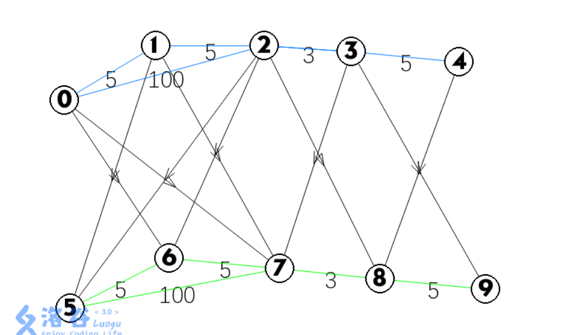
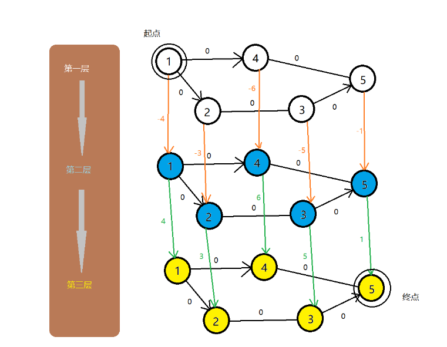

## 复杂度分析:

### 朴素版dij:  n^2^

### 堆优化dij复杂度: logn,更新m次，是mlogn, m是边数


## 单源最短路的建图方式


### 热浪


#### 思路

​	就是正常的单源最短路问题,可以采用dij和spfa来做


#### 代码

朴素版(O(n^2^))

```c++
#include<iostream>
#include<cstring>
#include<algorithm>
#include<queue>

using namespace std;

const int N=3000;

int g[N][N],dist[N];
int n,m,s,e;
bool st[N];

int dijkstra(int s,int e)
{
    memset(dist,0x3f,sizeof dist);
    dist[s]=0;
    for(int i=1;i<n;i++)
    {
        int t=-1;
        for(int j=1;j<=n;j++) if(!st[j] && (t==-1||dist[t]>dist[j]))  t=j;
        st[t]=true;
        for(int j=1;j<=n;j++)    dist[j]=min(dist[j],dist[t]+g[t][j]);
    }
    return dist[e];
}

int main()
{
    cin>>n>>m>>s>>e;
    memset(g,0x3f,sizeof g);
    for(int i=0;i<m;i++)
    {
        int a,b,w;
        scanf("%d%d%d",&a,&b,&w);
        g[a][b]=g[b][a]=min(g[a][b],w);
    }
    int t=dijkstra(s,e);
    cout<< t <<endl;
    return 0;
}

```


优化版dij:

```c++
#include <iostream>
#include <cstring>
#include <algorithm>
#include <queue>

using namespace std;

const int N = 3000, M = 20000;

typedef pair<int, int> PII;

int h[N], w[M], e[M], ne[M], idx;
bool ste[N];
priority_queue<PII, vector<PII>, greater<PII>> heap;

void add(int a, int b, int c)//或者可以用vector<>模拟,也可以直接g[][],邻接矩阵,
{
     e[idx] = b, ne[idx] = h[a], w[idx] = c, h[a] = idx++;
}

int dijkstra(int st, int ed)
{
     int dist[M];
     memset(dist, 0x3f, sizeof dist);
     dist[st] = 0;
     heap.push({0, st});
     while (heap.size())
     {
          auto t = heap.top();
          heap.pop();
          if (ste[t.second])
               continue;
          ste[t.second] = true;
          
          for (int i = h[t.second]; ~i; i = ne[i])//要是前面用邻接矩阵,这里采用: 
            /*for (int i = 1; i <= n; i++) 
          {
               if (g[ver][i])
               {
				}
          }
          时间会变慢
         */
             
          {
               int j = e[i];
               if (dist[j] > t.first + w[i])
               {
                    dist[j] = t.first + w[i];
                    heap.push({dist[j], j});
               }
          }
     }
     return dist[ed];
}

int main()
{
     int n, m, st, ed;
     cin >> n >> m >> st >> ed;
     memset(h, -1, sizeof h);
     for (int i = 0; i < m; i++)
     {
          int a, b, w;
          scanf("%d%d%d", &a, &b, &w);
          add(a, b, w), add(b, a, w);
     }
     int t = dijkstra(st, ed);
     cout << t << endl;
     return 0;
}

```


spfa O(m)
平均O(m)，最坏O(nm)

```c++
#include <iostream>
#include <cstring>
#include <algorithm>
#include <queue>

using namespace std;

const int N = 3000, M = 20000;

int h[N], w[M], e[M], ne[M], idx;
bool ste[N];

void add(int a, int b, int c)
{
     e[idx] = b, ne[idx] = h[a], w[idx] = c, h[a] = idx++;
}

int spfa(int st, int ed)
{
     int dist[M];
     memset(dist, 0x3f, sizeof dist);
     queue<int> q;
     q.push(st);
     dist[st] = 0;
     ste[st] = true;
     while (q.size())
     {
          int t = q.front();
          q.pop();
          ste[t] = false;
          for (int i = h[t]; ~i; i = ne[i])
          {
               int j = e[i];
               if (dist[j] > dist[t] + w[i])
               {
                    dist[j] = dist[t] + w[i];
                    if (!ste[j])
                    {
                         ste[j] = true;
                         q.push(j);
                    }
               }
          }
     }
     return dist[ed];
}

int main()
{
     int n, m, st, ed;
     cin >> n >> m >> st >> ed;
     memset(h, -1, sizeof h);
     for (int i = 0; i < m; i++)
     {
          int a, b, w;
          scanf("%d%d%d", &a, &b, &w);
          add(a, b, w), add(b, a, w);
     }
     int t = spfa(st, ed);
     cout << t << endl;
     return 0;
}

```


### 信使


#### 思路

稍微简化一下题意:将题意转换为求起点到其他各个点的最短路的最大值!


#### 代码

​	堆优化 mlogn 或 (n+m)logn 多个复杂度版本:

```c++
#include <bits/stdc++.h>
using namespace std;
const int N = 100 + 10;
typedef pair<int, int> pii;
vector<pair<int, int>> v[N];
int st[N];
int dist[N];
void dij()
{
     memset(dist, 0x3f, sizeof dist);
     priority_queue<pii, vector<pii>, greater<pii>> heap;
     dist[1] = 0;
     heap.push({0, 1});
     while (heap.size())
     {
          auto t = heap.top();
          heap.pop();
          if (st[t.second])
               continue;
          st[t.second] = 1;

          for (auto u : v[t.second])
          {
               if (dist[u.first] > u.second + t.first)
                    dist[u.first] = u.second + t.first;
               heap.push({dist[u.first], u.first});
          }
     }
}

int main()
{
     int n, m;
     cin >> n >> m;
     for (int i = 0; i < m; i++)
     {
          int x, y, z;
          cin >> x >> y >> z;
          v[x].push_back({y, z});
          v[y].push_back({x, z});
     }
     dij();
     int maxx = 0;
     for (int i = 1; i <= n; i++)
          maxx = max(dist[i], maxx);
     
     if (maxx == 0x3f3f3f3f)
          cout << -1 << endl;
     else
          cout << maxx;
}
```


​	spfa:

```c++
#include <iostream>
#include <cstring>
#include <algorithm>
#include <queue>
#define x first
#define y second

using namespace std;
typedef pair<int,int> PII;
const int N = 210 * 2;
int e[N],ne[N],w[N],h[N],dist[N],idx;
bool st[N];
void add(int a,int b,int c)
{
    e[++idx] = b,w[idx] = c,ne[idx] = h[a],h[a] = idx;
}
int n,m;

int spfa()
{
    queue<int> q;
    memset(dist,0x3f,sizeof dist);
    dist[1] = 0;
    q.push(1);

    while(q.size())
    {
        int t = q.front();
        q.pop();
        st[t] = false;
        for(int i = h[t]; ~i; i = ne[i])
        {
            int j = e[i];
            if(dist[j] > dist[t] + w[i])
            {
                dist[j] = dist[t] + w[i];
                if(!st[j])
                {
                    st[j] = true;
                    q.push(j);
                }
            }
        }
    }
    int res = -0x3f3f3f3f;
    for(int i = 1; i <= n; i ++)
    {
        if(dist[i] == 0x3f3f3f3f) return -1;
        res = max(res,dist[i]);

    }
    return res;


}


int main()
{

    cin >> n >> m;
    memset(h,-1,sizeof h);
    for(int i = 1;i <= m; i ++)
    {
        int a,b,c;
        cin >> a >> b >> c;
        add(a,b,c);
        add(b,a,c);
    }
    int step = spfa();
    cout << step << endl;


    return 0;
}

```


### 香甜的黄油


#### 思路

正常思路

​	枚举所有点作为特定牧场，求特定牧场到所有点的最短距离

​	点的个数p = 800，边的个数1500

​	堆优化版dijkstra 复杂度是O(n*mlogn)  nmlogn=1.2∗10^7^

​	spfa 复杂度是O(nm) 平均是2到3倍即 3∗nm=3.9∗106


#### 代码

​	堆优化:

```c++
#include <queue>
#include <cstring>
#include <iostream>
#include <algorithm>
using namespace std;
typedef pair<int, int> PII;
const int N = 1000, M = 3000, INF = 0x3f3f3f3f;
int h[N], e[M], ne[M], w[M], idx;
int dist[N], cow[N], n, m, p;
bool st[N];
void add(int a, int b, int c)
{
    e[idx] = b, w[idx] = c, ne[idx] = h[a], h[a] = idx ++;
}
int dijkstra_heap(int s)
{
    memset(st, 0, sizeof st);
    memset(dist, 0x3f, sizeof dist);
    dist[s] = 0;
    priority_queue<PII, vector<PII>, greater<PII>> heap;
    heap.push({0, s});
    while(heap.size())
    {
        PII t = heap.top();
        heap.pop();
        int ver = t.second, distance = t.first;
        if(st[ver]) continue;//判重,删去的话可以吗?会不会根本不会出现重复的数
        st[ver] = true;
        for(int i = h[ver]; i != -1; i = ne[i])
        {
            int j = e[i];
            if(dist[j] > distance + w[i])
            {
                dist[j] = distance + w[i];
                heap.push({dist[j], j});
            }
        }
    }
    int ans = 0;
    for(int i = 1; i <= n; i ++)
    {
        int j = cow[i];
        if(dist[j] == INF) return INF;
        ans += dist[j];
    }
    return ans;
}
int main()
{
    memset(h, -1, sizeof h);
    ios::sync_with_stdio(false), cin.tie(0), cout.tie(0);
    cin >> n >> p >> m;
    for(int i = 1; i <= n; i ++) cin >> cow[i];
    while(m --)
    {
        int a, b, c;
        cin >> a >> b >> c;
        add(a, b, c), add(b, a, c);
    }
    int ans = INF;
    for(int i = 1; i <= p; i ++) ans = min(ans, dijkstra_heap(i));
    cout << ans;
    return 0;
}


```


spfa:

```c++
#include <iostream>
#include <cstring>
#include <queue>

using namespace std;

const int N = 810, M = 1450 * 2 + 10;

int n, p, c;
int num[N], dist[N];
bool st[N];
int h[N], e[M], ne[M], w[M], idx;
int res = 0x3f3f3f3f;

void add(int a, int b, int c)
{
     e[idx] = b, w[idx] = c, ne[idx] = h[a], h[a] = idx++;
}

void spfa(int x)
{
     queue<int> q;
     memset(dist, 0x3f, sizeof dist);
     memset(st, 0, sizeof st);
     dist[x] = 0;
     st[x] = true;
     q.push(x);

     while (q.size())
     {
          int t = q.front();
          q.pop();
          st[t] = false;

          for (int i = h[t]; ~i; i = ne[i])
          {
               int j = e[i];
               if (dist[j] > dist[t] + w[i])
               {
                    dist[j] = dist[t] + w[i];
                    if (!st[j])
                    {
                         st[j] = true;
                         q.push(j);
                    }
               }
          }
     }

     int sum = 0;
     for (int i = 1; i <= p; i++)
          if (num[i] && dist[i] > 0x3f3f3f3f / 2)
               return;
          else
               sum += num[i] * dist[i];

     res = min(res, sum);
}

int main()
{
     cin >> n >> p >> c;

     for (int i = 0; i < n; i++)
     {
          int x;
          cin >> x;
          num[x]++;
     }

     memset(h, -1, sizeof h);
     for (int i = 0; i < c; i++)
     {
          int a, b, c;
          cin >> a >> b >> c;
          add(a, b, c), add(b, a, c);
     }

     for (int i = 1; i <= p; i++)
          spfa(i);

     cout << res;

     return 0;
}
```


### 最小的花费


#### 思路

​	有点思维的...

​	设:w=(1−z%),   则A需要的费用x×w1×w2×....×wn=100. 为使得A的费用最小, 即求

w1×w2×....×wn的最大值  wi都<=1


​	这道题和传统的题(dij求最短路)的区别在于:它从起点开始往四周走,无论怎么走,值都是越变越小,算怎么走会使得值走到终点剩的最多,而一般都是加上路上的花费,值越来越大,算怎么走会使得值走到终点最小.

​	dij的变形


​	回顾 dijkstra 算法的思想，他是基于贪心的!
对于寻找单源最短路，每次找到全图 dist最小的那个点来更新其他点

​	1、为什么最短路只能在正权图上使用？
因为保证 dijkstra 算法的贪心确认了每个点只会被更新一次，如果是最短路的话正权图 dist 只会越来越大，所以能保证这个性质。
​	但是对于负权图， dist 不一定是单调增大的，因此这个点不能被确认已经是最终 dist 最小的情况,可能后面又来了一个点,连向它,边权却是负的,这样虽然经过的点变得比之前多,但值变小了(加了个负值)。

​	2、对于最长路，能否使用dijkstra算法？
​	只要理解了 dijkstr 算法的贪心原理，就能发现对于最长路也是可以运算的。
对于最短路，我们要保证边是正的递增，才能保证每次找到的最小的 dist 再也不会被更新掉

​	那么对于最长路，我们只要保证 dist 是越来小的，才能保证每次我们找到的最大的距离点再也不会被更新掉
​	那么边权的加肯定是不满足的，什么是满足的？

​	本题的边权的乘积，而且是 0∼1 的边权，才能保证 dist 越来越小。


​	所以可以使用dij求剩余最大值!(每走一步减一点)


#### 代码

```c++
#include<iostream>
#include<cstring>
#include<cstdio>
using namespace std;
const int N = 2010;
double dist[N];
bool st[N];
double g[N][N];
int n,m,S,T;
void dijkstra()
{
    //memset(dist,0x3f,sizeof dist);
    dist[S]=1;
    //st[S]=true;
    for(int i=0;i<n;++i){
        int t=-1;
        for(int j=1;j<=n;++j){
            if((!st[j])&&(t==-1||dist[t]<dist[j]))
            t=j;
        }
        st[t]=true;
        for(int j=1;j<=n;++j){
            dist[j]=max(dist[j],dist[t]*g[t][j]);	//取max
        }
    }
}

int main()
{
    scanf("%d%d", &n, &m);

    while (m -- )
    {
        int a, b, c;
        scanf("%d%d%d", &a, &b, &c);
        double z = (100.0 - c) / 100;
        g[a][b] = g[b][a] = max(g[a][b], z);
    }

    cin >> S >> T;

    dijkstra();

    printf("%.8lf\n", 100 / dist[T]);//dist[T]竟可能大,才能让起点变得更接近100
}
```


### 最优乘车(bfs)


#### 思路

​	用bfs是我没有想到的额...但仔细想想,确实有这种感觉!

​	同一条路线上的车站i,j(i在前):设置v\[i][j]=true,代表存在这条路线,记住本题车只能从左往右开,一条路线中 1 3 :1能到3,3不能到1

​	采用bfs,每一层的点都是它这一层根节点不换乘能直接到的点

​	根据题意建立树状图(样例):


​	1是起点,1不换乘车只能到的了3 5,所以v[1].push_back(3,5); bfs把3,5分别放入队列,然后把3拿出来,再遍历以它为顶点的边... 

​	在遍历的时候,给点赋上距离,dist[3]=dist[1]+1=1,dist[6]=dist[3]+1..(1到3不换乘,值为1,1到6的话要换乘,值为2...)

​	最后答案输出dist[n]-1


#### 代码

```c++

#include <bits/stdc++.h>
using namespace std;
const int N = 500 + 10;
vector<int> v[N];
int temp[N], st[N], dist[N];

void bfs()
{
     queue<pair<int, int>> q;
     memset(dist, 0x3f, sizeof dist);
     q.push({1, 0});
     st[1] = 1;
     while (q.size())
     {
          auto t = q.front();
          q.pop();

          int x = t.first, dis = t.second;

          for (auto t1 : v[x])
          {
               if (!st[t1])
               {
                    q.push({t1, dis + 1});
                    dist[t1] = dis + 1;
                    st[t1] = 1;
               }
          }
     }
}

int main()
{
     int n, m;
     cin >> m >> n;
     string line;
     getline(cin, line);
     for (int i = 0; i < m; i++)
     {
          getline(cin, line);
          stringstream ssin(line);//一种输入方式
          int stop, cnt = 0;
          while (ssin >> stop)
               temp[cnt++] = stop;
          for (int j = 0; j < cnt; j++)
               for (int k = j + 1; k < cnt; k++)
                    v[temp[j]].push_back(temp[k]);
     }
     bfs();
     if (dist[n] == -1)
          cout << "NO" << endl;
     else
          cout << dist[n] - 1;
}

```


```c++
//换种风格的bfs
#include <cstring>
#include <iostream>
#include <algorithm>
#include <sstream>

using namespace std;

const int N = 510;

int m, n;
bool g[N][N];
int dist[N];
int stop[N];
int q[N];

void bfs()
{
     int hh = 0, tt = 0;
     memset(dist, 0x3f, sizeof dist);
     q[0] = 1;
     dist[1] = 0;

     while (hh <= tt)
     {
          int t = q[hh++];

          for (int i = 1; i <= n; i++)
               if (g[t][i] && dist[i] > dist[t] + 1)
               {
                    dist[i] = dist[t] + 1;
                    q[++tt] = i;
               }
     }
}

int main()
{
     cin >> m >> n;

     string line;
     getline(cin, line);
     while (m--)
     {
          getline(cin, line);
          stringstream ssin(line);
          int cnt = 0, p;
          while (ssin >> p)
               stop[cnt++] = p;
          for (int j = 0; j < cnt; j++)
               for (int k = j + 1; k < cnt; k++)
                    g[stop[j]][stop[k]] = true;
     }

     bfs();

     if (dist[n] == 0x3f3f3f3f)
          puts("NO");
     else
          cout << max(dist[n] - 1, 0) << endl;

     return 0;
}

```


## 单源最短路的综合应用


### 新年好


#### 思路

​	很暴力的一题,先把每个点(6个点)都当做起点,计算每个点到其他所有点的最短距离,存入dist[6]数组,然后用dfs搜索出所有走法(先去哪家,再去哪家),然后计算每种走法的路程,取最小值

​	但其中的写代码能力挺强,感觉自己有这种思路,也写不出这样的代码,emmm


#### 代码

```c++
#include <cstdio>
#include <cstring>
#include <iostream>
#include <algorithm>
#include <queue>

using namespace std;

typedef pair<int, int> PII;

const int N = 50010, M = 200010, INF = 0x3f3f3f3f;

int n, m;
int h[N], e[M], w[M], ne[M], idx;
int q[N], dist[6][N];
int source[6];
bool st[N];

void add(int a, int b, int c)
{
    e[idx] = b, w[idx] = c, ne[idx] = h[a], h[a] = idx ++ ;
}

void dijkstra(int start, int dist[])//因为dist有两维,引入dist
{
    memset(dist, 0x3f, N * 4);
    dist[start] = 0;
    memset(st, 0, sizeof st);

    priority_queue<PII, vector<PII>, greater<PII>> heap;
    heap.push({0, start});

    while (heap.size())
    {
        auto t = heap.top();
        heap.pop();

        int ver = t.second;
        if (st[ver]) continue;
        st[ver] = true;

        for (int i = h[ver]; ~i; i = ne[i])
        {
            int j = e[i];
            if (dist[j] > dist[ver] + w[i])
            {
                dist[j] = dist[ver] + w[i];
                heap.push({dist[j], j});
            }
        }
    }
}

int dfs(int u, int start, int distance)
{
    if (u > 5) return distance;

    int res = INF;
    for (int i = 1; i <= 5; i ++ )
        if (!st[i])
        {
            int next = source[i];
            st[i] = true;
            res = min(res, dfs(u + 1, i, distance + dist[start][next]));
            st[i] = false;
        }

    return res;
}

int main()
{
    scanf("%d%d", &n, &m);
    source[0] = 1;
    for (int i = 1; i <= 5; i ++ ) scanf("%d", &source[i]);

    memset(h, -1, sizeof h);
    while (m -- )
    {
        int a, b, c;
        scanf("%d%d%d", &a, &b, &c);
        add(a, b, c), add(b, a, c);
    }

    for (int i = 0; i < 6; i ++ ) dijkstra(source[i], dist[i]);

    memset(st, 0, sizeof st);
    printf("%d\n", dfs(1, 0, 0));

    return 0;
}

```


### 通信线路(多层图)


> 在郊区有 N 座通信基站，P 条 **双向** 电缆，第 i 条电缆连接基站 Ai 和 Bi。
> 特别地，1 号基站是通信公司的总站，N 号基站位于一座农场中。
>
> 现在，农场主希望对通信线路进行升级，其中升级第 i 条电缆需要花费 Li。
>
> 电话公司正在举行优惠活动。
> 农产主可以指定一条从 1 号基站到 N 号基站的路径，并指定路径上不超过 K 条电缆，由电话公司免费提供升级服务。
>
> 农场主只需要支付在该路径上剩余的电缆中，升级价格最贵的那条电缆的花费即可。
> 求至少用多少钱可以完成升级。
>
> 第 1 行：三个整数 N，P，K。
> 第 2..P+1 行：第 i+1 行包含三个整数 Ai,Bi,Li。
>
> 0≤K<N≤1000,1≤P≤10000,1≤Li≤1000000


#### 思路

​	分层图最短路:

什么是分层图：
	当同一个点可以有不同的操作时，我们将同一个点分成多个点，每个点对应不同的操作，再重新与其他点相连
	我们对每个点都进行如此操作后，原本只有一层的图就被我们分层了




​	例如本题,有给k条电缆免费的机会,我们就把这个题意采用分层建边的方式，将它直观的表示出来，你一个点要是到另一个点，你想免费走，那就走往上一层的路，去往不同层的路的花销就是0,代表免费,不想免费就走同一层，而同一层的就是正常题目所给的花销。建完之后直接跑dij算法就可以了


多层图建边方式:

```c++
//s是题目给的起点,问到终点t的最短路径
for(int i=0;i<m;++i)
    {
        u=Read(),v=Read(),c=Read();
        add_edge(u,v,c);
        add_edge(v,u,c);
        for(int j=1;j<=k;++j)
        {
            add_edge(u+(j-1)*n,v+j*n);
            add_edge(v+(j-1)*n,u+j*n);
            add_edge(u+j*n,v+j*n,c);
            add_edge(v+j*n,u+j*n,c);
        }
    }
    for(int i=1;i<=k;++i)
	{
		add_edge(t+(i-1)*n,t+i*n);
	}//由于上面的建边方法,就算你用了j次免费(j<k)就能使走到终点的路为最短路径,但仍然会建立k+1层图,算出来的的仍是到k+1层图的终点的最短距离,加了这一行能使得各个层的终点连接,使得用j次免费和k次免费的答案是一样的,(到了j+1层终点,可以一路无花销的总到k+1层)
```


#### 代码

```c++
#include <bits/stdc++.h>
int Read()
{
     int x = 0;
     char c = getchar();
     while (!isdigit(c))
     {
          c = getchar();
     }
     while (isdigit(c))
     {
          x = x * 10 + (c ^ 48);
          c = getchar();
     }
     return x;
}

using namespace std;

struct Edge
{
     int to, next, cost;
} edge[2500001];
int cnt, head[110005];

void add_edge(int u, int v, int c = 0)
{
     edge[++cnt] = (Edge){v, head[u], c};
     head[u] = cnt;
}

int dis[110005];
bool vis[110005];
void Dijkstra(int s)
{
     memset(dis, 0x3f, sizeof(dis));
     dis[s] = 0;
     priority_queue<pair<int, int>, vector<pair<int, int>>, greater<pair<int, int>>> points;
     points.push(make_pair(0, s));
     while (!points.empty())
     {
          int u = points.top().second;
          points.pop();
          if (!vis[u])
          {
               vis[u] = 1;
               for (int i = head[u]; i; i = edge[i].next)
               {
                    int to = edge[i].to;
                    int z = max(dis[u], edge[i].cost); //最终花费是权值最大的边,所以略微变动,保留最大值就行
                    cout<<to<<' '<<dis[to]<<' '<<z<<endl;
                    if (dis[to] > z)
                    {
                         dis[to] = z;
                         points.push(make_pair(dis[to], to));
                    }
               }
          }
     }
}

int main()
{
     int n = Read(), m = Read(), k = Read();
     int u, v, c;
     for (int i = 0; i < m; ++i)
     {
          u = Read(), v = Read(), c = Read();
          //标准多层图建边方式
          add_edge(u, v, c);
          add_edge(v, u, c);
          for (int j = 1; j <= k; ++j)
          {
               //第j层连j+1层
               add_edge(u + (j - 1) * n, v + j * n);
               add_edge(v + (j - 1) * n, u + j * n);
               add_edge(u + j * n, v + j * n, c);
               add_edge(v + j * n, u + j * n, c);
          }
     }
     for (int i = 1; i <= k; ++i)
     {
          add_edge(i * n, (i + 1) * n);
     } //预防奇葩数据,给每层终点建一条边是为了防止出现用不到k次就出现最短路的情况

     Dijkstra(1);
     if (dis[(k + 1) * n] == 0x3f3f3f3f)
          puts("-1");
     else
          printf("%d", dis[(k + 1) * n]);
     return 0;
}

```


---


### 道路与航线


**题目：**

> 他想把牛奶送到 T 个城镇，编号为 1∼T。
> 这些城镇之间通过 R 条道路 (编号为 1 到 R) 和 P 条航线 (编号为 1 到 P) 连接。
> 每条道路 i 或者航线 i 连接城镇 Ai 到 Bi，花费为 Ci。
> 对于道路，0≤Ci≤10,000;然而航线的花费很神奇，花费 Ci 可能是负数(−10,000≤Ci≤10,000)。
> 道路是双向的，可以从 Ai 到 Bi，也可以从 Bi 到 Ai，花费都是 Ci。
> 然而航线与之不同，只可以从 Ai 到 Bi。而且若从航路能Ai->Bi，则不可能再存在一条路径，使得Bi->A
> 他想找到从发送中心城镇 S 把奶牛送到每个城镇的最便宜的方案。
>
> 第一行包含四个整数 T,R,P,S。
> 接下来 R 行，每行包含三个整数（表示一个道路）Ai,Bi,Ci。
> 接下来 P 行，每行包含三个整数（表示一条航线）Ai,Bi,Ci。
> 第 1..T 行：第 i 行输出从 S 到达城镇 i 的最小花费，如果不存在，则输出 `NO PATH`。


#### 思路

​	1：其实本题单看题意，也就是一道很明显的单源最短路带负权边的问题，很容易想到可以用`SPFA`去写，但我们发现他们居然恶心地卡SPFA算法,那么我们不得不使用一些玄学优化：SLF+swap

​	众所周知,SPFA算法是一种鉴于队列的实现算法.每一次有节点加入队列都是加入队尾.
​	但是SLF优化,不同于一般的SPFA算法,它是一种利用双端队列算法处理的问题.
​	如果说当前点所花费的值少于我们当前队头点的值的话,那么我们就将这个节点插入到队头去,否则我们还是插入到队尾。	插入完成后，判断一下队头队尾元素谁大，swap。

​	PS：不幸的是，虽然`SPFA`衍生出了很多种优化，但只要出题人数据造的好，没有卡不掉的`SPFA`…
[如何看待 SPFA 算法已死这种说法？ - 知乎 (zhihu.com)](https://www.zhihu.com/question/292283275)


​	2：y总思想:

dfs+dj+拓扑序


#### 代码

```c++
#include <bits/stdc++.h>
using namespace std;
const int N = 5e5 + 10;
int n;                            // 总点数
int h[N], w[N], e[N], ne[N], idx; // 邻接表存储所有边
int dist[N];                      // 存储每个点到1号点的最短距离
bool st[N];                       // 存储每个点是否在队列中
void add(int a, int b, int c)
{
     e[idx] = b, w[idx] = c, ne[idx] = h[a], h[a] = idx++;
}
// 求1号点到n号点的最短路距离，如果从1号点无法走到n号点则返回-1
int t, r, p, s;
void spfa()
{
     memset(dist, 0x3f, sizeof dist);
     dist[s] = 0;

     deque<int> q;
     q.push_back(s);
     st[s] = true;

     while (q.size())
     {
          auto t = q.front();
          q.pop_front();
          st[t] = false;

          for (int i = h[t]; i != -1; i = ne[i])
          {
               int j = e[i];
               if (dist[j] > dist[t] + w[i])
               {
                    dist[j] = dist[t] + w[i];
                    if (!st[j]) // 如果队列中已存在j，则不需要将j重复插入
                    {

                         if (!q.empty() && dist[j] >= dist[q.front()])
                              q.push_back(j);
                         else
                              q.push_front(j);
                         st[j] = true;

                         if (dist[q.front()] > dist[q.back()])
                              swap(q.front(),q.back());
                    }
               }
          }
     }
}

int main()
{

     cin >> t >> r >> p >> s;
     memset(h, -1, sizeof h);
     for (int i = 0; i < r; i++)
     {
          int a, b, c;
          cin >> a >> b >> c;
          add(a, b, c);
          add(b, a, c);
     }
     for (int i = 0; i < p; i++)
     {
          int a, b, c;
          cin >> a >> b >> c;
          add(a, b, c);
     }
     spfa();

     for (int i = 1; i <= t; i++)
     {
          if (dist[i] == 0x3f3f3f3f)
               cout << "NO PATH" << endl;
          else
               cout << dist[i] << endl;
     }
}
```


---


### 最优贸易


**题目**

> C 国有 n 个大城市和 m 条道路，每条道路连接这 n 个城市中的某两个城市。
> 任意两个城市之间最多只有一条道路直接相连。
> 这 m 条道路中有一部分为单向通行的道路，一部分为双向通行的道路，双向通行的道路在统计条数时也计为 1 条。
> C 国幅员辽阔，各地的资源分布情况各不相同，这就导致了同一种商品在不同城市的价格不一定相同。
> 但是，同一种商品在同一个城市的买入价和卖出价始终是相同的。
> 商人阿龙来到 C 国旅游。
> 当他得知“同一种商品在不同城市的价格可能会不同”这一信息之后，便决定在旅游的同时，利用商品在不同城市中的差价赚一点旅费。
> 设 C 国 n 个城市的标号从 1∼n，阿龙决定从 1 号城市出发，并最终在 n 号城市结束自己的旅行。
> 在旅游的过程中，任何城市可以被重复经过多次，但不要求经过所有 n 个城市。
> 阿龙通过这样的贸易方式赚取旅费：他会选择一个经过的城市买入他最喜欢的商品——水晶球，并在之后经过的另一个城市卖出这个水晶球，用赚取的差价当做旅费。
> 因为阿龙主要是来 C 国旅游，他决定这个贸易只进行最多一次，当然，在赚不到差价的情况下他就无需进行贸易。
> 现在给出 n 个城市的水晶球价格，m 条道路的信息（每条道路所连接的两个城市的编号以及该条道路的通行情况）。
>
> 请你告诉阿龙，他最多能赚取多少旅费。
>
> 
>
> 第一行包含 2个正整数 n和 m，中间用一个空格隔开，分别表示城市的数目和道路的数目。
> 第二行 n 个正整数，每两个整数之间用一个空格隔开，按标号顺序分别表示这 n 个城市的商品价格。
> 接下来 m 行，每行有 3 个正整数，x，y，z，每两个整数之间用一个空格隔开。
> 如果 z=1，表示这条道路是城市 x 到城市 y 之间的单向道路；如果 z=2，表示这条道路为城市 x 和城市 y 之间的双向道路。
>
> 
>
> 1≤n≤100000,
> 1≤m≤500000,
> 1≤各城市水晶球价格≤100


#### 思路

1:

​	一个直接的想法就是,找到一个能从起点走到的最低价格的城市买入商品，再从能从这个城市走到终点的路径上最高价格的城市卖出商品，赚取最多的差价！

​	对于每个点 i,求出：

从 1 走到 i 的过程中，买入水晶球的最低价格 min(vi)；
从 i 走到 n 的过程中，卖出水晶球的最高价格 max(vi)；

​	然后枚举每个城市作为买卖的中间城市，求出 maxvi−minvi 的最大值即可。
这两个 min(vi) 和 max(vi) 其实可以用 dfs(记忆化搜索)来做，也可以bfs来做。

​	在做的过程中需要建立正向图和反向图，分别用于求出i能到哪些点(算出min(vi))，和哪些点可以到i(算出max(vi))


2:

​	采用分层图+spfa的方法(spfa是因为出现负权边):

​	此题的难点在与你如何知道你是否能够到达买入，卖出，终点（即上两行 并且 后面我说的话），和你能否把所有可能的情况考虑在内。

分层图可以很好的解决这个问题。

​	由于可以任意走动，所以我们可以建一张图，令图上的边全都是 0 ，表示我的走动对我最终的结果没有影响。
​	考虑某个点 i ，它买入或者卖出水晶球的花费是 vi 。

​	当我们进行买入操作，我们就建立一条有向边转移到一张新图上，边的大小为 -vi，它从第一层的点 i~0~ 指向点 i所能到达的点（在第二层图上） 指向第二层的点 i~1~ 。而这张新图就是我们的第二层图。
它表示：假如我选择走了这条边，就是我在这个点买了这个水晶球，我不会反悔，并且我接下来考虑在某个点卖它。

​	当我们进行卖出操作，我们建立一条有向边转移到第三层图上，边的大小为 vi，它从第二层的点 i~1~ 指向点 i 所能到达的点（在第二层图上） 指向第三层的点 i~2~ 。
它表示：假如我选择走了这条边，就是我在这个点卖了这个水晶球，我不会反悔，并且我接下来考虑走向终点。

​	

​	


3:

​	y总：dp+spfa


#### 代码

dfs：

```c++
#include <bits/stc++.h>
using namespace std;
vector<int> way_min[110000];
vector<int> way_max[110000]; 
int value[110000], mins[110000], maxs[110000];
// value[i]代表城市i的水晶球价格
// mins[i]表示从1走到i的过程中，买入水晶球的最低价格
// maxs[i]表示从i走到n的过程中，卖出水晶球的最高价格

//其实dfs的过程就有点像spfa，从队列中拿出松弛过的边去松弛别的边，复杂度可能差不多
void dfs_min(int x, int m)
{
     if (m >= mins[x])
          return; //该点已有更优解，无需再次搜索
     m = min(m, value[x]);
     mins[x] = m; //更新最优解
     for (int i = 0; i < way_min[x].size(); i++)
     {
          dfs_min(way_min[x][i], m); //遍历相邻的点
     }
}
void dfs_max(int x, int m) 
{
     if (m <= maxs[x])
          return;
     m = max(m, value[x]);
     maxs[x] = m;
     for (int i = 0; i < way_max[x].size(); i++)
     {
          dfs_max(way_max[x][i], m);
     }
}

int main()
{
     int n, m, x, y, z, ans = 0;
     cin >> n >> m;

     for (int i = 1; i <= n; i++)
     {
          cin >> value[i];
          mins[i] = 999999999;
          maxs[i] = -999999999; //先取一下极值，也就是初始化
     }
     for (int p = 1; p <= m; p++)
     {
          cin >> x >> y >> z;
          way_min[x].push_back(y); //这里表示求最小值所需的路径
          way_max[y].push_back(x); //因为最大值是从n开始(从i到n可转化为从n到i)，所以我们把所有路径倒个头，建立反图
          if (z == 2)              //双向边
          {
               way_min[y].push_back(x);
               way_max[x].push_back(y);
          }
     }

     dfs_min(1, value[1]); //从1开始遍历最小值
     dfs_max(n, value[n]); //从n开始遍历最大值
     for (int i = 1; i <= n; i++)
          ans = max(ans, maxs[i] - mins[i]);
     cout << ans << endl;
     return 0;
}
```


bfs：

```c++
#include <bits/stdc++.h>
#define N 100005
#define M 1000005
using namespace std;

int n, m, v[N], minv[N], maxv[N];
int sa[N], ans;
queue<int> q;

struct GRAPH
{                                         //图
     int head[N], to[M], nxt[M], cnt = 1; //前向星
     bool toab[N];                        //能被到达or能到达

     void addedge(int u, int v)
     {
          to[cnt] = v;
          nxt[cnt] = head[u];
          head[u] = cnt++;
     }

     void bfs(int s)
     { //能被到达or能到达 判断
          toab[s] = 1;
          q.push(s);
          while (q.size())
          {
               int p = q.front();
               q.pop();
               for (int i = head[p]; i; i = nxt[i])
                    if (!toab[to[i]])
                         toab[to[i]] = 1, q.push(to[i]);
          }
     }

     void mark(int s, int *a, int v)
     { //标记其他点信息
          a[s] = v;
          q.push(s);
          while (q.size())
          {
               int p = q.front();
               q.pop();
               for (int i = head[p]; i; i = nxt[i])
                    if (!a[to[i]]) //题面保证v>=1，就不必初始化成其他值。
                         a[to[i]] = v, q.push(to[i]);
          }
     }
} mp, fmp; //图和反图

struct OP
{ //点排序规则
     bool operator()(int a, int b) const
     {
          return v[a] < v[b];
     }
};

int main()
{
     
     scanf("%d%d", &n, &m);
     int a, b, op;
     for (int i = 1; i <= n; i++)
          scanf("%d", v + i);

     while (m--)
     {
          scanf("%d%d%d", &a, &b, &op);
          mp.addedge(a, b);
          fmp.addedge(b, a);
          if (op == 2)
          { //存图
               mp.addedge(b, a);
               fmp.addedge(a, b);
          }
     }

     mp.bfs(1);
     fmp.bfs(n); //能被到达or能到达 执行判断

     for (int i = 1; i <= n; i++)
          sa[i] = i;

     sort(sa + 1, sa + n + 1, OP());
     for (int i = 1; i <= n; i++)             //标记minv
          if (!minv[sa[i]] && mp.toab[sa[i]]) //能被起点到达 且 没被标记
               mp.mark(sa[i], minv, v[sa[i]]);

     for (int i = n; i; i--)                   //标记maxv
          if (!maxv[sa[i]] && fmp.toab[sa[i]]) //能到达终点 且 没被标记
               fmp.mark(sa[i], maxv, v[sa[i]]);

     for (int i = 1; i <= n; i++)                 //更新答案
          if (mp.toab[i] && fmp.toab[i])          //存在合法路径
               ans = max(ans, maxv[i] - minv[i]); //尝试更新答案
     printf("%d", ans);
     return 0;
}
```


分层图

```c++
#include <bits/stdc++.h>
#define pii pair<int, int>
using namespace std;

const int N = 100000 * 3 + 10, M = 100000 * 2 * 10;
int h[N], e[M], ne[M], w[M], idx;
int dis[N];
bool st[N];
int n, m;

void add(int a, int b, int c = 0)
{
     e[idx] = b, w[idx] = c, ne[idx] = h[a], h[a] = idx++;
}

void spfa()
{
     memset(dis, -0x3f, sizeof dis);
     queue<int> q;
     q.push(1);
     st[1] = true;
     dis[1] = 0;

     while (q.size())
     {
          int t = q.front();
          q.pop();
          st[t] = false;
          for (int i = h[t]; ~i; i = ne[i])
          {
               int j = e[i];
               if (dis[j] < dis[t] + w[i])
               {
                    dis[j] = dis[t] + w[i];
                    if (!st[j])
                    {
                         st[j] = true;
                         q.push(j);
                    }
               }
          }
     }
}

int main()
{
     cin >> n >> m;
     memset(h, -1, sizeof h);
     for (int i = 1; i <= n; i++)
     {
          int c;
          cin >> c;
          add(i, i + n, -c), add(i + n, i + 2 * n, c);
     }
     for (int i = 1; i <= m; i++)
     {
          int x, y, z;
          cin >> x >> y >> z;
          if (z == 1)
          {
               add(x, y), add(x + n, y + n), add(x + 2 * n, y + 2 * n);
          }
          else
          {
               add(x, y), add(x + n, y + n), add(x + 2 * n, y + 2 * n);
               add(y, x), add(y + n, x + n), add(y + 2 * n, x + 2 * n);
          }
     }

     spfa();

     cout << dis[3 * n] << endl;

     return 0;
}

```


y总dp：

```c++
#include <cstdio>
#include <cstring>
#include <iostream>
#include <algorithm>

using namespace std;

const int N = 100010, M = 2000010;

int n, m;
int w[N];
int hs[N], ht[N], e[M], ne[M], idx;
int dmin[N], dmax[N];
int q[N];
bool st[N];

void add(int h[], int a, int b)
{
     e[idx] = b, ne[idx] = h[a], h[a] = idx++;
}

void spfa(int h[], int dist[], int type)
{
     int hh = 0, tt = 1;
     if (type == 0)
     {
          memset(dist, 0x3f, sizeof dmin);
          dist[1] = w[1];
          q[0] = 1;
     }
     else
     {
          memset(dist, -0x3f, sizeof dmax);
          dist[n] = w[n];
          q[0] = n;
     }

     while (hh != tt)
     {
          int t = q[hh++];
          if (hh == N)
               hh = 0;

          st[t] = false;
          for (int i = h[t]; ~i; i = ne[i])
          {
               int j = e[i];
               if (type == 0 && dist[j] > min(dist[t], w[j]) || type == 1 && dist[j] < max(dist[t], w[j]))
               {
                    if (type == 0)
                         dist[j] = min(dist[t], w[j]);
                    else
                         dist[j] = max(dist[t], w[j]);

                    if (!st[j])
                    {
                         q[tt++] = j;
                         if (tt == N)
                              tt = 0;
                         st[j] = true;
                    }
               }
          }
     }
}

int main()
{
     scanf("%d%d", &n, &m);
     for (int i = 1; i <= n; i++)
          scanf("%d", &w[i]);

     memset(hs, -1, sizeof hs);
     memset(ht, -1, sizeof ht);

     while (m--)
     {
          int a, b, c;
          scanf("%d%d%d", &a, &b, &c);
          add(hs, a, b), add(ht, b, a);
          if (c == 2)
               add(hs, b, a), add(ht, a, b);
     }

     spfa(hs, dmin, 0);
     spfa(ht, dmax, 1);

     int res = 0;
     for (int i = 1; i <= n; i++)
          res = max(res, dmax[i] - dmin[i]);

     printf("%d\n", res);

     return 0;
}

```


---


## 单源最短路的扩展应用


### 选择最佳线路


**题目**

> 有一天，琪琪想乘坐公交车去拜访她的一位朋友。
> 由于琪琪非常容易晕车，所以她想尽快到达朋友家。
> 现在给定你一张城市交通路线图，上面包含城市的公交站台以及公交线路的具体分布。
> 已知城市中共包含 n 个车站（编号1~n）以及 m 条公交线路。
> 每条公交线路都是 **单向的**，从一个车站出发直接到达另一个车站，两个车站之间可能存在多条公交线路。
> 琪琪的朋友住在 s 号车站附近。
> 琪琪可以在任何车站选择换乘其它公共汽车。
> 请找出琪琪到达她的朋友家（附近的公交车站）需要花费的最少时间。
> 输入包含多组测试数据。
> 每组测试数据第一行包含三个整数 n,m,s，分别表示车站数量，公交线路数量以及朋友家附近车站的编号。
> 接下来 m 行，每行包含三个整数 p,q,t，表示存在一条线路从车站 p 到达车站 q，用时为 t。
> 接下来一行，包含一个整数 w，表示琪琪家附近共有 w 个车站，她可以在这 w 个车站中选择一个车站作为始发站。
> 再一行，包含 w 个整数，表示琪琪家附近的 w 个车站的编号。
> 每个测试数据输出一个整数作为结果，表示所需花费的最少时间。
> 如果无法达到朋友家的车站，则输出 -1。
>
> n≤1000,m≤20000,
> 1≤s≤n,0<w<n,0<t≤1000


#### 思路

​	一道简单的单源最短路变式题，出现了有多个起点的情况，但只有一个终点。我们直接把终点当做源点，输出dis[i]就可以了(注意边的方向要反着建)

​	还可以引用一个虚拟源点,连接多个起点,这样也就成为了单起点问题


#### 代码

```c++
#include <bits/stdc++.h>
using namespace std;

typedef pair<int, int> pii;
const int M = 2e5 + 5, N = 1005;
int h[M], nex[M], to[M], w[M], cnt = 1;
int n, m, n1, p, q, t, s, e;
int dist[N], ans;

bool vis[N];

inline void add(int a, int b, int c)
{
     to[cnt] = b, w[cnt] = c, nex[cnt] = h[a], h[a] = cnt++;
}

inline void init()
{
     memset(vis, 0, sizeof vis);
     memset(h, 0, sizeof h);
     cnt = 1;
     memset(dist, 0x3f, sizeof dist);
     ans = 0x3f3f3f3f;
}

void dij()
{
     priority_queue<pii, vector<pii>, greater<pii>> q;
     dist[s] = 0;
     q.push({0, s});
     while (!q.empty())
     {
          auto hh = q.top();
          int nn = hh.second, dd = hh.first;
          q.pop();
          if (vis[nn])
               continue;
          vis[nn] = true;
          for (int i = h[nn]; i; i = nex[i])
          {
               int ni = to[i];
               if (dist[ni] > dd + w[i])
               {
                    dist[ni] = dd + w[i];
                    q.push({dist[ni], ni});
               }
          }
     }
}
int main()
{
     while (cin >> n >> m >> s)
     {
          init();
          for (int i = 0; i < m; i++)
          {
               cin >> p >> q >> t;
               add(q, p, t);
          }
          dij();
          cin >> n1;
          while (n1--)
          {
               cin >> e;
               ans = min(ans, dist[e]);
          }
          printf("%d\n", ans == 0x3f3f3f3f ? -1 : ans);
     }
     return 0;
}

```


虚拟原点:

```c++
#include <bits/stdc++.h>
using namespace std;

const int N = 1005, M = 20005, INF = 0x3f3f3f3f;
typedef pair<int, int> PII;

int n, m, ed;
int dist[N];
bool st[N];
int h[N], e[M], ne[M], w[M], idx;
priority_queue<PII, vector<PII>, greater<PII>> heap;

void add(int a, int b, int c)
{
     e[idx] = b;
     w[idx] = c;
     ne[idx] = h[a];
     h[a] = idx++;
}

void dij()
{
     memset(dist, 0x3f, sizeof dist);
     while (heap.size())
     {
          auto t = heap.top();
          heap.pop();

          int ver = t.second, distance = t.first;
          if (st[ver])
               continue;
          st[ver] = true;

          for (int i = h[ver]; i != -1; i = ne[i])
          {
               int j = e[i];
               if (dist[j] > distance + w[i])
               {
                    dist[j] = distance + w[i];
                    heap.push({dist[j], j});
               }
          }
     }
}

int main()
{
     while (scanf("%d%d%d", &n, &m, &ed) != -1)
     {
          memset(h, -1, sizeof h);
          memset(st, 0, sizeof st);
          idx = 0;
          while (m--)
          {
               int a, b, c;
               cin >> a >> b >> c;
               add(a, b, c);
          }
          int k;
          scanf("%d", &k);
          while (k--)
          {
               int start;
               cin >> start;
               heap.push({0, start});
          }
          dij();
          if (dist[ed] == INF)
               printf("%d\n", -1);
          else
               printf("%d\n", dist[ed]);
     }
     return 0;
}

```


### 拯救大兵瑞恩


**题目**

> 1944 年，特种兵麦克接到国防部的命令，要求立即赶赴太平洋上的一个孤岛，营救被敌军俘虏的大兵瑞恩。
> 瑞恩被关押在一个迷宫里，迷宫地形复杂，但幸好麦克得到了迷宫的地形图。
> 迷宫的外形是一个长方形，其南北方向被划分为 N 行，东西方向被划分为 M 列， 于是整个迷宫被划分为 N×M 个单元。
> 每一个单元的位置可用一个有序数对 (单元的行号, 单元的列号) 来表示。
> 南北或东西方向相邻的 2 个单元之间可能互通，也可能有一扇锁着的门，或者是一堵不可逾越的墙。
> **注意：** 门可以从两个方向穿过，即可以看成一条无向边。
> 迷宫中有一些单元存放着钥匙，同一个单元可能存放 **多把钥匙**，并且所有的门被分成 P 类，打开同一类的门的钥匙相同，不同类门的钥匙不同。
> 大兵瑞恩被关押在迷宫的东南角，即 (N,M) 单元里，并已经昏迷。
> 迷宫只有一个入口，在西北角。
> 也就是说，麦克可以直接进入 (1,1) 单元。
> 另外，麦克从一个单元移动到另一个相邻单元的时间为 11，拿取所在单元的钥匙的时间以及用钥匙开门的时间可忽略不计。
> 试设计一个算法，帮助麦克以最快的方式到达瑞恩所在单元，营救大兵瑞恩。
>
> 第一行有三个整数,分别表示 N,M,P 的值。
> 第二行是一个整数 kk，表示迷宫中门和墙的总数。
> 接下来 k 行，每行包含五个整数，Xi1,Yi1,Xi2,Yi2,Gi：当 Gi≥1Gi≥1 时，表示 (Xi1,Yi1) 单元与 (Xi2,Yi2) 单元之间有一扇第 Gi 类的门，当 Gi=0时，表示 (Xi1,Yi1) 单元与 (Xi2,Yi2) 单元之间有一面不可逾越的墙。
> 接下来一行，包含一个整数 S，表示迷宫中存放的钥匙的总数。
> 接下来 S 行，每行包含三个整数 Xi1,Yi1,Qi，表示 (Xi1,Yi1) 单元里存在一个能开启第 Qi类门的钥匙。
>
> 


#### 思路

​	1：状态压缩+bfs

​	大致题意就是一个人在（1,1），想去（n,m）救人，但是它只能上下左右移动，且路上可能会碰到强或者门i，墙无法通过，想通过门必须要有i类门的钥匙，各个类钥匙的位置题目也给你了，你经过那个地方就能直接拿到钥匙，问你到终点的最短花费。

​	试想下如果本题没有钥匙和门的条件，只要求从左上角走到右下角的最小步数，就是简单的迷宫问题了，可以使用BFS解决。加上钥匙和门的的条件，便是类似于八数码问题了。实际上BFS解决的最短路问题都可以看作求从初始状态到结束状态需要的最小转移次数，普通迷宫问题的状态就是当前所在的坐标，八数码问题的状态就是当前棋盘的局面。

​	本题在迷宫问题上加上了钥匙和门的条件，显然，处在同一个坐标下，持有钥匙和不持有钥匙就不是同一个状态了，为了能够清楚的表示每个状态，除了当前坐标外还需要加上当前获得的钥匙信息，即dis[x]\[y][st]表示当前处在（x，y）位置下持有哪些钥匙，到这个地方的花费是多少。这里的st要采用二进制表示，第i位为1，则代表拿了种类为i的门的钥匙(此处为**状态压缩**，不用这个方法就不知道如何表示此时拥有多把钥匙的情况~)	st为0110时，表示持有第1,2类钥匙，我想确定是否持有第i类钥匙时，只需要判断st >> i & 1是不是等于1即可（为什么在表示状态时抛弃了最右边的一位，因为钥匙编号从1开始，它>>1，左移1位后判断的就是二进制串的第2位，>>0才是判断第一位，我们本题不会出现>>0的情况）

​	接下来做的就是正常的bfs求最短路


2：

​	y总采用的好像是双端队列+类似思路的方法


#### 代码

1

```c++
#include <bits/stdc++.h>
using namespace std;

const int N = 12;
int dis[N][N][1 << N];
struct node
{
   int x, y, state;
} node1;
int n, m, p, k;
int g[N][N][N][N];
int key[N][N], st[N][N];
int dir[4][2] = {1, 0, 0, 1, 0, -1, -1, 0};
int bfs()
{
   memset(dis, 0x3f, sizeof dis);
   dis[1][1][key[1][1]] = 0;
   queue<node> q;
   q.push({1, 1, key[1][1]});
   st[1][1] = 1; //其实也用不到判重数组,因为后面有要求距离变小了才加进队列

   while (q.size())
   {
      auto t = q.front();
      q.pop();

      if (t.x == n && t.y == m)
         return dis[t.x][t.y][t.state];

      for (int i = 0; i < 4; i++)
      {
         int nx = t.x + dir[i][0], ny = t.y + dir[i][1];

         if (nx > n || nx <= 0 || ny <= 0 || ny > m)
            continue;

         int &door = g[t.x][t.y][nx][ny]; // g之前初始化为-1

         if (door >= 0 && (door == 0 || !(t.state >> door & 1))) //要么是墙,要么还没有这扇门的钥匙(state的第door位是0)
            continue;

         int nstate = t.state | key[nx][ny]; //不管我们这时候走到的这个点是不是去往这个点的最短路径,都把这枚钥匙收下
          
         if (dis[nx][ny][nstate] > dis[t.x][t.y][t.state] + 1)
         {
            dis[nx][ny][nstate] = dis[t.x][t.y][t.state] + 1;
            q.push({nx, ny, nstate});
         }
          
      }
   }
   return -1;
}

int main()
{
   cin >> n >> m >> p;
   cin >> k;
   memset(g, -1, sizeof g);
   for (int i = 1; i <= k; i++)
   {
      int x1, y1, x2, y2, g1;
      cin >> x1 >> y1 >> x2 >> y2 >> g1;
      g[x1][y1][x2][y2] = g1;
      g[x2][y2][x1][y1] = g1;
   }
   int s;
   cin >> s;
   for (int i = 1; i <= s; i++)
   {
      int x1, y1, u;
      cin >> x1 >> y1 >> u;
      key[x1][y1] |= (1 << u);//标记第u位是钥匙
   }

   int ans = bfs();
   cout << ans;

   return 0;
}
```

​	也可以将二维坐标压缩成点的形式：

```c++
#include<bits/stdc++.h>
using namespace std;
const int N = 105, M = 12;
typedef pair<int, int> PII;
int g[N][N], key[N], d[N][1 << M];
bool st[N][1 << M];
int n, m, p, k, s;
int dx[] = {0, 1, 0, -1};
int dy[] = {1, 0, -1, 0};
queue<PII> q;
int get(int x, int y)//把一个坐标用点的形式保存，dis数组三维变二维
{
   return (x - 1) * m + y;
}
int bfs()
{
   int t = get(1, 1);
   q.push({t, key[t]});
   st[t][key[t]] = true;
   memset(d, 0x3f, sizeof d);
   d[t][key[t]] = 0;
   while (q.size())
   {
      PII u = q.front();
      q.pop();
      int z = u.first, v = u.second;
      for (int i = 0; i < 4; i++)
      {
         int x = (z - 1) / m + dx[i] + 1, y = (z - 1) % m + dy[i] + 1;
         int v1 = v, z1 = get(x, y);
         if (!x || !y || x > n || y > m || !g[z][z1])
            continue;
         if (g[z][z1] != -1)
         {
            if (!(v >> g[z][z1] & 1))
               continue;
         }
         v1 |= key[z1];
         if (!st[z1][v1])
         {
            q.push({z1, v1});
            st[z1][v1] = true;
            d[z1][v1] = d[z][v] + 1;
         }
         if (z1 == n * m)
            return d[z1][v1];
      }
   }
   return -1;
}
int main()
{
   cin >> n >> m >> p;
   cin >> k;
   int x1, y1, x2, y2, z, z1, z2;
   memset(g, -1, sizeof g);
   while (k--)
   {
      cin >> x1 >> y1 >> x2 >> y2 >> z;
      z1 = get(x1, y1), z2 = get(x2, y2);
      g[z1][z2] = g[z2][z1] = z;
   }
   cin >> s;
   while (s--)
   {
      cin >> x1 >> y1 >> z;
      key[get(x1, y1)] |= 1 << z;
   }
   cout << bfs() << endl;
   return 0;
}

```


y总：

```c++
#include <cstring>
#include <iostream>
#include <algorithm>
#include <deque>
#include <set>

#define x first
#define y second

using namespace std;

typedef pair<int, int> PII;

const int N = 11, M = 360, P = 1 << 10;

int n, m, k, p;
int h[N * N], e[M], w[M], ne[M], idx;
int g[N][N], key[N * N];
int dist[N * N][P];
bool st[N * N][P];

set<PII> edges;

void add(int a, int b, int c)
{
   e[idx] = b, w[idx] = c, ne[idx] = h[a], h[a] = idx++;
}

void build()
{
   int dx[4] = {-1, 0, 1, 0}, dy[4] = {0, 1, 0, -1};
   for (int i = 1; i <= n; i++)
      for (int j = 1; j <= m; j++)
         for (int u = 0; u < 4; u++)
         {
            int x = i + dx[u], y = j + dy[u];
            if (!x || x > n || !y || y > m)
               continue;
            int a = g[i][j], b = g[x][y];
            if (!edges.count({a, b}))
               add(a, b, 0);
         }
}

int bfs()
{
   memset(dist, 0x3f, sizeof dist);
   dist[1][0] = 0;

   deque<PII> q;
   q.push_back({1, 0});

   while (q.size())
   {
      PII t = q.front();
      q.pop_front();

      if (st[t.x][t.y])
         continue;
      st[t.x][t.y] = true;

      if (t.x == n * m)
         return dist[t.x][t.y];

      if (key[t.x])
      {
         int state = t.y | key[t.x];
         if (dist[t.x][state] > dist[t.x][t.y])
         {
            dist[t.x][state] = dist[t.x][t.y];
            q.push_front({t.x, state});
         }
      }

      for (int i = h[t.x]; ~i; i = ne[i])
      {
         int j = e[i];
         if (w[i] && !(t.y >> w[i] - 1 & 1))
            continue; // 有门并且没有钥匙
         if (dist[j][t.y] > dist[t.x][t.y] + 1)
         {
            dist[j][t.y] = dist[t.x][t.y] + 1;
            q.push_back({j, t.y});
         }
      }
   }

   return -1;
}

int main()
{
   cin >> n >> m >> p >> k;

   for (int i = 1, t = 1; i <= n; i++)
      for (int j = 1; j <= m; j++)
         g[i][j] = t++;

   memset(h, -1, sizeof h);
   while (k--)
   {
      int x1, y1, x2, y2, c;
      cin >> x1 >> y1 >> x2 >> y2 >> c;
      int a = g[x1][y1], b = g[x2][y2];

      edges.insert({a, b}), edges.insert({b, a});
      if (c)
         add(a, b, c), add(b, a, c);
   }

   build();

   int s;
   cin >> s;
   while (s--)
   {
      int x, y, c;
      cin >> x >> y >> c;
      key[g[x][y]] |= 1 << c - 1;
   }

   cout << bfs() << endl;

   return 0;
}
```


### 最短路记数


**题目**

> 


#### 思路

​	简单的bfs求最短路问题（感觉dfs也行）

​	cnt[i]表示从1号点走到i点的不同最短路的条数，dis表示距离一号点的距离

​	直接从1号点开始沿着边走，要是i点距离1号点的距离>他的父节点u到1号点的距离+1，则我们更新dis，且认为i是从u走到的，cnt[i]=cnt[u]，要是相等的话，cnt[i]=cnt[u]+cnt[i]，i号点就多出了cnt[u]的走法

​	本题就算有重边，也不用判重，也直接给两个点再建立一条边，因为重边算一种新走法

​	等等，感觉这就是堆优化dij啊，你会觉得少了找离原点最近的点这一步，其实根本就没少，因为这里每一条边的边权都是1，所以优先出来的就一定是离原点最近的，所以这复杂度就是O(m),没有找点这一步骤。


#### 代码

```c++
#include <bits/stdc++.h>
using namespace std;
const int N = 2 * 1e5 + 10;
int a[N], dis[N], cnt[N];
vector<int> v[N];
map<pair<int, int>, int> ma;

void bfs()
{
   memset(dis, 0x3f, sizeof dis);
   dis[1] = 0;
   queue<int> q;
   q.push(1);
   cnt[1]=1;
   while (q.size())
   {
      int t = q.front();
      q.pop();
      for (int e : v[t])
      {
         if (dis[e] > dis[t] + 1)
         {
            dis[e] = dis[t] + 1;
            cnt[e] = cnt[t];
            q.push(e);
         }
         else if (dis[e] == dis[t] + 1)
            cnt[e] = cnt[t] + cnt[e];
      }
   }
}

int main()
{
   int n, m;
   cin >> n >> m;

   for (int i = 0; i < m; i++)
   {
      int x, y;
      cin >> x >> y;
   
      v[x].push_back(y);
      v[y].push_back(x);
   }

   bfs();

   for(int i=1;i<=n;i++)
   cout<<cnt[i]<<'\n';
}
```


### 观光

**题目**

> “您的个人假期”旅行社组织了一次比荷卢经济联盟的巴士之旅。
> 比荷卢经济联盟有很多公交线路。
> 每天公共汽车都会从一座城市开往另一座城市。
> 沿途汽车可能会在一些城市（零或更多）停靠。
> 旅行社计划旅途从 S 城市出发，到 F 城市结束。
> 由于不同旅客的景点偏好不同，所以为了迎合更多旅客，旅行社将为客户提供多种不同线路。
> 游客可以选择的行进路线有所限制，要么满足所选路线总路程为 S 到 F 的最小路程，要么满足所选路线总路程仅比最小路程多一个单位长度。
>
> 2≤N≤1000,1≤M≤10000,1≤L≤1000，1≤A,B,S,F≤N


#### 思路

​	本题是一个求最短路和次短路，输出条数的问题。每次更新最短路，要在于被更新下来的去更新次短路

​	


#### 代码

```c++
#include <cstdio>
#include <cstring>
#include <iostream>
#include <algorithm>
#include <queue>

using namespace std;

const int N = 1010, M = 20010;
//这里不能只用优先队列排序了,因为我们要比较的是一个结构内部的一个元素,所以要在结构体内部重载小于号
struct Ver
{
   int id, type, dist;
   bool operator<(const Ver &W) const
   {
      return dist > W.dist; //小根堆，第一个是最小值，和sort相反
   }
};

int n, m, S, T;
int h[N], e[M], w[M], ne[M], idx;
int dist[N][2], cnt[N][2]; //[i][1]代表去往i点1的次小路距离,[i][0]表示最小路距离，cnt存储数量
bool st[N][2];

void add(int a, int b, int c)
{
   e[idx] = b, w[idx] = c, ne[idx] = h[a], h[a] = idx++;
}

int dijkstra()
{
   memset(st, 0, sizeof st);
   memset(dist, 0x3f, sizeof dist);
   memset(cnt, 0, sizeof cnt);

   dist[S][0] = 0, cnt[S][0] = 1;
   priority_queue<Ver> heap;
   heap.push({S, 0, 0});

   while (heap.size())
   {
      Ver t = heap.top();
      heap.pop();

      int ver = t.id, type = t.type, distance = t.dist, count = cnt[ver][type];

      if (st[ver][type])
         continue;
      st[ver][type] = true;

      for (int i = h[ver]; ~i; i = ne[i])
      {
         int j = e[i];
         
         if (dist[j][0] > distance + w[i])
         {
            dist[j][1] = dist[j][0], cnt[j][1] = cnt[j][0];
            heap.push({j, 1, dist[j][1]});
            dist[j][0] = distance + w[i], cnt[j][0] = count;
            heap.push({j, 0, dist[j][0]});
         }
         else if (dist[j][0] == distance + w[i])
            cnt[j][0] += count;
         else if (dist[j][1] > distance + w[i])
         {
            dist[j][1] = distance + w[i], cnt[j][1] = count;
            heap.push({j, 1, dist[j][1]});
         }
         else if (dist[j][1] == distance + w[i])
            cnt[j][1] += count;

      }
   }

   int res = cnt[T][0];
   if (dist[T][0] + 1 == dist[T][1])//注意本题的次小路仅限于比最小路小1的路
      res += cnt[T][1];

   return res;
}

int main()
{
   int t;
   scanf("%d", &t);
   while (t--)
   {
      scanf("%d%d", &n, &m);
      memset(h, -1, sizeof h);
      idx = 0;

      while (m--)
      {
         int a, b, c;
         scanf("%d%d%d", &a, &b, &c);
         add(a, b, c);
      }
      scanf("%d%d", &S, &T);

      printf("%d\n", dijkstra());
   }

   return 0;
}
```


## Floyd算法


