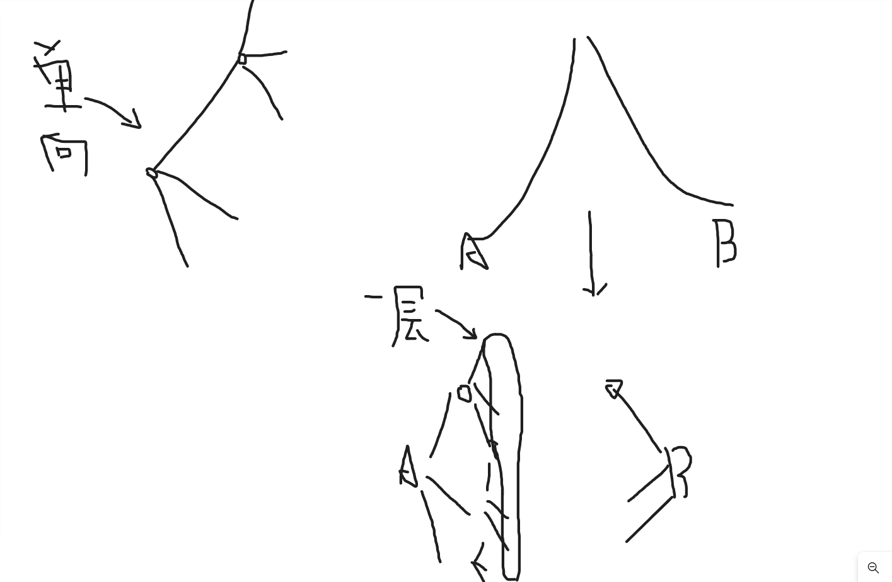
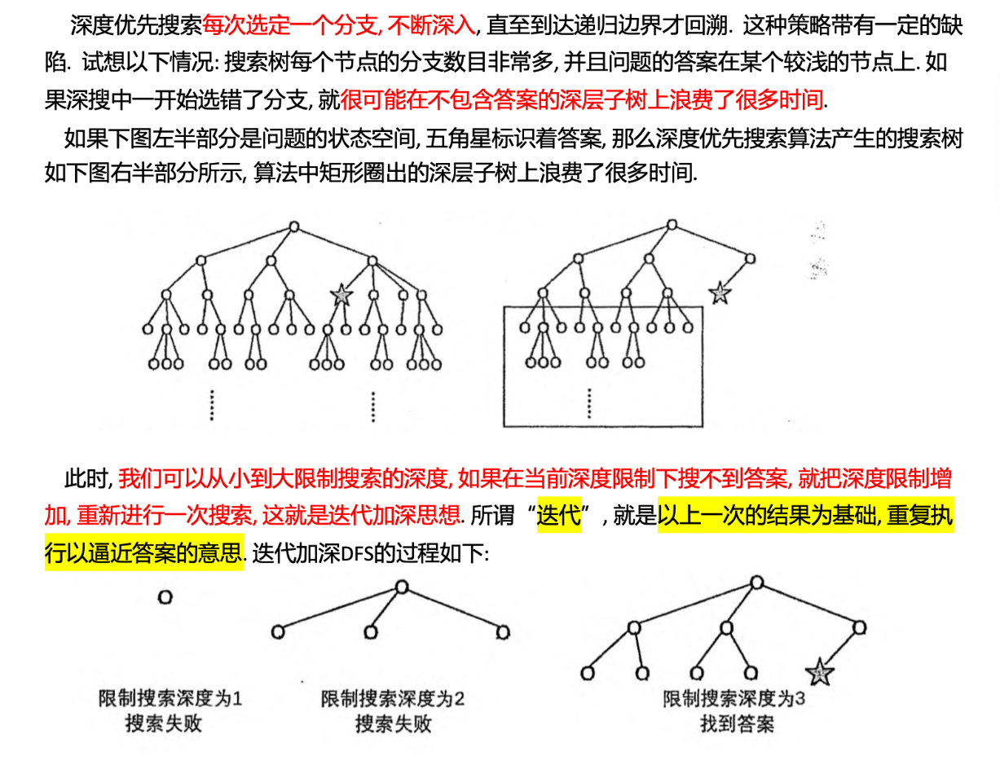
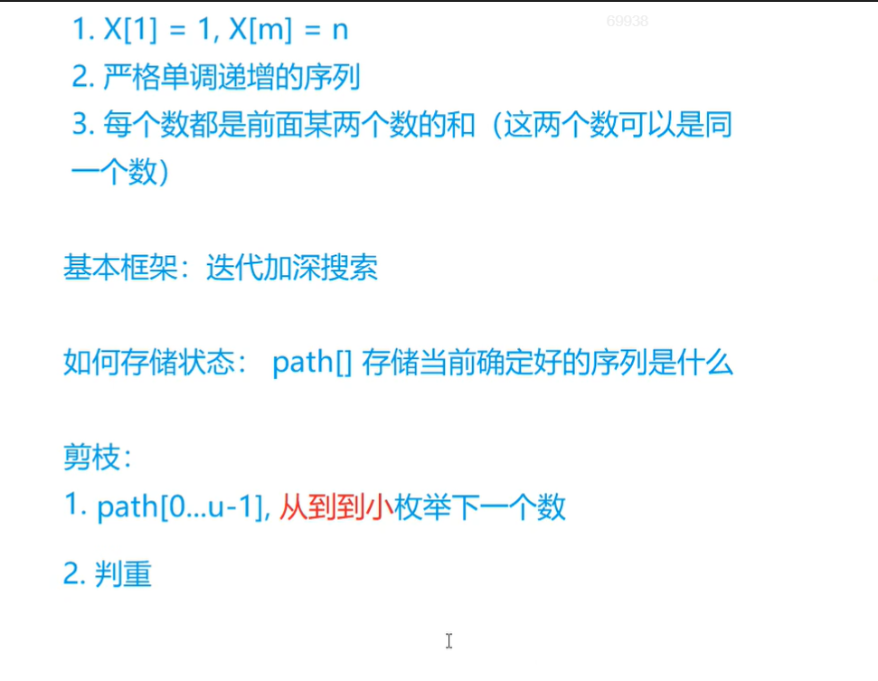
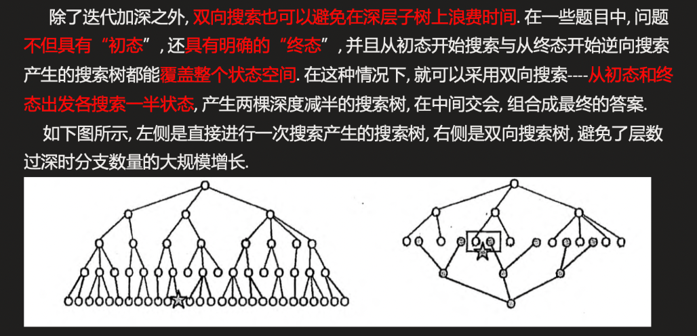

## Flood Fill

​	Flood Fill（泛洪填充）：从一个起始节点开始，把附近与其连通的节点提取出或填充成不同颜色，直到封闭区域内的所有节点都被处理过为止。
是从一个区域中提取若干个连通的点与其他相邻区域区分开(或分别染成不同颜色)的经典算法。

​	可以抽象成一个二维矩阵（图片其实就是像素点矩阵），然后从某个点开始向四周扩展，直到无法再扩展为止。

​	即求连通块问题的算法。
​	
​	具体实现采用BFS或DFS。

​	BFS求解：可以求出最短路或者判断两者是否连通，不存在爆栈的风险，但空间相对用的多一些而且代码相对来说繁琐一些。

​	DFS求解：DFS代码简洁，相对好写一些，但存在爆栈的风险，而且不能求出最短路。
​	(网上查的资料)


### 池塘记数

#### 题目


#### 思路

经典的bfs问题

线性的复杂度,每个点最多被找两遍


#### 代码

```c++
队列实现bfs

#include <bits/stdc++.h>
using namespace std;

int dir[8][2] = {1, 0, 0, 1, -1, 0, 0, -1, 1, 1, 1, -1, -1, 1, -1, -1};
const int N = 1e3 + 10;
char c[N][N];
int res = 0;
int n, m;
queue<pair<int, int>> q;
void bfs(int x, int y)
{

     q.push({x, y});
     c[x][y] = '.';
     while (q.size())
     {

          int sx = q.front().first, sy = q.front().second;
          q.pop();
          c[sx][sy] = '.';

          for (int i = 0; i < 8; i++)
          {
               int nx = sx + dir[i][0];
               int ny = sy + dir[i][1];

               if (nx < 0 || nx >= n || ny < 0 || ny >= m)
                    continue;
               if (c[nx][ny] == '.')
                    continue;

               q.push({nx, ny});
               c[nx][ny] = '.';//在这就要把它变为点,这步不能不要
          }
     }
     res++;
}

int main()
{

     cin >> n >> m;

     for (int i = 0; i < n; i++)
          for (int j = 0; j < m; j++)
          {
               cin >> c[i][j];
          }

     for (int i = 0; i < n; i++)
          for (int j = 0; j < m; j++)
          {
               if (c[i][j] == 'W')
               {
                    bfs(i, j);
               }
          }

     cout << res << endl;
}
```


```c++
手写队列

#include <bits/stdc++.h>
using namespace std;
#define x first
#define y second
int dir[8][2] = {1, 0, 0, 1, -1, 0, 0, -1, 1, 1, 1, -1, -1, 1, -1, -1};
const int N = 1e3 + 10;
const int M = 1e6 + 10;
char c[N][N];
int res = 0;
int n, m;
typedef pair<int, int> PII;
PII q[M];
void bfs(int sx, int sy)
{
     int hh = 0, tt = 0;
     q[0] = {sx, sy};
     c[sx][sy] = '.';

     while (hh <= tt)
     {
          PII t = q[hh++];

          for (int i = 0; i < 8; i++)
          {
               int nx = t.x + dir[i][0];
               int ny = t.y + dir[i][1];

               if (nx < 0 || nx >= n || ny < 0 || ny >= m)
                    continue;
               if (c[nx][ny] == '.')
                    continue;

               q[++tt] = {nx, ny};
               c[nx][ny] = '.';
          }
     }
}

int main()
{

     cin >> n >> m;

     for (int i = 0; i < n; i++)
          for (int j = 0; j < m; j++)
          {
               cin >> c[i][j];
          }

     for (int i = 0; i < n; i++)
          for (int j = 0; j < m; j++)
          {
               if (c[i][j] == 'W')
               {
                    bfs(i, j);
                    res++;
               }
          }
     cout << res;
}
```


### 城堡问题


#### 题目


#### 思路

稍微改了样子的经典bfs.(巧妙的bfs)

本来想着,输入的每个数字都是唯一的(如11就代表着它有着西北南三面墙),从而能在bfs的for循环里,判断下一个走的数字能不能从现在的位置走到,如第二行第一个的数字7,想往上走,发现是11,就知道了它南面有墙,走不到,直接continue.

但是写的时候,意识到想要实现这个思路,就必须要先讨论一遍所有可能出现的数字(11,6,3,10…),太多情况了,写起来会很冗余.

以下高能!(卡在这了 orz)

我们发现它墙是由1,2,4,8来表示的,刚好符合二进制的规则.所以我们直接用位运算就可以判断出这个数字是哪几面墙组成.(如11=>1011,只要这一位是0,代表这一位代表的方位没有墙.)

更巧妙的是,每一个数字都要经过4次位移,这刚好可以和bfs四次for循环判断方位结合起来


<!--对1,2,4,8这类数要敏感-->

#### 代码

```c++

#include <bits/stdc++.h>
using namespace std;
const int N = 55;
int dir[4][2] = {0, 1, 1, 0, 0, -1, -1, 0};
int g[N][N];
int st[N][N];
int n, m;
int area;
void bfs(int sx, int sy)
{
     queue<pair<int, int>> q;
     q.push({sx, sy});
     st[sx][sy] = 1;
     area = 0;
     while (q.size())
     {
          auto t = q.front();
          q.pop();
          area++;
          for (int i = 0; i < 4; i++)
          {
               int nx = t.first + dir[i][0];
               int ny = t.second + dir[i][1];
               if (nx < 0 || nx >= n || ny < 0 || ny >= m)
                    continue;
               if (st[nx][ny])
                    continue;
               if (g[nx][ny] >> i & 1)
                    continue;
                    //假如i=0,我们把dir[0][0/1]对应的方位设置为让现在这个点往东走,而如果这个数字二进制第0位是1的话,代表我们想去的点西面有墙,我们过不去,continue!
                   
               q.push({nx, ny});
               st[nx][ny] = 1;
          }
     }
}
int main()
{
     cin >> n >> m;
     for (int i = 0; i < n; i++)
          for (int j = 0; j < m; j++)
               cin >> g[i][j];
     int ans = 0;
     int num = 0;
     for (int i = 0; i < n; i++)
          for (int j = 0; j < m; j++)
          {
               if (!st[i][j])
               {
                    bfs(i, j);
                    ans = max(ans, area);
                    num++;
               }
          }
     cout << num << endl
          << ans;
}
```


### 山峰和山谷


#### 题目


#### 思路

经典bfs的变形


#### 代码

```c++
#include <bits/stdc++.h>
using namespace std;
const int N = 1e3 + 10;
int dir[8][2] = {1, 0, 0, 1, -1, 0, 0, -1, 1, 1, 1, -1, -1, 1, -1, -1};
int g[N][N];
int st[N][N];
int n;
int num1 = 0, num2 = 0;

void bfs(int sx, int sy)
{

     queue<pair<int, int>> q;
     q.push({sx, sy});
     st[sx][sy] = 1;
     int f = 0;
     int f1 = 0;
     while (q.size())
     {
          auto t = q.front();

          q.pop();
          for (int i = 0; i < 8; i++)
          {
               int nx = t.first + dir[i][0];
               int ny = t.second + dir[i][1];

               if (nx < 0 || nx >= n || ny < 0 || ny >= n)
                    continue;

               if (g[nx][ny] != g[sx][sy])
               {
                    if (g[nx][ny] < g[sx][sy])
                    {
                         if (f == 2)
                              f1 = 1;
                         f = 1;
                    }
                    else
                    {
                         if (f == 1)
                              f1 = 1;
                         f = 2;
                    }
                    continue;
               }
               if (st[nx][ny])
                    continue;
               q.push({nx, ny});
               st[nx][ny] = 1;
          }
     }
     if (f1)
          return;
     if (f == 1)
          num1++;

     else if (f == 2)
          num2++;

     else if (f == 0)
          num1++, num2++;
}

int main()
{

     cin >> n;

     for (int i = 0; i < n; i++)
          for (int j = 0; j < n; j++)
               cin >> g[i][j];

     for (int i = 0; i < n; i++)
          for (int j = 0; j < n; j++)
          {
               if (!st[i][j])
                    bfs(i, j);
                    }
     cout << num1 << ' ' << num2;
}
```


## 最短路问题


### 迷宫问题

#### 题目


#### 思路

简单的bfs求最短路,再加上考察了一个输出走过的路径


#### 代码

```c++

#include <bits/stdc++.h>
using namespace std;
const int N = 1010;
int a[N][N];
int st[N][N];
pair<int, int> pre[N][N];
vector<pair<int, int>> ans;
int dir[4][2] = {1, 0, -1, 0, 0, 1, 0, -1};
int n;
void bfs(int x, int y)
{
     queue<pair<int, int>> q;
     q.push({x, y});
     st[x][y] = 1;
     while (q.size())
     {
          auto t = q.front();
          q.pop();
          int sx = t.first, sy = t.second;
          for (int i = 0; i < 4; i++)
          {
               int nx = sx + dir[i][0];
               int ny = sy + dir[i][1];
               if (nx < 0 || nx >= n || ny < 0 || ny >= n)
                    continue;
               if (st[nx][ny])
                    continue;
               if (a[nx][ny] == 1)
                    continue;
               pre[nx][ny] = {sx, sy};
               if (nx == n - 1 && ny == n - 1)
                    return;

               q.push({nx, ny});
               st[nx][ny] = 1;
          }
     }
}

int main()
{

     cin >> n;
     for (int i = 0; i < n; i++)
          for (int j = 0; j < n; j++)
               cin >> a[i][j];

     bfs(0, 0);

     int x = n - 1, y = n - 1;
     ans.push_back({n - 1, n - 1});

     while (x != 0 || y != 0)
     {
          int x1, y1; //这里要加一个临时变量,不能直接把值赋给x,y.因为前面x会变,变了后,后面的y的值就不是原来的pre[x][y].second了
          x1 = pre[x][y].first, y1 = pre[x][y].second;
          x = x1, y = y1;
          ans.push_back({x, y});
     }

     reverse(ans.begin(), ans.end());
     for (int i = 0; i < ans.size(); i++)
          cout << ans[i].first << ' ' << ans[i].second << endl;
}

```


```c++

//手写队列,时间快了一倍左右

#include <cstring>
#include <iostream>
#include <algorithm>

#define x first
#define y second

using namespace std;

typedef pair<int, int> PII;

const int N = 1010, M = N * N;

int n;
int g[N][N];
PII q[M];
PII pre[N][N];

void bfs(int sx, int sy)
{
    int dx[4] = {-1, 0, 1, 0}, dy[4] = {0, 1, 0, -1};

    int hh = 0, tt = 0;
    q[0] = {sx, sy};

    memset(pre, -1, sizeof pre);
    pre[sx][sy] = {0, 0};
    while (hh <= tt)
    {
        PII t = q[hh ++ ];

        for (int i = 0; i < 4; i ++ )
        {
            int a = t.x + dx[i], b = t.y + dy[i];
            if (a < 0 || a >= n || b < 0 || b >= n) continue;
            if (g[a][b]) continue;
            if (pre[a][b].x != -1) continue;

            q[ ++ tt] = {a, b};
            pre[a][b] = t;
        }
    }
}

int main()
{
    scanf("%d", &n);

    for (int i = 0; i < n; i ++ )
        for (int j = 0; j < n; j ++ )
            scanf("%d", &g[i][j]);

    bfs(n - 1, n - 1);

    PII end(0, 0);

    while (true)
    {
        printf("%d %d\n", end.x, end.y);
        if (end.x == n - 1 && end.y == n - 1) break;
        end = pre[end.x][end.y];
    }

    return 0;
}

```


### 武士风度的牛


#### 题目


#### 思路

经典bfs求最短路(只不过走法不是向上走一格,向下走一格...),加上了要输出路径长度


#### 代码


```c++
用上一题记录路径的方法,来计算步数

#include <bits/stdc++.h>
using namespace std;
const int N = 160;
char g[N][N];
int st[N][N];
int dir[8][2] = {2, 1, 2, -1, -2, 1, -2, -1, 1, 2, 1, -2, -1, 2, -1, -2};
int n, m;
int step = 0;
pair<int, int> pre[N][N];
void bfs(int x, int y)
{
     queue<pair<int, int>> q;
     q.push({x, y});
     st[x][y] = 1;
     while (q.size())
     {
          auto t = q.front();
          q.pop();
          int sx = t.first, sy = t.second;
          for (int i = 0; i < 8; i++)
          {
               int nx = sx + dir[i][0];
               int ny = sy + dir[i][1];
               if (nx < 0 || nx >= n || ny < 0 || ny >= m)
                    continue;
               if (st[nx][ny])
                    continue;
               if (g[nx][ny] == '*')
                    continue;
               pre[nx][ny] = {sx, sy};
               if (g[nx][ny] == 'H')
                    return;

               q.push({nx, ny});
               st[nx][ny] = 1;
          }
     }
}

int main()
{

     cin >> m >> n;
     int x1, y1, ex, ey;
     for (int i = 0; i < n; i++)
          for (int j = 0; j < m; j++)
          {
               cin >> g[i][j];
               if (g[i][j] == 'K')
                    x1 = i, y1 = j;
               if (g[i][j] == 'H')
                    ex = i, ey = j;
          }
     bfs(x1, y1);

     int x = ex, y = ey;
     while (x != x1 || y != y1)
     {
          int x2, y2;
          x2 = pre[x][y].first, y2 = pre[x][y].second;

          x = x2, y = y2;
          step++;
     }
     cout << step;
}
```


```c++
直接用dist数组存储步数

#include <cstring>
#include <iostream>
#include <algorithm>

#define x first
#define y second

using namespace std;

typedef pair<int, int> PII;

const int N = 155, M = N * N;

int n, m;
char g[N][N];
PII q[M];
int dist[N][N];

int bfs()
{
    int dx[] = {-2, -1, 1, 2, 2, 1, -1, -2};
    int dy[] = {1, 2, 2, 1, -1, -2, -2, -1};

    int sx, sy;
    for (int i = 0; i < n; i ++ )
        for (int j = 0; j < m; j ++ )
            if (g[i][j] == 'K')
                sx = i, sy = j;

    int hh = 0, tt = 0;
    q[0] = {sx, sy};

    memset(dist, -1, sizeof dist);
    dist[sx][sy] = 0;

    while (hh <= tt)
    {
        auto t = q[hh ++ ];

        for (int i = 0; i < 8; i ++ )
        {
            int a = t.x + dx[i], b = t.y + dy[i];
            if (a < 0 || a >= n || b < 0 || b >= m) continue;
            if (g[a][b] == '*') continue;
            if (dist[a][b] != -1) continue;
            if (g[a][b] == 'H') return dist[t.x][t.y] + 1;

            dist[a][b] = dist[t.x][t.y] + 1;
            q[ ++ tt] = {a, b};
        }
    }

    return -1;
}

int main()
{
    cin >> m >> n;

    for (int i = 0; i < n; i ++ ) cin >> g[i];

    cout << bfs() << endl;

    return 0;
}


```


### 抓住那头牛


#### 题目


#### 思路

emm,本题要是没有看标签,可能想不到要用bfs来解,好神奇23333.

和bfs经典求最短路的唯一区别是: 每一个点去往下一个点都有3种可能:+1,-1,*2.而bfs经典求最短路里的每个点可以去往上下左右四个点.我们每讨论一个点,把它从队列里取出来`q.front()`,再把它能走到的其他三个点放入队列,然后`q.pop()`,接着继续取点.

还要用st数组记录一下走过的x值,走过的要是再碰到就不用管了.因为本题输出的是最小花销,先碰到的点绝对比后碰到的花销要小。

其实本来看到一个点有三种可能去处的时候，想到的是dfs，但本题要求的是最短路，就用了bfs。


#### 代码

```c++

#include <bits/stdc++.h>
using namespace std;
const int Max = 1e5 + 10;
int N, K;
int st[Max], dist[Max];
void bfs(int x)
{
     queue<int> q;
     q.push(x);
     st[x] = 1;
     while (q.size())
     {
          int t = q.front();
          q.pop();
          for (int i = 0; i < 3; i++)
          {
               int nx;
               if (i == 0)
                    nx = t + 1;
               if (i == 1)
                    nx = t - 1;
               if (i == 2)
                    nx = t * 2;
               if (st[nx])
                    continue;
               if (nx < 0 || nx > Max)
                    continue;

               dist[nx] = dist[t] + 1;
               if (nx == K)
                    return;

               q.push(nx);
               st[nx] = 1;
          }
     }
}

int main()
{
     cin >> N >> K;
     bfs(N);
     cout << dist[K];
}

```


```c++
或者不用for循环表示三种状态，而是一次就全写出来

#include <cstring>
#include <iostream>
#include <algorithm>

using namespace std;

const int N = 1e5 + 10;

int n, k;
int q[N];
int dist[N];

int bfs()
{
    memset(dist, -1, sizeof dist);
    dist[n] = 0;
    q[0] = n;

    int hh = 0, tt = 0;

    while (hh <= tt)
    {
        int t = q[hh ++ ];

        if (t == k) return dist[k];

        if (t + 1 < N && dist[t + 1] == -1)
        {
            dist[t + 1] = dist[t] + 1;
            q[ ++ tt] = t + 1;
        }
        if (t - 1 >= 0 && dist[t - 1] == -1)
        {
            dist[t - 1] = dist[t] + 1;
            q[ ++ tt] = t - 1;
        }
        if (t * 2 < N && dist[t * 2] == -1)
        {
            dist[t * 2] = dist[t] + 1;
            q[ ++ tt] = t * 2;
        }
    }

    return -1;
}

int main()
{
    cin >> n >> k;

    cout << bfs() << endl;

    return 0;
}

作者：yxc
```


## 多源BFS

​	给出n个点，再给一个集合,集合里面包含了这n个点的一部分点,现在要求出这n个点(所有)到这点的集合的最短距离。(最短距离就是假如一个点x，它到集合中每个点的距离是d1,d2,d3,d4……,那么点x到集合的最短距离就是d1,d2,d3这些距离的最小值)


### 矩阵距离

#### 题目


#### 思路

​	题目大意是矩阵中每一个位置到所有1的最短距离。(所有的1就是上面所说的点的集合)

​	要是直接用bfs求解，把每个1当作起点，遍历一遍全图，给每个位置附上距离(保留最小)，肯定会超时，因为复杂度是n^4^

​	多源bfs算法写起来比较简单，和普通bfs的区别就在于要先遍历一遍矩阵，把所有为1的点先存入队列，然后再进行`while(q.size())`。复杂度是n^2^。

证明可以结合以下图片和代码进行理解:


​	如上图这个矩阵，1的位置如图分布，我们先把1都存入队列，然后开始遍历每个1的四周，给其它点附上距离，要是碰到这个点已经有距离了，直接跳过，因为代表肯定有1个1离这个点的距离比你更近！！这样遍历完全图退出bfs，每个点遍历一遍，


#### 代码

```c++

#include <bits/stdc++.h>
using namespace std;
const int N = 1100;
int dir[4][2] = {0, 1, 1, 0, 0, -1, -1, 0};
char g[N][N];
int st[N][N], dist[N][N];
int n, m;
queue<pair<int, int>> q;

void bfs()
{
     while (q.size())
     {
          auto t = q.front();
          q.pop();
          for (int i = 0; i < 4; i++)
          {
               int x = t.first, y = t.second;
               int nx = x + dir[i][0];
               int ny = y + dir[i][1];
               if (nx < 0 || nx >= n || ny < 0 || ny >= m)
                    continue;
               if (st[nx][ny])
                    continue;
               if (g[nx][ny] == '1')
                    continue;
               dist[nx][ny] = dist[x][y] + 1;
               q.push({nx, ny});
               st[nx][ny] = 1;
          }
     }
}
int main()
{
     cin >> n >> m;
     for (int i = 0; i < n; i++)
          for (int j = 0; j < m; j++)
               cin >> g[i][j];

     for (int i = 0; i < n; i++)
          for (int j = 0; j < m; j++)
          {
               if (g[i][j] == '1')
               {
                    q.push({i, j});
                    st[i][j] = 1;
               }
          }
     bfs();
     for (int i = 0; i < n; i++)
     {
          for (int j = 0; j < m; j++)
          {
               cout << dist[i][j] << ' ';
          }
          cout << endl;
     }
}
```

```c++
手写队列

#include <cstring>
#include <iostream>
#include <algorithm>

#define x first
#define y second

using namespace std;

typedef pair<int, int> PII;

const int N = 1010, M = N * N;

int n, m;
char g[N][N];
PII q[M];
int dist[N][N];

void bfs()
{
    int dx[4] = {-1, 0, 1, 0}, dy[4] = {0, 1, 0, -1};

    memset(dist, -1, sizeof dist);

    int hh = 0, tt = -1;
    for (int i = 1; i <= n; i ++ )
        for (int j = 1; j <= m; j ++ )
            if (g[i][j] == '1')
            {
                dist[i][j] = 0;
                q[ ++ tt] = {i, j};
            }

    while (hh <= tt)
    {
        auto t = q[hh ++ ];

        for (int i = 0; i < 4; i ++ )
        {
            int a = t.x + dx[i], b = t.y + dy[i];
            if (a < 1 || a > n || b < 1 || b > m) continue;
            if (dist[a][b] != -1) continue;

            dist[a][b] = dist[t.x][t.y] + 1;
            q[ ++ tt] = {a, b};
        }
    }
}

int main()
{
    scanf("%d%d", &n, &m);
    for (int i = 1; i <= n; i ++ ) scanf("%s", g[i] + 1);

    bfs();

    for (int i = 1; i <= n; i ++ )
    {
        for (int j = 1; j <= m; j ++ ) printf("%d ", dist[i][j]);
        puts("");
    }

    return 0;
}


```


## 最小步数模型

​	我们之前用的bfs和dfs,都是一张表格或者一块面积,里面一个点在向旁边移动,去求a点到b点的最短路径... 而本题,是整张图的变化,这时我们把整张图当做一个点(把一个棋盘看做一个状态，求从状态a到状态b的最小步数),每变化一次就衍生出另外一个点:最小步数模型.

​	八数码也是最小步数模型题目.

​	这种题一般思路简单,但是用代码表示比较困难,和dp相反.


### 魔板


#### 题目


#### 思路


​	题目所给初始状态是:"12345678",问你要几步能转换到题目所给样例,采用最小步数模型的bfs宽搜:


​	一般都是用哈希表来存储表示每步的状态(map)

​	

​	而关于本题字典序最小的路径问题： 

​	一般来说，输出最字典序最小或者最大的路径不会增加题目的难度和复杂度。出题者因为懒，不搞speci judge，让我们输出唯一的答案，搞了这么一出。
​	做法:我们按照bfs原本的顺序执行操纵，不需要增加多余的代码，就可以实现最小的字典序，只需要每次先搜索字典序最小的操作就行(本题先用A操作,再B操作,最后C操作).


​	输出路径:

```c++
while (end != Start)	
     {
          res += pre[end].first;
          end = pre[end].second;
     }
```


​	但这个时间复杂度是多少呢?


#### 代码

```c++
#include <bits/stdc++.h>
using namespace std;
char g[2][4];
unordered_map<string, pair<char, string>> pre;//存储string的状态前驱:chars:上一步操作,string:上一步的状态
unordered_map<string, int> dist;//存储到达这个string的花费

void Set(string state)//字符串恢复成2*4矩阵
{
     for (int i = 0; i < 4; i++)
          g[0][i] = state[i];
     for (int i = 7, j = 0; j < 4; i--, j++)
          g[1][j] = state[i];
}

string get()	//矩阵->字符串
{
     string res;
     for (int i = 0; i < 4; i++)
          res += g[0][i];
     for (int i = 3; i >= 0; i--)
          res += g[1][i];
     return res;
}

string move0(string state)
{
     Set(state);
     for (int i = 0; i < 4; i++)
          swap(g[0][i], g[1][i]);
     return get();
}

string move1(string state)
{
     Set(state);
     int v0 = g[0][3], v1 = g[1][3];
     for (int i = 3; i >= 0; i--)
     {
          g[0][i] = g[0][i - 1];
          g[1][i] = g[1][i - 1];
     }
     g[0][0] = v0, g[1][0] = v1;
     return get();
}

string move2(string state)
{
     Set(state);
     int v = g[0][1];
     g[0][1] = g[1][1];
     g[1][1] = g[1][2];
     g[1][2] = g[0][2];
     g[0][2] = v;
     return get();
}

int bfs(string Start, string end)//bfs
{
     if (Start == end)
          return 0;

     queue<string> q;
     q.push(Start);
     dist[Start] = 0;

     while (!q.empty())
     {
          auto t = q.front();
          q.pop();

          string m[3];
          m[0] = move0(t);
          m[1] = move1(t);
          m[2] = move2(t);

          for (int i = 0; i < 3; i++)
               if (!dist.count(m[i]))	//去重
               {
                    dist[m[i]] = dist[t] + 1;
                    pre[m[i]] = {'A' + i, t};
                    q.push(m[i]);
                    if (m[i] == end)
                         return dist[end];
               }
     }

     return -1;
}

int main()
{
     string Start, end;
     for (int i = 0; i < 8; i++)
     {
          char x;
          cin >>
              x;
          end += x;
     }
     Start = "12345678";

     int step = bfs(Start, end);

     cout << step << endl;

     string res;
     while (end != Start)	//输出路径
     {
          res += pre[end].first;
          end = pre[end].second;
     }

     reverse(res.begin(), res.end());

     if (step > 0)
          cout << res << endl;

     return 0;
}

```


## 双端队列广搜


### 电路维修


#### 思路

​	本题题意是:能把每一个格子的线段旋转位置,问你最少旋转几次,能让起点到达终点(像之前玩的小游戏)

​	把题目意思转换一下,假如0,0(起点)能直接走到1,1,那么我们就把这段路抽象成一条边权为0的边,要是必须旋转一下才能走到1,1,那么这段路就抽象成一条边权为1的边,现在就等于问你,从起点走到终点,最小花费是多少.

​	这道题可以采用dij来写(可能会超时),也可以采用双端队列bfs来写,双端队列bfs就是处理这种边权只为0和1的题目,它和普通bfs的区别就在于,当你边权为0,存对头里,边权为1,存队尾里,一般bfs求最短路只能求解边权一样的情况.(双端队列其实就是dij特殊情况,复杂度低一点)

​	这道题其实就是dijkstra算法的特殊情况。(因为本题的边权只有0和1两种).然后，dijkstra的流程，就是先把源点放入优先队列，接下来重复以下操作(取出队列中距离源点最近的点—优先队列的队头，用该点更新其它与该点相邻的点的距离，再把更新后的距离放入队列)。
​	每个点在出队的时候就说明从源点到该点的最短距离已经找到，因此要对这个点进行标记，后续计算时忽略该点。

​	本题也是一样，先把左上方的(0，0)点放入队列中，然后接着操作。
​	但是本题用的数据结构并不是优先队列，而是双端队列，为了实现和优先队列相同的效果，当边权重是零的时候，就把新的点从队列头插入，是一的时候，就从队列尾部插入。这样可以保证该队列从头部到尾部，是单调不下降的。这样，就从本质上实现了dijkstra算法。

​	

​	y总在视频里用两段性和单调性证明了为什么bfs可求最短路.


​	细节:

本题有两个位置偏移量,可能不大好理解:


`int dir1[4][2] = {-1, -1, -1, 1, 1, 1, 1, -1};`

这就是正常的假如你此时在(1,2)(蓝色字迹),可以前往(0,1),(0,3),(2,1),(2,3)四个点

`int dir2[4][2] = {-1, -1, -1, 0, 0, 0, 0, -1};`

这是用来表示此时电线的状态,假如你要从1,2走到0,3.那么格子的电线必须是'/'才行,这时候我们就需要判断给你的字符二维数组里的这个位置是不是也是'/'.而从1,2走到0,3所要走的电线对应在字符数组里的位置就是(0,2)(红笔标注),所以`(a[ix][iy] 是否等于 c[i])	,` `char c[] = "\\/\\/";`c数组存储的是理想状态,a就是现实状态,判断他们是否相等来得到是否要旋转电线.


#### 代码

时间复杂度 O(nm)

```c++
#include <bits/stdc++.h>
using namespace std;
const int N = 500 + 10;
char a[N][N];
int n, m;
char c[] = "\\/\\/";
int dir1[4][2] = {-1, -1, -1, 1, 1, 1, 1, -1};
int dir2[4][2] = {-1, -1, -1, 0, 0, 0, 0, -1};
int dis[N][N];
int main()
{
     int t;
     cin >> t;
     while (t--)
     {

          cin >> n >> m;
          for (int i = 0; i < n; i++)
               for (int j = 0; j < m; j++)
               {
                    cin >> a[i][j];
               }
          memset(dis, 0x3f, sizeof dis);
          deque<pair<int, int>> q;
          q.push_front({0, 0});
          dis[0][0] = 0;
          while (q.size())
          {
               auto t = q.front();
               q.pop_front();
               for (int i = 0; i < 4; i++)
               {
                    int nx = t.first + dir1[i][0], ny = t.second + dir1[i][1];
                    if (nx < 0 || nx > n || ny < 0 || ny > m)
                         continue;
                    int ix = t.first + dir2[i][0], iy = t.second + dir2[i][1];
                    int d = dis[t.first][t.second] + (a[ix][iy] != c[i]); //(a[ix][iy] != c[i])判断走这一步要不要旋转电线

                    if (d < dis[nx][ny])
                    {
                         dis[nx][ny] = d;
                         if (a[ix][iy] == c[i])
                              q.push_front({nx, ny});
                         else
                              q.push_back({nx, ny});
                    }
               }
          }
          if (dis[n][m] == 0x3f3f3f3f)
               puts("NO SOLUTION");
          else
               cout << dis[n][m] << endl;//最后还是输出d[n][m],虽然我们初始是[0,n)来存取数组,但那是代表格子的位置,真实的起点是(0,0),终点是(n,m)
     }
}
```

​	

```c++
//y总
//大致一样,但其实不用判重,由于距离变小才能进入队列，因此之前的点不会进入再次队列中
#include <cstring>
#include <iostream>
#include <algorithm>
#include <deque>

#define x first
#define y second

using namespace std;

typedef pair<int, int> PII;

const int N = 510, M = N * N;

int n, m;
char g[N][N];
int dist[N][N];
bool st[N][N];

int bfs()
{
    memset(dist, 0x3f, sizeof dist);
    memset(st, 0, sizeof st);
    dist[0][0] = 0;
    deque<PII> q;
    q.push_back({0, 0});

    char cs[] = "\\/\\/";
    int dx[4] = {-1, -1, 1, 1}, dy[4] = {-1, 1, 1, -1};
    int ix[4] = {-1, -1, 0, 0}, iy[4] = {-1, 0, 0, -1};

    while (q.size())
    {
        PII t = q.front();
        q.pop_front();

        if (st[t.x][t.y]) continue;
        st[t.x][t.y] = true;

        for (int i = 0; i < 4; i ++ )
        {
            int a = t.x + dx[i], b = t.y + dy[i];
            if (a < 0 || a > n || b < 0 || b > m) continue;

            int ca = t.x + ix[i], cb = t.y + iy[i];
            int d = dist[t.x][t.y] + (g[ca][cb] != cs[i]);

            if (d < dist[a][b])
            {
                dist[a][b] = d;

                if (g[ca][cb] != cs[i]) q.push_back({a, b});
                else q.push_front({a, b});
            }
        }
    }

    return dist[n][m];
}

int main()
{
    int T;
    scanf("%d", &T);
    while (T -- )
    {
        scanf("%d%d", &n, &m);
        for (int i = 0; i < n; i ++ ) scanf("%s", g[i]);

        int t = bfs();

        if (t == 0x3f3f3f3f) puts("NO SOLUTION");
        else printf("%d\n", t);
    }

    return 0;
}

```


## 双向广搜

​	用来求最短路，是普通BFS求最短路模型的优化，通过每次向不同的方向扩展(一个是从起点往终点搜，还有一个是从终点向起点搜，如果两个队列中有相同的则说明走通)，让搜索空间缩小，提高搜索效率


### 字串变换


#### 思路

(BFS,双向BFS) O((LN)^5^)
	假如有K次变化方式，那么如果直接BFS，最坏情况下的搜索空间是 K^10^(每次k个)，非常大，所以会TLE或者MLE。



​	如果采用双向BFS，则可以把搜索空间降到 2K^5^。在实际测试中只需 20ms 左右，剪枝效果很好。

​	扩展(子串变换)方式是：分别枚举在原字符串中使用替换规则的起点，和所使用的的替换规则,每一次扩展要把一层(队列里的所有字符串)都扩展开

​	时间复杂度
​	假设字符串长度是 L，替换规则一共有 N 个，则：

​	在最坏情况下每次会从字符串的每个位置开始，使用全部的 N 种替换规则，因此总共会有 LN 种扩展方式，从起点和终点最多会分别扩展5步，因此总搜索空间是 2(LN)^5^。

​	在BFS过程中，空间中的每个状态只会被遍历一次，因此时间复杂度是 O((LN)^5^)。


#### 代码

```c++
#include <iostream>
#include <cstring>
#include <algorithm>
#include <queue>
#include <unordered_map>

using namespace std;

const int N = 6;

int n;
string A, B;
string a[N], b[N];

int extend(queue<string> &q, unordered_map<string, int> &da, unordered_map<string, int> &db,
           string a[N], string b[N])
{
     int d = da[q.front()];
     while (q.size() && da[q.front()] == d) //一次扩展就要扩展一层,把队列里现有的字符串的都扩展一遍
     {
          auto t = q.front();
          q.pop();

          for (int i = 0; i < n; i++)             //枚举所有变换状态
               for (int j = 0; j < t.size(); j++) //使用第i种替换状态对字符串进行替换
                    if (t.substr(j, a[i].size()) == a[i])
                    {
                         string r = t.substr(0, j) + b[i] + t.substr(j + a[i].size());
                         if (db.count(r))               //要是qb里有,代表找到了
                              return da[t] + db[r] + 1; //输出花费(距离和)
                         if (da.count(r))
                              continue;
                         da[r] = da[t] + 1;
                         q.push(r);
                    }
     }

     return 11;
}

int bfs()
{
     if (A == B)
          return 0;
     queue<string> qa, qb;//定义队列,存储A/B扩展出的某一层的所有字符串
     unordered_map<string, int> da, db; //定义距离

     qa.push(A), qb.push(B);//初始就是A和B
     da[A] = db[B] = 0;

     int step = 0;
     while (qa.size() && qb.size())
     {
          int t;
          if (qa.size() < qb.size())         //哪个短就先扩展哪个,稍微节约时间
               t = extend(qa, da, db, a, b); //一次扩展,对队列里的每个字符串都进行变换操作
          else
               t = extend(qb, db, da, b, a); //一次扩展

          if (t <= 10)
               return t;
          if (++step == 10) //扩展了10步还没有找到解,输出-1
               return -1;
     }

     return -1;
}

int main()
{
     cin >> A >> B;
     while (cin >> a[n] >> b[n]) //题目没告诉你如何终止
          n++;

     int t = bfs();
     if (t == -1)
          puts("NO ANSWER!");
     else
          cout << t << endl;

     return 0;
}

```


## A*

​	和dij长得类似

​	为启发式算法，可以看成是堆优化版dijkstra算法的升级，增添了一个估价函数(这个估价函数的值应该小于等于真实值)，通过将现在已经走过的路程和估价函数相加，利用最小堆即可实现,而堆优化版的dijkstra算法可以看成是估价函数为0的A*算法


## DFS之连通性模型


### 迷宫


#### 思路


​	本题较为简单,dfs模板题(bfs也可以写). 

​	只要判断能不能走到终点就可以,不用输出花费

​	不回溯

​	dfs返回值:bool

​	时间复杂度是o(n^2^)么,每个点只走一次


#### 代码

```c++
#include <bits/stdc++.h>
using namespace std;
const int N = 110;
char a[N][N];
int n;
int dir[4][2] = {1, 0, -1, 0, 0, 1, 0, -1};
int st[N][N];
int sx, sy, ex, ey;
bool dfs(int x, int y) //返回bool类型
{
     if (x == ex && y == ey)
          return 1;
     st[x][y] = 1; //防止走之前走过的路(点),陷入循环
     for (int i = 0; i < 4; i++)
     {
          int nx = x + dir[i][0], ny = dir[i][1] + y;
          if (nx < 0 || nx >= n || ny < 0 || ny >= n)
               continue;
          if (a[nx][ny] == '#' || st[nx][ny] == 1)
               continue;
         
          st[nx][ny] = 1;
          if (dfs(nx, ny))
               return 1;
     }
     return 0;
}

int main()
{
     int t;
     cin >> t;
     while (t--)
     {
          cin >> n;
          for (int i = 0; i < n; i++)
               for (int j = 0; j < n; j++)
                    cin >> a[i][j];
          memset(st, 0, sizeof st);
          cin >> sx >> sy >> ex >> ey;

          if (a[sx][sy] == '#' || a[ex][ey] == '#')
               cout << "NO" << endl;
          else
          {
               if (dfs(sx, sy))
                    cout << "YES" << endl;
               else
                    cout << "NO" << endl;
          }
     }
}

```


### 红与黑


#### 思路

​	与上题类似,注意输入格式


#### 代码

```c++
#include <bits/stdc++.h>
#include <bits/stdc++.h>
using namespace std;
const int N = 110;
char a[N][N];
int n, m;
int dir[4][2] = {1, 0, -1, 0, 0, 1, 0, -1};
int st[N][N];
int sx, sy, ex, ey;
int Sum = 1;
void dfs(int x, int y) //返回bool类型
{
     st[x][y] = 1; //防止走之前走过的路(点),陷入循环
     for (int i = 0; i < 4; i++)
     {
          int nx = x + dir[i][0], ny = dir[i][1] + y;
          if (nx < 0 || nx >= n || ny < 0 || ny >= m)
               continue;
          if (a[nx][ny] == '#' || st[nx][ny] == 1)
               continue;

          st[nx][ny] = 1;
          Sum++;
          dfs(nx, ny);
     }
     return;
}

int main()
{

     while (cin >> m >> n, m || n)
     {
          for (int i = 0; i < n; i++)
               for (int j = 0; j < m; j++)
                    cin >> a[i][j];
          for (int i = 0; i < n; i++)
               for (int j = 0; j < m; j++)
               {
                    if (a[i][j] == '@')
                         sx = i, sy = j;
               }
          memset(st, 0, sizeof st);

          dfs(sx, sy);
          cout << Sum << endl;
          Sum = 1;
     }
}

```


## DFS之搜索顺序


### 马走日

题目

马在中国象棋以日字形规则移动。

请编写一段程序，给定 n∗m 大小的棋盘，以及马的初始位置 (x，y)，要求不能重复经过棋盘上的同一个点，计算马可以有多少途径遍历棋盘上的所有点。


输入格式

第一行为整数 T，表示测试数据组数。

每一组测试数据包含一行，为四个整数，分别为棋盘的大小以及初始位置坐标 n,m,x,y。

输出格式

每组测试数据包含一行，为一个整数，表示马能遍历棋盘的途径总数，若无法遍历棋盘上的所有点则输出 0。


数据范围

1≤T≤9,1≤m,n≤9,
0≤x≤n−1,0≤y≤m−1


输入样例：

```
1
5 4 0 0
```

输出样例：

```
32
```


#### 思路

dfs模板题,请注意回溯的细节

本题要回溯,并且因为是讨论所有路线,所以题目所给数据较小,但也运行了很长时间:三千ms


#### 代码

```c++
#include <bits/stdc++.h>
using namespace std;
const int N = 10;
int dir[8][2] = {2, 1, 2, -1, -2, 1, -2, -1, 1, -2, 1, 2, -1, 2, -1, -2};
int n, m, sx, sy;
int st[N][N];
int Sum = 0;
void dfs(int x, int y, int num)
{
     //如果这里加上st[x][y]=1,则最后也要把它回溯成0
     if (num == n * m)
     {
          Sum++;
          return;
     }

     for (int i = 0; i < 8; i++)
     {
          int nx = x + dir[i][0], ny = dir[i][1] + y;
          if (nx < 0 || nx >= n || ny < 0 || ny >= m)
               continue;
          if (st[nx][ny])
               continue;
          st[nx][ny] = 1;
          dfs(nx, ny, num + 1); //必须num+1,不能++
          st[nx][ny] = 0;       //回溯,当运行到这一句的时候,代表一条路线讨论完了(可能走通,可能没走通)
     }
}
int main()
{
     int t;
     cin >> t;
     while (t--)
     {
          cin >> n >> m >> sx >> sy;
          memset(st, 0, sizeof st);
          st[sx][sy] = 1; //这句不能忘
          dfs(sx, sy, 1);
          cout << Sum << endl;
          Sum = 0;
     }
}
```


### 单词接龙


### 分成互质组


#### 思路

​	本题数据量较小,采用爆搜的方法,搜索出所有的分组方案,选取组数最小的方案数(剪枝),np完全问题.

​	本题搜索方法之前没遇过,这个搜索方法目的是使得分的组数尽可能少

​	方法:

​	分支方法:第一个数放在第一组,然后取下一个数,先判断它能不能放入之前存在的组(第一组..),行的话在这就可以进行一次dfs,进行深度讨论(分支):1:把这个数放入第一组,取第三个数,2:给第二个数新开一组,把它放入新一组里...


#### 代码

```c++
//和y总代码有点不同,我这写法与下一题小猫爬山雷同
//小数据,直接爆搜
#include <iostream>
#include <vector>
#include <algorithm>
using namespace std;

const int N = 15;
vector<int> g[N];
int nums[N];
int ans = N;
int n;

int gcd(int a, int b)
{
     return b ? gcd(b, a % b) : a;
}

bool check(vector<int> &vec, int x) //检测这个数和这个组是否互质
{
     for (int i = 0; i < vec.size(); i++)
          if (gcd(vec[i], x) > 1)
               return false;
     return true;
}


// u是当前处理到序列的下标，used是目前使用到的组数
void dfs(int u, int used)
{
     // 剪枝：如果当前使用的组已经>=目前获得的最优解，停止当前分支的搜索
     if (used >= ans)
          return;

     if (u >= n)
     {
          ans = min(ans, used + 1);
          return;
     }

    
     // 先在已经使用的组里面找，看看能不能插进去,但即使能不能插的进去都要再试着放入新的组里找,可能虽然这两个个数互质,但把他们放一起并非最佳方案
     for (int i = 0; i <= used; i++)
     {
          if (check(g[i], nums[u]))
          {
               g[i].push_back(nums[u]);
               dfs(u + 1, used);
               g[i].pop_back(); //回溯
          }
     }

	//放入新的组    
     // 剪枝：因为n个数最多只放进n个组，所以只要总组数<=n，允许尝试放进新的组
     if (used + 1 <= n)
     {
          g[used + 1].push_back(nums[u]);
          dfs(u + 1, used + 1);
          g[used + 1].pop_back();//回溯
     }
}

int main()
{
     scanf("%d", &n);

     for (int i = 0; i < n; i++)
          scanf("%d", &nums[i]);

     // 初始处理nums[0], 初始放入g[0]
     dfs(0, 0);

     printf("%d\n", ans);

     return 0;
}

```


## DFS之剪枝与优化


### 小猫爬山


#### 思路

​	与互质数那题雷同

​	难点在于选择正确的搜索顺序(方法)


#### 代码

```c++
#include <bits/stdc++.h>
using namespace std;
const int N = 20;
int a[N], g[N];
int u = 0x3f3f3f3f;
int n, w;
vector<int> v[N];

void dfs(int idx, int used)
{
     //剪枝
     //要是现在的缆车使用量以及大于之前算出的答案的缆车数量,直接退出
     if (used >= u)
          return;

     //赋值
     if (idx == n + 1)
     {
          u = min(used, u);
          return;
     }

     //看看第idx只猫能不能插入之前的缆车
     for (int i = 0; i <= used; i++)
     {
          if (g[i] + a[idx] <= w)
          {
               g[i] += a[idx];
               dfs(idx + 1, used);
               g[i] -= a[idx];
          }
     }

     //把第idx只猫放入新的缆车,无论它能不能插入前面的缆车,这步都要进行,因为要搜索出所有组合方案
     if (used + 1 <= u)
     {
          g[used + 1] += a[idx];
          dfs(idx + 1, used + 1);
          g[used + 1] -= a[idx];
     }
}

int main()
{
     cin >> n >> w;
     for (int i = 0; i < n; i++)
          cin >> a[i];

     dfs(0, 0);
     cout << u+1 << endl;
}
```


### 数独


### 木棍


#### 思路

题目等效于一堆数分成几组,使得每组数总和相同,这个总和最小多少


​	因为不知道原始木棒的长度len，但是知道每根小木棍的长度，小木棒最长的时候就是一根的时候也就是长度等于所有的小木棍的长度总和sum。所以，我们可以枚举长度len。这样子就把查询问题转化成了判断该长度是否可行的问题。
​	在长度确定的同时也就确定了小木棒的数量cnt=sum/len，那么这个就可以作为合法标志的判断条件：在所有的小木棍都用完的情况下拼成了cnt个长度相等的小木棒。
这个时候就要思考这道题要让计算机做什么？

枚举长度len；
用之前还没有使用过的小木棍拼凑小木棒；
判断该长度方案是否可行。
考虑上面的那些状态是需要在搜索中考虑到的？
每根小木棒的长度len； 已经拼成了多少根小木棒； 每一根小木棍的状态。
因为上面的sum最大是64*50（这个数字还是蛮大的），那么最坏的打算是每一个长度都要考虑进去，每一个长度的每一种拼法也都要尝试一遍，这样的话最后得出答案的话就是会需要很长时间的，更何况给出的数据是多组数据，所以我们要考虑剪枝优化。


多处剪枝优化:

​	搜索顺序的优化：我们可以按照小木棍的长度进行排序，从大到小，

​	可以在小木棒的长度上考虑剪枝。最长是sum，最短是最长的小木棍的长度，而且小木棒的长度一定是sum的因数，我们可以有选择的选择长度进行dfs。

​	在上面已经排好序的情况下，限制小木棍加入到木棒中的编号(last)，保证加入进来的木棍的长度是递减的，（长的必须比短的先加入到正在拼凑的木棒里来）这样子的话可以避免重复搜索。(组合数的概念,防止重复搜索 如3 2 1, 3 1 2,这其实是同一种)

​	记录失败的长度。若该长度的木棍拼凑失败，则该长度的一系列木棍均拼凑失败（在一大堆小木棍中可能有重复长度的木棍），此时记录最近一次尝试的长度(fail值)，若该分支搜索失败，便不再向正在尝试的木棒中加入其他的相同长度的木棍。

​	如果放第一根木棒和放最后一根木棒都失败了，那么该长度一定不合法。这个可以用反证法证明:如果木棍在第一个位置不合法的话：假设我们把该木棍用在其他的位置合法了，那么我们就可以把顺序颠倒一下，把该木棒放到第一个也是合法的，该假设与条件不符。
同理：如果木棍在最后一个位置不合法的话：假设我们把该木棍用在其他的位置合法了，那么我们就可以把顺序颠倒一下，把该木棒放到最后一个也是合法的，该假设与条件不符。但是，放到中间的木棍就不一样了，因为这种情况也可能是该木棍和前面组成该木棒的某一个木棍不合适，所以才造就了他的不合法。在这种情况下，可能换一种方法就合适了。


#### 代码

```c++
#include <bits/stdc++.h>
using namespace std;
const int N = 100;
int a[N], n, m, max_val, sum, i, len, cnt, vis[N], true_n;
int cmp(int a, int b) //从大到小排序
{
     return a > b;
}
int dfs(int cnm, int cab, int last) // cnm为当前第几根木棒了,cab记录当前拼接的木棒的长度,last为上一次已经选过的小木棍
{
     if (cnm > cnt) //所有木棒找齐,满足条件了
          return true;

     if (cab == len) //如果发现这一段已经用完了(一根木棍被拼接完成).
          return dfs(cnm + 1, 0, 1); //因为前i个棍子都在第cnm组枚举了,所以直接从第i+1根棍子开始枚举
     //保证木棍组成木棒时的编号是递减的

     //下面都是在拼接一根木棒的过程中
     int fail = 0; //记录上一次失败的值,如果这次还是的话,那么肯定是不能选择的
     for (int i = last; i <= true_n; i++)
          if (!vis[i] && a[i] != fail && cab + a[i] <= len) //没有被访问过的小木棍,不是上一次失败的值,长度满足在len以内
          {
               vis[i] = 1;
               if (dfs(cnm, cab + a[i], i + 1)) //开始下一次dfs
                    return true;
               fail = a[i];                       //失败了,记录下来,下一根再碰到这样长度的小木棍,直接丢弃
               vis[i] = 0;                        //回溯
               if (cab == 0 || cab + a[i] == len) //如果cab为0,或者相加正好是len,但是失败了,那么一定是失败了.(第一根失败了或者最后一根失败了)
                    return false;

               int j = i; //如果第i根失败了,那么长度跟i一样的棍子也一定失败
               while (j <= n && a[j] == a[i])
                    j++;
               i = j - 1;
          }
     return false; //所有的都失败了,那么肯定是失败的.
}

int main()
{
     ios::sync_with_stdio(false);
     while (cin >> n && n)
     {
          int x;
          max_val = 0, sum = 0;
          true_n = 0;
          for (i = 1; i <= n; i++)
          {
               cin >> x;
               if (x > 50) //自动忽略掉大于50的数据
                    continue;
               true_n++; //这才是真正的n QAQ
               a[true_n] = x;
               max_val = max(max_val, a[true_n]);
               sum += a[true_n];
          }
          sort(a + 1, a + 1 + true_n, cmp);      //排序优化搜索顺序
          for (len = max_val; len <= sum; len++) //枚举木棒长度,判断这个长度合不合法
          {
               if (sum % len)      //总长除以每根木棒的长度居然除不尽,代表这个长度不符合
                    continue;
               cnt = sum / len;             //计算出cnt多少段,作为一个优化条件,小木棍个数>cnt还凑不齐一个长度的木棍,返回false
               memset(vis, 0, sizeof(vis)); //初始化
               if (dfs(1, 0, 1))            //如果搜索成功,最小值就是它(从小到大搜索的)
                    break;
          }
          cout << len << endl;
     }
     return 0;
}

```


## 迭代加深

​	虽然题目所给的范围显示着dfs搜索最多要搜n层,但根据自己的估算,其实在远小于n的层数就能找到答案,所以要是真的不加限制一直深搜,会浪费较多时间

​	而所谓的迭代加深,就是限定一个深度,先设置限定层数是1层,搜索第一层的所有分枝,要是没搜到,再搜第二层的所有分支...





### 加成序列


#### 思路

​	

​	本题虽然看似最多要搜索100层(最大数是100. 1,2,3,4,5,6,7..100总共100层 ),但我们可以看出其实不至于搜索到这么深的地方:比如要凑128: 1 2 4 8 16 32 64 128,8层也就够了.这就典型的迭代加深.




​	剪枝的目的:让搜索树变得短一点,让分支变得少一点

​	第一个剪枝:已经知道0~u-1层是什么数,第u格的数从大到小来写,越大的u越接近答案

(通过排序,达到剪枝的目的,挺常见的剪枝套路)

```c++
for (int i = u - 1; i >= 0; i--)//双重循环,找到所有ij组合
		for (int j = i; j >= 0; j--)
		{
			path[u] = path[i] + path[j];//第u格的数=第i格的数+第j格的数
		}
```


#### 代码

```c++
//用path[i]存储路径
#include <cstring>
#include <iostream>
#include <algorithm>

using namespace std;

const int N = 110;

int n;
int path[N];

bool dfs(int u, int k)//当前第u层,总共k层
{
	if (u == k)
		return path[u - 1] == n;//到了第k层了

	bool st[N] = {0};//防止重复
	for (int i = u - 1; i >= 0; i--)
		for (int j = i; j >= 0; j--)
		{
			int s = path[i] + path[j];//填充第u格,第u格是第i格和第j格上的数相加而成
			//i,j都从大到小(从后往前)枚举,这样可以使得s能尽可能的大,从而更接近n,使得树更短
			if (s > n || s <= path[u - 1] || st[s]) //判重,要是s之前搜索过了,直接continue,避免重复搜索
				continue;
			st[s] = true;
			path[u] = s;
			if (dfs(u + 1, k))
				return true;
		}

	return false;
}

int main()
{
	path[0] = 1;
	while (cin >> n, n)
	{
		int k = 1;
		while (!dfs(1, k))//迭代加深,先假设总深度也只有1,1层不行,就++
			k++;

		for (int i = 0; i < k; i++)
			cout << path[i] << ' ';
		cout << endl;
	}

	return 0;
}


```


## 双向dfs


### 送礼物


> 　达达帮翰翰给女生送礼物，翰翰一共准备了 N个礼物，其中第 i 个礼物的重量是 G[i]。
>
> 达达的力气很大，他一次可以搬动重量之和不超过 W 的任意多个物品。
>
> 达达希望一次搬掉尽量重的一些物品，请你告诉达达在他的力气范围内一次性能搬动的最大重量是多少。
>
> 
>
> 第一行两个整数，分别代表 W 和 N。
> 以后 N 行，每行一个正整数表示 G[i]。
>
> 输出:
> 仅一个整数，表示达达在他的力气范围内一次性能搬动的最大重量。
>
> 数据范围:
> 1≤N≤46,  1≤W,G[i]≤2^31^−1
>
> 输入样例：
> 20 5
> 7
> 5
> 4
> 18
> 1
>
> 输出样例：
> 19


思路




#### 代码

```c++
#include <algorithm>
#include <iostream>
#include <vector>

using namespace std;

typedef long long LL;

const int N = 1 << 25; // k最大是25， 因此最多可能有2^25种方案

int n, m, k;
int g[50];      // 存储所有物品的重量
int weights[N]; // weights存储能凑出来的所有的重量
int cnt = 0;
int ans; // 用ans来记录一个全局最大值

// u表示当前枚举到哪个数了， s表示当前的和
void dfs(int u, int s)
{
     // 如果我们当前已经枚举完第k个数（下标从0开始的）了， 就把当前的s， 加到weights中去
     if (u == k)
     {
          weights[cnt++] = s;
          return;
     }

     // 枚举当前不选这个物品
     dfs(u + 1, s);

     // 选这个物品, 做一个可行性剪枝
     if ((LL)s + g[u] <= m)
     { //计算和的时候转成long long防止溢出
          dfs(u + 1, s + g[u]);
     }
}

void dfs2(int u, int s)
{
     if (u == n)
     { // 如果已经找完了n个节点， 那么需要二分一下
          int l = 0, r = cnt - 1;
          while (l < r)
          {
               int mid = (l + r + 1) >> 1;
               if (weights[mid] <= m - s)
                    l = mid;
               else
                    r = mid - 1;
          }
     //不能用lower和upper,因为他是在从大到小的数列里找最最大的<=m-s的数
          ans = max(ans, weights[l] + s);
          return;
     }

     // 不选择当前这个物品
     dfs2(u + 1, s);

     // 选择当前这个物品
     if ((LL)s + g[u] <= m)
          dfs2(u + 1, s + g[u]);
}

int main()
{
     cin >> m >> n;
     for (int i = 0; i < n; i++)
          cin >> g[i];

     // 优化搜索顺序（从大到小）
     sort(g, g + n,greater<int>());
     

     // 把前k个物品的重量打一个表
     k = n >> 1;
     dfs(0, 0);

     // 做完之后， 把weights数组从小到大排序
     sort(weights, weights + cnt);

     // 判重
     int t = 1;
     for (int i = 1; i < cnt; i++)
          if (weights[i] != weights[i - 1])
               weights[t++] = weights[i];
     cnt = t;

     // 从k开始， 当前的和是0
     dfs2(k, 0);

     cout << ans << endl;

     return 0;
}

```

