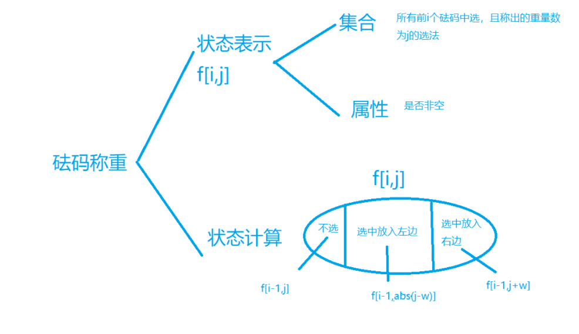

### A(进制转换)


#### 代码

```c++

#include <bits/stdc++.h>
using namespace std;
typedef long long ll;

int main()
{
     ll n;
     cin >> n;
     n /= 1000;//转换成秒,少去之后都要除1000的尴尬(毫秒题目说不考虑)
     n = n % 86400;//减去天(24*60*60)

     int h, m, s;
     h = n / 3600;
     m = (n - h * 3600) / 60;
     s = n - h * 3600 - m * 60;
     printf("%02lld:%02lld:%02lld", h, m, s);//补两位
}

```


### B(砝码称重)


#### 思路

```
	dp问题.是一道有限制选择性问题,也称为完全背包问题.(感觉一般数据量小带状态转移的题目,用dp)
	
	dp[i][j]代表前i个物体中能否称出j这个重量.可以用bool类型表示0是不行,1是行.
	而它可以由三种状态转移过来.1:如果不选第i件物品 dp[i-1][j].2:把第i件物体放入左边
dp[i-1][j-wi].3:第i件物品放入右边 dp[i-1][j+wi]	.然后如果物品都放左边,可以到-sum(sum是所有物品的总重量),如果全放右边,可以到sum.所以我们j的范围就可以从-sum~sum,设定初值dp[0][0]=1.双重循环,遍历i是1~n,j从-sum~sum,可以得到的情况赋值为1.
	最后再遍历dp[n][1]~dp[n][sum],为1的ans++,最后输出ans就是可以称的重量个数.
	
	但注意,因为数组不能存在负值(如dp[1][-3]),所以我们要给每一个j加上一个偏移量,B(B可以设为1e5+10,因为总重最大不能有1e5,这样可以使得值为正).(但为什么我偏移量取sum会错呢?)
	(这个思路对应第一种代码 y总)
	
	对于这道题的理解,我是这么认为的.题意转换为:一件物体放在托盘的左边,给你n个砝码,然后物品重量从1~1e5遍历,你砝码怎么摆能使得天平平衡(也就是称出了这件物品的重量).然后如果放左边的话等于左边重量变大了(如果物品重量为x),此时左边重量为x+wi,所以你要找到一种摆法,使得右边有x+wi的重量(不一定砝码放右边一直叠到x+wi,可以右边放x+2wi,左边再放wi,这样也等效于右边放x+wi).这样就等于判断dp[i-1][x+wi]是否为1了,如果是1,代表有这种摆法.而且我们还不用偏移量,用abs就可以了.
	因为如果存在x-wi为负数的情况,代表右边的重量大于左边了,这时我们只要找到一种方案,使得左边的重量+(x-wi),这样就可以保持平衡.所以我们的目的也就是找存不存在dp[i-1][abs(x-wi)]的情况(这个式子表示是否有用所给砝码称出x-wi重量的方案存在.如果存在,我们只要把这个方案用在左边)
	(也就是说这里,本题正负的实际意义其实是一样的)
	(这个思路对应第二种代码)
	
	
```




#### 	代码:

```c++
//为什么我偏移量B用sum来代替，就错了....
//y总代码

#include <bits/stdc++.h>
using namespace std;
const int N = 110, M = 200010, B = M / 2;
bool dp[N][M]; //也就2e7；
int a[N];
int sum = 0;
int main()
{
     int n;
     cin >> n;
     for (int i = 1; i <= n; i++)
     {
          cin >> a[i];
          sum += a[i];
     }

     dp[0][B] = 1; //加上sum的偏移量，防止数组出现负值[-sum]
     for (int i = 1; i <= n; i++)
          for (int j = -sum; j <= sum; j++)
          {
               dp[i][j + B] = dp[i - 1][j + B];
               if (j - a[i] >= -sum)
                    dp[i][j + B] |= dp[i - 1][j - a[i] + B];
               if (j + a[i] <= sum)
                    dp[i][j + B] |= dp[i - 1][j + a[i] + B];
          }

     int res = 0;
     for (int i = 1; i <= sum; i++)
     {
          if (dp[n][i + B] == 1)
               res++;
     }
     cout << res << endl;
}

//第二种代码
#include <bits/stdc++.h>

using namespace std;

const int N = 110, M = 2e5 + 10;
int sum;
int n;
int w[N];
bool f[N][M];

int main() {

    cin>>n;
    for (int i = 1; i <= n; i++)
    {
        scanf("%d", &w[i]);
        sum+=w[i];
    }

    f[0][0]=true;

    for (int i = 1; i <= n;i++)
        for (int j = 0; j <=sum;j++)//遍历0~sum,一个一个重量讨论过去,看看能不能用砝码称出来
            f[i][j]=f[i-1][j]||f[i-1][j+w[i]]||f[i-1][abs(j-w[i])];
                //只要有一个非空,f[i][j]就非空
    
    int ans = 0;
    for (int i = 1; i <=sum;i++)
        if(f[n][i])ans++;//不为零说明可以选出这个质量的砝码

    cout << ans;

    return 0;
}


```


### C(杨辉三角)

#### 思路

```
	1e9,O(n)会超时
	
	本题杨辉三角,一个思维题(找规律)的题目.
	要想做出本题,必须懂得杨辉三角的一些性质.如果抛掉两边的1不看的话,杨辉三角的每一个值就等于C(i,j),i是下面的数,代表行,j是上面的数,代表它是这一行的第几个.如2:C(2,1) 3:C(3,1)  6 C(4,2)(可以画一个杨辉三角看一下)
	
	而且本题想要找这个数第一次出现的位置,则它一定在左半边,所以我们右边可以直接不看.我们把整个三角分成左右两半.然后如果我们要在这半个三角找数,只要我们把这半个三角按斜行来看,就会豁然开朗.我们发现它从左上到右下是严格递增的.并且每一个斜行第一个数都是C(2x,x).
如:2 C(2,1) 6 C(4,2)  20:C(6,3). 
	并且每一斜行的递增规律是C(2x++，x)，例如6是C（4，2），10是C（5，2）.....我们就可以用二分,在每一个斜行里找数.
	
	但题目要求我们找第一个出现的位置,我们就要斜行从下往上找.因为如果一个数是20,我们在第4斜行找到了,那他就不可能在更前的位置里出现.因为它左边的数肯定都小于它,而每一个斜行又是递增的,也都小于他.因为N≤109 ,而C(34,17)>1e9,所以我们从第16条斜行开始找.
	
```


#### 代码

```c++
#include <iostream>
#include <cstring>
#include <algorithm>
using namespace std;
typedef long long LL;

int n;

LL C(int a, int b)
{
     LL res = 1;
     for (int i = a, j = 1; j <= b; i--, j++)
     {
          res = res * i / j;
          if (res > n)
               return res;
     }
     return res;
}

bool judge(int k)
{
     LL l = 2 * k;
     LL r = max(l, (LL)n); // 右边界是n的原因是C(n,k)一定>n.而如果我们要找的这个数n比l(左边界)都小,那就直接把r=l,表示这一列不可能有n(因为这一个斜行的一个数都比它大了)
     while (l < r)
     {
          int mid = l + r >> 1;
          if (C(mid, k) >= n)
               r = mid;
          else
               l = mid + 1;
     }
     if (C(r, k) != n)
          return false;

     cout << r * (r + 1) / 2 + k + 1 << endl;

     return true;
}

int main()
{

     cin >> n;
     if (n == 1)
          cout << 1 << endl;
     else
          for (int i = 16; i >= 1; i--)
          {
               if (judge(i))
                    break;
          }
}

```


### D(双向排序)


#### 思路

```
	一个思维题,要懂得分析每一种会出现的情况,化简每一种情况,将类似的情况进行合并,代码可利用栈来实现
	
	本题的数原本就是按照升序排列,所以第一次的有效操作一定是从0开始.(因为没有0,无论出现多少个1,数组都不会变)
	
	1:要是由连续的相同0或1组成,如果是0的话,则只有q最大的那一段(也就是最长的那一段)为有效操作(画一下就理解了),那么我们就可以把多段化成一段.同理,由多段1构成,则只有q最小的那一段(也是最长的那一段)为有效操作.
	
	2:要是交叠出现
	1): 若是出现以下情况(0 1 0 1交替出现,且第二个1长度比第一个1要短,第二个0长度比第一个0要短),先是对0~a进行降序,再n~b进行升序,再0~b''进行降序,最后来段升序.
	我们发现它看似每次操作都是从起点或终点开始的一整段,但实际上每一次操作的范围其实越来越小了(第一次降完序后,第二次的升序操作其实真要变化的也就是1这一小段,其他范围都不会在变了,而接下来的降序需要操作的数是2这一段范围,最后一段升序是3这一段).所以我们只要把每一次操作完就都固定下来的数(两边)先放好,直到中间操作的范围为0,整个数组就排完序了
	
	2): 而要是出现第二个0比第一个0要大的情况,如c比a大.那么我们只要看c这个操作就好了,a,b两次完全可以不用管它,有效操作只有c.因为我们先a降序后,第二次的b的操作范围就是b~a'这一小段,而这一小段已经被下面的c给囊括了,所以不论前面怎么排序,最后的c都会让他们按照降序出现.
	
	
	到这我们就讨论完了所有会出现的情况,我们仅保留最后的有效操作,得到的是图3.我们发现它操作范围确实是都在缩小.所以我们第一次操作后,我们可以把第1段的数填上去(降序)(填上去代表就这部分就是答案了,以后的操作都不会干扰到这一块),第二次操作完填2这段(升序),第三次操作完填3这一段....知道最后中间的范围变为0,整个数组都被填完了,算法复杂度0(n).
	别忘了还要写如果有效操作遍历完,中间的范围没有变为0的时候,按什么顺序输出剩下的数字(代码里有)
	
	看视频好像有别的算法可以直接实现范围数的倒置(可以再看一下)
	
```


#### 代码


```c++
// y总代码
#include <iostream>
#include <cstring>
#include <algorithm>
#define x first
#define y second
using namespace std;
typedef pair<int, int> PII;
const int N = 100010;

int n, m;
PII stk[N]; //用来存储最终有效的操作.手写栈.
int ans[N]; //每一次确定下来的数放入这个1数组,最后从头到尾遍历一遍输出即可

int main()
{
     scanf("%d%d", &n, &m);
     int top = 0;
    
    //看此m里面有很多while,但每次操作最多遍历两遍(第二遍取决于是否放入栈),也就是2m
     while (m--)
     {
          int p, q;
          scanf("%d%d", &p, &q);
          if (!p)
          {
               while (top && stk[top].x == 0)//连续出现0
                    q = max(q, stk[top--].y);
               while (top >= 2 && stk[top - 1].y <= q)
                    top -= 2;
               stk[++top] = {0, q};//把有效操作放入stk
          }
          else if (top)
          {
               while (top && stk[top].x == 1)//连续出现1
                    q = min(q, stk[top--].y);
               while (top >= 2 && stk[top - 1].y >= q)
                    top -= 2;
               stk[++top] = {1, q};//把有效操作放入
          }
     }
    
    //最后的top是个栈顶,stk[top]没内容,内容在stk[0]~stk[top-1]里
     int k = n, l = 1, r = n; // l~r代表中间那段范围,到0代表遍历完了
     for (int i = 1; i <= top; i++)
     {
          if (stk[i].x == 0)
               while (r > stk[i].y && l <= r)
                    ans[r--] = k--;
          else
               while (l < stk[i].y && l <= r)
                    ans[l++] = k--;
          if (l > r)
               break;
     }

    
     //要是有效操作遍历完,发现中间范围没有变0.直接看上一次是逆序还是降序排,一个个的输出

     if (top % 2) //栈顶是奇数,代表最后一次操作是偶数,最后的那一段范围应该是降序
          while (l <= r)
               ans[l++] = k--;
     else
          while (l <= r)
               ans[r--] = k--;

     for (int i = 1; i <= n; i++)
          printf("%d ", ans[i]);
     return 0;
}

```


### E(括号序列)


```
	判断括号合法性,可以采用栈来写,也可以采用cnt记数,碰到一个'('就+1,碰到')'就减1.我们从左往右遍历,如果当cnt<0了,代表序列到这不合法了,想要合法必须在它前面加'('.如果遍历完cnt>0,代表'('多了,要再后面补上对应数量的')'.
	
	一个合法的括号序列:对于一段括号序列，从左往右起，一个字符一个字符的往前看，对于每一段的括号序列 ‘(’ 数量 大于等于 ‘)’ 数量，那么括号序列就合法
```


#### 思路


```
	dp+思维
	
	括号是被添加到原序列的括号与括号之间的空隙里的，假如左括号和右括号加入的是不同的空隙，那么它们必然是互不影响的。如果加入的是同一个空隙，那么右括号的添加必然在左括号之前，否则括号配对，添加无意义( 这种状况:'()' )，不存在顺序的影响，那么也是互不影响的，所以我们将添加分开讨论。
	
	我们先算出最少插入多少左括号,再算出最少插入多少右括号,把他们相乘,就是最后的种数.我们先讨论左括号.
	我们如果以右括号为端点， 将整个序列进行分割， 那么在分割后的每一小段添加左括号的方案数显然只和这段序列中左括号的数量有关， 因为这段序列里全是左括号， 怎么排列都是一种。所以我们只关注左括号的个数就好了， 更准确的来说， 我们只要关注我们添加的左括号的个数。
	
	
	我们设定动态转移方程f[i][j].表示:
(1)集合：只考虑前 i 部分，左括号比右括号多 j 个的所有合法方案的集合

(2)属性：数量


是指前i个括号字符之前 添加不知道多少个(可以是0个) ’(’ 使这前i个括号字符合法（合法的含义是 ’(’ 比 ’)’ 多或者相等，所以j从0开始) 的种数。
去掉括号注释来看就是：前i个括号字符之前添加不知道多少(j)个左括号使前i个括号字符合法的种数。(j最大为原序列右括号的总个数,这种情况是假如这个序列全都是右括号,没有左括号,所以)
	
	
	这样使得最后每个右括号前都可能加了很多左括号,使得左括号数量大于右括号,但别忘了我们还要再讨论一次右括号(讨论它的方法是先将括号序列逆序，再将左括号变成右括号，右括号变成左括号),会使得结果每个右括号前可能有大于等于它个数的左括号,最后一综合,就变成等于了
	
```

#### 代码

```c++
#include <iostream>
#include <cstring>
#include <algorithm>

using namespace std;

typedef long long LL;

const int N = 5010, MOD = 1e9 + 7;

int n;
char str[N];
LL f[N][N];

LL work()
{
    memset(f, 0, sizeof f);
    f[0][0] = 1;
    for (int i = 1; i <= n; i ++ )
        if (str[i] == '(')
        {
            for (int j = 1; j <= n; j ++ )
                f[i][j] = f[i - 1][j - 1];
        }
        else
        {
            f[i][0] = (f[i - 1][0] + f[i - 1][1]) % MOD;
            for (int j = 1; j <= n; j ++ )
                f[i][j] = (f[i - 1][j + 1] + f[i][j - 1]) % MOD;
        }

    for (int i = 0; i <= n; i ++ )
        if (f[n][i])
            return f[n][i];
    return -1;
}

int main()
{
    scanf("%s", str + 1);
    n = strlen(str + 1);
    LL l = work();
    reverse(str + 1, str + n + 1);
    for (int i = 1; i <= n; i ++ )
        if (str[i] == '(') str[i] = ')';
        else str[i] = '(';
    LL r = work();
    printf("%lld\n", l * r % MOD);
    return 0;
}


作者：yxc

```


### 异或数列


#### 思路

```
	异或问题,也算是一个思维题把.
	
	A和B刚开始都为0,这代表它们起先不论异或那个数,都会变成那个数(0⨁x=x)
	初始时A和B都为0, 由异或的性质最终 A⨁B=X1⨁X2⨁Xi.如果所有X异或的结果为0,那么说明最终的A 和 B 是相同的(相等的两个数异或起来才为0),直接输出平局0。(解释一下,就是如果我们给的n个数,异或总合为0,则不管怎么取,A和B最后都一定相等.假如A随便n个数里面的a个,B取了b个.则A的最后答案就是a个数异或一起为c,B是b个数异或一起为d.它们最后的值就一定相等.只有c=d ,c⨁d才等于0(c⨁d也就等效于n个数异或在一起))

	如果要使得最终结果最大,那么肯定要使得最高位为1,我们记录每一位上1出现的次数,放入num数组里 .由于异或中：与 1 异或是取反,与 0 异或不变,当某一位的num[i]为偶数(这一位1出现次数为偶数),则游戏结果的这一位一定相等(A和B的最高位都不可能为1了,偶数个1相或),直接看下一位1出现的次数

	如果num[i]的个数为1,则一定是先手赢(抢了1之后,就没有1了.那么先手的最高位x就是1,后手再怎么选,都不可能第x位为1)
	
	
	那么当num[i]为大于1的奇数, 0的个数为偶数(0的个数可以通过n为奇还是为偶看出),则先手赢

	当num[i]为大于1的奇数, 0的个数为奇数,则后手赢
	
	为什么呢?因为这一位上不仅1的个数能决定最后A还是B这一位是1,0的个数也可以.假如有奇数个1奇数个0

```


#### 代码

```c++

#include <bits/stdc++.h>
using namespace std;
int num[22];

void get_cnt(int n)
{
     int cnt = 0;
     while (n)
     {
          if (n & 1)
               num[cnt]++;
          cnt++;
          n >>= 1;
     }
}
int main()
{
     int n;
     cin >> n;
     while (n--)
     {
          memset(num, 0, sizeof num);
          int x, sum = 0;
          cin >> x;
          for (int i = 0; i < x; i++)
          {
               int t;
               cin >> t;
               sum ^= t;
               get_cnt(t);
          }

          if (sum == 0)
               cout << 0 << endl;
          else
          {
               for (int i = 20; i >= 0; i--)
               {
                    if (num[i] == 1)
                    {
                         cout << 1 << endl;
                         break;
                    }
                    else if (num[i] % 2) //个数为奇数
                    {
                         if (x % 2)
                         {
                              cout << 1 << endl;
                              break;
                         }
                         else
                         {
                              cout << -1 << endl;
                              break;
                         }
                    }
               }
          }
     }
}
```


