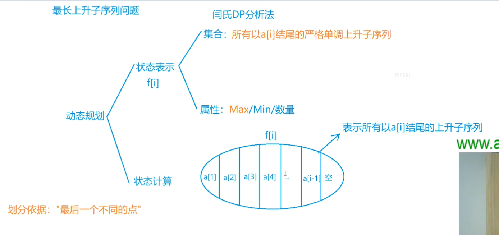
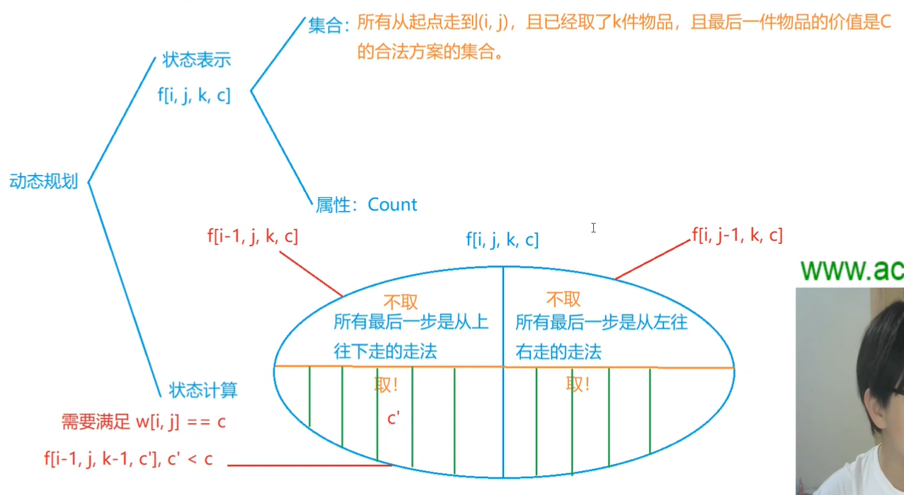
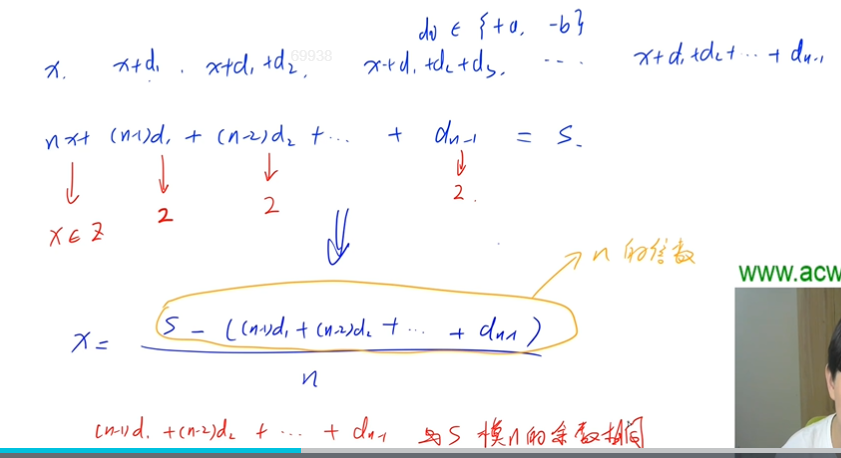
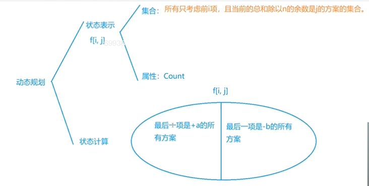
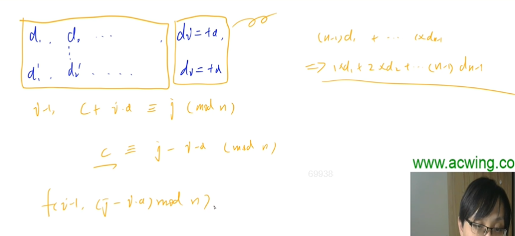
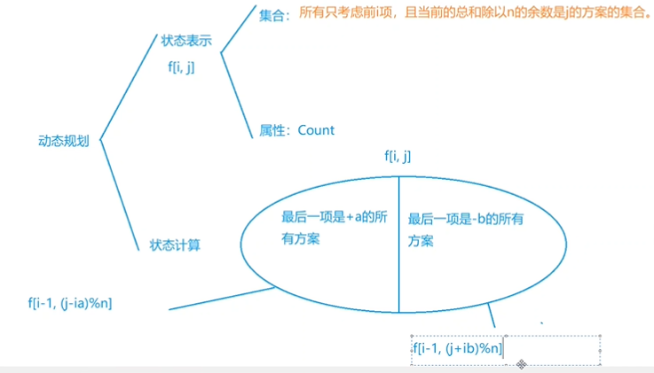

[活动 - AcWing](https://www.acwing.com/activity/content/19/)


### 摘花生


#### 思路

```
它和上升子序列共同组成了地宫取宝，所以地宫取宝会了，这个应该没问题hhh。(没看y总的讲解)

也就是一个二维dp，并且这两个变量都表示着位置。
dp[i][j]存储着走到这个点所采摘到的花生的最大数量，状态计算分为两部分，从左边走过来的和从上边走过来的，取个最大值。
```


#### 代码

```c++
#include <bits/stdc++.h>
using namespace std;
int a[110][110];
int dp[110][110];
int main()
{
     int t;
     cin >> t;
     while (t--)
     {
          int r, c;
          cin >> r >> c;
          for (int i = 0; i < r; i++)
               for (int j = 0; j < c; j++)
                    cin >> a[i][j];

         //预处理
          dp[0][0] = a[0][0];
          for (int i = 1; i < c; i++)
               dp[0][i] = a[0][i] + dp[0][i - 1];
          for (int i = 1; i < r; i++)
               dp[i][0] = a[i][0] + dp[i - 1][0];

         
          for (int i = 1; i < r; i++)
               for (int j = 1; j < c; j++)
               {
                    dp[i][j] = a[i][j] + max(dp[i - 1][j], dp[i][j - 1]);
               }

          cout << dp[r - 1][c - 1] << endl;
     }
}
```


### 最长上升子序列


———线性dp(一维,这里用不到二维)



f[i]表示以a[i]结尾的严格单调的上升的子序列的最大长度.

按照倒数第二个数是什么来划分集合(因为这里最后一个数一定相等).y总说前一节课有说要挖掘最后这个条件,一般都是按最后一步进行划分.

(背包问题是讨论要不要把第i件物品放入背包,而这里是讨论选一个<最后一个数的倒数第二个数..)


#### 代码

```c++

#include <bits/stdc++.h>
using namespace std;
const int N = 1e3 + 10;//这里是1e3，可以用2次循环。
int a[N], f[N];
int main()
{
     int n;
     cin >> n;

     for (int i = 1; i <= n; i++)
          cin >> a[i];

     for (int i = 1; i <= n; i++)
          f[i] = 1;

     for (int i = 1; i <= n; i++)
          for (int j = 1; j < i; j++)
          {
               if (a[i] > a[j])
                    f[i] = max(f[i], f[j] + 1);
          }

     int ans = 0;
     for (int i = 1; i <= n; i++)
          ans = max(ans, f[i]);

     cout << ans;
}

```


### 地宫取宝

#### 思路

———四维dp(f(i,j,u,v))

前四重循环表示状态,第五重循环用来转移.(是acwing上摘花生+最长上升子序列的结合)

f(i,j,u,v):前两维代表位置,已经取了k件物品,且最后一件物品的价值是c的方案数量的集合





#### 代码

```c++
#include <cstring>
#include <iostream>
#include <algorithm>

using namespace std;

const int N = 55, MOD = 1000000007;

int n, m, k;
int w[N][N];
int f[N][N][13][14];

int main()
{
     cin >> n >> m >> k;
     for (int i = 1; i <= n; i++)
          for (int j = 1; j <= m; j++)
          {
               cin >> w[i][j];
               w[i][j]++;
          }

     f[1][1][1][w[1][1]] = 1;
     f[1][1][0][0] = 1;

     for (int i = 1; i <= n; i++)
          for (int j = 1; j <= m; j++)
          {
              
               if (i == 1 && j == 1)
                    continue;
              
               for (int u = 0; u <= k; u++)
                    for (int v = 0; v <= 13; v++)
                    {
                        
                         int &val = f[i][j][u][v];//加了地址符,改val的值就等于改dp的值
                         val = (val + f[i - 1][j][u][v]) % MOD;//不取
                         val = (val + f[i][j - 1][u][v]) % MOD;
                        
                         if (u > 0 && v == w[i][j])//取
                             //这里的v的转移是直接从值转移过来,而不是像上升序列那题,由位置,因为这是二维,用位置表示太麻烦.并且这里值范围小,直接枚举上一个值可能是哪一个
                         {
                              for (int c = 0; c < v; c++)
                              {
                                   val = (val + f[i - 1][j][u - 1][c]) % MOD;
                                   val = (val + f[i][j - 1][u - 1][c]) % MOD;
                              }
                         }
                        
                    }
              
          }

     int res = 0;
     for (int i = 0; i <= 13; i++)
          res = (res + f[n][m][k][i]) % MOD;

     cout << res << endl;

     return 0;
}

```


### 波动数列


#### 思路

```
用dfs的话绝对会爆,因为有多少种方案,就有多少次搜索.2

先分析题目,化简题目,因为这里总和太大了,最大可以到1e9,第一个值可取的范围也太大了.

经过分析,这其实是一道组合的题目,可以利用类似背包的思维去解答.

凡是问满足要求的选法的数量或最值的,都可以称为组合问题(背包问题也是一种)
```




因为第一个数可以取得范围太大,我们把它转化一下,用后面的数代替他,找到一个新等式.题目要求的方案数就转换为,d1~dn-1的各个d的取法的方案集合.

有两个限制条件,di属于(+a,-b).并且x要是整数.x是整数就代表(s−((n−1)d1+(n−2)d2+(n−3)d3+…+dn−1))% n一定为 0 ，因此推出s % n == (n−1)d1+(n−2)d2+(n−3)d3+…+dn−1(n−1)的和 % n，也就是两者的模n的余数必须相同.

我们在这两个限制条件下,用dp找寻d的取值.

抓住最后一个不同点,我们讨论最后一个d是+a还是-b进行状态转移.




先考虑左半边:




因为这一块有一个共同点,最后一部分di都是+a,所以我们可以把+a这一部分给舍弃掉,它就又是令一个集合的方案数,这两个集合互相对应,可以通过转移得到.(和鸣人的影分身同)

我们在这做一个小转换:(n−1)d1+(n−2)d2+(n−3)d3+…+dn−1)=>

d1+(2)d2+(3)d3+…+(n-1)dn−1).因为这里d都是变量,转换后意思并没有改变,只不过更好看一点..

一种选法的前i-1个数的和%n是c,要求c+i*a≡j(mod n) =>c≡(j- ia)(mod n) (不懂可看一下同余定义)

所以得到动态转移方程:f(i,j)=f(i-1,c)=f(i-1,j-i*a(mod n))


另一部分也是这个思路,最后的方案数是两块取一个总和!




初始化:f(0,0)=1. 而f(0,1)(0,2)这些都是非法方案,都是0


#### 代码

```c++

#include <cstring>
#include <iostream>
#include <algorithm>

using namespace std;

const int N = 1010, MOD = 100000007;

int f[N][N];

int get_mod(int a, int b) // 求a除以b的正余数
{
     return (a % b + b) % b;
}

int main()
{
     int n, s, a, b;
     cin >> n >> s >> a >> b;

     f[0][0] = 1;
     for (int i = 1; i < n; i++)
          for (int j = 0; j < n; j++)
               f[i][j] = (f[i - 1][get_mod(j - a * (n - i), n)] + f[i - 1][get_mod(j + b * (n - i), n)]) % MOD;

     cout << f[n - 1][get_mod(s, n)] << endl; //不能用[s%n],否则可能会是负数

     return 0;
}

```

