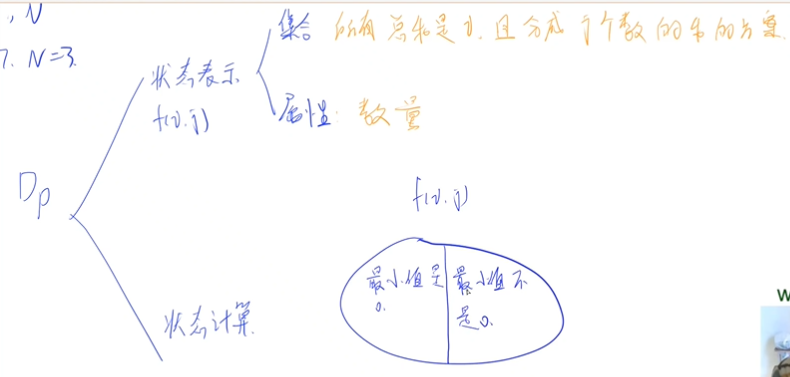
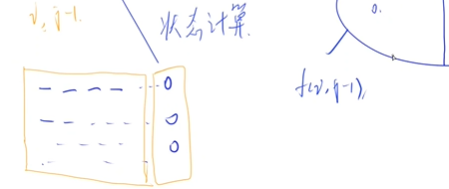
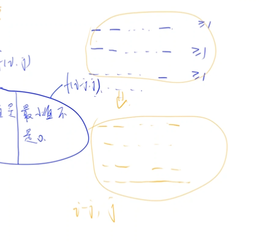
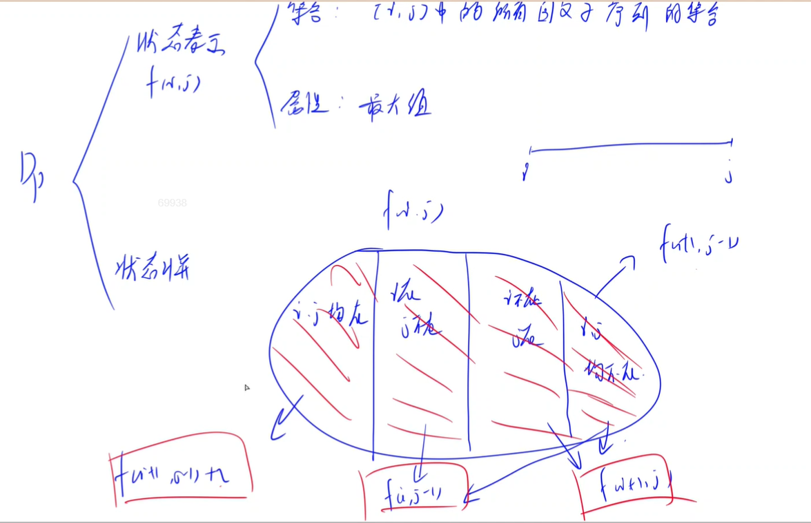

### 鸣人的影分身


#### 思路

​	1:暴搜,复杂度较高.
​	
​	2:dp,挺难想的,但算法复杂度低,只有n^2.


闫式dp:




划分的集合是f(i,j):所有总和为i,且是由j个数组成的方案.

属性(求的是):数量

状态计算方程:

+ 最小值是0
+ 最小值不是0


这些方案的最小值都是0,所以我们可以得到这半边的转移方程:f(i,j)=f(i,j-1)

(把0都舍弃不看)




而另一半里每个方案的数都是>=1的,所以我们可以把它映射一下,每个方案都-1,就可以得到一个新的集合,它与之前的集合一一对应.

同时,我们也得到一个状态转移方程:f(i,j)=f(i-j,j)	:后一个集合是由前一个集合每个方案-1,总计减j得到的.....




最后的方案数就是:`f(i,j)=f(i,j-1)+f(i-j,j)`


这样我们的复杂度就是n^2^.这类问题也被成为整数划分问题,很经典的问题..

但真的好难想(QAQ)


#### 代码

```c++
#include <bits/stdc++.h>
using namespace std;
int cnt;
int n, m;
void dfs(int x, int y, int z)
{
     if (x == m && y == n)
     {
          cnt++;
          return;
     }
     if (x > m || y > n)
          return;
     for (int i = 0; i <= n; i++)
     {
          if (i >= z)	//后一个数一定比前一个数大,这样保证搜到的数不重复
               dfs(x + 1, y + i, i);
     }
}
int main()
{
     int t;
     cin >> t;
     while (t--)
     {
          cnt = 0;
          cin >> n >> m;
          dfs(0, 0, 0);
          cout << cnt << endl;
     }
}
```


```c++
#include <bits/stdc++.h>
using namespace std;
const int N = 13;
int dp[N][N];

int main()
{

     int t;
     cin >> t;
     while (t--)
     {
          int n, m;
          cin >> n >> m;

          dp[0][0] = 1;
          for (int i = 0; i <= n; i++)
               for (int j = 1; j <= m; j++)
               {
                    dp[i][j] = dp[i][j - 1];
                    if (i >= j)
                         dp[i][j] += dp[i - j][j];
               }

          cout << dp[n][m] << endl;
     }
}
```


### 糖果


#### 思路

在lzz的指导下写出......一道类似01背包问题,这不过怎么状态表示有点难想!!!!

dp[i][j]表示着前i个数,余数为j的最大的糖果数量.//用余数来表示很难想到
最后dp[n][0]就是答案.

状态转移:不取第i个数:dp[i][j]=dp[i - 1][j], 取: dp[i][j]= a[i]+dp[i - 1][(j + m - a[i] % m) % m]),两者取最大值 //题目要求整除7,如果此时j为0,要是这个a[i]=9的话,它对7的余数是2,(什么数加上2)%7能等于0能,就是5,所以要是取这个a[i],那么这个状态就可以从dp[i - 1][5]转移得到.j + m - a[i] % m:这个式子就是用来推出是从什么数转移得到的.后面再% m怕j加上之后会可能超出7这个范围.(可以举个例子推一下)

记住dp数组初始化为负无穷!因为防止一些状态可以从前一个转移过来,可前一个状态却根本不存在的情况
如:假如a[1]=4,题目判断能不能被8整除,显然dp[1][5]是不可能存在的,要是dp[1][5]等于0的话,可能后面有一个dp[2][7],刚好可以从dp[1][5]转移过来,如果dp[1][5]不设定为负无穷的话,那么这个dp[2][7]的值可能真就是从dp[1][5]过来了,那就错了


#### 代码

```c++
#include <bits/stdc++.h>
using namespace std;
const int N = 110;
const int M = 1e6 + 10;
int dp[N][N];
int a[N];
int main()
{
     int n, m;
     cin >> n >> m;
     memset(dp, -0x3f, sizeof dp);//初始化为负无穷!
     dp[0][0] = 0;
    
     for (int i = 1; i <= n; i++)
          cin >> a[i];

     dp[1][a[1] % m] = a[1];
    
     for (int i = 1; i <= n; i++)
     {
          for (int j = 0; j < m; j++)
          {
               dp[i][j] = max(dp[i - 1][j], a[i] + dp[i - 1][(j + m - a[i] % m) % m]);
          }
     }
    
     cout << dp[n][0];
}
//还可以进行滚动数组优化~
```


### 密码脱落

#### 思路

区间dp

这个题意转换太秀了!!!

这题意思是给我们一个字符串序列，问我们需要给它在其中至少添加多少个字符，才能使得它是回文串
题目其实等价于在这个序列中，找到最大长度的回文子序列
这里的添加操作其实和删除操作是等价的，添加几个字符使得这个串是回文串，添加的字符个数等价于删除几个字符使得这个串是回文串，删除的字符个数。
最终至少需要添加的字符个数==字符串总长度−−字符串中的最长回文子序列长度

现在我们从区间DP的角度来考虑这个问题：
dp[i][j]表示在i和j之间的回文子序列的集合.分为四种情况,
1:i,j均在这个回文子序列中,2:i在j不在,3:j在i不在,4:i,j都不在.其中2,3种能覆盖到第四种,所以第四种可以不用讨论
若l和r都在回文串内,那么dp[l][r]由dp[l + 1][r - 1]转移而来(大区间由小区间转移而来)

本题不用初始化为负无穷.初始化负无 穷就错了.如dp[2][3],假如s[2]==s[3],那么就应该是等于dp[3][2]+2,变成2.如果初始化为负无穷了,dp[3][2]就变成负无穷,dp[2][3]也不等于2了.这种区间问题,根本不存在像上一题的无法转移的情况.

写题目时候(状态转移),先枚举区间长度,在枚举左端点.

区间dp根本没听~





#### 代码

```c++
#include <bits/stdc++.h>
using namespace std;
const int N = 1010;

char s[N];
int f[N][N];

int main()
{
     scanf("%s", s);
     int n = strlen(s);

     //区间dp模板
     for (int len = 1; len <= n; len++)         //枚举区间的长度
          for (int l = 0; l + len - 1 < n; l++) //枚举左端点
          {
               int r = l + len - 1; //推出右端点
               if (len == 1)        //每个区间长度为1的时候,必有1个
                    f[l][r] = 1;
               else
               {
                    f[l][r] = max(f[l + 1][r], f[l][r - 1]);

                    if (s[l] == s[r])
                         f[l][r] = f[l + 1][r - 1] + 2;
               }
          }

     printf("%d\n", n - f[0][n - 1]);

     return 0;
}

```

