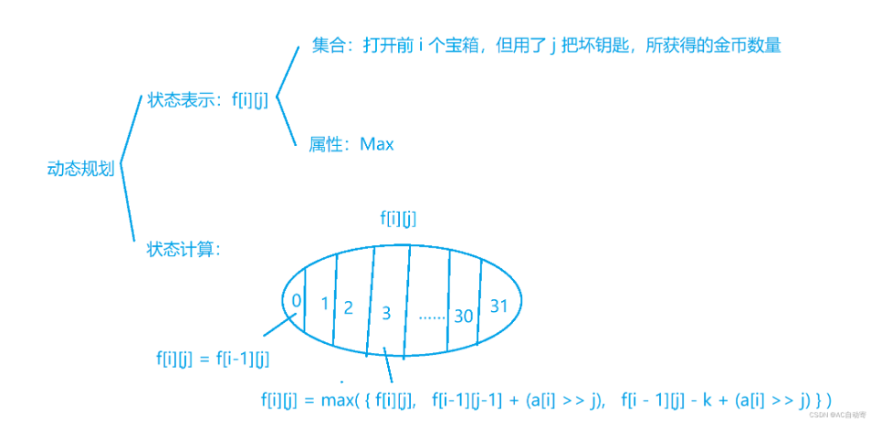

[Dashboard - Codeforces Round #806 (Div. 4) - Codeforces](https://codeforces.com/contest/1703)

## D

**题意**

​	给你n个字符串,让你输出第i个字符串能否由第k个和第t个字符串拼接而成,k可以等于t,每个字符串长度最多为8。

**思路**

​	一道简单的stl题，之前没注意到长度为8这个条件.....把每个字符串储存在map里,然后遍历i,对s[i]串进行分割,看看前后两个字符串存不存在就可以了

**code**

```c++
#include <bits/stdc++.h>
using namespace std;
const int maxn = 1e5 + 5;
int n, T, tot, flag;
string s[maxn];
map<string, int> mp;
int main()
{
     ios::sync_with_stdio(0);
     cin >> T;
     while (T--)
     {
          cin >> n;
          tot = 0;
          for (int i = 1; i <= n; i++)
               cin >> s[i], mp[s[i]] = ++tot;
          for (int i = 1; i <= n; i++)
          {
               flag = 0;
               for (int j = 1; j <= s[i].size(); j++)
                    if (mp[s[i].substr(0, j)] && mp[s[i].substr(j, s[i].size() - j)])
                    {
                         flag = 1;
                         break;
                    }
               cout << flag;
          }
          cout << endl;
          for (int i = 1; i <= n; i++)
               mp[s[i]] = 0;
     }
     return 0;
}
```


## E

**题意**

​	给你n个矩形，矩形内部由0/1填充，将矩形旋转90度，旋转四次(直到变回原位)，现在你的一次操作可以让矩形里的一个0变成1或1变成0，问你旋转的这四次产生的矩形，你至少要几次操作才能让他们四个都相等

​	n<=100,矩形边长<=100

**思路**

​	想要一个矩阵旋转0,90,180,270度时完全相同，只需要让其**中心对称**即可

​	显然一个点旋转后将会经过四个点，我们只需要让这四个点相同即可，假设这四个点的值的和为t，则将它们变为相同的值需要的最小次数为 min（t,4−t）

​	接下来我们需要知道这四个点到底是哪几个点，这只需要一个点旋转90度的时候坐标怎么变即可
​	假设现在有一个点 （x,y） 想要绕中心旋转90度（注意x代表行，y代表列），那么新的坐标 （xx,yy） 将会满足 **xx=y，yy=n+1−x** （自己画一个验证一下就知道了）


**code**

```c++
#include <bits/stdc++.h>
using namespace std;

const int maxn = 105, inf = 1e9 + 7;
int n, T, t, ans = 0, a[maxn][maxn], x, y, xx, yy;
bool ins[maxn][maxn];
string s;

int main()
{
     cin >> T;
     while (T--)
     {
          cin >> n;
          ans = 0;
          for (int i = 1; i <= n; i++)
          {
               cin >> s;
               for (int j = 0; j < n; j++)
                    a[i][j + 1] = (s[j] == '1'), ins[i][j + 1] = 0;
          }
          for (int i = 1; i <= n; i++)
               for (int j = 1; j <= n; j++)
               {
                    if (n & 1 && i == (n + 1) / 2 && j == (n + 1) / 2)
                         continue; // n为奇数时存在中心，不需要变动
                    if (!ins[i][j])
                    {
                         t = 0;
                         x = i, y = j;
                         while (!ins[x][y]) //遍历四个点
                         {
                              ins[x][y] = 1, t += a[x][y];
                              xx = y, yy = n + 1 - x; //变为旋转90度后的下一个点
                              x = xx, y = yy;
                         }
                         ans += min(t, 4 - t); // 0和1,选少的那个
                    }
               }
          cout << ans << endl;
     }
     return 0;
}
```


## F

### 思维+前缀和

**题意**

​	给你一个序列，里面n个数，让你找出有几对(i,j) 满足**ai<i<aj<j**，输出对数。

​	n<=2*1e5


**思路**

​	挺巧妙的一个题，稍微转换一下题意，计算出每个点的贡献，最后使用**前缀和**维护出答案。

​	我们先遍历一遍序列，判断一下每个点是否满足 a[i]<i ，若满足我们称这个点为可行点。

​	于是我们要满足的条件就转化成了 i<a[j] （i，j均为可行点）
​	所以一个可行点j的贡献为1~a[j]-1中可行点的个数，这显然可以用前缀和优化，于是本题得解

​	

**code**

```c++
#include <bits/stdc++.h>
using namespace std;
const int N = 2e5 + 5;
int a[N], s[N]; // s[i]为1~i中可行点的个数
bool f[N];      // f[i]用来判断a[i]是否小于i
long long ans;
int main()
{
     int t;
     cin >> t;
     while (t--)
     {
          int n;
          cin >> n;
          memset(s, 0, sizeof s);
          memset(f, 0, sizeof f);
          for (int i = 1; i <= n; i++)
          {
               cin >> a[i];
          }

          for (int i = 1; i <= n; i++)
          {
               if (a[i] < i)
               {
                    f[i] = 1;
                    s[i] = s[i - 1] + 1;
               }
               else
               s[i]=s[i-1];
          }
          ans = 0;
          for (int i = 1; i <= n; i++)
          {
               if (f[i] && a[i] > 1)    //是可行点
                    ans += s[a[i] - 1]; //计算1~a[i]-1的可行点的数量
          }
          cout << ans << '\n';
     }
}
```


## G

## 线性dp/贪心

**题意**

​	有n个宝箱,你可以选择用好钥匙和换钥匙打开，若用好钥匙，则消耗k个金币，得到宝箱里的金币，若用坏钥匙，不用金币，但这个宝箱已经后面的所有宝箱里的金币数都变成半(向下取整)，问你最多能拿多少金币

​	n<=1e5

**思路**

dp:

​	一道经典的dp题，本来我想着是dp[i]\[j][t]代表当前第i个宝箱，j则是选择用好钥匙打开还是坏钥匙打卡，t则代表到现在为止用了几把坏钥匙了，但因为n是1e5，要是在枚举i的情况下,再枚举1e5把钥匙,则一定超时。
​	但是看了题解,我发现，这**t最大也就31把**，超过31后宝箱的金币数就会变成0，不会产生影响。




贪心:

​	直接猜了结论，前面全用好钥匙，后面全用坏钥匙(也可以从样例看出)，下面简单证明一下

​	如果好钥匙使用的把数确定，那么花费也是一定的，那么显然坏钥匙越在后面出现越优，即把坏钥匙全部放在后面
​	那么我们直接枚举使用的好钥匙数量，假设1~x使用好钥匙，x+1~n使用坏钥匙

1~x这一段非常好计算，$$ans+=\sum_{i=1}^x a[i]−k$$ 即可
(x+1)~n这一段中，每过一个点都会使用一次坏钥匙，所有位置的值就会除以2，所以 ans+=∑i=x+1na[i]/2i−x

​	我们可以发现，最多经过31个点，所有值就都变成0了（因为a[i]<1e9），不需要再往后计算
​	所以最终的复杂度为 O(31∗n) 


**code**

dp:

```c++
#include <bits/stdc++.h>

#define fast                                        \
     ios::sync_with_stdio(false), cin.tie(nullptr); \
     cout.tie(nullptr)

using namespace std;

typedef long long LL;
typedef pair<int, int> PII;

const int N = 2e5 + 10;
const int mod = 998244353;

int T;
LL f[N][40]; // 第 i 个位置用了 j 个坏钥匙

void solve()
{
     int n, k;
     scanf("%d%d", &n, &k);

     int a[N];

     for (int i = 1; i <= n; i++)
          scanf("%d", &a[i]);

     for (int i = 1; i <= n; i++)
          for (int j = 0; j <= 31; j++)
               f[i][j] = -1e18;

     for (int i = 1; i <= n; i++)
     {
          f[i][0] = f[i - 1][0] - k + a[i]; // 没有坏钥匙的情况特判
          for (int j = 1; j <= 31; j++)
          {
               f[i][j] = max(f[i][j], f[i - 1][j - 1] + (a[i] >> j)); // 第 i 把是坏钥匙，则到第 i - 1 把时，用了 j - 1 把坏钥匙
               f[i][j] = max(f[i][j], f[i - 1][j] - k + (a[i] >> j)); // 第 i 把不是坏钥匙，则到第 i 把时，用了 j 把坏钥匙
          }
          f[i][31] = max(f[i][31], f[i - 1][31]); // 已经用31把坏钥匙，之后的数都为0，特判
     }

     LL res = 0;
     for (int i = 0; i <= 31; i++) // 判断每种情况的最大值
          res = max(res, f[n][i]);
     printf("%lld\n", res);

     return;
}

int main()
{
     // fast; cin >> T;
     scanf("%d", &T);
     while (T--)
          solve();

     return 0;
}
```


贪心:

```c++
#include <bits/stdc++.h>
using namespace std;
const int N = 1e5 + 5;
typedef long long ll;
int a[N];
ll s[N], mi[40] = {1};
int main()
{
     for (int i = 1; i <= 33; i++)
          mi[i] = mi[i - 1] * 2ll;
     int t;
     cin >> t;
     while (t--)
     {
          int n, k;
          cin >> n >> k;
          ll ans1 = -1;
          ll ans = 0;
          for (int i = 1; i <= n; i++)
               cin >> a[i], s[i] = s[i - 1] + a[i];
         
          for (int x = 0; x <= n; x++)
          {                              //枚举使用好钥匙的数量
               ans = s[x] - k * 1ll * x; //计算1~x
               for (int i = x + 1; i <= min(x + 32, n); i++)
                    ans += a[i] / mi[i - x]; //计算x+1~n
               ans1 = max(ans1, ans);
          }
         
          cout << ans1 << endl;
     }
}
```

