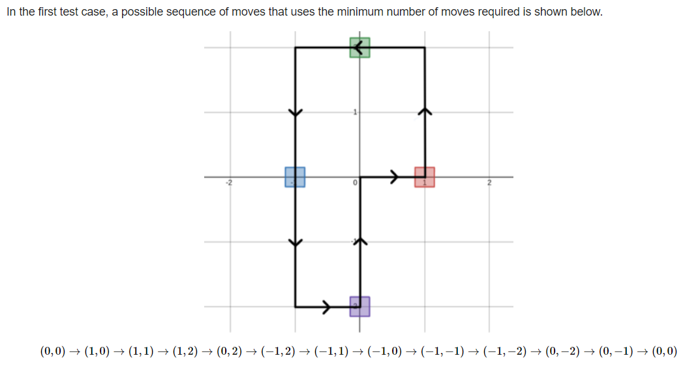

## A

**题意**

​	现有 n 个在二维坐标轴上的点。你需要找到一条路径，从 (0,0) 出发，到 (0,0) 结束，且经过了所有这 n 个点。求最短路。

​	xi and y (−100≤xi,yi≤100) 

**思路**

​	看到样例，其实就有想法，无论点分布在哪里，它最后走的路线一定能通过平移拼接成一个矩形。



​	然后请注意,它必须从原点出发,原点回来,这使得它计算矩形四个角的时候,不能单纯找出现过的最左边的点,最右边的点,最上边的点,最下边的点….,而是从0开始。因为就算出现的点都在第一象限，矩形也必须以(0,0)为左下角

​	(可以自己画一下)

**code**

```c++
#include <bits/stdc++.h>
using namespace std;
int main()
{
     int n;
     cin >> n;
     int xmax = 0, xmin = 0, ymax = 0, ymin = 0;//初始化都置为0,而不是-200,200这种.
     for (int i = 1; i <= n; i++)
     {
          int x, y;
          cin >> x >> y;
          xmax = max(x, xmax);
          xmin = min(x, xmin);
          ymax = max(y, ymax);
          ymin = min(y, ymin);
     }
     cout << 2 * (ymax - ymin + xmax - xmin) << '\n';
}
```


## B

**题意**

​	给定一个数组a，可以进行以下操作：选择区间，然后使得区间中所有数减少1。设f(a)是让a变成0的最下操作数。问a是不是a的所有排列中f值最小的。

​	1≤n≤10^5^


**思路**

​	要想知道题目所给序列是不是已经是f值最小，就要判断此序列能否满足这个条件：我们对序列的每一次操作都能作用在序列中最大值身上(f值最小的序列一定是满足这种想法)

​	判断是否满足条件 <=> **最大值左边满足序列递增，右边满足序列递减**。

​	可以自己根据题目样例动手试一下：

> ```
> 4
> 2 3 5 4
> Yes
> 3
> 1 2 3
> Yes
> 4
> 3 1 3 2
> No
> ```


**code**

```c++
#include <bits/stdc++.h>
using namespace std;
const int N = 1e5 + 5;
#define long long int
void solve()
{
     int n;
     cin >> n;
     vector<int> a(n);
     for (int i = 0; i < n; i++)
          cin >> a[i];
     bool flag = false;
     for (int i = 1; i < n; i++)
     {
          if (flag)
          {
               if (a[i] > a[i - 1])
               {
                    cout << "NO\n";
                    return;
               }
          }

          if (a[i] < a[i - 1])
               flag = true;
     }

     cout << "YES\n";
}
signed main()
{
     int t;
     cin >> t;
     while (t--)
     {
          solve();
     }
}
```


## C

### 思维+构造

**题意**

​	让你构造出一个长度为n的序列，里面的数由[0~n-1]填充，顺序可以任意。使得构造出的新序列满足a[i]+i为完全平方数(i从0开始)

​	n<=1e5


**思路**

​	可以从**样例找思路**，如n=7，答案构造出`1 0 2 6 5 4 3 `，我们发现后面半段数字是连续逆序数,且a[i]+i都等于一个固定的数:9，我们得到启发，假如a+b为完全平方数(b>a且b<=n-1)，那么a~b这一串数就都能被确定.
​	如3+6=9,是完全平方数,那么下标为3到下标为6的值就确定了,刚好是从b到a

​	所以我们只要先确定b,把它设为n-1(必存在n-1的b值,因为所构造的序列[0,n-1]都必须存在),然后找到满足条件的a,这一段的数就都能被填充,然后再b=a-1,继续操作下去


**code:**

```c++
#include <bits/stdc++.h>
using namespace std;
const int N = 1e5 + 5;
#define long long int
void solve()
{
     int n;
     cin >> n;
     vector<int> ans(n);
     //对于每一个a,找一个b(b>a,b<=n-1),使得a+b符合条件,然后a~b的所有的数就都有了答案
     for (int i = n - 1, j; i >= 0; i = j - 1)//确定b
     {
          for (j = i; j >= 0; j--)
          {
               int t = (i + j);
               int k = sqrt(t);
               if (k * k == t) //找到了平方数
                    break;
          }

          for (int k = j; k <= i; k++)//这一段的数都能被填充
          {
               ans[k] = i - (k - j);
          }
     }

     for (int i = 0; i < ans.size(); i++)
          cout << ans[i] << ' ';

     cout << "\n";
}
signed main()
{
     int t;
     cin >> t;
     while (t--)
     {
          solve();
     }
}
```


## D
