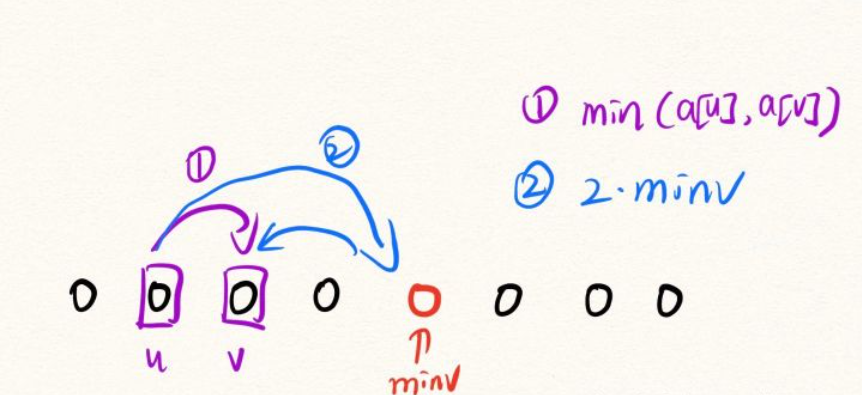

## A

**题意**

​	给定一个范围是[1,n]的乱序排列，每一次操作是交换这个排列的任意两个数，问你最少操作几次，使得前k项之和最小。

### 思路

​	贪心题

​	要想使得前k项之和最小，并且本题是一个排列，那么最小的情况就只能是前k项的数都是从[1,k]中选一个，所以正解就是遍历原序列，要是哪个数比k大，res++，算作一次交换

​	关键：将题目所要求的前k项之和最小转换成统计前k个数中大于k的数有多少

code：

```c++
const int N = 2e5 + 10 , INF = 0x3f3f3f3f;
int n, m, a[N], k;

void solve()
{
    cin >> n >> k;
    for(int i = 1 ; i <= n ; i ++ ) cin >> a[i];
    int res = 0;
    for(int i = 1 ; i <= k ; i ++ )
    {
        if(a[i] > k) res ++ ;
    }
    cout << res << endl;
}
```


## B

**题目**

​	给定一个数字n，请构造一个排列a[i]使得 $∑lcm(i,a[i])$ 最大,lcm是最小公倍数


### 思路

​	我们发现相邻的两个数一定是互质数,且它们组成的最小公倍数累加起来的和一定是最大的，如n=5，则构造出来的序列是`1 3 2 5 4`，lcm[5]=i*a[i]=5\*4=20 lcm[4]=4\*5=20...	n=4 :`2 1 4 3`

​	以上结论属于感觉上的正确,有时候看不出来结论的可以看一下样例的序列是如何构造的。而想要正式的证明是比较困难的，可以参考cf官方题解。


code:

```c++
#include <bits/stdc++.h>
using namespace std;
const int N = 1e5 + 10;
int a[N], b[N];
int st[N];
int main()
{
   int t;
   cin >> t;
   while (t--)
   {
      int n;
      cin >> n;
      vector<int> ans;
      if (n % 2)
      {
         for (int i = n; i >= 2; i -= 2)
         {
            ans.push_back(i - 1);
            ans.push_back(i);
         }
         ans.push_back(1);
      }
      else
      {
         for (int i = n; i >= 1; i-=2)
         {
            ans.push_back(i - 1);
            ans.push_back(i);
         }
      }
      reverse(ans.begin(), ans.end());
      for (int i = 0; i < ans.size(); i++)
         cout << ans[i] << ' ';
      cout << '\n';
   }
}
```


## C

**题意**

​	给定一串长度为n的数字，你可以进行若干次操作，每次操作选择一个数x，使得数组中所有i当且仅当a[i] = x，这些i位置上的a[i]**变成0**。请问最少需要操作几次使得该数组变成不下降序列。


### 思路

​	我们发现，假如一个数字被变成了0，那么他前面的所有数字都必须变成0。因此操作后的结果要么是全0，要么是后缀有一些数没有变成0。0和非0的界限呢 ?

​	假如有两个相同的数字不相邻：5 ….. 5，那么他们中间的数字不管更大还是更小都要变成0，既然中间变成0了，那么这个区间内包括前面的所有数字都要变成0。对于某一数字x，他出现的位置比如说是2 5 8，那么8前面的所有数都要变为0。

​	因此我们需要维护每一个数字**出现至少两次并且不是连续**的最后一次出现的位置**。**

​	然后找到最大值，就是我们第一步找到的0和非0的分界线。其次剩下的数一定在数组的后缀上并且都仅仅出现一次。我们从后往前，找到第一个a[i] < a[i - 1]的位置，那么再次更新界限为i - 1即可。
​	我们算出的界限就是界限之前的数都变成0，界限后面的数不变。


code：

```c++
#include <bits/stdc++.h>
using namespace std;
const int N = 2e5 + 10, INF = 0x3f3f3f3f;
int n, m, a[N], b[N], k;

int main()
{
   int t;
   cin >> t;
   while (t--)
   {
      cin >> n;
   for (int i = 1; i <= n; i++)
      cin >> a[i];
   map<int, int> mp;
   map<int, int> mpp;
   int maxv = 0; // 分界线
   
   for (int i = 1; i <= n; i++)
   {
      if (mp[a[i]] && a[i] != a[i - 1])//出现过两次及以上且不是连续的
         maxv = max(maxv, i);
      mp[a[i]] = 1;
   }

   for (int i = n; i > maxv + 1; i--)
   {
      if (a[i] < a[i - 1])
      {
         maxv = i - 1;
         break;
      }
   }

   int res = 0;
   for (int i = 1; i <= maxv; i++) // 分界线前统计答案
   {
      if (!mpp[a[i]])//把值为a[i]的数字都变成0,变成0的数就不用再变一次
         res++;
      mpp[a[i]] = 1;
   }
   cout << res << endl;
   }
}
```


## D

**题意**

​	给定一长度为n的数组，你可以进行k次操作，每次操作任意改变数组的一个值，用该数组构建一张无向完全图，对于任意[l, r]两点之间的路径长度为数组a上[l, r]范围内的最小值。求操作后该图上两个点之间最短路的最大值。

​	

### 思路

​	本题总共有n^2^条边,不能暴力去写,要分析图的性质

分析:

1:**本题图的性质**:

​	u->v的最短路只有两种取得的方式，一种是从u直接走到v,路程是min(d[i]),i:[u,v]。还有一种是u先走到数组中权值最小的点，然后再走到v去，那么路径长度是2*min(d[i]),i:[1,n]。

2:**最短路的最大值一定出现在两个相邻的位置上。**

​	如有1,2,3三个点，1->2或者2->3的最短路其中一定有一个和1->3一样,你选1和3一定可以转换成选1和2或者2和3。




接下来就是考虑如何应用k次操作的问题了:

**第一种情况：**

​	我们假设最后答案来自于u直接走到v，我们要尽可能是这个值变大。根据刚才的结论答案是min(a[i], a[i + 1])，那么他们之间一定存在一个最小值。因此我们要用一次操作把其中一个变成无穷大，我们取到的就是两者中最大权值的那个数。剩余的k - 1次我们只需要把最小的那k - 1次变成正无穷即可。

​	这样子操作后，最后的答案就是此刻数组中最大的那个数和最小的数*2之间取最小值(最短路)：我们利用一次操作使得min(a[i], a[i + 1])取到的就是修改后数组的最大值，利用k-1次操作尽量的拔高了2\*min的值

**第二种情况：**

​	我们假设最后答案来自于2 * 最小权值。我们要尽量抬高最小的值，因此我们只需要将最小k个权值变成无穷大即可。那么最终答案就来自于2 * min，并且枚举一遍相邻位置上的最小值min(a[i], a[i + 1])即可。

​	


code：

```c++
#include <bits/stdc++.h>
using namespace std;
typedef pair<int, int> PII;
const int N = 2e5 + 10, INF = 1e9;
int n, m, a[N], b[N], k;
struct Node
{
   int id, w;
   bool operator<(const Node &t) const
   {
      return w < t.w;
   }
} p[N];

void solve()
{
   cin >> n >> k;

   int res, res1 = INF, res2 = INF;
   for (int i = 1; i <= n; i++)
      cin >> a[i], p[i] = {i, a[i]};

   sort(p + 1, p + n + 1);
   // k-1次把前k-1小的数调大,第k次把a[i]和a[i+1]之间最小的那个数调大
   for (int i = 1; i <= k - 1; i++)
   {
      p[i].w = INF;
      a[p[i].id] = INF;
   }

   sort(p + 1, p + n + 1);
   // 第一种情况,答案在最小值*2和最大值之间产生
   res1 = min(res1, p[1].w * 2);
   res1 = min(res1, p[n].w);

   // 第二种情况
   p[1].w = INF;
   a[p[1].id] = INF;
   sort(p + 1, p + n + 1);
   res2 = min(res2, p[1].w * 2);
   int temp = -INF;
   for (int i = 1; i <= n; i++)
      a[p[i].id] = p[i].w;

   for (int i = 1; i < n; i++)
      temp = max(temp, min(a[i], a[i + 1]));

   res2 = min(temp, res2);

   res = max(res2, res1);
   cout << res << endl;
}

int main()
{
   int t;
   cin >> t;
   while (t--)
   {
      solve();
   }
}
```

