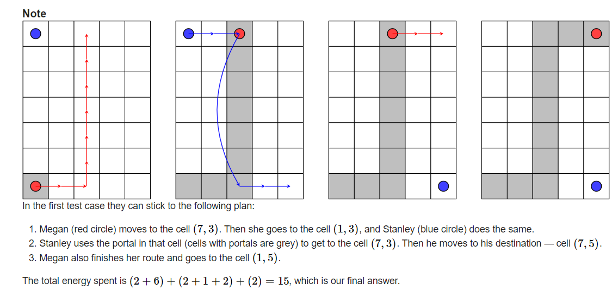
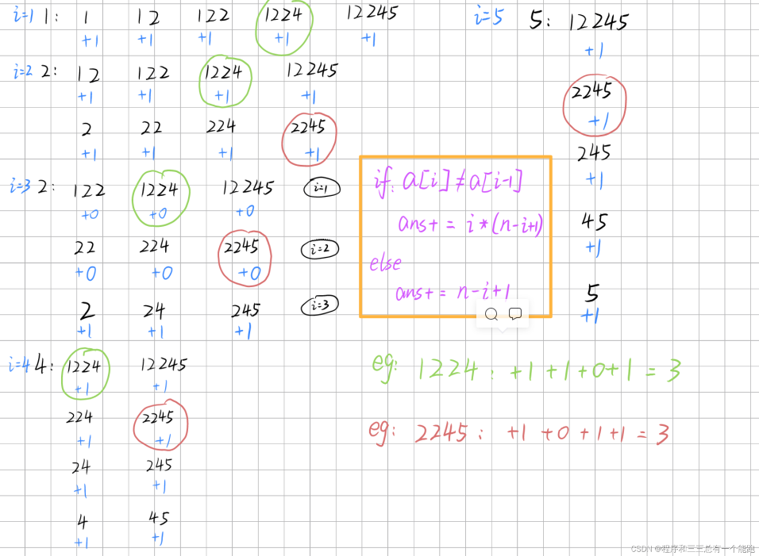
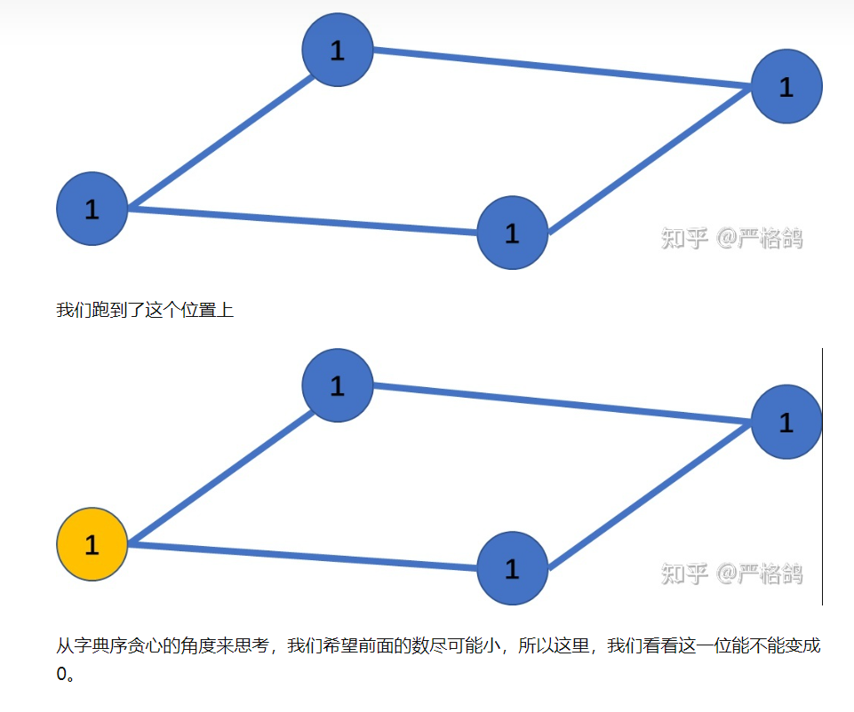
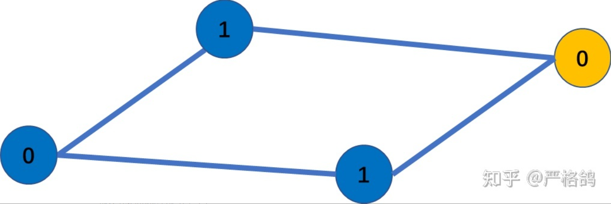

[Dashboard - Codeforces Round #816 (Div. 2) - Codeforces](https://codeforces.com/contest/1715)

## A

**题意**

​	有一个n*m的矩形,q站在矩形左上角,想去右下角,w站在矩形左下角想去右上角,他们可以移动一格到相邻的矩阵(消耗一格能量),而且q可以在w走过的路上任意穿梭(消耗一格能量),问他们都到达目的地的时候,消耗能量最少是多少。

​	（7,5）最少消耗15个能量




**思路**

​	我们发现无论如何，w都是要一步一步走的，他要消耗(n-1)+(m-1)个能，而q可以通过传送门减少能量消耗。我们又发现，他可以通过传送门直接砍掉横着走or竖着走的花费(上图是砍掉了竖着走)，这时候我们只要判断长和宽哪个大就可以了

​	$$ans= (n−1)+(m−1)+1+(min(n,m)−1)$$


**code**

```c++
#include<bits/stdc++.h>
#define int long long
using namespace std;
const int N =3e5+10,mod=998244353;
 
signed main()
{
    int T;
    cin>>T;
    while(T--)
    {
    	int m,n;
    	
    	cin>>n>>m;
    	if(m==n&&m==1)
    	{
    		cout<<0<<endl;
    		continue;
		}
    	cout<<(m+n-2)+min(m,n)<<endl;
	}
	
    return 0;
}
```


## B

**题意**

​	有一个长度为n的非负整数序列a，且有一个数b，满足
$$
b=\sum_{i=1}^n\frac{a_i}k
$$
且除法是向下取整，现在给你k,b,n,s(s是原数组之和),让你构造出数组a，不存在的输出-1.


**思路**

​	（**根据样例提示**）我们发现，可以让b只由一个数maxx去提供,那么这个数的范围就是[b\*k,(b+1)*k-1]，数组里的其它数都<k,这样它们向下取整算出来的都为0。

​	而要是maxx这一个数就比s大了,那么就输出-1，

​	而要是maxx选了它能到的最大值，(b+1)*k-1，其他数也选了最大值，k-1，而s居然比他还大，那么就也不可能有方案数。`s>(k-1)*(n-1)+(b+1)*k-1`

​	为什么？因为就算maxx变小了，要想除k和为b，其他数的值也要加上去。如b=3，k=4，我们可以构造序列：15 0 0 0，也可以适当减少maxx，变成14 0 0 0,13 0 0 0，而当最大值减了4之后，其他某个位置一定要加上4，才能使得总和b还为3： 11 4 0 0，这样就发现其实没有什么区别。maxx最小是12 0 0 0，可以稍作改变成为：8,4,0,0，这样其实也没有变。所以要是12 0 0 0这种最小方案没有合成出和为s的答案，再怎么变也无法合成。
​	所以我们得出，虽然上面让b只由一个数提高，其他数都是有<k的数组成(为了拼成s)，这种方法看似特殊，但要是这种方法都没有构造出数组，那其他方法也就构造不出来。


**code**

```c++
#include <bits/stdc++.h>
#define int long long
using namespace std;
const int N = 3e5 + 10, mod = 998244353;

signed main()
{
     int t;
     cin >> t;
     while (t--)
     {
          int n, k, b, s;
          cin >> n >> k >> b >> s;
          if (s < k * b || k * b + (k - 1) * n < s)
          {
               cout << -1 << endl;
               continue;
          }
          int out = k * (b + 1) - 1;
          s -= out;
          for (int i = 1; i < n; i++)
          {
               if (s >= k - 1)
                    cout << k - 1 << " ", s -= k - 1;
               else if (s < k - 1 && s > 0)
                    cout << s << " ", s = 0;
               else
                    cout << 0 << " ";
          }
          cout << out + s << endl;
     }

     return 0;
}
```

​	


## C

**题意**

​	给你一个序列，长度为 n，连续相同的一段区间可以视为一个数，同时会给出t组 i和x 也就是将数组位置的 i 变成 x，求这一次整个序列连续子区间的个数和

​	1 2 2 是一个数组其中的子序列,它的个数和是2:`1` ` 22`


**思路**

​	本题每一次查询操作都会对数组产生变化，会对下一次产生影响，而本题数据量又很大，甚至只是提取一次子数组就达到n^2^级别，承受不住。所以一定是采用了某种方法/思路。

​	大胆猜测，我们是不是可以先预处理出每个数对数组答案的贡献，(遍历一遍数组，时间复杂度O(n))。后面要是采用替换操作，直接减去这个数的贡献加上新换的数组的贡献就可以了。

​	我们发现，要是a[i]=a[i-1],贡献是`ans+=n-i+1`,要是a[i]!=a[i-1],贡献是`ans+=i*(n-i+1)`。这就是本题的核心。

​	解释一下，举例1 2 2 3 4 5,首先ans初始化为n，代表第一个数对包含它的n个区间都有1的贡献。然后要是a[i]=a[i-1],(i=3) 由它**产生的新子序列中能对答案产生贡献**就是:`2`  ,  `2 3` ,  `2 3 4` ,`2 3 4 5`这几种, `1 2 2` 不算,因为它和前一个2产生的序列1 2 贡献的值一摸一样,都是2,代表第2个2的贡献就是0，同理` 2 2 3`，` 2 2 3 4`都一样，第2个2都没有产生贡献！ 我们发现这样的总贡献就是 `n-i+1`，子序列个数由a[i]分别与i后面的数连接产生而成，a[i]在其中的每个子序列的贡献值都为1。

​	而要是1 2 3 4 5，a[i]!=a[i-1]，i=3时产生的子序列:`1 2 3`,` 1 2 3 4` , `1 2 3 4 5`, `2 3` , `2 3 4 `, `2 3 4 5 `,` 3` ,  `3 4` , `3 4 5`  :   发现前i个数,每个数都能产生`(n-i+1)`个子序列，所以总贡献是`i*(n-i+1)`，a[i]在其中的每个子序列的贡献值都为1。

​	然后在m次改数据的时候，先减去原本的数对左右的影响，改变后再加上对左右的影响即可。

画图详解:1 2 2 4 5




**code**

```c++
#include <bits/stdc++.h>
#define int long long
using namespace std;
const int N = 3e5 + 10, mod = 998244353;

signed main()
{
     int n, m;
     cin >> n >> m;
     vector<int> a(n + 2, 0);
     for (int i = 1; i <= n; ++i)
     {
          cin >> a[i];
     }
     int ans = n;
     for (int i = 2; i <= n; i++)
     {
          if (a[i] != a[i - 1])
               ans += i * (n - i + 1);
          else
               ans += n - i + 1;
     }
     // cout<<"ans="<<ans<<endl;
     while (m--)
     {
          int index, x;
          cin >> index >> x;
          //先减去原来的
          if (a[index] != a[index - 1])
               ans -= index * (n - index + 1);
          else
               ans -= n - index + 1;
          if (a[index + 1] != a[index])
               ans -= (index + 1) * (n - (index + 1) + 1);
          else
               ans -= n - (index + 1) + 1;
          //改变后加上新的
          a[index] = x;
          if (a[index] != a[index - 1])
               ans += index * (n - index + 1);
          else
               ans += n - index + 1;
          if (a[index + 1] != a[index])
               ans += (index + 1) * (n - (index + 1) + 1);
          else
               ans += n - (index + 1) + 1;
          cout << ans << endl;
     }
     return 0;
}
```


## D

**题意**

​	请你构造一个长度为 n(n≤10^5^) 的数组 a ,能满足 q(q≤2∗105) 个条件。每个条件给出 (i,j,x) 表示 a[i] | a[j]=x (其中 | 表示或运算）,题目保证一定存在这样的数组。如果有多个这样的数组，请输出字典序最小的那个。(0≤ai<2^30^)


**思路**

​	按位进行考虑!

​	如果x的第 k 位上，**a[i] | a[j]=0 ,则说明，在第 k 上 a[i],a[j] 都是0** 只有0和0才能or出0

​	如果 a[i] | a[j]=1 ，我们就在 这两个元素之前建边 i↔j。

​	这里我们都是按位考虑的，初始我们认为a数组每一个元素每一位都是1，都是最大状态.然后我们去看看能不能把尽量多的1变成0。前面已经把要是x的第k位为0,a[i]和a[j]的第k位都设置为0了，现在看x的第k位为1的,我们为了让元素变小，可以把a[i]的第k位和a[j]的第k位一个设置为1,一个设置为0,为了使字典序小,应该将前面的元素第k位设置为0。 

​	如果我们建图是这个样子的 :（



我们进行调整，最后形成了这个样子：




**code:**

```c++
#include <bits/stdc++.h>
using namespace std;
#define long long int
const int N = 1e6 + 10;
int h[N], ne[2 * N], e[2 * N], idx, w[2 * N];
void add(int a, int b, int c)
{
     e[idx] = b, ne[idx] = h[a], w[idx] = c, h[a] = idx++;
}
int a[N], vis[N];
int n, q;

int main()
{
     ios::sync_with_stdio(0), cin.tie(0), cout.tie(0);
     memset(h, -1, sizeof h);
     idx = 0;
     cin >> n >> q;
     for (int i = 1; i <= n; i++)
          a[i] = (1 << 30) - 1; //初始化,所有位都变为1
     while (q--)
     {
          int i, j, x;
          cin >> i >> j >> x;
          if (i == j)
          {
               vis[i] = 1; //要是i=j,则a[i]就等于x
               a[i] = x;
          }
          else
          {
               add(i, j, x);
               add(j, i, x);
               for (int k = 0; k <= 29; k++)
                    // 要是x的第k位为0,把a[i]和a[j]的第k位都变成0
                    //感觉这里就能构造出a[i]|a[j]=x,并且使得尽可能小:x这一位为0,则a[i],a[j]这一位都变成0
                    if ((x >> k & 1) == 0)
                    {
                         if (a[i] >> k & 1)
                              a[i] ^= (1 << k);
                         if (a[j] >> k & 1)
                              a[j] ^= (1 << k);
                    }
          }
     }
    //按照每一位进行跑图
     for (int k = 29; k >= 0; k--)
     {
          for (int i = 1; i <= n; i++)
          {
               if (vis[i])
                    continue;
               if ((a[i] >> k & 1) == 0)
                    continue;
               // a[i]  的第k位上是1 ，我们看看他能不能变成0
               //看看它和哪几个点连接
               bool flag = 1;

               for (int i1 = h[i]; i1 != -1; i1 = ne[i1])
               {
                    int j = e[i1], x = w[i1];
                    if ((x >> k & 1) == 0)
                         continue; //我们只要讨论第k位上为1的边(x的第k位为1)
                    if ((a[j] >> k & 1) == 0)//已经其中之一变成0了
                         flag = 0;
               }
               if (flag)
                    a[i] ^= (1 << k); //a[i]第k位,1变成0
              //在q次调整中没出现过的数组下标,直接在次操作全部每一位都变成0
          }
     }
     for (int i = 1; i <= n; i++)
          cout << a[i] << " ";
     cout << '\n';
}
```


