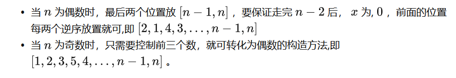

https://codeforces.com/contest/1728


## A

**题意:**

​	有一个袋子，里面有彩色的球。袋子里有n种不同颜色的球，编号从1到n。袋子里的球总数是奇数（例如：cnt1+cnt2+⋯+cntn是奇数）。在一次行动中，你可以选择两个不同颜色的球，并把它们从袋子里拿出来。在某些时候，袋子里剩下的所有球都会有相同的颜色。这时你就不能再做动作了。输出留到最后的球的颜色数量,有多个答案则挑选一个输出


**思路:**

​	无论何时，个数最多的颜色球一定有保留到最后的取法，所以直接输出最大值的位置就好了


**code**

```c++
#include <bits/stdc++.h>
using namespace std;
#define int long long
const int N = 30;
int a[N];
signed main()
{

     int t;
     cin >> t;
     while (t--)
     {
          int n;
          cin >> n;
          int max = 0, idx = 0;
          for (int i = 0; i < n; i++)
          {
               cin >> a[i];
               if(a[i]>max)
               {
                    max=a[i];
                    idx=i+1;
               }
          }
          cout<<idx<<'\n';
     }
}
```


## B

**题意：**

​	你需要构造一个长度为 n 的全排列p  ,使得x 在进行完下面的操作后最大：初始时 x=0,从1到n 遍历p,判断p[i]是否<x  ,x<p[i]  ,则 x=p[i]+x ,否则x=0  .

> ```
> 3
> 4
> 5
> 6
> ```
>
> 2 1 3 4
> 1 2 3 4 5
> 4 5 1 2 3 6


**思路:**

​	我们发现，要想使得x最后所剩最大，则一定是`n+n-1`(从样例输出中也可以发现)，因为我们一定要保证最后不会出现x>p[i]的情况,否则直接置0
​	这样我们的目的就转换为 把排列p最后两个设置为n-1，n，并且使得遍历到n-1的时候，x刚好为0，这样就能产生最大值`n+n-1`

​	分奇偶情况:

当个数为偶数：直接前面倒序输出，最后两个输出n-1和n就可以了

当个数为奇时：不能按照偶数情况去写了，不然到n-1的时候，x根本就不为0。
我们的最后两个任然是n-1和n，但n-1的前面就要是1 2 3，这样就使得遍历完3后，x刚好被置为0，并且遍历到1的时候，x也要是0(只要把1前面倒序输出就好)

```c++
if (n > 5)
               {
                    for (int i = n-2; i >= 4; i--)
                         cout << i << ' ';
               }
               cout << 1 << ' ' << 2 << ' ' << 3 << ' '<<n-1<<' '<<n;
```

当然对n-1的前面该如何排列,还有着其他的思路,比如按照1小1大的规律去排：




<!--一般这种构造题的思路，都来自于把玩样例，跟着样例走一遍得到样例的答案，就会有感觉，而且一看B题就发现，应该和n的大小没关系，n小n大，规律都是通用的-->


## C

### 输出操作数

**题意:**

​	有两个数组a,b,你要用最少的操作数使得ab数组经过排列后相同。

​	一次操作：把a[i]或b[i]的值变为它的位数，如100变为3


**思路:**

​	本题要先判断a,b数组是否有一样的数,有一样的数就要先删去,不用累加贡献。这时候由于每个数的范围在1e9，判断数有没有出现过要用哈希。并且本题数组中可能存在多个相同的数，所以不能单纯用m[a[i]]=1来表示，可以采用++.

​	除此以外的情况，如果某个数 x 大于等于 10 ，一定需要将其置为f(x)  ，因为其他数y 进行操作一定无法得到 x（  y进行一次操作后，一定小于等于 9 ）。

现在 a,b 数组内仅剩 0….9 

 此时，再进行判断，如果某个数在 a,b 中都有出现，则可以将它删去，不予考虑。

现在，将剩下的所有元素（除 1 以外）执行一次操作，将所有元素置为 1，处理完成后两个数组必定"相似"。

​	<!--新知识：用map的++--，表示元素的删去，元素x在a，b中数量相同，map[x]=0，b删完了a还有，map[x]>0，a删完了b还有，map[x]<0-->


**code:**

```c++
#include <bits/stdc++.h>
using namespace std;
#define int long long
const int N = 2e5 + 10;
int a[N], b[N];

int get(int n)
{
     int cnt = 0;
     while (n != 0)
     {
          n /= 10;
          cnt++;
     }
     return cnt;
}
signed main()
{

     int t;
     cin >> t;
     while (t--)
     {
          map<int, int> m, m1;
          int n;
          cin >> n;
          for (int i = 0; i < n; i++)
          {
               cin >> a[i];
               m[a[i]]++;
          }
          for (int i = 0; i < n; i++)
          {
               cin >> b[i];
               m[b[i]]--; //++--亮点
          }

          int sum = 0;
          for (auto [val, cnt] : m)
          {
               if (cnt == 0)
                    continue;
               if (get(val) != 1)
               {
                   
                    int e = get(val);
                    m[e] += cnt; // 注意:cnt可能为负数
                    m[val]=0;
                    sum += abs(cnt);
               }
          }
         
          for (auto [val, cnt] : m)
          {
               if (cnt == 0 || val == 1)
                    continue;
              
               sum += abs(cnt);
          }
         
          cout << sum << '\n';
     }
}
```


## D

### 区间dp


**题意:**

Alice 和 Bob 玩游戏，游戏规则是这样的：

给定一个长度为偶数的小写字母字符串 s，Alice 和 Bob 也有自己的字符串，最初是空的。  爱丽丝先手，然后他们交替操作。在一个操作中，玩家获取字符串 的第一个或最后一个字母，将其从 s 中删除，并将其添加到自己的字符串中的开头。直到字符串 s为空，操作结束，谁最后得到的字符串字典序小，谁获胜。

假设每个人都执行最优操作，那么最终的结局是 Alice 获胜，还是 Bob 获胜， 或者是平局(字符串相同)？


**思路:**

​	从小区间慢慢转移,推出大区间。先是假如s长度为2，答案易得。然后再为4，为6……

​	**定义** dp(i,j)表示：只考虑区间[i,j]  ,先手的那个人在最优策略下执行完所有操作后结局是**胜**(用 1 表示)，**平局**(用 0 表示)，**输**(用 -1 表示)。

显然先手的那个人想要的结果的优先级满足 1 > 0 > -1，即尽可能拿大的。

而后手的那个人会想方设法的拿到 -1 > 0 > 1，即尽可能拿小的。

考虑**转移：**

无非就四种情况,只考虑前两次操作

- 先手拿 i ,后手拿 j , 从 dp(i+1,j-1)转移

+ 先手拿 i ,后手拿 i+1 ，从 dp(i+2,j) 转移

这两种情况后手的人有选择权，它会尽量的拿小的，故需要取两者的 Min ，设为val1 

- 先手拿 j,后手拿i  , 从dp(i+1,j-1) 转移

+ 先手拿 j,后手拿 j-1 , 从dp(i,j-2)  转移

后两种情况分析方法一样，取两者的Min, 设为val2 

那么显然 dp(i,j)= max(val1,val2),因为先手者想要拿大的。


**code**

```c++
#include <bits/stdc++.h>
using namespace std;
#define int long long
const int N = 2e5 + 5;
string s;
int dp[2005][2005];
int calc(int l, int r, int x, int y)
{
     if (dp[l][r] != 0)
          return dp[l][r];
     if (s[x] == s[y])
          return 0;
     if (s[x] < s[y])
          return 1;
     else
          return -1;
}
int main()
{

     int T;
     cin >> T;
     while (T--)
     {
          cin >> s;
          int n = s.size();
          for (int i = 0; i < n - 1; i++)
          {
               dp[i][i + 1] = (s[i] == s[i + 1]) ? 0 : 1;
          }
          for (int len = 4; len <= n; len += 2)
          {
               for (int i = 0; i + len - 1 < n; i++)
               {
                    int j = i + len - 1;
                    dp[i][j] = max(min(calc(i, j - 2, j, j - 1), calc(i + 1, j - 1, j, i)), min(calc(i + 2, j, i, i + 1), calc(i + 1, j - 1, i, j)));
               }
          }
          if (dp[0][n - 1] == 0)
               cout << "Draw";
          else if (dp[0][n - 1] == 1)
               cout << "Alice";
          else
               cout << "Bob";
     }
     return 0;
}

```


