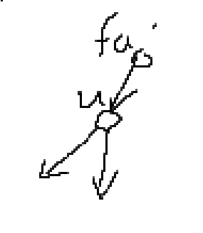

### A(数学)


#### 思路

```
	刚开始都不知道别人的代码,时间为什么超过一万多还没有相同的就直接退出输出-1.(可能太菜了...

	然后看了y总解释:
	t满足:b+xa=d+yc=t,且t一定>=b,>=d. 所以a一定能整除t-b,c一定能整除t-d. 所以t减若干个a和c的最小公倍数并不影响结果(t-b-ka不影响能被a整除的结果,t-c-kd也不影响)
	
	所以t-b(或t-d)必定在10000以内,大于10000的通过减若干个10000,都会回到10000里面.(10000是a和c取最大的时候的最小公倍数)
```


#### 代码

```c++
#include <iostream>
#include <cstring>
#include <algorithm>

using namespace std;

int main()
{
     int a, b, c, d;
     cin >> a >> b >> c >> d;

     for (int i = max(b, d); i <= 10100; i++)//10000+100
          if ((i - b) % a == 0 && (i - d) % c == 0)
          {
               cout << i << endl;
               return 0;
          }

     puts("-1");
     return 0;
}

```


### B

#### 思路


#### 代码

```c++
#include <bits/stdc++.h>
using namespace std;
const int N = 1e5 + 10;
int a[N], b[N];
vector<int> v1, v2;
int main()
{
     int n, m;
     cin >> n >> m;
     for (int i = 0; i < n; i++)
     {
          cin >> a[i];
          v1.push_back(a[i]);
     }
     for (int i = 0; i < m; i++)
     {
          cin >> b[i];
          v2.push_back(b[i]);
     }

     int i = 0, j = 0;
     int num = 1;
     while (i < n - 1 || j < m - 1)
     {
          if (v1[i] == v2[j])
          {
               i++;
               j++;
               num++;
          }
          else if (v1[i] < v2[j])
          {
               v1[i + 1] += v1[i];
               i++;
          }
          else if (v1[i] > v2[j])
          {
               v2[j + 1] += v2[j];
               j++;
          }
          // cout << i << ' ' << j << endl;
     }
     while (i < n - 1)
          num++;
     while (j < m - 1)
          num++;

     cout << num;
}
```


### C(树形dp)


#### 思路

```
	dfs两遍
	
	假如我们根确定的话,建立双向边,直接从dfs一遍,不需要翻转边就能走到的把边权值设为0,要翻转才能走到的把边权值设为1,走完整棵树后,从上往下回退的时候加上边权,最后得到的值就是需要翻转的条数.但这里不知道根,我们必须要把每个点都当做根走一遍,这样时间复杂度就变成n^2了,会超时.
	
	我们可以按照上面这个思路,假设1号点为根,dfs一遍,可以构造出一棵树,并且得到以1为根需要翻转的边数.然后其他点为根的情况可以通过以1位根的情况推断出来.如u为1,是根节点,它往下可以任意走,走完值也为0,但它要走到它的fa节点,就要加上1.我们通过第一遍dfs已经得到f[1]=1(1号根节点需要翻的边数),现在我们用它来转移得到其他:f[fa]就等于f[u]的值减掉u-fa这条边所贡献的值.如我们的f[u]的值就是通过翻转fa->u才得到的,所以我们要退出f[fa],就要减掉这个1,就是f[fa].
	
	y总思路应该也差不多,emmm,有点不同:
```




#### 代码

```c++
#include <bits/stdc++.h>
using namespace std;
const int N = 2e5 + 10;
struct edge
{
     int to, val;
};
vector<edge> v[N];
int f[N], dp[N];

void dfs_down(int x, int fa)
{
     for (auto t : v[x])
     {
          if (t.to == fa)
               continue;

          dfs_down(t.to, x);
          f[x] += f[t.to] + t.val;//从下往上的推(从最后节点开始)
     }
}

void dfs_up(int x, int fa)//fa就是x的父节点
{
     for (auto t : v[x])
     {
          if (t.to == fa)
               continue;

          dp[t.to] = dp[x] + (t.val == 1 ? 0 : 1) - (t.val == 1 ? 1 : 0);
         //从上往下的推(从根开始)
          dfs_up(t.to, x);
     }
}

int main()
{
     int n;
     cin >> n;
     for (int i = 0; i < n - 1; i++)
     {
          int x, y;
          cin >> x >> y;
          v[x].push_back({y, 0});
          v[y].push_back({x, 1});
     }

     dfs_down(1, -1);

     dp[1] = f[1];

     dfs_up(1, -1);
    
     int ans = 0x3f3f3f3f;
     for (int i = 1; i <= n; i++)
     {
          ans = min(ans, dp[i]);
     }
     cout << ans << endl;
     for (int i = 1; i <= n; i++)
     {
          if (ans == dp[i])
               cout << i << ' ';
     }
}
```


```c++
//y总代码
#include <iostream>
#include <cstring>
#include <algorithm>

using namespace std;

const int N = 200010, M = N * 2;

int n;
int h[N], e[M], w[M], ne[M], idx;
int down[N], up[N];

void add(int a, int b, int c)
{
    e[idx] = b, w[idx] = c, ne[idx] = h[a], h[a] = idx ++ ;
}

void dfs_down(int u, int from)//这里的from是指的边值,down就是向下走,
{
    for (int i = h[u]; ~i; i = ne[i])
    {
        if (i == (from ^ 1)) continue;//相等代表这条边不用翻转
        int j = e[i];
        dfs_down(j, i);
        down[u] += down[j] + w[i];
    }
}

void dfs_up(int u, int from)//向上走
{
    if (from != -1)
    {
        int fa = e[from ^ 1];
        up[u] = up[fa] + down[fa] - down[u] - w[from]  + w[from ^ 1];
    }

    for (int i = h[u]; ~i; i = ne[i])
    {
        if (i == (from ^ 1)) continue;
        int j = e[i];
        dfs_up(j, i);
    }
}

int main()
{
    scanf("%d", &n);
    memset(h, -1, sizeof h);
    for (int i = 0; i < n - 1; i ++ )
    {
        int a, b;
        scanf("%d%d", &a, &b);
        add(a, b, 0);
        add(b, a, 1);
    }

    dfs_down(1, -1);
    dfs_up(1, -1);

    int res = N;
    for (int i = 1; i <= n; i ++ )
        res = min(res, down[i] + up[i]);

    printf("%d\n", res);
    for (int i = 1; i <= n; i ++ )
        if (down[i] + up[i] == res)
            printf("%d ", i);

    return 0;
}


```

