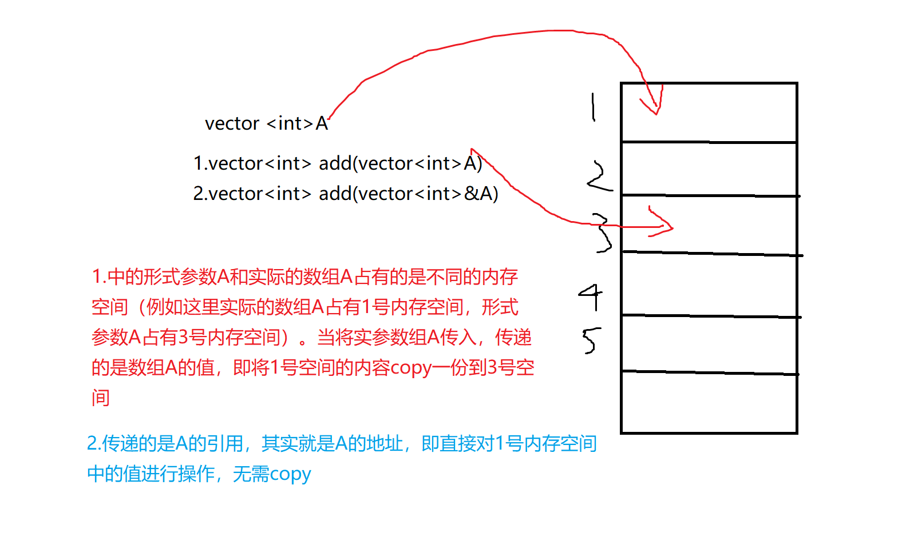
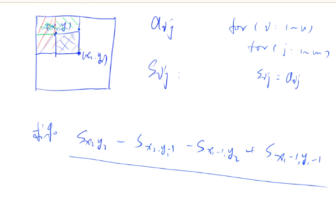
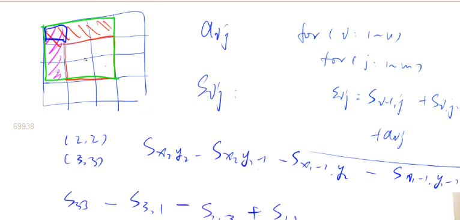
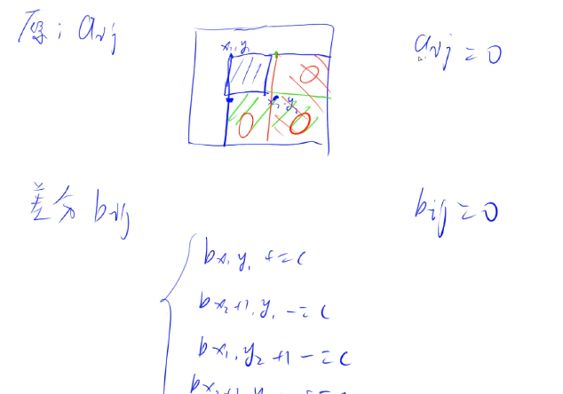

## lesson_2

c++的sort函数是快排和插排的一个组合

快排模板对于面试有一定帮助。


### 高精度问题

（用于c++。java(里面有大整数类)，python不适用）

#### 大整数的存储

它无法用于int，而是每位数字都存于数组。而数组的第一位应该存大数的个数（反过来的），接下来以此类推。

#### A+B

##### 思想

此时A和B的位数（长度）是小于10的六次方左右。

一个模拟小学人工加法的过程。对上下位相对应的数进行相加，满十进位....

觉得用于进位的t很妙。

##### 模板

```c++
vector<int> add(vector<int> &A, vector<int> &B)
//定义加法模板。加个引用&，为了增加效率，防止把整个数组copy一遍，会快很多。不加一般也没事。
{
    vector<int> C;
    int t = 0; //定义进位
    for (int i = 0; i < A.size() || i < B.size(); i++) //i小于A,B的最短的那个
    {
        if (i < A.size())
            t += A[i];
        if (i < B.size())
            t += B[i];
        C.push_back(t % 10);
        t /= 10;
        //如果这时候两个数相加大于10，则进的位就会存在t。，11的话就是1，23的话就是2
    }
    if (t) //如果最高位还要进位
        C.push_back(1);
    return C;
}

```


<!--vector<int> &A和vector<int>A的区别-->

```
	
	前者传的引用，可以操作内存，改变存储A的那段内存里面的值；后者传的是值，只能用A的值，修改不了A的内容。传实例本身本身有一个复制构造过程。传引用效率会提升，因为不需要再构造只是传了个别名。作为参数，如果不用引用，其实有个隐式过程，在函数内构造一个局部变量，再把传进来的复制给它


```




##### 例子

给定两个正整数（不含前导 0

），计算它们的和。

输入格式

共两行，每行包含一个整数。

输出格式

共一行，包含所求的和。

数据范围

1≤整数长度≤100000

输入样例：

```
12
23
```

输出样例：

```
35
```

| 难度：                                简单           |
| ---------------------------------------------------- |
| 时/空限制：                                1s / 64MB |
| 总通过数：                                28093      |
| 总尝试数：                                44561      |
| 来源：                                模板题         |
| 算法标签                                             |

------

​          

```cpp
#include <iostream>
#include <vector> //它自带size长度函数
using namespace std;
const int N = 1e6 + 10; //(防止边界问题， + 10更保险)
vector<int> add(vector<int> &A, vector<int> &B)
//定义加法模板。加个引用&，为了增加效率，防止把整个数组copy一遍。
{
    vector<int> C;
    int t = 0;                                         //定义进位
    for (int i = 0; i < A.size() || i < B.size(); i++) //i小于A,B的最短的那个
    {
        if (i < A.size())
            t += A[i];
        if (i < B.size())
            t += B[i];
        C.push_back(t % 10);
        t /= 10;
        //如果这时候两个数相加大于10，则进的位就会存在t。，11的话就是1，23的话就是2
    }
    if (t) //如果最高位还要进位
        C.push_back(1);
    return C;
}
int main()
{
    string a, b;
    vector<int> A, B;
    cin >> a >> b;
    for (int i = a.size() - 1; i >= 0; i--) //逆序
        A.push_back(a[i] - '0');            //-0 为了字母变数字
    //此时a要是123456，则A=[6,5,4,3,2,1]
    for (int i = b.size() - 1; i >= 0; i--)
        B.push_back(b[i] - '0');
    auto C = add(A, B); //auto,编译器自己推断变量是啥类型。
    for (int i = C.size() - 1; i >= 0; i--)
        printf("%d", C[i]); //C的最后一位就是答案的第一位
    return 0;
}
```

  

​        

​                                                                                                                    

#### A-B

##### 思想

A和B的位数（长度）是小于10的六次方左右

也是与小学人工减法列竖式类似。

但此时要分两种状况，当A-B的时候，A>B,就直接算A-B,而当B>A的时候，就计算-(B-A)。

觉得用于进位的t很妙。

##### 模板

```c
// C = A - B, 满足A >= B, A >= 0, B >= 0
vector<int> sub(vector<int> &A, vector<int> &B)
{
    vector<int> C;
    for (int i = 0, t = 0; i < A.size(); i++)
    {
        t = A[i] - t;
        if (i < B.size())
            t -= B[i];
        C.push_back((t + 10) % 10);
        if (t < 0)
            t = 1;
        else
            t = 0;
    }
    while (C.size() > 1 && C.back() == 0)
        C.pop_back();
    return C;
}

```


##### 例子

给定两个正整数（不含前导 0），计算它们的差，计算结果可能为负数。

输入格式

共两行，每行包含一个整数。

输出格式

共一行，包含所求的差。

数据范围

1≤整数长度≤105

输入样例：

```
32
11
```

输出样例：

```
21
```

| 难度：                                简单    |
| --------------------------------------------- |
| 时/空限制：                         1s / 64MB |
| 总通过数：                            23212   |
| 总尝试数：                            55118   |
| 来源：                                模板题  |
| 算法标签                                      |


```c
#include <iostream>
#include <vector>
using namespace std;
bool cmp(vector<int> &A, vector<int> &B) //比较A和B哪个数比较大
{
    if (A.size() != B.size())
        return A.size() > B.size();
    for (int i = A.size() - 1; i >= 0; i--)
    {
        if (A[i] != B[i]) //找到A和B第一位不相等的
            return A[i] > B[i];
    }
    return true; //要是所有都相等
}
vector<int> sub(vector<int> &A, vector<int> &B)
{
    vector<int> C;
    for (int i = 0, t = 0; i < A.size(); i++) //这里已经保证了A的size大于B。A是被减数
    {
        t = A[i] - t;     //用于进位
        if (i < B.size()) //判断B这一位有没有
            t -= B[i];
        C.push_back((t + 10) % 10);
        //应对出现减法过程中被减数不够大，向前借位的情况，
        if (t < 0) //已经向前借了一位
            t = 1;
        else
            t = 0; //没有借位
    }
    while (C.size() > 1 && C.back() == 0) //去掉前导0（减法过程中，高位相减后变成0的情况）
        C.pop_back();
    return C;
}
int main()
{
    string a, b;
    vector<int> A, B;
    cin >> a >> b;
    for (int i = a.size() - 1; i >= 0; i--)
        A.push_back(a[i] - '0');
    for (int i = b.size() - 1; i >= 0; i--)
        B.push_back(b[i] - '0');
    if (cmp(A, B))
    {
        auto C = sub(A, B);
        for (int i = C.size() - 1; i >= 0; i--)
            printf("%d", C[i]);
    }
    else
    {
        auto C = sub(B, A);
        printf("-");
        for (int i = C.size() - 1; i >= 0; i--)
            printf("%d", C[i]);
    }
    return 0;
}
```


#### A*a

##### 思想

大整数的长度是10的六次方，小的整数值小于10的9次方（1000，10000这种）

A的个位*a，就是个位 *a%10，然后再十位 *a+个位乘后的进位再%10......


觉得用于进位的t很妙。

##### 模板

```c
// C = A * b, A >= 0, b >= 0
vector<int> mul(vector<int> &A, int b)
{
    vector<int> C;

    int t = 0;
    for (int i = 0; i < A.size() || t; i++)//只要t不是0，就一直循环。和加法类似，只不过把两个循环写在一块了。
    {
        if (i < A.size())
            t += A[i] * b;
        C.push_back(t % 10);//只取个位
        t /= 10;//进位
    }

    while (C.size() > 1 && C.back() == 0)//去除前导0
        C.pop_back();

    return C;
}
```

##### 例子

给定两个非负整数（不含前导 0） *A* 和 *B*，请你计算 *A*×*B* 的值。

输入格式

共两行，第一行包含整数 *A*，第二行包含整数 *B*。

输出格式

共一行，包含 *A*×*B*的值。

数据范围

1≤*A*的长度≤100000,0≤*B*≤10000

输入样例：

```
2
3
```

输出样例：

```
6
```

| 难度：                                简单    |
| --------------------------------------------- |
| 时/空限制：                         1s / 64MB |
| 总通过数：                            19908   |
| 总尝试数：                             37052  |
| 来源：                                模板题  |
| 算法标签                                      |


```c
#include <iostream>
#include <vector>
using namespace std;
vector<int> mul(vector<int> &A, int b)
{
    vector<int> C;

    int t = 0;
    for (int i = 0; i < A.size() || t; i++)
    {
        if (i < A.size())
            t += A[i] * b;
        C.push_back(t % 10); //只取个位
        t /= 10;             //进位
    }

    while (C.size() > 1 && C.back() == 0) //去除前导0
        C.pop_back();

    return C;
}
int main()
{
    string a;
    int b;
    cin >> a >> b;
    vector<int> A;
    for (int i = a.size() - 1; i >= 0; i--)
        A.push_back(a[i] - '0');
    auto C = mul(A, b);
    for (int i = C.size() - 1; i >= 0; i--)
        printf("%d", C[i]);
    return 0;
}
```


#### A/b

##### 思路

高精度整数除低精度整数

求商和余数，模拟小学计算除法列竖式的过程。

被除数的单个位数除以除数后，剩下的模再与被除数的下一位一起除去除数。（这时候那个

和其他运算的不同点是，除法是从最高位开始算，而其他是从最低位开始算。但为了使这四则运算可以兼容，所以除法也是倒着来存。要是只有乘法的话，正着来存也可以。

##### 模板

```c
// A / b = C ... 商是C，余数是r
vector<int> div(vector<int> &A, int b, int &r) //r是余数
{
    vector<int> C;
    r = 0;
    for (int i = A.size() - 1; i >= 0; i -- )//从最高位开始算。
    {
        r = r * 10 + A[i];
        C.push_back(r / b);
        r %= b; 
    }
    reverse(C.begin(), C.end()); //要进行倒置
    while (C.size() > 1 && C.back() == 0) C.pop_back();
    return C;
}
```

##### 例子

给定两个非负整数（不含前导 0） *A*，*B*，请你计算 *A*/*B 的商和余数。

输入格式

共两行，第一行包含整数 *A*，第二行包含整数 *B*。


输出格式

共两行，第一行输出所求的商，第二行输出所求余数。


数据范围

1≤*A*的长度≤100000,1≤*B*≤10000,*B* 一定不为 0


输入样例：

```
7
2
```


输出样例：

```
3
1
```

| 难度：                                简单   |
| -------------------------------------------- |
| 时/空限制：                        1s / 64MB |
| 总通过数：                             16841 |
| 总尝试数：                             29374 |
| 来源：                                模板题 |
| 算法标签                                     |


```c++
#include <iostream>
#include <vector>
#include <algorithm> //为reverse准备
using namespace std;
vector<int> div(vector<int> &A, int b, int &r) //r是余数
{
    vector<int> C; //商
    r = 0;
    for (int i = A.size() - 1; i >= 0; i--) //从最高位开始算。
    {
        r = r * 10 + A[i];
        C.push_back(r / b);
        r %= b;
    }
    reverse(C.begin(), C.end()); //这时候C就是答案，但要与其他运算匹配，要将他进行倒置
    while (C.size() > 1 && C.back() == 0) //防止类似00999的情况
        C.pop_back();
    return C;
}
int main()
{
    string a;
    int b;
    vector<int> A;
    cin >> a >> b;
    for (int i = a.size() - 1; i >= 0; i--)
        A.push_back(a[i] - '0');
    int r;
    auto C = div(A, b, r);
    for (int i = C.size() - 1; i >= 0; i--)
        printf("%d", C[i]);
    cout << endl
         << r << endl; //引用了&，直接改变r值
    return 0;
}
```

<!--大整数相乘和大整数相除用的不多，所以不讲。-->


### 前缀和

#### 一维前缀和

##### 概念

这不是一个模板，而是一种思想。

它求的是一个数组里前i个数的和，下标要从1开始。

它的预处理复杂度是O(n),每次查询是O(1)。

##### 如何求

+ for循环，i从1开始，i++

  `s[i] = s[i - 1] + a[i];`

##### 作用

快速求出原数组里一段数的和。[l,r]范围的和=Sr-S(l-1)。

使查询的时候算法复杂度是O(1)。


##### 例子

输入一个长度为 *n* 的整数序列。接下来再输入 *m*个询问，每个询问输入一对 *l*,*r*。

对于每个询问，输出原序列中从第 *l*个数到第 *r* 个数的和。


输入格式

第一行包含两个整数 *n* 和 *m*。

第二行包含 *n* 个整数，表示整数数列。接下来 *m*行，每行包含两个整数 *l* 和 *r*，表示一个询问的区间范围。


输出格式

共 *m*行，每行输出一个询问的结果。


数据范围

1≤*l*≤*r*≤*n*,1≤*n*,*m*≤100000,−1000≤数列中元素的值≤1000


输入样例：

```
5 3
2 1 3 6 4
1 2
1 3
2 4
```

输出样例：

```
3
6
10
```

| 难度：                                简单    |
| --------------------------------------------- |
| 时/空限制：                         2s / 64MB |
| 总通过数：                            26710   |
| 总尝试数：                           34702    |
| 来源：                                模板题  |
| 算法标签                                      |

------

​          

```c++
#include <iostream>
using namespace std;
const int N = 100010;//因为n，m小于10万
int n, m;
int a[N], s[N];
int main()
{
    scanf("%d%d", &n, &m); 
    //用scanf实际上比cin更快。但可以在前面加ios...,但这样函数就无法再使用scanf，而且这样也没用scanf块。
    for (int i = 1; i <= n; i++)
    {
        scanf("%d", &a[i]);
    }
    //刚开始S[0]=0
    for (int i = 1; i <= n; i++)
    {
        s[i] = s[i - 1] + a[i];
    }
    while (m--)
    {
        int l, r;
        scanf("%d%d", &l, &r);
        printf("%d\n", s[r] - s[l - 1]);
    }
}
//使得算法复杂度就是O(100000)
//当数据大于100万的时候推荐用scanf
```

  

#### 二维前缀和

##### 概念

求出一个矩阵里的一块小矩阵的数据和

也是一种前缀，但是两个方向的前缀。

##### 作用

+ S[i, j] = 第i行j列格子左上部分所有元素的和
+ (x1, y1)为左上角，(x2, y2)为右下角的子矩阵的和为：
  S[x2, y2] - S[x1 - 1, y2] - S[x2, y1 - 1] + S[x1 - 1, y1 - 1]







##### 例子

输入一个 *n* 行 *m* 列的整数矩阵，再输入 *q* 个询问，每个询问包含四个整数 *x*1,*y*1,*x*2,*y*2，表示一个子矩阵的左上角坐标和右下角坐标。对于每个询问输出子矩阵中所有数的和。

输入格式

第一行包含三个整数 *n*，*m*，*q*。接下来 *n* 行，每行包含 *m* 个整数，表示整数矩阵。接下来 *q* 行，每行包含四个整数 *x*1,*y*1,*x*2,*y*2，表示一组询问。


输出格式

共 *q*行，每行输出一个询问的结果。


数据范围

1≤*n*,*m*≤1000,1≤*q*≤200000,1≤*x*1≤*x*2≤*n*,1≤*y*1≤*y*2≤*m*,−1000≤矩阵内元素的值≤1000


输入样例：

```
3 4 3
1 7 2 4
3 6 2 8
2 1 2 3
1 1 2 2
2 1 3 4
1 3 3 4
```

输出样例：

```
17
27
21
```

| 难度：                                简单  |
| ------------------------------------------- |
| 时/空限制：                       2s / 64MB |
| 总通过数：                          23484   |
| 总尝试数：                          32903   |
| 来源：                              模板题  |
| 算法标签                                    |

 

```c++
#include <iostream>
const int N = 1010;
int n, m, q;
int a[N][N], s[N][N];
int main()
{
    scanf("%d%d%d", &n, &m, &q);
    for (int i = 1; i <= n; i++)
    {
        for (int j = 1; j <= m; j++)
            scanf("%d", &a[i][j]);
    }
    
    for (int i = 1; i <= n; i++)
    {
        for (int j = 1; j <= m; j++)
        {
            s[i][j] = s[i - 1][j] + s[i][j - 1] - s[i - 1][j - 1] + a[i][j];
            //任意一块的数据和
        }
    }
    
    while (q--)
    {
        int x1, y1, x2, y2;
        scanf("%d%d%d%d", &x1, &y1, &x2, &y2);
        printf("%d\n", s[x2][y2] - s[x1 - 1][y2] - s[x2][y1 - 1] + s[x1 - 1][y1 - 1]);
    }
    return 0;
}

```

​       

 

```c++
//自己模仿着写的

#include <bits/stdc++.h>
using namespace std;
const int N = 1e3 + 10;
int Sum[N][N];
int a[N][N];
int n, m;
void Init()
{
     for (int i = 1; i <= n; i++)
          for (int j = 1; j <= m; j++)
          {
               Sum[i][j] = Sum[i - 1][j] + a[i][j] + Sum[i][j - 1] - Sum[i - 1][j - 1];
          }
}
int main()
{
     int q;
     ios_base::sync_with_stdio(false);
     cin.tie(nullptr);
     cout.tie(nullptr);
    
     cin >> n >> m >> q;
     for (int i = 1; i <= n; i++)
          for (int j = 1; j <= m; j++)
               cin >> a[i][j];
    
     Init();
    
     for (int i = 0; i < q; i++)
     {
          int x1, y1, x2, y2;
          cin >> x1 >> y1 >> x2 >> y2;
          cout << Sum[x2][y2] - Sum[x1 - 1][y2] - Sum[x2][y1 - 1] + Sum[x1 - 1][y1 - 1] << '\n';
     }
    
}

```

 


​                                                                                                                  

### 差分       

——前缀和的逆运算


#### 一维差分

##### 概念

给定一个原数组，a1,a2,a3....an。构造一个b数组，使b数组是a数组的前缀和

如：b1=a1,b2=a2-a1,b3=a3-a2,....bn=an-a(n-1)。

换句话说，每一个a[i]都是b数组中从头开始的一段区间和。


##### 作用

对b数组求前缀和就能得到a数组。(只要O(n)的时间)   

如：给定区间[l,r]，让我们把a数组中的[l,r]区间中的每一个数都加上c

暴力做法是for循环l到r区间，时间复杂度O(n)，如果我们需要对原数组执行m次这样的操作，时间复杂度就会变成O(n*m)。有没有更高效的做法吗? 考虑差分做法。

在差分数组里，对b数组的b[i]的修改，会影响到a数组中从a[i]及往后的每一个数。b[i]+c,则后面每个数都+c。因为al后面的每个数，都要用到bl。如：a(l+1)=b1+b2+b3+...bl+b(l+1)

所以首先让差分b数组中的 b[l] + c，然后再打个补丁，b[r+1] - c，这样对于a[r] 以后区间的数相当于没有发生改变。这方法的时间复杂度为O(1).

(实在不懂的话,自己在草稿纸举几个例子,很快就出来了)


##### 例子

  输入一个长度为 *n* 的整数序列。接下来输入 *m* 个操作，每个操作包含三个整数 *l*,*r*,*c*，表示将序列中 [*l*,*r*] 之间的每个数加上 *c*。请你输出进行完所有操作后的序列。


输入格式

第一行包含两个整数 *n*和 *m*。第二行包含 *n* 个整数，表示整数序列。接下来 *m* 行，每行包含三个整数 *l*，*r*，*c*表示一个操作。

输出格式

共一行，包含 *n*个整数，表示最终序列。


数据范围

1≤*n*,*m*≤100000,1≤*l*≤*r*≤*n*,−1000≤*c*≤1000,−1000≤整数序列中元素的值≤1000


输入样例：

```
6 3
1 2 2 1 2 1
1 3 1
3 5 1
1 6 1
```

输出样例：

```
3 4 5 3 4 2
```


```c

#include <iostream>
using namespace std;
const int N = 100010;
int n, m;
int a[N], b[N];

void insert(int l, int r, int c)
{
    b[l] += c;
    b[r + 1] -= c;	//打补丁,防止影响到a[r]后面的数
}

int main()
{
    scanf("%d%d", &n, &m);
    for (int i = 1; i <= n; i++)
        scanf("%d", &a[i]);  //输入第二行数据
    for (int i = 1; i <= n; i++)
        insert(i, i, a[i]); //插入b值。b1=a[1],b[2]=a[2]-a[1]....(初始化)
    
    while (m--)
    {
        int l, r, c;
        scanf("%d%d%d", &l, &r, &c);
        insert(l, r, c); //对b进行计算,一个范围加上或减去一个数
    }

    for (int i = 1; i <= n; i++)  //对差分数组求一遍前缀和。算出a[i]
        b[i] += b[i - 1];

    for (int i = 1; i <= n; i++)
        printf("%d ", b[i]);

    return 0;
}
```

  

#### 二维差分     

####                                                                                                     

##### 概念

————对原矩阵a~ij~构造差分矩阵b~ij~。和一维差分类似，能快速求出一片区域加上一个值后的样子




我们要求x~1~y~1~和x~2~y~2~组成的小矩形的所有元素+C后的值。我们利用二维差分，只要算出下面b~ij~的四个式子。不用再遍历x~1~y~1~和x~2~y~2~的小矩形的所有元素了.(如：bx~1~y~1~就是原数组矩阵的ax~1~y~1~右下角所有点)


##### 例子

输入一个 *n* 行 *m* 列的整数矩阵，再输入 *q* 个操作，每个操作包含五个整数x*1,*y*1,*x*2,*y*2,*c*，其中 (*x*1,*y*1) 和 (*x*2,*y*2) 表示一个子矩阵的左上角坐标和右下角坐标。每个操作都要将选中的子矩阵中的每个元素的值加上 *c*。请你将进行完所有操作后的矩阵输出。


输入格式

第一行包含整数 *n*,*m*,*q*。接下来 *n* 行，每行包含 *m* 个整数，表示整数矩阵。接下来 *q* 行，每行包含 5 个整数 *x*1,*y*1,*x*2,*y*2,*c*，表示一个操作。

输出格式

共 *n*行，每行 *m*个整数，表示所有操作进行完毕后的最终矩阵。


数据范围

1≤*n*,*m*≤1000,1≤*q*≤100000,1≤*x*1≤*x*2≤*n*,1≤*y*1≤*y*2≤*m*,−1000≤*c*≤1000,−1000≤矩阵内元素的值≤1000


输入样例：

```
3 4 3
1 2 2 1
3 2 2 1
1 1 1 1
1 1 2 2 1
1 3 2 3 2
3 1 3 4 1
```

输出样例：

```
2 3 4 1
4 3 4 1
2 2 2 2
```

| 难度：                                简单    |
| --------------------------------------------- |
| 时/空限制：                         2s / 64MB |
| 总通过数：                            18404   |
| 总尝试数：                            27917   |
| 来源：                                模板题  |
| 算法标签                                      |


```c++
#include <iostream>
#include <cstdio>
using namespace std;
const int N = 1e3 + 10;
int a[N][N], b[N][N];
void insert(int x1, int y1, int x2, int y2, int c)
{
    b[x1][y1] += c;
    b[x2 + 1][y1] -= c;
    b[x1][y2 + 1] -= c;
    b[x2 + 1][y2 + 1] += c;
}
int main()
{
    int n, m, q;
    cin >> n >> m >> q; //可以用scanf
    for (int i = 1; i <= n; i++)
        for (int j = 1; j <= m; j++)
            cin >> a[i][j];
    for (int i = 1; i <= n; i++)
    {
        for (int j = 1; j <= m; j++)
        {
            insert(i, j, i, j, a[i][j]); //构建差分数组,给b数组赋值
        }
    }
    
    while (q--)
    {
        int x1, y1, x2, y2, c;
        cin >> x1 >> y1 >> x2 >> y2 >> c;
        insert(x1, y1, x2, y2, c);
    }
    for (int i = 1; i <= n; i++)
    {
        for (int j = 1; j <= m; j++)
        {
            b[i][j] += b[i - 1][j] + b[i][j - 1] - b[i - 1][j - 1]; //二维前缀和
        }
    }
    for (int i = 1; i <= n; i++)
    {
        for (int j = 1; j <= m; j++)
        {
            printf("%d ", b[i][j]);
        }
        printf("\n");
    }
    return 0;
}

```

