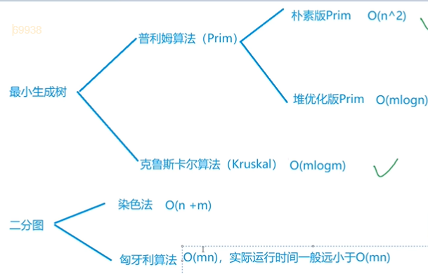
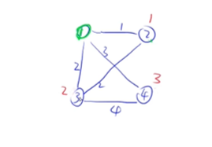
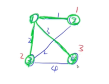
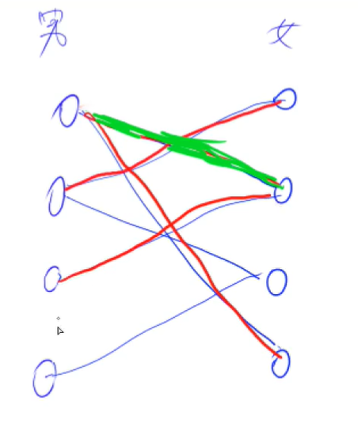

# 最小生成树

一般都是用于无向图。一个联通图的生成树就是图的极小联通子图，它包含图中所有的顶点和尽可能少的边。代表着它只要再少一条边就成为了不连通图，多一条边就有了回路。最小生成树就是一个图的不同的生成树中边权值最小的那个。

最小生成树的其中之一种问题是公路问题，一张地图上有n个城市，现在要铺公路，使得各个城市联通，求公路最少铺几米

## prim算法

和dj算法很像。

### 朴素版prim

用于稠密图，并且算法流程短。O(n^2^).(稠密图就是边的条数(范围)n^2^,稀疏图就是边的条数远小于n^2^)

#### 流程

<!--之前就讲过，图论的算法，不会讲为什么这样做是最短的，只会讲流程。算法推导过程，都可以看算法导论-->

贪心思想

和dj算法流程很类似。

把所有的距离dist[i]初始化为正无穷，创建一个集合，然后就是n次迭代，每次迭代找到不在集合中的最小距离的点，把它赋值给t，把t放集合里面去,用t更新其他点到集合(dj算法里是更新到起点的距离，这是一处不同)的距离。离集合的距离就是这个点里此时集合内所有点的距离的 *最小值* 。 

#### 模板

```c++
时间复杂度是 O(n2+m), n表示点数，m表示边数
int n;      // n表示点数
int g[N][N];        // 邻接矩阵，存储所有边
int dist[N];        // 存储其他点到当前最小生成树的距离
bool st[N];     // 存储每个点是否已经在生成树中


// 如果图不连通，则返回INF(值是0x3f3f3f3f), 否则返回最小生成树的树边权重之和
int prim()
{
    memset(dist, 0x3f, sizeof dist);

    int res = 0;
    for (int i = 0; i < n; i ++ )
    {
        int t = -1;
        for (int j = 1; j <= n; j ++ )
            if (!st[j] && (t == -1 || dist[t] > dist[j]))
                t = j;                       //找最小值

        if (i && dist[t] == INF) return INF;

        if (i) res += dist[t];
        st[t] = true;

        for (int j = 1; j <= n; j ++ ) dist[j] = min(dist[j], g[t][j]);
    }

    return res;
}

```


#### 题目

##### Prim算法求最小生成树

给定一个 n 个点 m 条边的无向图，图中可能存在重边和自环，边权可能为负数。

求最小生成树的树边权重之和，如果最小生成树不存在则输出 `impossible`。

给定一张边带权的无向图 G=(V,E)G=(V,E)，其中 V 表示图中点的集合，E 表示图中边的集合，n=|V|，m=|E|。

由 V 中的全部 n 个顶点和 E 中 n−1条边构成的无向连通子图被称为 G 的一棵生成树，其中边的权值之和最小的生成树被称为无向图 G 的最小生成树。

输入格式

第一行包含两个整数 n 和 m。

接下来 m 行，每行包含三个整数 u,v,w，表示点 u 和点 v 之间存在一条权值为 w 的边。

输出格式

共一行，若存在最小生成树，则输出一个整数，表示最小生成树的树边权重之和，如果最小生成树不存在则输出 `impossible`。

数据范围

1≤n≤500,
1≤m≤10^5^,

图中涉及边的边权的绝对值均不超过 10000。

输入样例：

```
4 5
1 2 1
1 3 2
1 4 3
2 3 2
3 4 4
```

输出样例：

```
6
```

```
首先在这四个点中找到离集合最近的点，因为刚开始离集合的距离都是正无穷(dist)，所以可以任选一个，我们选1号点，放入集合(标绿)，然后用它更新它所连接的其他点，2号点值从正无穷变为1,3号点值变为2,4号点变为3。接下来再选离集合距离最小的点，2号点。用它更新其他点...再选3号点，4号点....
	而最小生成树里的边就是你在把点存入集合后对应的那条边，存一个点，边也相对应确定一条(当前要存入集合的点到集合的距离)，这个边的权值要加入ans。(这道题就是算权值和)，先是1号点，没有边，再用1号点找到的二号点，有一条权值为1的边(标绿)，然后是三号点，两条边权值都为2，任意选一个，最后就是4号点，是一条权值为3的边，最后绿色组成的就是最小生成树
```






```c++
#include <string>
#include <iostream>
#include <algorithm>
#include <bits/stdc++.h>
using namespace std;
const int N = 510, INF = 0x3f3f3f3f;
int n, m;
int g[N][N]; //稠密图用邻接矩阵比较好
int dist[N]; //存这个点距离当前集合的距离
bool st[N];
int prim()
{
    memset(dist, 0x3f, sizeof dist);
    int res = 0; //存储最小生成树的长度之和
    for (int i = 0; i < n; i++)
    {
        int t = -1;
        for (int j = 1; j <= n; j++)
            if (!st[j] && (t == -1 || dist[t] > dist[j]))
                t = j; //不断遍历j，找当前的最小值

        if (i && dist[t] == INF)
            return INF;

        if (i) //只要不是第一个点
            res += dist[t];
        st[t] = true;

        for (int j = 1; j <= n; j++) //用t来更新所有点的dist
            dist[j] = min(dist[j], g[t][j]);
        //在dist要不断更新，因为它存的是距离集合的距离(最短)，在集合里的点变化后，它的值也会变化
    }
    return res;
}
int main()
{
    cin >> n >> m;
    memset(g, 0x3f, sizeof g);
    while (m--)
    {
        int a, b, c;
        cin >> a >> b >> c;
        g[a][b] = g[b][a] = min(g[a][b], c); //有重边
    }
    int t = prim();
    if (t == INF)
        cout << "impossible";
    else
        cout << t;
}
```


### 堆优化版prim

用于稀疏图，也是用堆优化了求最小值O(mlogn),但不常用，一般稀疏图用kru算法，它的算法思路比较清晰简单。而且因为这里的优化方式和dj的很像，所以本节课就不详细介绍了。


## Kruskal算法

用于稀疏图，O(mlogm)(和mlogn同，因为m<n^2^)

### 流程

先把所有边按照权重排序，可以用快排来排(sort函数)。O(mlogm)

从小到大枚举每条边a b 权重为c，如果a，b不连通，就将这条边加入集合中。(这一步操作的话就是连通块中点的数量这道题，并查集)O(m)

### 模板

```c++
时间复杂度是 O(mlogm), n 表示点数，m 表示边数
int n, m;       // n是点数，m是边数
int p[N];       // 并查集的父节点数组

struct Edge     // 存储边
{
    int a, b, w;

    bool operator< (const Edge &W)const
    {
        return  W.w>w;//升序
    }
}edges[M];

int find(int x)     // 并查集核心操作
{
    if (p[x] != x) p[x] = find(p[x]);
    return p[x];
}

int kruskal()
{
    sort(edges, edges + m);

    for (int i = 1; i <= n; i ++ ) p[i] = i;    // 初始化并查集

    int res = 0, cnt = 0;
    for (int i = 0; i < m; i ++ )
    {
        int a = edges[i].a, b = edges[i].b, w = edges[i].w;

        a = find(a), b = find(b);
        if (a != b)     // 如果两个连通块不连通，则将这两个连通块合并
        {
            p[a] = b;
            res += w;
            cnt ++ ;
        }
    }

    if (cnt < n - 1) return INF;
    return res;
}
```

### 题目


#### Kruskal算法求最小生成树


给定一个 n 个点 m 条边的无向图，图中可能存在重边和自环，边权可能为负数。

求最小生成树的树边权重之和，如果最小生成树不存在则输出 `impossible`。

给定一张边带权的无向图 G=(V,E)，其中 V 表示图中点的集合，E 表示图中边的集合，n=|V|，m=|E|。

由 V 中的全部 n个顶点和 E 中 n−1 条边构成的无向连通子图被称为 G 的一棵生成树，其中边的权值之和最小的生成树被称为无向图 G 的最小生成树。

输入格式

第一行包含两个整数 n 和 m。

接下来 m 行，每行包含三个整数 u,v,w，表示点 u和点 v 之间存在一条权值为 w 的边。

输出格式

共一行，若存在最小生成树，则输出一个整数，表示最小生成树的树边权重之和，如果最小生成树不存在则输出 `impossible`。

数据范围

1≤n≤10^5^ 1≤m≤2∗10^5^
图中涉及边的边权的绝对值均不超过 1000。

输入样例：

```
4 5
1 2 1
1 3 2
1 4 3
2 3 2
3 4 4
```

输出样例：

```
6
```

| 难度：**简单**         |
| ---------------------- |
| 时/空限制：1.5s / 64MB |
| 总通过数：17295        |
| 总尝试数：30009        |
| 来源：模板题           |
| 算法标签               |


```c++
#include <string>
#include <iostream>
#include <algorithm>
#include <bits/stdc++.h>
using namespace std;
const int N = 200010;
int n, m;
int p[N];

struct Edge // 存储边
{
    int a, b, w;
    bool operator<(const Edge &W) const //重载运算符
    {
        return  W.w>w;
    }
} edges[N];

int find(int x) // 并查集核心操作
{
    if (p[x] != x)
        p[x] = find(p[x]);
    return p[x];
}

int main()
{
    cin >> n >> m;
    for (int i = 0; i < m; i++)//i是边的编号
    {
        int a, b, w;
        cin >> a >> b >> w;
        edges[i] = {a, b, w};
    }
    
    sort(edges, edges + m); //或者可以自己写一个cmp函数，按w进行排序
    for (int i = 1; i <= n; i++)
        p[i] = i;
    
    int res = 0, cnt = 0;

    for (int i = 0; i < m; i++)
    {
        int a = edges[i].a, b = edges[i].b, w = edges[i].w;
        a = find(a), b = find(b);
        if (a != b) // 合并边操作
        {
            p[a] = b; //加入之后，要进行合并
            res += w;
            cnt++; //当前加了多少条边
        }
    }
    if (cnt < n - 1)//加到最后边小于n-1，代表图不连通
        puts("impossible");
    else
        cout << res; //输出所有边的长度之和
}
```


# 二分图

先判断是否是二分图，采用染色法


## 染色法

### 流程

一个简单的dfs遍历。深度优先遍历复杂度是线性的，O(m+n)

判断一个图是不是二分图。用到了一个很经典的性质：一个图是二分图，当且仅当图中不含奇数环(一个环当中的边是奇数)。(意思是：一个图中有奇数环，它就不是二分图).

什么是二分图呢？把所有点分进两个集合，使每个集合内部的点构不成1条边。(假如1 2是两个点，题目把1,2两个点连在了一起，所以我们就要把1放在1个集合，2放在一个集合，如果他们在同一个集合，集合内部就有边了)。这也是奇数环不是二分图的原因(y总给了充分性必要性的证明，可以看一下视频)。

所以从上面可以找到如何一个图是不是二分图的方法。遍历所有点，找到一个没有染色的点，就把染成白色(白色代表一个集合，黑色代表另一个集合)，再把它连接的点都染成黑色，一直遍历完所有点。如中间出现矛盾了(如一个白色点遍历自己所连接到的点却碰到了另一个白色)，这时候就代表它不是二分图(而这个遍历过程矛盾的原因就是里面有奇数环)。这里用dfs，它的代码短一点。


### 模板

```c++
时间复杂度是 O(n+m), n 表示点数，m 表示边数
int n;      // n表示点数
int h[N], e[M], ne[M], idx;     // 邻接表存储图
int color[N];       // 表示每个点的颜色，-1表示未染色，0表示白色，1表示黑色

// 参数：u表示当前节点，c表示当前点的颜色
bool dfs(int u, int c)
{
    color[u] = c;
    for (int i = h[u]; i != -1; i = ne[i])
    {
        int j = e[i];
        if (color[j] == -1)
        {
            if (!dfs(j, !c)) return false;
        }
        else if (color[j] == c) return false;
    }

    return true;
}

bool check()
{
    memset(color, -1, sizeof color);
    bool flag = true;
    for (int i = 1; i <= n; i ++ )
        if (color[i] == -1)
            if (!dfs(i, 0))
            {
                flag = false;
                break;
            }
    return flag;
}
```


### 题目

#### 染色法判定二分图

给定一个 n 个点 m 条边的无向图，图中可能存在重边和自环。

请你判断这个图是否是二分图。

输入格式

第一行包含两个整数 n 和 m。

接下来 m 行，每行包含两个整数 u 和 v，表示点 u 和点 v 之间存在一条边。

输出格式

如果给定图是二分图，则输出 `Yes`，否则输出 `No`。

数据范围

1≤n,m≤105

输入样例：

```
4 4
1 3
1 4
2 3
2 4
```

输出样例：

```
Yes
```


```
dfs算法，这里先找一个顶点，把它染成白色(0),然后for循环遍历它所连接的每一个点，在for循环里用dfs探索每一条支路。
```

```c++
#include <string>
#include <iostream>
#include <algorithm>
#include <bits/stdc++.h>
using namespace std;
const int N = 100010, M = 200010;
int n, m;
int h[N], e[M], ne[M], idx;
int color[N];
void add(int a, int b)
{
    e[idx] = b, ne[idx] = h[a], h[a] = idx++;
}
bool dfs(int u, int c)
{
    // c为0意思是染成白色，1染成黑色
    color[u] = c;                          //给这个点赋上颜色
    for (int i = h[u]; i != -1; i = ne[i]) //遍历这个点连接到的点
    {
        int j = e[i];
        if (color[j] == -1) //没有染过颜色的话开始染色,!c就是染色的意思
        {
            if (!dfs(j, !c)) // dfs递归
                return false;
        }
        else if (color[j] == c) //如果dfs遍历时矛盾了。碰到了0(白色)
            return false;
    }
    return true;
}
int main()
{
    cin >> n >> m;
    memset(h, -1, sizeof h); //用到邻接表都要的初始化
    while (m--)
    {
        int a, b;
        cin >> a >> b;
        add(a, b), add(b, a);
    }
    bool flag = true; //判断染色过程有没有矛盾
    memset(color, -1, sizeof color);//起初所有点没颜色(-1)
    for (int i = 1; i <= n; i++)
    {
        if (color[i] == -1)
            if (!dfs(i, 0))
            {
                flag = false;
                break;
            }
    }
    if (flag)
        puts("Yes");
    else
        puts("No");
}
```


## 匈牙利算法

### 流程

经典，求二分图的最大匹配。最坏情况是O(mn),但实际运行是远小于它的。

匈牙利算法可以在较短时间内返回二分图成功匹配的最大数量。匹配只的是边的数量，一次成功匹配意思是不存在两条边共用一个点

匈牙利算法可以用男女朋友关系来比喻，(一个男的只能和一个女的确立关系)如图，左边男生(1-4)，右边女生(5-8)。从1号点开始，他和6在一起了，然后看2，他和5在一起了，再看3，他喜欢7，但7已经有喜欢的人了，所以我们再看7喜欢的男人1，能不能换一个人喜欢，发现他还喜欢8，所以我们这时候就可以安排他和8在一起，3和7在一起。以此类推…(y总本算法化为人生导师),所以最终匹配数量为4。



### 模板

```c++
时间复杂度是 O(nm), n 表示点数，m 表示边数
int n1, n2;     // n1表示第一个集合中的点数，n2表示第二个集合中的点数
int h[N], e[M], ne[M], idx;     // 邻接表存储所有边，匈牙利算法中只会用到从第一个集合指向第二个集合的边，所以这里只用存一个方向的边
int match[N];   // 存储第二个集合中的每个点当前匹配的第一个集合中的点是哪个
bool st[N];     // 表示第二个集合中的每个点是否已经被遍历过

bool find(int x)
{
    for (int i = h[x]; i != -1; i = ne[i])
    {
        int j = e[i];
        if (!st[j])
        {
            st[j] = true;
            if (match[j] == 0 || find(match[j]))
            {
                match[j] = x;
                return true;
            }
        }
    }
    return false;
}

// 求最大匹配数，依次枚举第一个集合中的每个点能否匹配第二个集合中的点
int res = 0;
for (int i = 1; i <= n1; i ++ )
{
    memset(st, false, sizeof st);
    if (find(i)) res ++ ;
}
```

###  

### 题目

#### 二分图的最大匹配

给定一个二分图，其中左半部包含 n~1~个点（编号 1∼n~1~），右半部包含 n~2~ 个点（编号 1∼n~2~），二分图共包含 m 条边。

数据保证任意一条边的两个端点都不可能在同一部分中。

请你求出二分图的最大匹配数。

> 二分图的匹配：给定一个二分图 G，在 G 的一个子图 M 中，M 的边集 {E} 中的任意两条边都不依附于同一个顶点，则称 M 是一个匹配。
>
> 二分图的最大匹配：所有匹配中包含边数最多的一组匹配被称为二分图的最大匹配，其边数即为最大匹配数。

输入格式

第一行包含三个整数 n~1~、 n~2~和 m。

接下来 m 行，每行包含两个整数 u 和 v，表示左半部点集中的点 u 和右半部点集中的点 v 之间存在一条边。

输出格式

输出一个整数，表示二分图的最大匹配数。

数据范围

1≤n1,n2≤500, 1≤u≤n 1≤v≤n~2~, 1≤m≤10^5^

输入样例：

```
2 2 4
1 1
1 2
2 1
2 2
```

输出样例：

```
2
```

| 难度：**简单**       |
| -------------------- |
| 时/空限制：1s / 64MB |
| 总通过数：13367      |
| 总尝试数：24878      |
| 来源：模板题         |
| 算法标签             |

------

```
虽然是无向图，但我们思路里都是男生主动考虑女生，所以不用建立两条边
```


```c++
#include <string>
#include <iostream>
#include <algorithm>
#include <bits/stdc++.h>
using namespace std;
const int N = 510, M = 100010;
int n1, n2, m;
int h[N], e[M], ne[M], idx;
bool st[N];
int match[N];
void add(int a, int b)
{
    e[idx] = b, ne[idx] = h[a], h[a] = idx++;
}
bool find(int x)
{
    for (int i = h[x]; i != -1; i = ne[i]) //枚举他看上了几个妹子
    {
        int j = e[i];
        if (!st[j]) //这个妹子必须之前没有考虑过
        {
            st[j] = true;
            if (match[j] == 0 || find(match[j]))
            //如果这个妹子还没有匹配任何男生，或者匹配了男生，但是可以给这个男生找到下家，那这个妹子也是空的
            {
                match[j] = x; //那就把这个妹子给当前这个男生
                return true;
            }
        }
    }
    return false; //实在找不到就只能返回false
}
int main()
{
    cin >> n1 >> n2 >> m;
    memset(h, -1, sizeof h);
    while (m--)
    {
        int a, b;
        cin >> a >> b;
        add(a, b); //不用双向
    }
    int res;
    for (int i = 1; i <= n1; i++)
    {
        memset(st, false, sizeof st);
        if (find(i)) //找到了
            res++;
    }
    cout << res;
}
```

