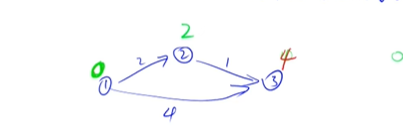
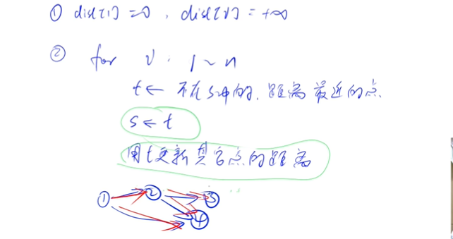
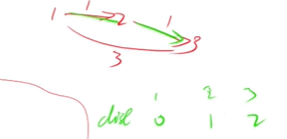
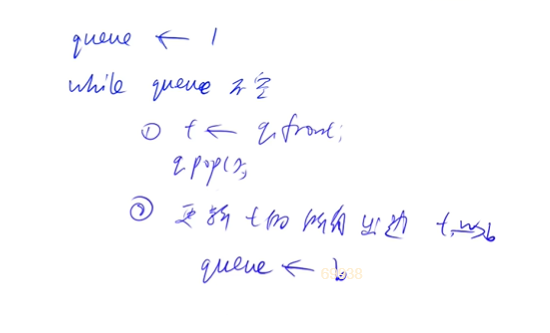

### 知识结构

最短路问题(图论)最主要考察的就是建图，怎么把原问题画成，抽象成最短路问题(如何建立点和边….)然后去套用下面的这些模板。所以以下算法的原理不会讲解，可以百度。现在主要讲如何去实现，抽象。(相关的题目acwing有)

+ 单源最短路

  从一个点到其他所有点的最短路问题。(求从一号点到n号点的最短路)

  ​	这个最短路又分为两类：

  + 所有边都是正权值的图

    ​	有两个算法可以处理：

    + 朴素版本Dijkstra算法(O(n^2^)其实准确来说是O(n^2^+m),n是点的数量，m是边的数量)

      

    + 堆优化的Dijkstra算法(O(mlogn)) 所以不一定朴素版比堆优化慢，朴素版适合稠密图(边数和n^2^差不多)。而当边和点的个数1都差不多是10^5^,则要用优化。不然五次方再平方就太大了

      

      

  + 存在负权边

    ​	也有两种实现方式

    + Bellman-Ford算法(O(nm))

      

    + SPFA算法  可以看成对于上一个算法的优化，一般情况下是线性O(m),最坏是O(nm)。虽说是个优化，但并不是所有算法用SPFA都可以做。要是对经过的边数有限制(<=k)，则只能用上一个

      

    

  

+ 多源汇最短路

  起点和终点不确定了(任选两个点的最短路问题,求很多起点到终点的最短路)

  使用Floyd算法(O(N^3^))

我们发现上面并没有区分有向图和无向图，因为无向图只要连两条变就可以了


### 朴素版Dijkstra算法

#### 过程

dist数组存储着各个点到1号点的距离

1:先初始化距离。把一号点(起点)的距离存入数组赋值为0(dis[1]=0)，其他点是赋值为无穷，dis[i]=无穷。并且再建立一个数组s，以后这里面存入已经确定最短距离的点。

2:进行for循环(0——n个点)，每一次确定一个点的最短路(到原点)。

先找到一个不在s数组里面的却已经知道最短路径的点t，先把它存入s，再用它来推出与它相连接的那些点最短距离(每个点取min(dist[j], dist[t] + `g[t][j]`)来重新赋值)。然后第二轮再在已经确定最短距离的点(不包括上一个已经存入s的点t)里再找一个最小值,继续更新.....

(如第一次，s数组无值，而已知的点起点的距离一定是最小的，0。把它存入s。然后2号点和三号点的dis变为2和4第一次结束。再进行第二次，已知最小的t是2号点，通过min(dist[3], dist[2] + `g[2][3]`得出3号点的值变为3)





有一种dp的感觉，从前面的状态退出后面的状态。

外层一次循环，内层找最小值又以此循环，n^2^。

并且这种算法，用于稠密图，之前讲过，它用邻接矩阵来存。(稀疏图用邻接表)


复杂度分析


找最小点赋值给t，在n次循环里每一遍又要找n次。

用t更新边的距离，总次数是m次(这里也是n^2^，在稠密图里n^2^和m是同个级别)


#### 模板

```c++
时间复杂是 O(n2+m), n 表示点数，m 表示边数
int g[N][N];  // 存储每条边
int dist[N];  // 存储1号点到每个点的最短距离
bool st[N];   // 存储每个点的最短路是否已经确定

// 求1号点到n号点的最短路，如果不存在则返回-1
int dijkstra()
{
    
    memset(dist, 0x3f, sizeof dist);
    dist[1] = 0;

    for (int i = 0; i < n - 1; i ++ )
    {
        int t = -1;     // 在还未确定最短路的点中，寻找距离最小的点
        for (int j = 1; j <= n; j ++ )
            if (!st[j] && (t == -1 || dist[t] > dist[j]))
                t = j;

        // 用t更新其他点的距离
        for (int j = 1; j <= n; j ++ )
            dist[j] = min(dist[j], dist[t] + g[t][j]);

        st[t] = true;
    }

    if (dist[n] == 0x3f3f3f3f) return -1;
    return dist[n];
    
}
```


#### 题目

##### Dijkstra求最短路 I

给定一个 n 个点 m 条边的有向图，图中可能存在重边和自环，所有边权均为正值。

请你求出 1 号点到 n 号点的最短距离，如果无法从 1 号点走到 n号点，则输出 −1。


输入格式

第一行包含整数 n 和 m。

接下来 m 行每行包含三个整数 x,y,z，表示存在一条从点 x 到点 y 的有向边，边长为 z。

输出格式

输出一个整数，表示 1 号点到 n 号点的最短距离。

如果路径不存在，则输出 −1。


数据范围

1≤n≤500,
1≤m≤105, (看出是稠密图)
图中涉及边长均不超过10000。

输入样例：

```
3 3
1 2 2
2 3 1
1 3 4
```

输出样例：

```
3
```


```
存在重边和自环，重边:两个点之间有多条边 自环:自己出发指向自己。在最短路问题，自环不影响，有多条边的话则保存最短的边。
```


```c++
#include <iostream>
#include <algorithm>
#include <cstring>
using namespace std;
const int N = 510;
int n, m;
int g[N][N];
int dis[N];
bool st[N]; //判断这个点有没有设定最短路
int dij()
{
    memset(dis, 0x3f, sizeof dis);
    dis[1] = 0;
    for (int i = 0; i < n; i++)
    {
        int t = -1; //刚开始t还没确定，设为-1
        for (int j = 1; j <= n; j++)
            if (!st[j] && (t == -1 || dis[t] > dis[j]))
                t = j;

        // 用t更新其他点的距离
        for (int j = 1; j <= n; j++)
            dis[j] = min(dis[j], dis[t] + g[t][j]);

        st[t] = true;//这个点已经确定最小值，存入s数组
    }
    if (dis[n] == 0x3f3f3f3f) //如果不连通的话
        return -1;
    return dis[n];
}
int main()
{
    scanf("%d%d", &n, &m);
    memset(g, 0x3f, sizeof g);
    while (m--)
    {
        int a, b, c;
        scanf("%d%d%d", &a, &b, &c);
        g[a][b] = min(g[a][b], c);
    }
    int t = dij();
    cout << t;
}
```

```c++
//自己手敲一遍

#include <bits/stdc++.h>
using namespace std;
const int N = 510;
int a[N][N];
int n, m;
int dis[N], st[N];
void dij()
{
     dis[1] = 0;
     //不能在这加st[1]=1,因为这时候1还在集合外
     for (int i = 0; i < n; i++)
     {
          int t = -1;
          for (int j = 1; j <= n; j++)
          {
               if (!st[j] && (t == -1 || dis[t] > dis[j]))
                    t = j; //找到没在集合的最小距离的点.i=0的时候,这个点是1
          }
          st[t] = 1; //把这个点放入集合
          for (int j = 1; j <= n; j++)
          {
               if (dis[t] + a[t][j] < dis[j])
                    dis[j] = dis[t] + a[t][j];
          }
     }
}
int main()
{

     cin >> n >> m;
     memset(a, 0x3f3f3f3f, sizeof a);
     memset(dis, 0x3f3f3f3f, sizeof dis);
     for (int i = 0; i < m; i++)
     {
          int x, y, z;
          cin >> x >> y >> z;
          a[x][y] = min(a[x][y], z);
     }
     dij();
     int ans = 0x3f3f3f3f;
     for (int i = 1; i <= n; i++)
     {
          ans = min(ans, dis[i]);
     }
     if (dis[n] == 0x3f3f3f3f)
          cout << -1;
     else
          cout << dis[n];
}
```


### 堆优化版Dijkstra


#### 过程

如果上面那题，n再大一点，就会爆掉。所以要去优化。

上面那个Dijkstra算法，最花时间得到就在于找到最小值(n^2^),我们发现这个可以用以前学的堆去找,复杂度变为O(1)，然后在堆中更新值是logn,更新m次，是mlogn。(稀疏图是每次遍历从t出去的所有边，t会遍历1-n。就等于遍历了总边数m。如遍历1号点的所有边，1->2,1->4。再遍历2号点，2->3,2->4。3号4号没有边)



​	因为是稀疏图(点的个数太多了)，用邻接矩阵(二维数组)存不下，所以改为邻接表。

这里堆有两种实现方式

+ 手写堆 (增加映射)

+ c++的优先队列。但它不支持像手写堆修改元素的操作的，它实现的方法是往里面插入新的数，这可能会造成点变成m个，但由于是稀疏图，m<=n^2^，则其实也和原本的n个差不多。所以一半堆优化版本都用优先队列。


#### 模板

```c++
typedef pair<int, int> PII;

int n;      // 点的数量
int h[N], w[N], e[N], ne[N], idx;       // 邻接表存储所有边
int dist[N];        // 存储所有点到1号点的距离
bool st[N];     // 存储每个点的最短距离是否已确定

// 求1号点到n号点的最短距离，如果不存在，则返回-1
int dijkstra()
{
    memset(dist, 0x3f, sizeof dist);
    dist[1] = 0;
    priority_queue<PII, vector<PII>, greater<PII>> heap;
    heap.push({0, 1});      // first存储距离，second存储节点编号

    while (heap.size())
    {
        auto t = heap.top();
        heap.pop();

        int ver = t.second, distance = t.first;

        if (st[ver]) continue;
        st[ver] = true;

        for (int i = h[ver]; i != -1; i = ne[i])
        {
            int j = e[i];
            if (dist[j] > distance + w[i])
            {
                dist[j] = distance + w[i];
                heap.push({dist[j], j});
            }
        }
    }

    if (dist[n] == 0x3f3f3f3f) return -1;
    return dist[n];
}

```


#### 题目

##### Dijkstra求最短路 II


给定一个 n 个点 m 条边的有向图，图中可能存在重边和自环，所有边权均为非负值。

请你求出 1 号点到 n 号点的最短距离，如果无法从 1 号点走到 n 号点，则输出 −1。


输入格式

第一行包含整数 n 和 m。

接下来 m 行每行包含三个整数 x,y,z，表示存在一条从点 x 到点 y 的有向边，边长为 z。

输出格式

输出一个整数，表示 1 号点到 n 号点的最短距离。

如果路径不存在，则输出 −1。


数据范围

1≤n,m≤1.5×105,
图中涉及边长均不小于 0，且不超过 10000。
数据保证：如果最短路存在，则最短路的长度不超过 109。


输入样例：

```
3 3
1 2 2
2 3 1
1 3 4
```

输出样例：

```
3
```


```c++
#include <iostream>
#include <algorithm>
#include <cstring>
#include <queue>
using namespace std;
typedef pair<int, int> PII;
const int N = 100010;
int n, m;
int h[N], w[N], e[N], ne[N], idx; // w表示权重
int dis[N];
bool st[N]; //判断这个点有没有设定最短路

void add(int a, int b, int c)
{
     e[idx] = b, w[idx] = c, ne[idx] = h[a], h[a] = idx++;
}

int dij()
{
     memset(dis, 0x3f, sizeof dis);
     dis[1] = 0;
     priority_queue<PII, vector<PII>, greater<PII>> heap; //从小到大出队，优先队列的写法
     heap.push({0, 1});                                   //存入距离是0编号是1的点，起点。
     while (heap.size())
     {
          auto t = heap.top();
          heap.pop();
          int ver = t.second, distance = t.first;
          if (st[ver])
               continue;
          st[ver] = true;

          for (int i = h[ver]; i != -1; i = ne[i])
          {
               int j = e[i];
               if (dis[j] > distance + w[i])
               {
                    dis[j] = distance + w[i];
                    heap.push({dis[j], j});
               }
          }
     }

     if (dis[n] == 0x3f3f3f3f) //如果不连通的话
          return -1;
     return dis[n];
}

int main()
{
     scanf("%d%d", &n, &m);
     memset(h, -1, sizeof h);
     while (m--)
     {
          int a, b, c;
          scanf("%d%d%d", &a, &b, &c);
          add(a, b, c); //用邻接表存，重边就无所谓了，算法保证一定会选最短的边
     }
     int t = dij();
     cout << t;
}
```


```cpp
#include <bits/stdc++.h>
using namespace std;
const int N = 1.5e5 + 10;
struct node
{
     int id, val;
};
vector<node> v[N]; //有些题讨论边,存边,有些讨论点,存点.
typedef pair<int, int> pii;
int n, m;
int st[N], dis[N];
void dij()
{
     dis[1] = 0;
     priority_queue<pii, vector<pii>, greater<pii>> q;
     q.push({0, 1});

     while (q.size()) //类似于bfs的思想,不用再for循环了
     {
          auto t = q.top(); //取最小值
          q.pop();
          int w = t.first, y = t.second;
          if (st[y]) //防止已经确定最小值的点,在队列中还有,结果又判断了一次.continue节省时间.
          //如题目样例
          {
               continue;
          }
          st[y] = 1;
          for (auto e : v[y])
          {
               if (!st[e.id])
               {
                    if (dis[e.id] > w + e.val)
                    {
                         dis[e.id] = w + e.val;
                         q.push({dis[e.id], e.id}); //更新过的值都放入队列
                    }
               }
          }
     }
}
int main()
{
     memset(dis, 0x3f, sizeof dis);
     cin >> n >> m;
     for (int i = 0; i < m; i++)
     {
          int x, y, z;
          cin >> x >> y >> z;
          v[x].push_back({y, z});
     }
     dij();
     if (dis[n] == 0x3f3f3f3f)
          cout << -1;
     else
          cout << dis[n];
}
```


### Bellman-Ford算法


#### 过程

for循环n次。每一次都还循环所有边(m次)(a,b,w	表示存在一条从a走向b的边，权重是w)，所以这个算法有两重循环。这个算法存边的方式可以随便存，不一定用邻接表用结构体也行，只要能遍历就行。每一次遍历(循环)边的时候还同时要进行更新(松弛操 作)dist[b]=min(dist[b],dist[a]+w).循环完n次之后，保证了所有的边都满足dist[b]<=dist[a]+w。

它是用于处理有负权边的最短路，但注意，要是题目存在负权回路的时候(1,2,3  2,3,-4  3,4,-5如这三条边，你发现绕一圈反而路程-6)，最小值是不存在的，因为每走完这样的回路一圈，走的路程不增反减，这样不停的转，会减到无穷小，但有一个情况注意，要是这个负权回路与我们最终要去的那个点没有一点关系(走负权回路根本到不了目的地)，那么它就不影响最小值。而且当题目限制所走的边的条数的话，有负权回路也没事，因为就不会不停地减了。

这里的迭代n次，这个意思:如果是刚循环完k次，则就已经确定了从1号点经过不超过k条边的最短路。而当你第n次迭代，你还更新了，则图里有一条最短路一定是至少走了n条边(正常情况要有n+1个点才有n条边)，因为图就n个点，所以一定存在一个环(如从t点出发又指回t点)，而能这样在最短路算法走的，就一定是负环。所以第n次迭代更新，可以判断出有负环。但这种找负环时间复杂度较高，我们判断有无负环，一般使用SPFA算法

SPFA算法的使用，要在无负环的情况下，它一般情况下都是优于BF算法的，所以y总说正权用dj，有负用SPFA。但有些情况是只能用BF的，比如下面这题限制了要走的边数量。


#### 模板

```c++
注意在模板题中需要对下面的模板稍作修改，加上备份数组，详情见模板题。

int n,m;       // n表示点数，m表示边数
int dist[N]; // dist[x]存储1到x的最短路距离

struct Edge //存边，a表示出点，b表示入点，w表示边的权重
{
    int a, b, w;
} edges[M];

// 求1到n的最短路距离，如果无法从1走到n，则返回-1。
int bellman_ford()
{
    memset(dist, 0x3f, sizeof dist);
    dist[1] = 0;

    // 如果第n次迭代仍然会松弛三角不等式，就说明存在一条长度是n+1的最短路径，由抽屉原理，路径中至少存在两个相同的点，说明图中存在负权回路。
    for (int i = 0; i < n; i++)
    {
        for (int j = 0; j < m; j++)
        {
            int a = edges[j].a, b = edges[j].b, w = edges[j].w;
            if (dist[b] > dist[a] + w)
                dist[b] = dist[a] + w;
        }
    }

    if (dist[n] > 0x3f3f3f3f / 2) //防止可能虽然有起点到不了的点，但也会因为负权边使原来的0x3f3f3f减小一点，要是>0x3f3f3f3f,就会把这点默认成可以从起点过来
        return -1;
    return dist[n];
}
```


#### 题目


##### 有边数限制的最短路

给定一个 n 个点 m 条边的有向图，图中可能存在重边和自环， **边权可能为负数**。

请你求出从 1  号点到 n 号点的最多经过 k 条边的最短距离，如果无法从 1 号点走到 n 号点，输出 `impossible`。

注意：图中可能 **存在负权回路** 。

输入格式

第一行包含三个整数 n,m,k。

接下来 m 行，每行包含三个整数 x,y,z，表示存在一条从点 x 到点 y 的有向边，边长为 z。

输出格式

输出一个整数，表示从 1 号点到 n 号点的最多经过 k 条边的最短距离。

如果不存在满足条件的路径，则输出 `impossible`。

数据范围

1≤n,k≤500,1≤m≤10000,
任意边长的绝对值不超过 10000。

输入样例：

```
3 3 1
1 2 1
2 3 1
1 3 3
```

输出样例：

```
3
```


```
此题可能存在负环。
且这题在每次边的松弛操作前还要进行备份处理，防止串连。因为它加上了边数的限制，如图，假如从1->3，若k为1的话，我们就绝对不能选择从1->2->3的路程，尽管它的路程更短。而如果不加备份，它枚举所有边的时候可能发生串连，就是我们第一次枚举的边是1->2，那么dist[2]=1，此时dist[3]还是等于无穷大(初值)。而当更新到三号点的时候，我们是不能拿上一次算好的dist[2]=1来参与这次边的计算的(这样计算结果是dist[3]=2)，应该还是选之前的dist[2]=无穷，算出来dist[3]=3。这样做是为了满足题目对边数的限制。为了防止这个情况，我们就可以存储上一轮迭代的结果，来进行使用。
```




```c++
#include <string>
#include <bits/stdc++.h>
#include <iostream>
#include <algorithm>
using namespace std;
const int N = 510, M = 100010;
int n, m, k;
int dist[N], backup[N];
struct Edge // 边，a表示出点，b表示入点，w表示边的权重
{
    int a, b, w;
} edges[M];
void bellman_ford()
{
    memset(dist, 0x3f, sizeof dist);
    dist[1] = 0;
    // 如果第n次迭代仍然会松弛三角不等式，就说明存在一条长度是n+1的最短路径，由抽屉原理，路径中至少存在两个相同的点，说明图中存在负权回路。
    for (int i = 0; i < k; i++)//限制k条
    {
        memcpy(backup, dist, sizeof dist);//备份
        for (int j = 0; j < m; j++)
        {
            int a = edges[j].a, b = edges[j].b, w = edges[j].w;
            dist[b] = min(dist[b], backup[a] + w);
        }
    }
    if (dist[n] > 0x3f3f3f3f / 2)
        //防止可能循环完之后虽然起点到不了这个点，但也会因为负权边使一些点对这个点造成影响原来的0x3f3f3f减小一点，要是>0x3f3f3f3f,就会把这点默认成可以从起点过来。
        cout << "impossible" << endl;
    else
        cout << dist[n] << endl;
}
int main()
{
    cin >> n >> m >> k;
    for (int i = 0; i < m; i++)
    {
        int a, b, w;
        cin >> a >> b >> w;
        edges[i] = {a, b, w};
    }
    bellman_ford();//不像模板一样返回-1，是怕它最短路径就是-1，这样子的话答案是-1，而你就输出impossible了
  }  
/*  return -1;
    return dist[n];
}
int main()
{
    cin >> n >> m >> k;
    for (int i = 0; i < m; i++)
    {
        int a, b, w;
        cin >> a >> b >> w;
        edges[i] = {a, b, w};
    }
    int t = bellman_ford();
    if (t == -2)
        cout << "impossible" << endl;
    else
        cout << t << endl;*/

```


### SPFA算法

#### 定义：

SPFA算法比较好，可以用于有负值的题，也可以用于无负值的题目。它处理正值有时候还比dj算法快。(除非有些题目故意卡你，所以我们可以试着先用SPFA，不行再用堆优化dj算法)

SPFA看成是对BF算法的一个优化，感觉BF算法很傻，每一次遍历都要循环所有边来更新，但其实每一次迭代却不一定都会更新dist[b]=min(dist[b],dist[a]+w)这个式子，SPFA就是对这的一个优化，用宽搜(队列)来做优化，(因为我们发现只有dist[a]变小了，dist[b]才会变化)。所以我们就可以把所有变小的存入队列，只要队列不空，就还可以松弛。

基本思路就是:我更新过谁，就拿更新过的点来更新别人。

长得像dj算法。




并且SPFA算法还能判断是否有负环，BF算法判断负环太慢了(O(nm))。

原理：在更新dist数组的时候(dist[x]表示当前从1号点(起点)到x的最短路径。判断负环还会另设一个cnt数组，cnt[x]存储1到x的最短路中经过的点数)，如果该过程中cnt[x]>=n,代表从1-x至少经过了n条边，则有n+1个点，由抽屉原理一定有两个点相同，所以存在环(有环的话一定是负环，否则在最短路径的条件下是不可能走正环的，走一圈回来路程增加了)。与BF判断负环的思想类似


#### 模板

##### spfa 算法（队列优化的Bellman-Ford算法)

```c++
时间复杂度 平均情况下 O(m)，最坏情况下 O(nm), n 表示点数，m 表示边数
int n;      // 总点数
int h[N], w[N], e[N], ne[N], idx;       // 邻接表存储所有边
int dist[N];        // 存储每个点到1号点的最短距离
bool st[N];     // 存储每个点是否在队列中

// 求1号点到n号点的最短路距离，如果从1号点无法走到n号点则返回-1
int spfa()
{
    memset(dist, 0x3f, sizeof dist);
    dist[1] = 0;

    queue<int> q;
    q.push(1);
    st[1] = true;

    while (q.size())
    {
        auto t = q.front();
        q.pop();
        st[t] = false;

        for (int i = h[t]; i != -1; i = ne[i])
        {
            int j = e[i];
            if (dist[j] > dist[t] + w[i])
            {
                dist[j] = dist[t] + w[i];
                if (!st[j])     // 如果队列中已存在j，则不需要将j重复插入
                {
                    q.push(j);
                    st[j] = true;
                }
            }
        }
    }

    if (dist[n] == 0x3f3f3f3f) return -1;
    return dist[n];
}

```


##### spfa判断图中是否存在负环 

```c++
时间复杂度是 O(nm), n 表示点数，m 表示边数
int n;      // 总点数
int h[N], w[N], e[N], ne[N], idx;       // 邻接表存储所有边
int dist[N], cnt[N];        // dist[x]存储1号点到x的最短距离，cnt[x]存储1到x的最短路中经过的点数
bool st[N];     // 存储每个点是否在队列中

// 如果存在负环，则返回true，否则返回false。
bool spfa()
{
    // 不需要初始化dist数组
    // 原理：如果某条最短路径上有n个点（除了自己），那么加上自己之后一共有n+1个点，由抽屉原理一定有两个点相同，所以存在环。

    queue<int> q;
    for (int i = 1; i <= n; i ++ )
    {
        q.push(i);
        st[i] = true;
    }

    while (q.size())
    {
        auto t = q.front();
        q.pop();

        st[t] = false;

        for (int i = h[t]; i != -1; i = ne[i])
        {
            int j = e[i];
            if (dist[j] > dist[t] + w[i])
            {
                dist[j] = dist[t] + w[i];
                cnt[j] = cnt[t] + 1;
                if (cnt[j] >= n) return true;       // 如果从1号点到x的最短路中包含至少n个点（不包括自己），则说明存在环
                if (!st[j])
                {
                    q.push(j);
                    st[j] = true;
                }
            }
        }
    }

    return false;
}
```


#### 题目

##### spfa求最短路

给定一个 n 个点 m 条边的有向图，图中可能存在重边和自环， **边权可能为负数**。

请你求出 1 号点到 n 号点的最短距离，如果无法从 1 号点走到 n 号点，则输出 `impossible`。

数据保证不存在负权回路。


输入格式

第一行包含整数 n 和 m。

接下来 m 行每行包含三个整数 x,y,z，表示存在一条从点 x 到点 y 的有向边，边长为 z。


输出格式

输出一个整数，表示 1 号点到 n 号点的最短距离。

如果路径不存在，则输出 `impossible`。


数据范围

1≤n,m≤10^5^，图中涉及边长绝对值均不超过 10000。

输入样例：

```
3 3
1 2 5
2 3 -3
1 3 4
```

输出样例：

```
2
```


```
SPFA每次只更新队列里的边，不存在一次走两步的情况，不需要backup数组。
且本题不存在负环， 0x3f3f3f3f不用除2。
```


```c++
#include <iostream>
#include <algorithm>
#include <cstring>
#include <queue>
using namespace std;
typedef pair<int, int> PII;
const int N = 100010;
int n, m;
int h[N], w[N], e[N], ne[N], idx; // w表示权重
int dist[N];
bool st[N];
void add(int a, int b, int c)
{
    e[idx] = b, w[idx] = c, ne[idx] = h[a], h[a] = idx++;
}
void spfa()
{
    memset(dist, 0x3f, sizeof dist);
    dist[1] = 0;

    queue<int> q;
    q.push(1);    // 1号点放入队列
    st[1] = true; //防止队列存入重复的点

    while (q.size())
    {
        auto t = q.front();
        q.pop();

        st[t] = false; //不在队列里了

        for (int i = h[t]; i != -1; i = ne[i])
        {
            int j = e[i];
            if (dist[j] > dist[t] + w[i])
            {
                dist[j] = dist[t] + w[i];
                if (!st[j]) // 如果队列中已存在j，则不需要将j重复插入队列
                {
                    q.push(j);
                    st[j] = true;
                }
            }
        }
    }
    if (dist[n] == 0x3f3f3f3f)
        puts("impossible");
    else
        printf("%d\n", dist[n]);
}
int main()
{
    scanf("%d%d", &n, &m);
    memset(h, -1, sizeof h);
    while (m--)
    {
        int a, b, c;
        scanf("%d%d%d", &a, &b, &c);
        add(a, b, c); 
    }
    spfa();
}
```


##### spfa判断负环

给定一个 n个点 m 条边的有向图，图中可能存在重边和自环， **边权可能为负数**。

请你判断图中是否存在负权回路。


输入格式

第一行包含整数 n 和 m。

接下来 m 行每行包含三个整数 x,y,z，表示存在一条从点 x 到点 y 的有向边，边长为 z。

输出格式

如果图中**存在**负权回路，则输出 `Yes`，否则输出 `No`。


数据范围

1≤n≤2000 1≤m≤10000 。图中涉及边长绝对值均不超过 10000。

输入样例：

```
3 3
1 2 -1
2 3 4
3 1 -4
```

输出样例：

```
Yes
```


```c++
#include <iostream>
#include <algorithm>
#include <cstring>
#include <queue>
using namespace std;
typedef pair<int, int> PII;
const int N = 100010;
int n, m;
int h[N], w[N], e[N], ne[N], idx; // w表示权重
int dist[N], cnt[N];
bool st[N];
void add(int a, int b, int c)
{
    e[idx] = b, w[idx] = c, ne[idx] = h[a], h[a] = idx++;
}

bool spfa()
{
    // 不需要初始化dist数组
    // 原理：如果某条最短路径上有n个点（除了自己），那么加上自己之后一共有n+1个点，由抽屉原理一定有两个点相同，所以存在环。

    queue<int> q;
    for (int i = 1; i <= n; i++)
    {
        q.push(i); //不是只加1号点了。因为题目判断是不是存在负环，而不是判断从1开始的负环
        st[i] = true;
    }
    while (q.size())
    {
        auto t = q.front();
        q.pop();

        st[t] = false;

        for (int i = h[t]; i != -1; i = ne[i])
        {
            int j = e[i];
            if (dist[j] > dist[t] + w[i])
            {
                dist[j] = dist[t] + w[i];
                cnt[j] = cnt[t] + 1;
                if (cnt[j] >= n)
                    return true; // 如果从1号点到x的最短路中包含至少n个点（不包括自己），则说明存在环
                if (!st[j])
                {
                    q.push(j);
                    st[j] = true;
                }
            }
        }
    }
    return false; //都不返回true的话，则最后返回false
}
int main()
{
    scanf("%d%d", &n, &m);
    memset(h, -1, sizeof h);
    while (m--)
    {
        int a, b, c;
        scanf("%d%d%d", &a, &b, &c);
        add(a, b, c);
    }
    if (spfa())
    {
        puts("Yes");
    }
    else
        puts("No");
}
```


发现今天讲的都是有向图，没讲无向图，因为无向图是特殊的有向图，只要建立两条边就可以了。


### Floyd算法

#### 定义

用邻接矩阵来存储所有的边，`d[i][j]`.然后三层循环，k从1-n，i从1-n，j从1-n，然后再更新`d[i][j] = min(d[i][j], d[i][k] + d[k][j])`。不能存在负权回路(负环)

原理基于动态规划。d[k,i,j]:从i这个点只经过1-k这些中间点，到达j的最短距离。求它是从d[k-1,i,k]+d[k-1,k,j]转移过来的，发现第一维没什么用，可以优化掉，所以变成`d[i][k] + d[k][j]` (与01背包类似，具体dp课讲)


#### 模板

```c++
时间复杂度是 O(n3), n 表示点数
初始化：
    for (int i = 1; i <= n; i ++ )
        for (int j = 1; j <= n; j ++ )
            if (i == j) d[i][j] = 0;
            else d[i][j] = INF;

// 算法结束后，d[a][b]表示a到b的最短距离
void floyd()
{
    for (int k = 1; k <= n; k ++ )
        for (int i = 1; i <= n; i ++ )
            for (int j = 1; j <= n; j ++ )
                d[i][j] = min(d[i][j], d[i][k] + d[k][j]);
}

```


#### 题目

##### Floyd求最短路

给定一个 n 个点 m 条边的有向图，图中可能存在重边和自环，边权可能为负数。

再给定 k 个询问，每个询问包含两个整数 x 和 y，表示查询从点 x 到点 y 的最短距离，如果路径不存在，则输出 `impossible`。

数据保证图中不存在负权回路。


输入格式

第一行包含三个整数 n,m,k。

接下来 m 行，每行包含三个整数 x,y,z，表示存在一条从点 x 到点 y 的有向边，边长为 z。

接下来 k 行，每行包含两个整数 x,y，表示询问点 x 到点 y 的最短距离。

输出格式

共 k 行，每行输出一个整数，表示询问的结果，若询问两点间不存在路径，则输出 `impossible`。


数据范围

1≤n≤200 1≤k≤n^2^ 1≤m≤20000
图中涉及边长绝对值均不超过 1000010000。


输入样例：

```
3 3 2
1 2 1
2 3 2
1 3 1
2 1
1 3
```

#### 输出样例：

```
impossible
1
```


```
存在重边和自环，重边保留最短路，自环直接删去
```


```c++
#include <iostream>
#include <algorithm>
#include <cstring>
using namespace std;
const int N = 210, INF = 1e9; // 3f3f3f3也可以
int n, m, Q;
int d[N][N];
void floyd()
{
    for (int k = 1; k <= n; k++)
        for (int i = 1; i <= n; i++)
            for (int j = 1; j <= n; j++)
                d[i][j] = min(d[i][j], d[i][k] + d[k][j]);
}
int main()
{
    scanf("%d%d%d", &n, &m, &Q);
    for (int i = 1; i <= n; i++)
        for (int j = 1; j <= n; j++)
            if (i == j)
                d[i][j] = 0;
            else
                d[i][j] = INF;
    while (m--)
    {
        int a, b, w;
        scanf("%d%d%d", &a, &b, &w);
        d[a][b] = min(d[a][b], w);
    }
    floyd();
    while (Q--)
    {
        int a, b;
        cin >> a >> b;
        if (d[a][b] > INF / 2) //可能存在负权边
            puts("impossible");
        else
            cout << d[a][b]<<endl;
    }
    return 0;
}
```

