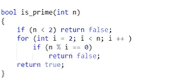

d|a(一个意义是d能整除a,d是a的约数)


## 质数

### 定义

大于1的整数中,如果只包含1和本身这两个约数,就被称为质数.


### 题目


#### 1:质数的判定 

采用试除法,判断这个数是不是质数

最暴力的On写法:



第一次优化:

```c++
for(int i=2;i<=n/i;i++) (一定会算到更号n)

不写i<=sqrt(n),因为每次调用函数可能会比较慢.
不写i*i<=n,因为当i为int的临界的时候,i+1会有溢出风险.
```


#### 2:分解质因数  

采用试除法:

```c++
void divide(int n)
{
for(int i=2;i<=n;i++)
        if(n%i==0)//符合这个条件的i一定是个质数.因为此时n不再有任何2~i-1的因数,而i是n的约数,代表i也不再有任何2~i-1的因数
        {
            int s=0;
            while(n%i==0)//把所有的i都除干净
            {
                n/=i;
                s++;
            }
            cout<<i<<s<<endl;//打印出质因数和这个质因数的个数2
        }
}
```


优化:

n中最多只包含一个大于sqrt(n)的质因子(如果有两个,乘一起直接大于n了)

把时间复杂度降低到更号n:

```c++
void divide(int n)
{
for(int i=2;i<=n/i;i++)//把所有小于sqrt(n)的质因子枚举出来
        if(n%i==0)
        {
            int s=0;
            while(n%i==0)//把所有的i都除干净
            {
                n/=i;
                s++;
            }
            cout<<i<<s<<endl;
        }
    if(n>1)//那么最后剩下来的这个数,就是大于sqrt(n)的质因子.单独讨论
        cout<<n<<1<<endl;
}
```


#### 筛质数

暴力:

​	给定一个范围从小到大枚举每个数,每枚举一个数,就把这个范围里这个数的倍数筛掉

​	当i=2的时候,循环2/n次,当i=3的时候,循环3/n次,所以总共2/n+3/n+....n/n

=n(ln(n)+c)(c为0.577左右的不循环小数).

​	所以整个算法约等于nln(n)<nlogn.所以时间复杂度认为nlogn.

```c++

const int N=1e6+10;
int primes[N],cnt;
bool st[N];
void get_primes(int n)
{
    for(int i=2;i<=n;i++)
    {
        if(!st[i])//是质数的倍数
            primes[cnt++]=n;
	
    	for(int j=i+i;j<=n;j+=i)
       		 st[j]=true;
    }
}
```


优化(埃氏筛):

​	筛的时候,我们只要筛所有质数的倍数就可以了(合数都是通过从比他小的质数得到的).复杂度:O(nloglogn)基本O(n)一个级别,视频有计算复杂度.有时候不用这个方法求素数,但这个思想很重要,可以用来解决其他问题

```c++
const int N=1e6+10;
int primes[N],cnt;
bool st[N];
void get_primes(int n)
{
    for(int i=2;i<=n;i++)
    {
        if(!st[i])
        {
            primes[cnt++]=i;
    		for(int j=i+i;j<=n;j+=i)
       		 	 st[j]=true;
        }
    }
}
```


线性筛:

比埃氏筛还快一点.

核心:每一个数只会被它的最小质因子筛掉(而每一个数只有一个最小质因子,所以每个数只被筛一次)


1: i%primes[j]==0,意味着primes[j]一定是i的最小质因子(primes[j]是从小到大枚举的质数).所以pj(primes[j]的缩写)也一定是pj*i的最小质因子

2: i%primes[j]!=0,意味着primes[j]一定小于i的所有质因子,所以所以pj也一定是pj*i的最小质因子


```c++

const int N=1e6+10;
int primes[N],cnt;
bool st[N];
void get_primes(int n)
{
    for(int i=2;i<=n;i++)
    {
        if(!st[i])
            primes[cnt++]=i;
        for(int j=0;primes[j]<=n/i;j++)//没有必要再写j<cnt.无论如何都会在j>cnt的时候挺小来
        {
            st[primes[j]*i]=true;//primes[j]一定是primes[j]*i的最小质因子
            if(i%primes[j]==0)//发生的时候,意味着primes[j]一定是i的最小质因子
                break;
        }
    }
}

```


## 约数


### 题目

#### 试除法求约数

试除法求一个数的所有约数(1包括在内).

和试除法求质数差不多的思想


一个数的约数大概有多少个?(假如这个数是n)

1~n中,a是b的约数,则b是a的倍数.所以约数个数和倍数个数是相同的.

1~n中有n个1的倍数,n/2个2的倍数,有n/n个n的倍数.所以总共的约数个数是nlogn,平均下来每个数的约数个数就是logn	,所有n这个数大概有logn个约数

(记一下,int范围内,约数个数最多的那个数大概有1500个)


//时间复杂度为$\sqrt{n}$,因为排序的时间复杂度为$logn*loglogn$小于$\sqrt{n}$

```c++
#include <iostream>
#include <algorithm>
#include <vector>

using namespace std;

vector<int> get_divisors(int n)
{
     vector<int> res;

     for (int i = 1; i <= n / i; i++)
     {
          if (n % i == 0)
          {
               res.push_back(i);
               if (i != n / i)
                    res.push_back(n / i);
          }
     }
     sort(res.begin(), res.end());//复杂度是logn*loglogn小于更号n.所以整个程序复杂度还是更号n
     return res;
}

int main()
{
     int n;
     cin >> n;
     while (n--)
     {
          int x;
          cin >> x;
          auto res = get_divisors(x);
          for (auto t : res)
               cout << t << ' ';
          cout << endl;
     }
}

```


#### 约数个数

一个数n能被拆封(因数分解)成很多质数次方之和.(N=P1^a1^ * P2^a2^ * P3^a3^ ....Pn^an^)

而它的约数个数就是`(a1+1)*(a2+1)*…*(an+1)`


证明:

N的任意一个约数都可以写成d=P1^b1^ * P2^b2^ * P3^b3^ ....Pn^bn^(bi<=ai)

所以b1~bn的每一种取法都对应着一个约数,而bi又是在0 ~ ai之间,有ai+1个取法.


##### 题目:

给定 n 个正整数 ai，请你输出这些数的乘积的约数个数，答案对 109+7 取模。


输入格式

第一行包含整数 n。

接下来 n 行，每行包含一个整数 ai。

输出格式

输出一个整数，表示所给正整数的乘积的约数个数，答案需对 109+7 取模。


数据范围

1≤n≤100, 1≤ai≤2×109

输入样例：

```
3
2
6
8
```

输出样例：

```
12
```


##### 过程

```c++

#include <iostream>
#include <algorithm>
#include <unordered_map>
using namespace std;
typedef long long ll;
const int mod = 1e9 + 7;
int main()
{
     int n;
     cin >> n;

     unordered_map<int, int> primes;
     while (n--)
     {
          int x;
          cin >> x;
          for (int i = 2; i <= x / i; i++)
          {
               while (x % i == 0)
               {
                    x /= i;
                    primes[i]++; // primes存了所有质因数的指数
               }
          }
          if (x > 1)
               primes[x]++;
     }
    
     ll res = 1;
     for (auto prime : primes)
          res = res * (prime.second + 1) % mod;

     cout << res << endl;
}
```


#### 约数之和

而约数之和的求法是(P1^0^+P1^1^+...P1^a1^) * (...P2^a2^) * (....P3^a3^) .....(...Pn^an^)

原因:乘法分配律展开,就是把所有约数加到一块了.


```c++
#include <iostream>
#include <algorithm>
#include <vector>
#include <unordered_map>
using namespace std;
typedef long long ll;
const int mod = 1e9 + 7;
int main()
{
     int n;
     cin >> n;

     unordered_map<int, int> primes;
     while (n--)
     {
          int x;
          cin >> x;
          for (int i = 2; i <= x / i; i++)
          {
               while (x % i == 0)
               {
                    x /= i;
                    primes[i]++; // primes存了所有质因数的指数
               }
          }
          if (x > 1)
               primes[x]++;
     }
    
    
     ll res = 1;
     for (auto prime : primes)
     {
          int p = prime.first, a = prime.second; // p是底数,a是指数
          //先求p的0次方加到p的1次方
          ll t = 1;
          while (a--)
               t = (t * p + 1) % mod; //巧妙地计算了每个括号的求和
          res = res * t % mod;
     }

     cout << res << endl;
}
```


#### 辗转相除法

证明:(a,b)=(b,a mod b)  (a,b)表示a和b的最大公约数

要知道:d|a,d|b 所以d|(ax+by).

因为a mod b=a-(a/b)*b. (括号里是整除) =a- c *b,  

所以要证明(a,b)=(b,a-c*b)

对于左边任意一个公约数d,d|a d|b 所以d|(a-c*b).所以左边任意一个公约数都是右边的公约数.

而若 d|(a-c*b) d|b,所以`d|(a-c*b+c*b`,所以d|a,所以右边任意一个公约数都是左边的公约数.所以左右两边公约数相同.

则左右两边最大公约数相同


```c++
int gcd(int a,int b)//最大公约数
{
	return b ? gcd(b,a%b):a;//b如果是0的话,返回gcd(b,a%b).当b=0的时候,就返回a.因为a和0的最大公约数就是a
}
```

