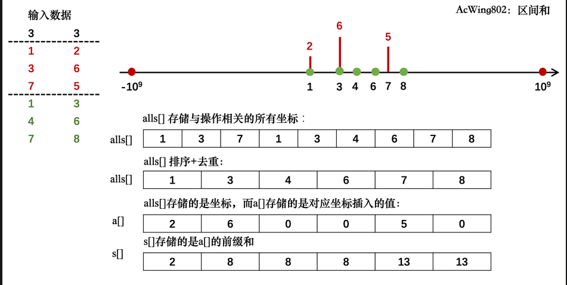
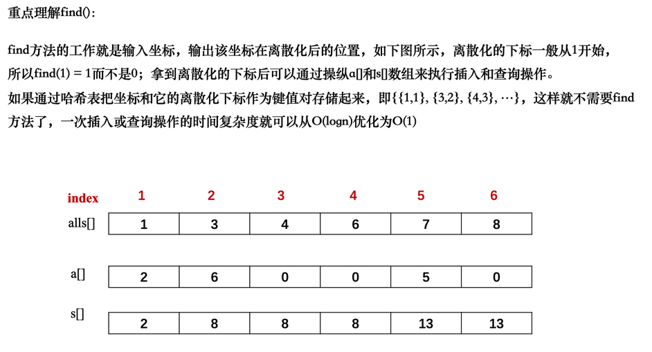

## 双指针算法   位运算    离散化    区间合并


### 双指针运算


#### 概念

​	它是用的非常多的一种算法，比如，归并排序的时候，把两个有序数列合并，就是一种双指针算法（两个不同序列，一个指针指向一个，另一个指针指向另一个）。而在快排划分的时候，一个指针指向开头，另一个指针指向尾部，则是另一种双指针算法。(kmp算法也是双指针算法)

核心思想：

两个指针遍历数组，本来是n^2的复杂度(双重循环)，但当用到双指针算法的时候，所有的复杂度都是O(n)（具体来说有时候是2n，但复杂度不考虑系数）

#### 模板

```cPP
for (int i = 0, j = 0; i < n; i ++ )
{
    while (j < i && check(i, j)) j ++ ;

    // 具体问题的逻辑
}
```

#### 例子

1：

一串字符串，里面是多个单词，每个单词由空格隔开，现在我们要求把每个单词输出出来，且输出一个换行一次。

```c++
#include <iostream>
#include <string.h>
using namespace std;
int main()
{
    char str[1000];   //定义字符串长度
    gets(str);       //输入字符串
    int n = strlen(str);
    //j和i是两个指针,i在前,j在后
    for (int i = 0; i < n; i++)
    {
        int j = i;
        while (j < n && str[j] != ' ')//j没碰到空格，且没走到终点，j继续向右走
            j++;
        //下面是这道问题具体逻辑
        for (int k = i; k < j; k++)
            cout << str[k];
        cout << endl;   //两个指针锁定一个单词
        i = j;		//继续下一个单词的输出
    }
    return 0;
}
```

2：

给定一个长度为 *n*的整数序列，请找出最长的不包含重复的数的连续区间，输出它的长度。


输入格式

第一行包含整数 *n*。第二行包含 *n* 个整数（均在 0∼105 范围内），表示整数序列。

输出格式

共一行，包含一个整数，表示最长的不包含重复的数的连续区间的长度。

数据范围

1≤*n*≤105


输入样例：

```
5
1 2 2 3 5
```

输出样例：

```
3
```

// 2 3 5

| 难度：                             简单  |
| ---------------------------------------- |
| 时/空限制：                    1s / 64MB |
| 总通过数：                        24625  |
| 总尝试数：                        40092  |
| 来源：                            模板题 |
| 算法标签                                 |

大意就是

```c++
1：暴力做法,复杂度是n^2(就写个大概)
    for(int i=0;i<n;i++)
    {
        for(int j=0;j<=i;j++)
            if(check(j,i))
            {
                res=max(res,j-i+1);
            }
    }

2:
//i和j是两个指针，j要在i左边
#include <iostream>
using namespace std;

const int N = 100010;
int a[N], s[N];

int main()
{
    int n, r = 0;
    cin >> n;
    //i就一直往右走
    for (int i = 0, j = 0; i < n; ++i)
    {
        cin >> a[i];//输入数据
        ++s[a[i]]; //统计每个数字出现次数
        while (s[a[i]] > 1)  //check的部分此时可以不写，意思有包含
            --s[a[j++]];     // 这种的写法是先减次数后指针右移
      //当i和j包围的数里有重复的数字，j要不断右移逼近i，是范围内重复的数被踢出
        
        r = max(r, i - j + 1);//用到max,使r就是当前走过的数里的最大值
    }
    cout << r;

    return 0;
    
    
//双指针算法思路就想一遍暴力的解法，然后试着去找i和j的关系(某些单调关系),使算法简化
```


### 位运算

#### 概念

介绍一些算法比赛里面常见的位运算操作。

#### 模板

+ 求n的二进制表示里面第k位数字是多少: n >> k & 1(先进行位移操作，再与1比较)

+ 返回n的最后一位1(最右边的一位1)：`lowbit(n) = n & -n`。这是树状数组的基本操作.

  x=1010,则返回10，x=101000，返回101000。

  如何实现：n与上-n。-n是n的补码，取其补码的操作是取反码再+1,101000的取反是010111，再+1=011000(到取反后的最右边的0截止)，再与上原数,=001000。

  

  ——这可以用来统计一个数里有几个1:每lowbit一次减一次1，看总共剪了多少次

  

#### 例子

给定一个长度为 *n* 的数列，请你求出数列中每个数的二进制表示中 1的个数。


输入格式

第一行包含整数 *n*。第二行包含 *n* 个整数，表示整个数列。

输出格式

共一行，包含 *n*个整数，其中的第 *i* 个数表示数列中的第 *i* 个数的二进制表示中 1 的个数。

数据范围

1≤*n*≤100000,0≤数列中元素的值≤109


输入样例：

```
5
1 2 3 4 5
```

输出样例：

```
1 1 2 1 2
```

| 难度：                             简单  |
| ---------------------------------------- |
| 时/空限制：                   1s / 64MB  |
| 总通过数：                        20477  |
| 总尝试数：                        24614  |
| 来源：                            模板题 |
| 算法标签                                 |


```c++
#include <iostream>
using namespace std;
int lowbit(int x)
{
    return x & (-x);
}
int main()
{
    int n;
    cin >> n;
    while (n--)
    {
        int x;
        cin >> x;

        int res = 0;
        while (x)
            x -= lowbit(x), res++;//res判断减了几次1

        cout << res << ' ';
    }
    return 0;
}
```

#### 拓展

##### 原码 反码 补码

感觉定义可以自己百度，(可以查查计算机为什么要用到补码)


有说到在b站可以搜acwing算法竞赛


### 离散化

————特指整数的离散化

#### 概念

首先如果我们有一些数值，数值的范围是0~1e9,但个数比较少(可能只有1e5个)。我们处理这些数(有时候可能要拿这些数作为下标)，不可能开1个10的9次方的数组，去囊括这100000个数。这时候，我们就要把这些要用到的数映射到一堆从0开始的连续的数里，这时候只要开1e5的范围就行。

如：a数组里面有5个数。1，3，100，2000，500000。我们就把这些数映射到0，1，2，3，4这些数里面，这叫离散化。要引用的时候，就s[0]=1,s[1]=3...

但有些时候，a中可能有重复元素，所以我们需要去重，(可以通过c++里的一些方法)。然后如何快速算出原数组(a数组)的数值离散化后的值是多少？由于a是有序的，我们可以通过二分来找

#### 模板

```c++
vector<int> alls; // 存储所有待离散化的值

sort(alls.begin(), alls.end()); // 将所有值排序

alls.erase(unique(alls.begin(), alls.end()), alls.end()); // 去掉重复元素，可以直接背
//unique函数可以帮助数组去重，将未重复元素提前，重复元素后置，并返回最后一个未重复元素的位置，通过这点，直接用erase掉后面部分就行。

// 二分求出x对应的离散化的值
int find(int x) // 找到第一个大于等于x的位置
{
    int l = 0, r = alls.size() - 1;
    while (l < r)//二分
    {
        int mid = l + r >> 1;
        if (alls[mid] >= x) r = mid;
        else l = mid + 1;
    }
    return r + 1; // 映射到1, 2, ...n
}

```

#### 例子

假定有一个无限长的数轴（−10的9次方≤*x*≤10的9次方,），数轴上每个坐标上的数都是 0。现在，我们首先进行 *n* 次操作，每次操作将某一位置 *x* 上的数加 *c*。接下来，进行 *m* 次询问，每个询问包含两个整数 *l* 和 *r*，你需要求出在区间 [*l*,*r*]之间的所有数的和。


输入格式

第一行包含两个整数 *n* 和 *m*。接下来 *n* 行，每行包含两个整数 *x* 和 *c*。再接下来 *m*行，每行包含两个整数 *l* 和 *r*。

输出格式

共 *m* 行，每行输出一个询问中所求的区间内数字和。


数据范围


−109≤x≤109,1≤n,m≤105,−109≤l≤r≤109,−10000≤c≤10000


输入样例：

```
3 3
1 2
3 6
7 5
1 3
4 6
7 8
```

//从第二行开始，3次操作，3次询问

输出样例：

```
8
0
5
```

| 难度：                             简单  |
| ---------------------------------------- |
| 时/空限制：                    2s / 64MB |
| 总通过数：                        20744  |
| 总尝试数：                         35741 |
| 来源：                           模板题  |
| 算法标签                                 |

------

```c
当数据是在10^5以内，这道题我们可以采用昨天讲的前缀和

有n个x，最多只会用到2m(l,r)个下标。所以最多用n+2m个下标(3*10^5)，绝大部分坐标用不到.很经典的离散化。把所有用到了的下标映射成从0或者1开始的自然数。(其实就是把1个数组里的每个数映射成他的下标)
本题映射成从1开始(通过find函数)，为了方便下面的前缀和操作。

    
#include <iostream>
#include <vector>
#include <algorithm>
//java有一个是和vector类似，但uniqe函数要自己实现，等一下会讲一下它的原理
using namespace std;
typedef pair<int, int> PII; //因为每次处理两个值
const int N = 300010;
int n, m;
int a[N], s[N];
vector<int> alls;
vector<PII> add, query;
int find(int x) //查找离散化后的值。
{
    int l = 0, r = alls.size() - 1;
    while (l < r) //二分
    {
        int mid = l + r >> 1;
        if (alls[mid] >= x)
            r = mid;
        else
            l = mid + 1;
    }
    return r + 1; //使得映射出来的值从1开始
}


int main()
{
    cin >> n >> m;
    for (int i = 0; i < n; i++)
    {
        int x, c; //int的范围大于10的9次方
        cin >> x >> c;
        add.push_back({x, c});
        alls.push_back(x); //把x存入要离散化的数组里面去
    }
    for (int i = 0; i < m; i++)
    {
        int l, r;
        cin >> l >> r; //它的左右两个端点，我们都要离散化
        query.push_back({l, r});
        alls.push_back(l);
        alls.push_back(r); //存入要离散化的数组里面
    }
    
    //接下来排序去重
    sort(alls.begin(), alls.end());
    alls.erase(unique(alls.begin(), alls.end()), alls.end());
    
    //处理插入(加上值)
    for (auto item : add)
    {
        int x = find(item.first);
        //找到离散化后的数值是多少，其实就是找出数值存入数组后在哪个位置。
        a[x] += item.second; //item.second就是题目给出的c。a[N]在没加之前，都是0，因为N就是题目中数组的位置。
    }
    
    //预处理前缀和
    for (int i = 1; i <= alls.size(); i++)
        s[i] = s[i - 1] + a[i];
    
    //处理询问
    for (auto item : query)
    {
        int l = find(item.first), r = find(item.second);
        cout << s[r] - s[l - 1] << endl;
    }
    return 0;
}

```







```cpp
因为java里没有unique1函数，以下介绍它是怎么实现的。
//这里详细讲解unique是如何实现的。unique的含义是拿出所有满足要么他是第一个数，要么他和前一个数不一样的数。它其实也是一个双指针算法
vector<int>::iterator unique(vector<int> &a) //unique函数返回的应该是一个vector<int>的一个迭代器
{
    //i和j两个指针
    int j = 0;
    for (int i = 0; i < a.size(); i++) //这里的a是vector
        if (!i || a[i] != a[i - 1])
            a[j++] = a[i]; //这里只是赋值，并没有调换它们的位置。a[i]=a[0]
    //此时a[0]到a[j-1]就是所有不重复的数了。但j-1后面的数就不再是原数组剩下的数了，因为并没有调换位置
    return a.begin() + j;
}
//后面就可以改写成alls.erase(unique(alls),alls.end())

```


2：acwing里的格子染色，也考察了离散化


### 区间合并

#### 概念

不是很常用

有很多很多的区间，如果两两区间有交集的话，我们可以把他们合并。而区间合并算法，就是能够快速的把这些有交集的区间进行合并(贪心算法的味道)

当合并多个区间的时候，1：按区间左端点大小将各个区间进行排序，2：然后按照顺序扫描各个区间，判断区间是否可以合并，此时应该只有三种情况，【第二个区间在第一个里面，一半在第一个区间里面，和完全在第一个区间的左边(没有任何交集)】

#### 模板

```cpp
// 将所有存在交集的区间合并，这个模板完全就是下面的题目来的
void merge(vector<PII> &segs)   
{
    vector<PII> res;

    sort(segs.begin(), segs.end());

    int st = -2e9, ed = -2e9;//这里的-2e9的意思是无穷小，用无穷小使得能与题目给得第一个区间无缝衔接，因为for函数语句里的逻辑针对的是第二个区间和第一个区间的关系
    for (auto seg : segs) //遍历
        if (ed < seg.first)
        {
            if (st != -2e9) res.push_back({st, ed});
            st = seg.first, ed = seg.second;
        }
        else ed = max(ed, seg.second);//更新区间

    if (st != -2e9) res.push_back({st, ed});

    segs = res;
}

```

#### 例子

给定 *n* 个区间 [*l**i*,*r**i*]，要求合并所有有交集的区间。注意如果在端点处相交，也算有交集。输出合并完成后的区间个数。例如：[1,3] 和 [2,6] 可以合并为一个区间 [1,6]。


输入格式

第一行包含整数 *n*。接下来 *n* 行，每行包含两个整数 *l* 和 *r*。

输出格式

共一行，包含一个整数，表示合并区间完成后的区间个数。

数据范围

1≤*n*≤100000,−109≤*l**i*≤*r**i*≤109


输入样例：

```
5
1 2
2 4
5 6
7 8
7 9
```

输出样例：

```
3
```

```cpp

#include <iostream>
#include <vector>
#include <algorithm>
using namespace std;
typedef pair<int, int> PII;
const int N = 100010;
int n;
vector<PII> segs;
void merge(vector<PII> &segs)
{
    vector<PII> res;
    sort(segs.begin(), segs.end()); //pair排序，优先以左端点进行排序
    int st = -2e9, ed = -2e9;       //刚开始没有遍历任何区间，引用一个无穷小，这里-2e9意思其实就是无穷小.因为2e9已经大于题目所给范围1，所以他就等于无穷

    for (auto seg : segs)   //遍历
        if (ed < seg.first) //前一个区间和后一个区间完全没有交集的时候
        {
            if (st != -2e9)                  //不是初始状态没有遍历任何区间的时候
                res.push_back({st, ed});     //把这个区间存入答案里
            st = seg.first, ed = seg.second; //更行st，ed的值，对segs里的下一个区间进行关系判断
        }
        else                          //有交集的时候
            ed = max(ed, seg.second); //更新区间

    if (st != -2e9)
        res.push_back({st, ed}); //加上最后一个合并好的区间，因为按前面这个逻辑，当这个区间是最后一个的时候，是没有加入res的

    segs = res; //这时候res有几个区间就是答案所求
}
int main()
{
    cin >> n;
    for (int i = 0; i < n; i++)
    {
        int l, r;
        cin >> l >> r;
        segs.push_back({l, r}); //把区间都存入里面
    }
    merge(segs);
    cout << segs.size() << endl;
}
```

