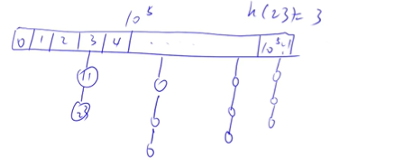
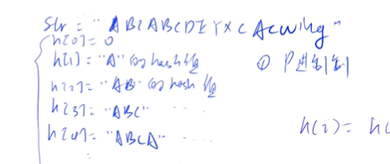
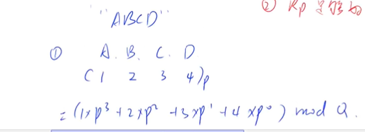
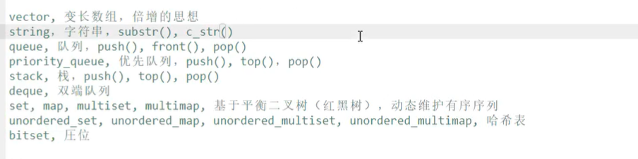

## Hash表

### 定义

用到哈希表的时间复杂度的题一般复杂度O(n)。哈希表本身是O(1)。

介绍两部分内容。

+ 普通hash表的写法（存储结构）

  

  + 开放寻址法

    

  + 拉链法

  

+ 介绍常用字符串的哈希方法


#### 哈希

作用: 把一个庞大的空间/值域映射到一个小空间(如 0~n,n的话比较小，10^5^或10^6^)


之前的离散化是一种特殊的哈希方式，它是需要保序的，要单调递增


哈希函数的写法：
x mod n (x大范围里的数，n就是小空间比如10^5^.直接取模)
但这样直接取模可能把不同的数映射成同一个数，所以要用拉链法或寻址法的处理方式(两个方法都可以)。而且取的模我们一般把它设置为质数，这样产生的冲突是最小的(网上有证明，可以搜一下)


拉链法：开一个一维数组，存储所有哈希后的值。(如 为下面这题开一个10^5^空间的数组)。每个数组里的值都有一根链，对应着原数，要是两个数冲突了，映射到同一区域了，那就再加一根链。(每个槽有一链表)



而哈希表一般没有删除操作，大都是添加和查找。

要是删除的话，也并不是真的要删掉这个点，而是设置个bool变量，打一下标记。


 开放寻址法：就只开一个一维数组，不去开链表。但一般要开题目所给范围的两到三倍的数组去降低冲突。

基本思路就是映射到数组一个数(h(x)=k)，要是这个格子k已经有数的话，就继续往后找，找到一个空的位子。查找也是这个思路，这个位子有但不是要找的数，就往后找，要是格子k什么都没有，就代表我们根本没有把x映射进来。删除是找到后打个标记，和拉链法类似。


#### 字符串哈希

字符串哈希可以快速比较两个字符串是否相等，不用再一个一个比较(这是O(n)的时间)

对字符串的处理方法不一定只有 kmp ，大部分我们都用字符串哈希(字符串前缀哈希法)。(但kmp与这个相比，唯一的优势是可以用于计算循环结，这个不行)


字符串前缀哈希法：

先将一个字符串的每个前缀和的哈希值存入数组。(如：“ABCDE”,则h[1]=A的哈希值,h[2]=AB的哈希值,h[3]=ABC的哈希值)



再将字符串看成(假设)一个p进制的数，每个字母都对应(假设)着一个数字。通过就可以将字符串转换成数(从p进制到10进制)。因为这样转换出来可能会很大，所以通过mod Q进行映射。

注意：我们给每个字母一个数字，但不能给0.因为如下图，A给0不给1的话，A=0，AA=0，AAA也等于0，导致不同字符串转换成了同一个数

字符串哈希，为了减少像数字哈希一样的冲突，我们一般设置p=131或13331，q=2^64^。(通过经验)




我们就能通过一个公式知道所有子串(通过得知字串的前缀和求)的哈希值(哈希值就是字符串对应的十进制数)

我们已知h[L-1]和h[R]这两前缀段的哈希值，用h[R]-h[L]*p^R-L+1^来求L-R这段的哈希值


### 模板

#### 一般哈希 

```c++

找取模的那个质数：  
//若小范围的值是<=100000.
for (int i = 100000;; i++) //找大于100000的第一个质数
    {
        bool flag = true;
        for (j = 2; j * j <= i; j++)
            if (i % j == 0)
            {
                flag = false;
                break;
            }
        if (flag)
        {
            cout << i << endl;
            break;
        }
    }


(1) 拉链法
    int h[N], e[N], ne[N], idx;

    // 向哈希表中插入一个数
    void insert(int x)
    {
        int k = (x % N + N) % N;//映射到0~N-1范围里
    //为什么不直接x%N?为了防止x是负数的时候，模出来的也是负数(在c++里取模是这样的)
    //而要先模再加，为了防止当x很小的时候，直接加N，任然是负数
        
        e[idx] = x;
        ne[idx] = h[k];
        h[k] = idx ++ ;
    }

    // 在哈希表中查询某个数是否存在
    bool find(int x)
    {
        int k = (x % N + N) % N;
        for (int i = h[k]; i != -1; i = ne[i])
            if (e[i] == x)
                return true;

        return false;
    }

(2) 开放寻址法
    int h[N];

    // 如果x在哈希表中，返回x的下标；如果x不在哈希表中，返回x应该插入的位置
    int find(int x)
    {
        int t = (x % N + N) % N;
        while (h[t] != null && h[t] != x)
        {
            t ++ ;
            if (t == N) t = 0;
        }
        return t;
    }
```


#### 字符串哈希

```c++
核心思想：将字符串看成P进制数，P的经验值是131或13331，取这两个值的冲突概率低
小技巧：取模的数用2^64，这样直接用unsigned long long存储，溢出的结果就是取模的结果

typedef unsigned long long ULL;
ULL h[N], p[N]; // h[k]存储字符串前k个字母的哈希值, p[k]存储 P^k mod 2^64

// 初始化
p[0] = 1;
for (int i = 1; i <= n; i ++ )
{
    h[i] = h[i - 1] * P + str[i];
    p[i] = p[i - 1] * P;
}

// 计算子串 str[l ~ r] 的哈希值
ULL get(int l, int r)
{
    return h[r] - h[l - 1] * p[r - l + 1];
}
```


### 题目


#### 模拟散列表

维护一个集合，支持如下几种操作：

1. `I x`，插入一个数 $x$；
2. `Q x`，询问数 $x$ 是否在集合中出现过；

现在要进行 $N$ 次操作，对于每个询问操作输出对应的结果。


输入格式

第一行包含整数 $N$，表示操作数量。

接下来 $N$ 行，每行包含一个操作指令，操作指令为 `I x`，`Q x` 中的一种。

输出格式

对于每个询问指令 `Q x`，输出一个询问结果，如果 $x$ 在集合中出现过，则输出 `Yes`，否则输出 `No`。

每个结果占一行。


数据范围

$1 \le N \le 10^5$
$-10^9 \le x \le 10^9$

输入样例：

```
5
I 1
I 2
I 3
Q 2
Q 5
```

输出样例：

```
Yes
No
```


```
在一个大范围里进行小数据的操作
设立一个哈希函数，h(x)。x属于-109到109的范围，输出的话在10的5次的范围。把一个大范围里的数映射到小范围的一个作用

```


```c++
拉链法：

#include <cstring>
#include <iostream>
using namespace std;
const int N = 100003; // 取大于1e5的第一个质数，取质数冲突的概率最小 可以百度
//* 开一个槽 h
int h[N];
int e[N], ne[N], idx; //这就是链表的写法。e存储值，ne存储下一个值在哪，idx当前那个位置

void insert(int x)
{
    // c++中如果是负数 那他取模也是负的 所以 加N 再 %N 就一定是一个正数
    int k = (x % N + N) % N;
    e[idx] = x;
    ne[idx] = h[k];
    h[k] = idx++;
}
bool find(int x)
{
    //用上面同样的 Hash函数 讲x映射到 从 0-1e5 之间的数
    int k = (x % N + N) % N;
    for (int i = h[k]; i != -1; i = ne[i])//链表里，下一个点的下标是ne[i]
    {
        if (e[i] == x)
        {
            return true;
        }
    }
    return false;
}
int n;
int main()
{
    cin >> n;
    memset(h, -1, sizeof h); //将槽先清空 空指针一般用 -1 来表示
    while (n--)
    {
        /* string op;
        int x;
        cin >> op >> x; */
        char op[2];
        int x;
        scanf("%s%d", op, &x); // scanf尽量用于读入字符串，会把空格 回车等都忽略掉
        if (*op == 'I')
        {
            insert(x);
        }
        else
        {
            if (find(x))
            {
                puts("Yes");
            }
            else
            {
                puts("No");
            }
        }
    }
    return 0;
}

```


```c++
 开放寻址法：
 
#include <cstring>
#include <iostream>
using namespace std;
const int N = 200003; //比200000大的质数
const int null = 0x3f3f3f3f;//来判断数组里的这个格子有没有放入数，给null设一个比题目所有数据都大的值，填充到数组的每个格子，当作原始数据，这样判断格子有没有数，只要看等不等于null就行了

int h[N];
int find(int x)
// 如果x在哈希表中，返回x的下标；如果x不在哈希表中，返回x应该插入的位置
{
    int k = (x % N + N) % N; //进行映射
    while (h[k] != null && h[k] != x) //这个格子有数了，且这个数不等于x
    {
        k++;
        if (k == N)//如果k到最后一个位，再从第一个开始找。
            k = 0;
    }
    //一定会找到一个数不满足while循环的条件，跳出循环的，因为我们开的坑位够大
    return k;
}

int main()
{
    int n;
    scanf("%d", &n);
    memset(h, 0x3f, sizeof(h)); //初始数组里的每个数都是0x3f了，比题目给的10e9都大。
    while (n--)
    {
        char op[2];
        int x;
        scanf("%s%d", op, &x); // scanf尽量用于读入字符串，会把空格 回车等都忽略掉

        int k = find(x);
        if (*op == 'I')
        {
            h[k] = x;
        }
        else
        {
            if (h[k] != null)
                puts("Yes");
            else
                puts("No");
        }
    }
    return 0;
}
```


#### 字符串哈希

给定一个长度为 n的字符串，再给定 m 个询问，每个询问包含四个整数 l1,r1,l2,r2请你判断 [l1,r1] 和  [l2,r2] 这两个区间所包含的字符串子串是否完全相同。

字符串中只包含大小写英文字母和数字。

输入格式

第一行包含整数 n 和 m，表示字符串长度和询问次数。

第二行包含一个长度为 n 的字符串，字符串中只包含大小写英文字母和数字。

接下来 m 行，每行包含四个整数 l1,r1,l2,r2表示一次询问所涉及的两个区间。

注意，字符串的位置从 11 开始编号。

输出格式

对于每个询问输出一个结果，如果两个字符串子串完全相同则输出 `Yes`，否则输出 `No`。

每个结果占一行。

数据范围

1≤n,m≤1051≤n,m≤105

输入样例：

```
8 3
aabbaabb
1 3 5 7
1 3 6 8
1 2 1 2
```

输出样例：

```
Yes
No
Yes
```


```c++
#include <iostream>
using namespace std;
typedef unsigned long long ULL;
const int N = 100010;
int n, m;
int P = 131;
char str[N];
ULL h[N], p[N]; // p数组存储p的多少次方,h存储哈希值
ULL gets(int l, int r)
{
    return h[r] - h[l - 1] * p[r - l + 1];
}
int main()
{
    scanf("%d%d%d%d", &l1, &r1, &l2, &r2);
    p[0] = 1;
    for (int i = 1; i <= n; i++)
    {
        p[i] = p[i - 1] * P;          // 写p数组就是为了方便公式的计算。p[1]是P的1次，p[2]是P的2次...
        h[i] = h[i - 1] * P + str[i]; //计算前缀和的哈希值
    }
    while (m--)
    {
        int l1, r1, l2, r2;
        scanf("%d%d%d%d", &l1, &l2, &l3, &l4);
        if (gets(l1, r1) == gets(l2, r2))
            puts("Yes");
        else
            puts("No");
    }
}

```


## c++ :STL使用技巧

### 定义

用stl刚开始会忘记很正常，忘的时候可以百度搜索，xxx的基本用法。

以下各个stl在模板里都有他们的用法



#### vector

变长数组(动态数组)，是倍增的思想。

操作系统为程序分配空间时，所需的时间基本与空间大小无关，与申请次数有关。所以vector的核心是减少申请次数，每一次数组长度不够的时候，长度会*2，起到动态变长的效果。(y总说的是申请次数o(logn),每次时间为O(1),不懂可以再听一遍)


```c++
#include <cstdio>
#include <cstring>
#include <iostream>
#include <algorithm>
#include <vector>
using namespace std;
int main()
{
    vector<int> a; //定义一个vector

    vector<int> b(10); //定义一个长度为10的vector

    vector<int> c(10, 3); //定义一个长度为10的vector,里面每个元素都是3
    // for(auto x:c) cout<<x<<endl;可以输出vector里的元素，检验是否都为3

    vector<int> d;
    d.size();       //输出vector的元素个数，stl里都有这个函数
    d.empty();      //判断是否为空，不空1为1
    d.clear();      //清空
    d.front();      //返回第一个数。back是最后一个数
    d.push_back(1); //向最后插入一个数字1
    d.pop_back();   //删除最后一个数
    d.begin();      //迭代，begin是第0个数，end是1最后一个数的后一个数.a.end()=a[a.size()]

    /*
    一种输入方式，三种输出方式
       for (int i = 0; i < 10; i++)
           d.push_back(i);
       for (int i = 0; i < 10; i++)
           cout << d[i] << ' ';
       for (vector<int>::iterator i = d.begin(); i != d.end(); i++)//把迭代器理解成指针，迭代器i初始化就是vector的首地址
           cout << *i << ' ';
        for(auto x:d) cout<<x<<' ';//c++的范围遍历
   */

    //支持比较运算
    vector<int> n(4, 3), n(3, 4); //这里n<m，比较字母，3<4
}
```


#### pair

c++内置二元组，和结构体类似，支持比较。

也可以存储三个不同属性


```c++
#include <cstdio>
#include <cstring>
#include <iostream>
#include <algorithm>
using namespace std;
int main()
{
    pair<int, string> p;
    // p.first  p.second

    //支持比较运算，和前面一样，按字典来比，first为第一关键字

    //初始化
    p = make_pair(10, "asd");
    p = {20, "assd"};

    //存储三个不同属性
    pair<int, pair<int, int>> t;
}
```


#### string

c++处理字符串的利器，把字符串进行了封装。


```c++
#include <cstdio>
#include <cstring>
#include <iostream>
#include <algorithm>
using namespace std;
int main()
{
    string a = "yxc";

    a.size();
    a.empty();
    a.clear();
    //还支持substr()，c_str()

    a += "asd"; //能直接再它后面加减字符
    a += 'a';

    cout << a.substr(1, 2); //返回字符串的子串，1是下标，2是长度,返回xc。当第二个参数很大，或没有，则直接返回从下标到结尾

    printf("%s\n", a.c_str()); // printf无法直接输出string，所以用这样的方式输出字符换a
    // printf("%s，输出字符数组的起始地址，而c_str()刚好能返回字符数组a的起始地址。
}
```


#### queue

队尾插入，队头弹出


```c++
#include <cstdio>
#include <cstring>
#include <iostream>
#include <algorithm>
#include <queue>
using namespace std;
int main()
{
    queue<int> a;
    a.size();

    a.empty();
    //无clear函数,想清空，可以直接重建一次.
    a = queue<int>();

    a.push(1); //向队尾插入一个元素1

    a.front(); //返回队头元素

    a.back(); //返回队尾元素

    a.pop(); //弹出队头元素
}
```


#### priority_queue

核心就是堆。(起初默认是大根堆)

根节点是树中最大的，就是大根堆(堆顶元素最大)，根节点是最小的，就是小根堆。在之前数组模拟堆里有提到过


```c++
#include <cstdio>
#include <cstring>
#include <iostream>
#include <algorithm>
#include <queue>
using namespace std;
int main()
{
    priority_queue<int> a; //默认大根堆

    a.push(1); //插入元素
    a.top();   //返回堆顶元素
    a.pop();   //弹出堆顶元素

    //如果希望是小根堆，有两种方式
    a.push(-1); //-x。在堆中插入的时候，把要输入的数，写成负数，这样就会逆序排列
    //换种定义方式
    priority_queue<int, vector<int>, greater<int>> b; //是小根堆。
    //如果想知道为什么这样写，每部分代表什么，可以看c++官方文档。c++ reference

    //也无clear函数
}
```


#### stack

先进先出的存储规则


```c++
#include <cstdio>
#include <cstring>
#include <iostream>
#include <algorithm>
#include <stack>
using namespace std;
int main()
{
    stack<int> a;

    a.size();
    a.empty();
    a.push(1);
    a.top();
    a.pop();
    
}
```


#### deque

deque牛，但速度有一点慢，效率不高，用的不多


```c++
#include <cstdio>
#include <cstring>
#include <iostream>
#include <algorithm>
#include <deque>
using namespace std;
int main()
{
    deque<int> a;

    a.size();
    a.empty();
    a.clear();
    a.front();
    a.back();
    a.pop_back();
    a.pop_front();  //队首弹出
    a.push_back(1); //队首插入
    a.push_front(1);

    a.begin(); // a.end();
}
```


#### set, map, multiset, multimap

set和map都是关联式容器，都基于平衡二叉树（红黑树），动态维护有序序列，时间复杂度都是log(n) (查找等操作) 。它们的不同在于map存入一个pair，有着Key － value的一对一对应关系。如 **根据key值快速查找记录**


set：

```c++

#include <cstdio>
#include <cstring>
#include <iostream>
#include <algorithm>
#include <set> //操作 时间复杂度是log(n)
using namespace std;
int main()
{
    int x;
    set<int> s;       // set里不允许有重复元素，有的话会被忽略掉
    multiset<int> ms; //这里允许有重复元素

    s.size();
    s.empty();
    s.clear();
    s.begin(); // s.end();支持加减操作，返回前驱和后继。前驱和后继的意思是有序列表里的钱一个数和后一个。

    s.insert(1); //插入
    s.find(1);   //查找，不存在则返回end迭代器
    s.count(1);  //返回莫一个数的个数.set只有0/1，multiset有更多
    s.erase(1);  //输入一个数，删除所有等于x的数(复杂度k+log(n)，k是这个数的个数)
    //当输入迭代器，删除这个迭代器。这两个在set没区别，但在mul里有很多同样的数，防止所有都被删掉
    s.lower_bound(x); //返回大于等于x的最小的数的迭代器
    s.upper_bound(x); //返回大于x的最小的数的数的迭代器
}
```


```c++
#include <cstdio>
#include <cstring>
#include <iostream>
#include <algorithm>
#include <set> //操作 时间复杂度是log(n)
#include <map>
using namespace std;
int main()
{
    map<string, int> a; // map 容器存储的都是 pair 对象

    //一种读入
    a["xyc"] = 1; // xyc就是string,1就是Int
    cout << a["xyc"] << endl;
    cout << a["yxc"]; //输出1
    //从这可以看出，map可以当作数组来用但时间复杂度是log(n)，数组的话取下标是O(1)

    a.insert(); //存入一个pair
    a.erase();  //输入的参数是pair或者迭代器
    a.find();
    a.lower_bound();
}
```


#### unordered_set, unordered_map, unordered_multiset, unordered_multimap

核心是哈希表

和上面操作类似，但增删改查等操作的时间复杂度是O(1),且不支持lower_bound，迭代器的加加减减。(因为内部无序，无法完成有排序的操作)。


#### bitset


当我们想去存一个10000*10000的布尔矩阵，它有10^8^,占100mb，如果这已经超过了题目空间，我们就可以用bitset来存，它会节省八倍空间。


```c++
#include <cstdio>
#include <cstring>
#include <iostream>
#include <algorithm>
#include <set> //操作 时间复杂度是log(n)
#include <bitset>
using namespace std;
int main()
{
    bitset<10000> s;
    //支持 ~,&,|,^所有位操作,>>,<<,==,!=,[]取出里面第几个数(0/1),count()数出有几个1
    s.any();     //是否至少有一个1
    s.none();    //是否全为0
    s.set();     //所有位置成1
    s.set(k, v); //将第k位变成v
    s.flip();    //取反
    s.flip(k);   //第k位取反
}
```


### 模板

```c++

vector, 变长数组，倍增的思想
    size()  返回元素个数
    empty()  返回是否为空
    clear()  清空
    front()/back()
    push_back()/pop_back()
    begin()/end()
    []
    支持比较运算，按字典序

    
pair<int, int>
    first, 第一个元素
    second, 第二个元素
    支持比较运算，以first为第一关键字，以second为第二关键字（字典序）

    
string，字符串
    size()/length()  返回字符串长度
    empty()
    clear()
    substr(起始下标，(子串长度))  返回子串
    c_str()  返回字符串所在字符数组的起始地址

    
queue, 队列
    size()
    empty()
    push()  向队尾插入一个元素
    front()  返回队头元素
    back()  返回队尾元素
    pop()  弹出队头元素

    
priority_queue, 优先队列，默认是大根堆
    size()
    empty()
    push()  插入一个元素
    top()  返回堆顶元素
    pop()  弹出堆顶元素
    定义成小根堆的方式：priority_queue<int, vector<int>, greater<int>> q;


stack, 栈
    size()
    empty()
    push()  向栈顶插入一个元素
    top()  返回栈顶元素
    pop()  弹出栈顶元素

    
deque, 双端队列
    size()
    empty()
    clear()
    front()/back()
    push_back()/pop_back()
    push_front()/pop_front()
    begin()/end()
    []

    
set, map, multiset, multimap, 基于平衡二叉树（红黑树），动态维护有序序列
    size()
    empty()
    clear()
    begin()/end()
    ++, -- 返回前驱和后继，时间复杂度 O(logn)

    set/multiset
        insert()  插入一个数
        find()  查找一个数
        count()  返回某一个数的个数
        erase()
            (1) 输入是一个数x，删除所有x   O(k + logn)
            (2) 输入一个迭代器，删除这个迭代器
        lower_bound()/upper_bound()
            lower_bound(x)  返回大于等于x的最小的数的迭代器
            upper_bound(x)  返回大于x的最小的数的迭代器
    map/multimap
        insert()  插入的数是一个pair
        erase()  输入的参数是pair或者迭代器
        find()
        []  注意multimap不支持此操作。 时间复杂度是 O(logn)
        lower_bound()/upper_bound()

    
unordered_set, unordered_map, unordered_multiset, unordered_multimap, 哈希表
    和上面类似，增删改查的时间复杂度是 O(1)
    不支持 lower_bound()/upper_bound()， 迭代器的++，--

    
bitset, 位运算 圧位
    bitset<10000> s;
    ~, &, |, ^
    >>, <<
    ==, !=
    []

    count()  返回有多少个1

    any()  判断是否至少有一个1
    none()  判断是否全为0

    set()  把所有位置成1
    set(k, v)  将第k位变成v
    reset()  把所有位变成0
    flip()  等价于~
    flip(k) 把第k位取反

```

