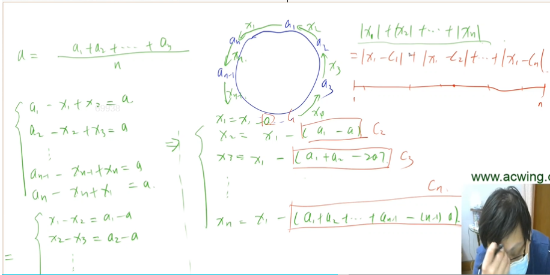

[活动 - AcWing](https://www.acwing.com/activity/content/16/)


## 位运算


## 递推与递归


## 前缀和与差分

### 激光炸弹

[AcWing 99. 激光炸弹 - AcWing](https://www.acwing.com/activity/content/problem/content/1788/)


### 增减序列

[AcWing 100. 增减序列 - AcWing](https://www.acwing.com/activity/content/problem/content/1789/)


#### 思路


本题是对一个区间的数赋值，让他最后数组每个值相同，既然是区间赋值，我们可以想着转换为差分数组来看一下

bn是由an构成的差分序列,b1=a1,b2=a2-a1……… .差分数组存着的是原数组这一项和前一项的差值。既然最后数组值都一样，则b2到bn都应该变为0 我们将本题题意转换为:进行多次操作后,b2~ bn变为0,b1和b~n+1~值任意(若改动原数组的an,就需要改动b~n+1~),(这样子就会令原数组每个值都相同!).我们所求就变成至少操作多少次,可以使b2 ~bn变为0,且在这前提下,b1有多少种值.

我们可以进行如图所示的以下四种操作,第四种没有意义,操作2和操作3等价.

选哪一种操作,由贪心的思路得知,要多采用第一种操作,因为它一次能改变两个b值,更能快速的将b数组变为0.(求一下所有正数的和:p,再是所有负数的和:q,我们第一种操作就可以进行min(abs(p),abs(q))次,再进行abs(p-q)的第二或第三种操作,就可以剩下的b变为0)=>也就是max(p,q)次.

然后我们要知道b1可以有多少种值.b1的值只会被操作二改变,我们就看操作2和操纵3怎么分配剩下的abs(p-q)次操作来觉得b1的数量.


#### 代码

```c++
//对一个区间的数赋值，使得整个数组值相同
//或对一个区间的数赋值，将一个数组变为另一个数组(空调题)
#include <cstdio>
#include <cstring>
#include <iostream>
#include <algorithm>

using namespace std;

const int N = 100010;

typedef long long LL;

int n;
int a[N], b[N];

int main()
{
     scanf("%d", &n);
     for (int i = 1; i <= n; i++)
          scanf("%d", &a[i]);
     for (int i = 1; i <= n; i++)
          b[i] = a[i] - a[i - 1];

     LL p = 0, q = 0;
     for (int i = 2; i <= n; i++)
          if (b[i] > 0)
               p += b[i];
          else
               q -= b[i];

     cout << max(p, q) << endl;
     cout << abs(p - q) + 1 << endl;

     return 0;
}

```


## 二分


### 最佳牛围栏


#### 思维

通过暴力来枚举所有区间，本题会超时，区间大小有N-F个，右端点可以走N-F次，N-F的平法是有可能超过1e9的。

在一段长度不固定的区间寻找平均值最大，采用了浮点数二分。(比较隐晦，因为此题并没有明显的单调性，但是这种求最值来二分枚举答案的，好像挺常见的)

这里的二分是用来枚举答案的。我们通过二分获得一个avg，check条件是判断有没有方案的平均值>=avg，有的话就mid=l(avg要放大)，不然就mid=r-1

判断判断有没有方案的平均值>=avg的方法很巧妙，先将a数组里所有数都减去avg，然后题目就等价于是否存在一个区间的和>=0.我们进行分个类，每一个数代表以它为右端点的所有区间，而题目还有要求区间长度必须>=F，所以左端点最大是k-F+1，


左端点i就是在[1,K-F+1]里任意选一个，而快速求区间和[i,k]就采用S~k~-S~i-1~的方法，i-1就属于[0,K-F]。要判断以k为右端点的区间有没有存在区间和>=0的，我们只要记录一下左端点移动时的最小值就可以。右端点就是从F到n。

```c++
for (int k = F; k <= n; k ++ )//巧妙！！
    {
        mins = min(mins, s[k - F]);
        if (s[k] >= mins) return true;
    }
```

而以上程序就用线性的时间满足了这个需求！！它只在移动右端点，并没有在每一次移动右端点的时候从头开始判断左端点，只要用一个变量维护一下左端点就可以了。因为比如右端点r为F的时候，左端点只有0，用mins存一下此刻的最小值，然后r变为F+1了，左端点可以在0~1之间选一个，我们不用再重复讨论0，而是只需要看一下新来的和之前的最小值比较一下，再选一个最小值就行！

但这个方法不能用在暴力上面，因为暴力的时候就算知道了以k为右端点的区间最大值，你想要求平均值还要除它的区间长度(加上长度这个变量，就算分子最大也不一定答案最大)


#### 代码

```c++
#include <cstdio>
#include <cstring>
#include <iostream>
#include <algorithm>

using namespace std;

const int N = 100010;

int n, F;
double a[N], s[N];

bool check(double avg)
{
     for (int i = 1; i <= n; i++)
          s[i] = s[i - 1] + a[i] - avg;

     double mins = 0; //浮点数
     for (int k = F; k <= n; k++)
     {
          mins = min(mins, s[k - F]); //维护最小值
          if (s[k] - mins >= 0)
               return true;
     }

     return false;
}

int main()
{
     scanf("%d%d", &n, &F);

     double l = 0, r = 0;
     for (int i = 1; i <= n; i++)
     {
          scanf("%lf", &a[i]);
          r = max(r, a[i]);
     }

     while (r - l > 1e-5)
     {
          double mid = (l + r) / 2; //浮点数二分不用>>
          if (check(mid))
               l = mid;
          else
               r = mid; //浮点数二分
     }

     printf("%d\n", (int)(r * 1000));

     return 0;
}

```


## 排序

### 七夕祭


#### 思路

没有用到什么算法，但这个分析过程很清晰，目的很明确。(y总nb)


写题前分析一下，要是总共有4家感兴趣的店铺，只有三列，肯定无法满足每一列的摊点数一样多(因为除不尽)，而如果有两行，则可以满足要求。

本题发现，每一个点的行内互换对这一行得数量没有影响，列内呼唤，对这一列个数没有影响，所以我们将行，列分开讨论，总次数就是操作行的次数的最小值+操作列的次数的最小值。(是一个经典问题均分纸牌问题，有例题(糖果传送))

因为每一行/列首尾相连，所以它成了一个环。(现在变成了环形均分纸牌问题233333)

我们先讨论行，如右，an代表着这一行感兴趣的摊点数的总数量，我们的目的是要使得每一行得摊点数量一样多。我们假设a1给了x1个到an(x1可正可负)，a~n~给了n个到a~n-1~……,最后a数组每一个数都相同=a,最小的操作次数就是 abs(x~n~)+abs(x~1~)+abs(x~2~)……… 的最小值




根据题意列出方程组，等量代换后发现x1=x1-0,x2=x1-(a1-a),x3=x1-(a1+a2-2a)…

我们将后半部分用c代替后，题目转换为|x1-c1|+|x1-c2|+|x1-c3|…(是一个经典问题，已知n个点，找一个点到所有点的距离之和最小,邮递员问题)：先将c数组排一个序，然后x1取排完序后这些点的中值(c~(n+1)/2~)(+1的原因是让他向上取整)


为什么取这个值呢？可以利用绝对值不等式进行证明：|x1-c1|+|x1-c2|+|x1-c3|…=>

(|x1-c1|+|cn-x1|)+(|x1-c2|+|c~n-1~-x1|)…	运用绝对值不等式原式>=|x1-c1+cn-x1|…… =>cn-c1+cn-1-c2+……. 要想取等于号，必须保证原式绝对值里的数都为正，所以x1取c~(n+1)/2~(是排完序得c数组得中值，这样才能保证(|x1-c1|+|cn-x1|)+(|x1-c2|+|c~n-1~-x1|绝对值都为正)


#### 代码

```c++
#include <bits/stdc++.h>
using namespace std;
const int N = 1e5 + 10;
typedef long long ll;
int row[N], col[N], s[N], c[N];
ll work(int n, int a[])
{
     for (int i = 1; i <= n; i++)
          s[i] = s[i - 1] + a[i];

     if (s[n] % n)
          return -1;
     int avg = s[n] / n;

     for (int i = 2; i <= n; i++)
          c[i] = s[i - 1] - (i - 1) * avg;
     c[1] = 0;
     sort(c + 1, c + n + 1); //求得x

     ll res = 0;
     for (int i = 1; i <= n; i++)
          res += (abs(c[i] - c[(n + 1) / 2]));
     return res;
}
int main()
{
     int n, m, t;
     cin >> n >> m >> t;
     while (t--)
     {
          int x, y;
          cin >> x >> y;
          row[x]++, col[y]++;
     }
     ll r = work(n, row);
     ll c = work(m, col);

     if (r != -1 && c != -1)
          printf("both %lld\n", r + c);
     else if (r != -1)
          printf("row %lld\n", r);
     else if (c != -1)
          printf("column %lld\n", c);
     else
          printf("impossible\n");
}
```


### 动态中位数


#### 思路

采用了对顶堆的数据结构


下面来存比较小的那些数，上面存比较大的那些数，并且随着不断放入数据，我们保证下面那个堆的数量要么等于上面那个堆(放入偶数个数)，要么比上面那个数量多1。只要维护好这样的数据结构，那么最后相求此时的中位数的时候，大根堆的第一个值一定就是答案！

维护：放入数据的时候，第一个数x放入大根堆，要是下一个数比x小就放入大根堆，比它大的话放入小根堆，这样子上面元素永远大于下面元素这个性质就维护好了。为了做好第二个性质，在插完这个数之后，不满足下面个数比上面个数多1的时候，下面多了就挤一个数到上面，少了就挤一个下来。

比较上下两个优先队列的值的时候，不能使用down.size()-up.size()>1,因为size()返回的是无符号长整数，会出问题。好像还可以用平衡树来做，但这题我们可以要求其他数无序，所以两个堆做法最简单

实现较为简单，因为堆的话可以采用优先队列，不用自己去写。

#### 

#### 代码

```c++
// 1千万的数据量，采用O(n)或nlogn。中位数:按顺序排列的数中，中间这个数
//(对顶堆这方法好像是叫对顶堆，面试挺常见)
//注意: 比较上下两个优先队列的值的时候，不能使用down.size()-up.size()>1,因为size()返回的是无符号长整数，会出问题。
//好像还可以用平衡树来做，但这题我们可以要求其他数无序，所以两个堆做法最简单

#include <bits/stdc++.h>
using namespace std;

int main()
{
     int t;
     cin >> t;
     int t1 = t;
     while (t1--)
     {
          int n, m;
          cin >> n >> m;
          priority_queue<int> q;
          priority_queue<int, vector<int>, greater<>> q1;

          vector<int> ans;
          for (int i = 1; i <= m; i++)
          {
               int x;
               cin >> x;
               if (q.empty() || x < q.top())
                    q.push(x);
               else
                    q1.push(x);

               if (q.size() > q1.size() + 1)
               {
                    q1.push(q.top());
                    q.pop();
               }
               if (q.size() < q1.size())
               {
                    q.push(q1.top());
                    q1.pop();
               }
               if (i & 1)
                    ans.push_back(q.top());
          }

          cout << n << ' ' << ans.size() << endl;
          for (int i = 0; i < ans.size(); i++)
          {
               cout << ans[i] << ' ';
               if ((i + 1) % 10 == 0 && i != 0)
                    cout << endl;
               else if (i == ans.size() - 1)
                    cout << endl;
          }
     }
}

```


### 超快速排序

#### 思路

本题就是一个冒泡排序，让你求把他变为升序的操作次数。但显然暴力做法会超时。

我们发现原序列变为上升序列的操作数刚好就是原序列逆序对的数量(每一个逆序对都必会交换一次)，所以本题变成了求数组逆序对的数量(刚开始还么发现，一直在分析emmmm)

求逆序对的话就采用基础课讲的，归并排序求逆序对，复杂度为nlogn


#### 代码

```c++
#include <cstdio>
typedef long long LL;
const int N = 500010;
int n;
LL q[N], w[N];

LL merge_sort(int l, int r)
{
     if (l == r)
          return 0;

     int mid = l + r >> 1;
     LL res = merge_sort(l, mid) + merge_sort(mid + 1, r);

     int i = l, j = mid + 1, k = 0;
     while (i <= mid && j <= r)
          if (q[i] <= q[j])
               w[k++] = q[i++];
          else
          {
               res += mid - i + 1;
               w[k++] = q[j++];
          }
     while (i <= mid)
          w[k++] = q[i++];
     while (j <= r)
          w[k++] = q[j++];

     for (i = l, j = 0; i <= r; i++, j++)
          q[i] = w[j];

     return res;
}

int main()
{
     while (scanf("%d", &n), n) //输入为0跳出循环
     {
          for (int i = 0; i < n; i++)
               scanf("%d", &q[i]);

          printf("%lld\n", merge_sort(0, n - 1));
     }

     return 0;
}

```


### RMQ

#### 思路

RMQ算法，是一个快速求区间最值的离线算法，预处理时间复杂度O（n*log(n)），查询O(1)，所以是一个很快速的算法。

当然这个问题用线段树同样能够解决，算法复杂度为：O(N)~O(logN) 。

RMQ的本质是动态规划.

首先用动态规划进行预处理，第一维n个，第二维log

处理出每一段的最大数:(有一种区间dp的感觉)

看这里的时候我有想过，既然[l,r]的最大值是max([l,mid],[mid,r]),那么为什么不可以这样分治下去呢？分治到每个区间只有一个数的时候。

但细想，觉得没必要，因为确定区间完后就可以dp了，再分治有点麻烦


查询：这个k有要求:2^k^<=len,然后答案就是求一下max(f[l] [k], f [r - 2^k^ - 1] [k])


#### 代码

```c++
#include <cstdio>
#include <cstring>
#include <algorithm>
#include <cmath>
using namespace std;

const int N = 200010, M = 18;

int n, m;
int w[N], lg[N];
int f[N][M];

void init()
{
     ;
     for (int j = 0; j < M; j++)
          for (int i = 1; i + (1 << j) - 1 <= n; i++)
               if (!j)
                    f[i][j] = w[i];
               else
                    f[i][j] = max(f[i][j - 1], f[i + (1 << j - 1)][j - 1]);
}

int query(int l, int r)
{
     int len = r - l + 1;
     int k = log(len) / log(2);
     return max(f[l][k], f[r - (1 << k) + 1][k]);
}

int main()
{
     scanf("%d", &n);
     for (int i = 1; i <= n; i++)
          scanf("%d", &w[i]);

     init();

     scanf("%d", &m);
     while (m--)
     {
          int l, r;
          scanf("%d%d", &l, &r);
          printf("%d\n", query(l, r));
     }

     return 0;
}

```


