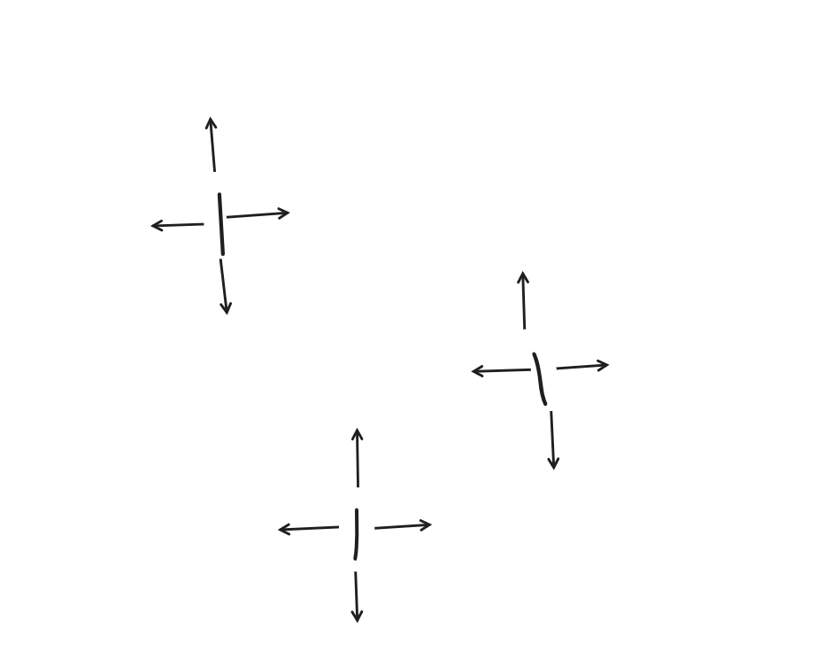

## Flood Fill

​	Flood Fill（泛洪填充）：从一个起始节点开始，把附近与其连通的节点提取出或填充成不同颜色，直到封闭区域内的所有节点都被处理过为止。
是从一个区域中提取若干个连通的点与其他相邻区域区分开(或分别染成不同颜色)的经典算法。

​	可以抽象成一个二维矩阵（图片其实就是像素点矩阵），然后从某个点开始向四周扩展，直到无法再扩展为止。

​	即求连通块问题的算法。
​	
​	具体实现采用BFS或DFS。

​	BFS求解：可以求出最短路或者判断两者是否连通，不存在爆栈的风险，但空间相对用的多一些而且代码相对来说繁琐一些。

​	DFS求解：DFS代码简洁，相对好写一些，但存在爆栈的风险，而且不能求出最短路。
​	(网上查的资料)


### 池塘记数

#### 题目


#### 思路

经典的bfs问题

线性的复杂度,每个点最多被找两遍


#### 代码

```c++
队列实现dfs

#include <bits/stdc++.h>
using namespace std;

int dir[8][2] = {1, 0, 0, 1, -1, 0, 0, -1, 1, 1, 1, -1, -1, 1, -1, -1};
const int N = 1e3 + 10;
char c[N][N];
int res = 0;
int n, m;
queue<pair<int, int>> q;
void bfs(int x, int y)
{

     q.push({x, y});
     c[x][y] = '.';
     while (q.size())
     {

          int sx = q.front().first, sy = q.front().second;
          q.pop();
          c[sx][sy] = '.';

          for (int i = 0; i < 8; i++)
          {
               int nx = sx + dir[i][0];
               int ny = sy + dir[i][1];

               if (nx < 0 || nx >= n || ny < 0 || ny >= m)
                    continue;
               if (c[nx][ny] == '.')
                    continue;

               q.push({nx, ny});
               c[nx][ny] = '.';//在这就要把它变为点,这步不能不要
          }
     }
     res++;
}

int main()
{

     cin >> n >> m;

     for (int i = 0; i < n; i++)
          for (int j = 0; j < m; j++)
          {
               cin >> c[i][j];
          }

     for (int i = 0; i < n; i++)
          for (int j = 0; j < m; j++)
          {
               if (c[i][j] == 'W')
               {
                    bfs(i, j);
               }
          }

     cout << res << endl;
}
```


```c++
手写队列

#include <bits/stdc++.h>
using namespace std;
#define x first
#define y second
int dir[8][2] = {1, 0, 0, 1, -1, 0, 0, -1, 1, 1, 1, -1, -1, 1, -1, -1};
const int N = 1e3 + 10;
const int M = 1e6 + 10;
char c[N][N];
int res = 0;
int n, m;
typedef pair<int, int> PII;
PII q[M];
void bfs(int sx, int sy)
{
     int hh = 0, tt = 0;
     q[0] = {sx, sy};
     c[sx][sy] = '.';

     while (hh <= tt)
     {
          PII t = q[hh++];

          for (int i = 0; i < 8; i++)
          {
               int nx = t.x + dir[i][0];
               int ny = t.y + dir[i][1];

               if (nx < 0 || nx >= n || ny < 0 || ny >= m)
                    continue;
               if (c[nx][ny] == '.')
                    continue;

               q[++tt] = {nx, ny};
               c[nx][ny] = '.';
          }
     }
}

int main()
{

     cin >> n >> m;

     for (int i = 0; i < n; i++)
          for (int j = 0; j < m; j++)
          {
               cin >> c[i][j];
          }

     for (int i = 0; i < n; i++)
          for (int j = 0; j < m; j++)
          {
               if (c[i][j] == 'W')
               {
                    bfs(i, j);
                    res++;
               }
          }
     cout << res;
}
```


### 城堡问题


#### 题目


#### 思路

稍微改了样子的经典bfs.(巧妙的bfs)

本来想着,输入的每个数字都是唯一的(如11就代表着它有着西北南三面墙),从而能在bfs的for循环里,判断下一个走的数字能不能从现在的位置走到,如第二行第一个的数字7,想往上走,发现是11,就知道了它南面有墙,走不到,直接continue.

但是写的时候,意识到想要实现这个思路,就必须要先讨论一遍所有可能出现的数字(11,6,3,10…),太多情况了,写起来会很冗余.

以下高能!(卡在这了 orz)

我们发现它墙是由1,2,4,8来表示的,刚好符合二进制的规则.所以我们直接用位运算就可以判断出这个数字是哪几面墙组成.(如11=>1011,只要这一位是0,代表这一位代表的方位没有墙.)

更巧妙的是,每一个数字都要经过4次位移,这刚好可以和bfs四次for循环判断方位结合起来


<!--对1,2,4,8这类数要敏感-->

#### 代码

```c++

#include <bits/stdc++.h>
using namespace std;
const int N = 55;
int dir[4][2] = {0, 1, 1, 0, 0, -1, -1, 0};
int g[N][N];
int st[N][N];
int n, m;
int area;
void bfs(int sx, int sy)
{
     queue<pair<int, int>> q;
     q.push({sx, sy});
     st[sx][sy] = 1;
     area = 0;
     while (q.size())
     {
          auto t = q.front();
          q.pop();
          area++;
          for (int i = 0; i < 4; i++)
          {
               int nx = t.first + dir[i][0];
               int ny = t.second + dir[i][1];
               if (nx < 0 || nx >= n || ny < 0 || ny >= m)
                    continue;
               if (st[nx][ny])
                    continue;
               if (g[nx][ny] >> i & 1)
                    continue;
                    //假如i=0,我们把dir[0][0/1]对应的方位设置为让现在这个点往东走,而如果这个数字二进制第0位是1的话,代表我们想去的点西面有墙,我们过不去,continue!
                   
               q.push({nx, ny});
               st[nx][ny] = 1;
          }
     }
}
int main()
{
     cin >> n >> m;
     for (int i = 0; i < n; i++)
          for (int j = 0; j < m; j++)
               cin >> g[i][j];
     int ans = 0;
     int num = 0;
     for (int i = 0; i < n; i++)
          for (int j = 0; j < m; j++)
          {
               if (!st[i][j])
               {
                    bfs(i, j);
                    ans = max(ans, area);
                    num++;
               }
          }
     cout << num << endl
          << ans;
}
```


### 山峰和山谷


#### 题目


#### 思路

经典bfs的变形


#### 代码

```c++
#include <bits/stdc++.h>
using namespace std;
const int N = 1e3 + 10;
int dir[8][2] = {1, 0, 0, 1, -1, 0, 0, -1, 1, 1, 1, -1, -1, 1, -1, -1};
int g[N][N];
int st[N][N];
int n;
int num1 = 0, num2 = 0;

void bfs(int sx, int sy)
{

     queue<pair<int, int>> q;
     q.push({sx, sy});
     st[sx][sy] = 1;
     int f = 0;
     int f1 = 0;
     while (q.size())
     {
          auto t = q.front();

          q.pop();
          for (int i = 0; i < 8; i++)
          {
               int nx = t.first + dir[i][0];
               int ny = t.second + dir[i][1];

               if (nx < 0 || nx >= n || ny < 0 || ny >= n)
                    continue;

               if (g[nx][ny] != g[sx][sy])
               {
                    if (g[nx][ny] < g[sx][sy])
                    {
                         if (f == 2)
                              f1 = 1;
                         f = 1;
                    }
                    else
                    {
                         if (f == 1)
                              f1 = 1;
                         f = 2;
                    }
                    continue;
               }
               if (st[nx][ny])
                    continue;
               q.push({nx, ny});
               st[nx][ny] = 1;
          }
     }
     if (f1)
          return;
     if (f == 1)
          num1++;

     else if (f == 2)
          num2++;

     else if (f == 0)
          num1++, num2++;
}

int main()
{

     cin >> n;

     for (int i = 0; i < n; i++)
          for (int j = 0; j < n; j++)
               cin >> g[i][j];

     for (int i = 0; i < n; i++)
          for (int j = 0; j < n; j++)
          {
               if (!st[i][j])
                    bfs(i, j);
                    }
     cout << num1 << ' ' << num2;
}
```


## 最短路问题


### 迷宫问题

#### 题目


#### 思路

简单的bfs求最短路,再加上考察了一个输出走过的路径


#### 代码

```c++

#include <bits/stdc++.h>
using namespace std;
const int N = 1010;
int a[N][N];
int st[N][N];
pair<int, int> pre[N][N];
vector<pair<int, int>> ans;
int dir[4][2] = {1, 0, -1, 0, 0, 1, 0, -1};
int n;
void bfs(int x, int y)
{
     queue<pair<int, int>> q;
     q.push({x, y});
     st[x][y] = 1;
     while (q.size())
     {
          auto t = q.front();
          q.pop();
          int sx = t.first, sy = t.second;
          for (int i = 0; i < 4; i++)
          {
               int nx = sx + dir[i][0];
               int ny = sy + dir[i][1];
               if (nx < 0 || nx >= n || ny < 0 || ny >= n)
                    continue;
               if (st[nx][ny])
                    continue;
               if (a[nx][ny] == 1)
                    continue;
               pre[nx][ny] = {sx, sy};
               if (nx == n - 1 && ny == n - 1)
                    return;

               q.push({nx, ny});
               st[nx][ny] = 1;
          }
     }
}

int main()
{

     cin >> n;
     for (int i = 0; i < n; i++)
          for (int j = 0; j < n; j++)
               cin >> a[i][j];

     bfs(0, 0);

     int x = n - 1, y = n - 1;
     ans.push_back({n - 1, n - 1});

     while (x != 0 || y != 0)
     {
          int x1, y1; //这里要加一个临时变量,不能直接把值赋给x,y.因为前面x会变,变了后,后面的y的值就不是原来的pre[x][y].second了
          x1 = pre[x][y].first, y1 = pre[x][y].second;
          x = x1, y = y1;
          ans.push_back({x, y});
     }

     reverse(ans.begin(), ans.end());
     for (int i = 0; i < ans.size(); i++)
          cout << ans[i].first << ' ' << ans[i].second << endl;
}

```


```c++

//手写队列,时间快了一倍左右

#include <cstring>
#include <iostream>
#include <algorithm>

#define x first
#define y second

using namespace std;

typedef pair<int, int> PII;

const int N = 1010, M = N * N;

int n;
int g[N][N];
PII q[M];
PII pre[N][N];

void bfs(int sx, int sy)
{
    int dx[4] = {-1, 0, 1, 0}, dy[4] = {0, 1, 0, -1};

    int hh = 0, tt = 0;
    q[0] = {sx, sy};

    memset(pre, -1, sizeof pre);
    pre[sx][sy] = {0, 0};
    while (hh <= tt)
    {
        PII t = q[hh ++ ];

        for (int i = 0; i < 4; i ++ )
        {
            int a = t.x + dx[i], b = t.y + dy[i];
            if (a < 0 || a >= n || b < 0 || b >= n) continue;
            if (g[a][b]) continue;
            if (pre[a][b].x != -1) continue;

            q[ ++ tt] = {a, b};
            pre[a][b] = t;
        }
    }
}

int main()
{
    scanf("%d", &n);

    for (int i = 0; i < n; i ++ )
        for (int j = 0; j < n; j ++ )
            scanf("%d", &g[i][j]);

    bfs(n - 1, n - 1);

    PII end(0, 0);

    while (true)
    {
        printf("%d %d\n", end.x, end.y);
        if (end.x == n - 1 && end.y == n - 1) break;
        end = pre[end.x][end.y];
    }

    return 0;
}

```


### 武士风度的牛


#### 题目


#### 思路

经典bfs求最短路(只不过走法不是向上走一格,向下走一格...),加上了要输出路径长度


#### 代码


```c++
用上一题记录路径的方法,来计算步数

#include <bits/stdc++.h>
using namespace std;
const int N = 160;
char g[N][N];
int st[N][N];
int dir[8][2] = {2, 1, 2, -1, -2, 1, -2, -1, 1, 2, 1, -2, -1, 2, -1, -2};
int n, m;
int step = 0;
pair<int, int> pre[N][N];
void bfs(int x, int y)
{
     queue<pair<int, int>> q;
     q.push({x, y});
     st[x][y] = 1;
     while (q.size())
     {
          auto t = q.front();
          q.pop();
          int sx = t.first, sy = t.second;
          for (int i = 0; i < 8; i++)
          {
               int nx = sx + dir[i][0];
               int ny = sy + dir[i][1];
               if (nx < 0 || nx >= n || ny < 0 || ny >= m)
                    continue;
               if (st[nx][ny])
                    continue;
               if (g[nx][ny] == '*')
                    continue;
               pre[nx][ny] = {sx, sy};
               if (g[nx][ny] == 'H')
                    return;

               q.push({nx, ny});
               st[nx][ny] = 1;
          }
     }
}

int main()
{

     cin >> m >> n;
     int x1, y1, ex, ey;
     for (int i = 0; i < n; i++)
          for (int j = 0; j < m; j++)
          {
               cin >> g[i][j];
               if (g[i][j] == 'K')
                    x1 = i, y1 = j;
               if (g[i][j] == 'H')
                    ex = i, ey = j;
          }
     bfs(x1, y1);

     int x = ex, y = ey;
     while (x != x1 || y != y1)
     {
          int x2, y2;
          x2 = pre[x][y].first, y2 = pre[x][y].second;

          x = x2, y = y2;
          step++;
     }
     cout << step;
}
```


```c++
直接用dist数组存储步数

#include <cstring>
#include <iostream>
#include <algorithm>

#define x first
#define y second

using namespace std;

typedef pair<int, int> PII;

const int N = 155, M = N * N;

int n, m;
char g[N][N];
PII q[M];
int dist[N][N];

int bfs()
{
    int dx[] = {-2, -1, 1, 2, 2, 1, -1, -2};
    int dy[] = {1, 2, 2, 1, -1, -2, -2, -1};

    int sx, sy;
    for (int i = 0; i < n; i ++ )
        for (int j = 0; j < m; j ++ )
            if (g[i][j] == 'K')
                sx = i, sy = j;

    int hh = 0, tt = 0;
    q[0] = {sx, sy};

    memset(dist, -1, sizeof dist);
    dist[sx][sy] = 0;

    while (hh <= tt)
    {
        auto t = q[hh ++ ];

        for (int i = 0; i < 8; i ++ )
        {
            int a = t.x + dx[i], b = t.y + dy[i];
            if (a < 0 || a >= n || b < 0 || b >= m) continue;
            if (g[a][b] == '*') continue;
            if (dist[a][b] != -1) continue;
            if (g[a][b] == 'H') return dist[t.x][t.y] + 1;

            dist[a][b] = dist[t.x][t.y] + 1;
            q[ ++ tt] = {a, b};
        }
    }

    return -1;
}

int main()
{
    cin >> m >> n;

    for (int i = 0; i < n; i ++ ) cin >> g[i];

    cout << bfs() << endl;

    return 0;
}


```


### 抓住那头牛


#### 题目


#### 思路

emm,本题要是没有看标签,可能想不到要用bfs来解,好神奇23333.

和bfs经典求最短路的唯一区别是: 每一个点去往下一个点都有3种可能:+1,-1,*2.而bfs经典求最短路里的每个点可以去往上下左右四个点.我们每讨论一个点,把它从队列里取出来`q.front()`,再把它能走到的其他三个点放入队列,然后`q.pop()`,接着继续取点.

还要用st数组记录一下走过的x值,走过的要是再碰到就不用管了.因为本题输出的是最小花销,先碰到的点绝对比后碰到的花销要小。

其实本来看到一个点有三种可能去处的时候，想到的是dfs，但本题要求的是最短路，就用了bfs。


#### 代码

```c++

#include <bits/stdc++.h>
using namespace std;
const int Max = 1e5 + 10;
int N, K;
int st[Max], dist[Max];
void bfs(int x)
{
     queue<int> q;
     q.push(x);
     st[x] = 1;
     while (q.size())
     {
          int t = q.front();
          q.pop();
          for (int i = 0; i < 3; i++)
          {
               int nx;
               if (i == 0)
                    nx = t + 1;
               if (i == 1)
                    nx = t - 1;
               if (i == 2)
                    nx = t * 2;
               if (st[nx])
                    continue;
               if (nx < 0 || nx > Max)
                    continue;

               dist[nx] = dist[t] + 1;
               if (nx == K)
                    return;

               q.push(nx);
               st[nx] = 1;
          }
     }
}

int main()
{
     cin >> N >> K;
     bfs(N);
     cout << dist[K];
}

```


```c++
或者不用for循环表示三种状态，而是一次就全写出来

#include <cstring>
#include <iostream>
#include <algorithm>

using namespace std;

const int N = 1e5 + 10;

int n, k;
int q[N];
int dist[N];

int bfs()
{
    memset(dist, -1, sizeof dist);
    dist[n] = 0;
    q[0] = n;

    int hh = 0, tt = 0;

    while (hh <= tt)
    {
        int t = q[hh ++ ];

        if (t == k) return dist[k];

        if (t + 1 < N && dist[t + 1] == -1)
        {
            dist[t + 1] = dist[t] + 1;
            q[ ++ tt] = t + 1;
        }
        if (t - 1 >= 0 && dist[t - 1] == -1)
        {
            dist[t - 1] = dist[t] + 1;
            q[ ++ tt] = t - 1;
        }
        if (t * 2 < N && dist[t * 2] == -1)
        {
            dist[t * 2] = dist[t] + 1;
            q[ ++ tt] = t * 2;
        }
    }

    return -1;
}

int main()
{
    cin >> n >> k;

    cout << bfs() << endl;

    return 0;
}

作者：yxc
```


## 多源BFS

给出n个点，再给一个集合,集合里面包含了这n个点的一部分点,现在要求出这n个点(所有)到这点的集合的最短距离。(最短距离就是假如一个点x，它到集合中每个点的距离是d1,d2,d3,d4……,那么点x到集合的最短距离就是d1,d2,d3这些距离的最小值)


### 矩阵距离

#### 题目


#### 思路

题目大意是矩阵中每一个位置到所有1的最短距离。(所有的1就是上面所说的点的集合)

要是直接用bfs求解，把每个1当作起点，遍历一遍全图，给每个位置附上距离(保留最小)，肯定会超时，因为复杂度是n^4^

多源bfs算法写起来比较简单，和普通bfs的区别就在于要先遍历一遍矩阵，把所有为1的点先存入队列，然后再进行`while(q.size())`。

证明可以结合以下图片和代码进行理解:




如上图这个矩阵，1的位置如图分布，我们先把1都存入队列，然后开始遍历每个1的四周，给其它点附上距离，要是碰到这个点已经有距离了，直接跳过，因为代表肯定有1个1离这个点的距离比你更近！！这样遍历完全图退出bfs，每个点遍历一遍，复杂度是n^2^。


#### 代码

```c++

#include <bits/stdc++.h>
using namespace std;
const int N = 1100;
int dir[4][2] = {0, 1, 1, 0, 0, -1, -1, 0};
char g[N][N];
int st[N][N], dist[N][N];
int n, m;
queue<pair<int, int>> q;

void bfs()
{
     while (q.size())
     {
          auto t = q.front();
          q.pop();
          for (int i = 0; i < 4; i++)
          {
               int x = t.first, y = t.second;
               int nx = x + dir[i][0];
               int ny = y + dir[i][1];
               if (nx < 0 || nx >= n || ny < 0 || ny >= m)
                    continue;
               if (st[nx][ny])
                    continue;
               if (g[nx][ny] == '1')
                    continue;
               dist[nx][ny] = dist[x][y] + 1;
               q.push({nx, ny});
               st[nx][ny] = 1;
          }
     }
}
int main()
{
     cin >> n >> m;
     for (int i = 0; i < n; i++)
          for (int j = 0; j < m; j++)
               cin >> g[i][j];

     for (int i = 0; i < n; i++)
          for (int j = 0; j < m; j++)
          {
               if (g[i][j] == '1')
               {
                    q.push({i, j});
                    st[i][j] = 1;
               }
          }
     bfs();
     for (int i = 0; i < n; i++)
     {
          for (int j = 0; j < m; j++)
          {
               cout << dist[i][j] << ' ';
          }
          cout << endl;
     }
}
```

```c++
手写队列

#include <cstring>
#include <iostream>
#include <algorithm>

#define x first
#define y second

using namespace std;

typedef pair<int, int> PII;

const int N = 1010, M = N * N;

int n, m;
char g[N][N];
PII q[M];
int dist[N][N];

void bfs()
{
    int dx[4] = {-1, 0, 1, 0}, dy[4] = {0, 1, 0, -1};

    memset(dist, -1, sizeof dist);

    int hh = 0, tt = -1;
    for (int i = 1; i <= n; i ++ )
        for (int j = 1; j <= m; j ++ )
            if (g[i][j] == '1')
            {
                dist[i][j] = 0;
                q[ ++ tt] = {i, j};
            }

    while (hh <= tt)
    {
        auto t = q[hh ++ ];

        for (int i = 0; i < 4; i ++ )
        {
            int a = t.x + dx[i], b = t.y + dy[i];
            if (a < 1 || a > n || b < 1 || b > m) continue;
            if (dist[a][b] != -1) continue;

            dist[a][b] = dist[t.x][t.y] + 1;
            q[ ++ tt] = {a, b};
        }
    }
}

int main()
{
    scanf("%d%d", &n, &m);
    for (int i = 1; i <= n; i ++ ) scanf("%s", g[i] + 1);

    bfs();

    for (int i = 1; i <= n; i ++ )
    {
        for (int j = 1; j <= m; j ++ ) printf("%d ", dist[i][j]);
        puts("");
    }

    return 0;
}


```


## 最小步数模型

