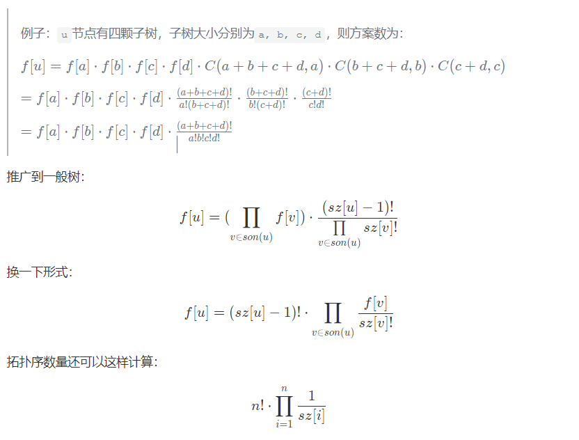

[牛客小白月赛55](https://ac.nowcoder.com/acm/contest/38630#question)

## A


**思路**

单纯的求等差中项,ez


**code:**

```c++
#include<bits/stdc++.h>
using namespace std;

int main()
{
    int t;
    int x,y;
    cin>>x>>y;
    cout<<2*y-x;
}
```


## B

**题意**

​	给你两个数a,b，都<2^63^，让你输出一个c使得a&c=b&c,要尽可能大,但也<2^63^


**思路**

​	只要比较a和b的二进制数,其中ai=bi(**相同位置**都是0或都是1),则c的相同位置上我们放1(ci=1),要是不相同,c这个位置放0。要是a二进制数位数是30位，b是28位，则29\~30这一段位置，c填充0。31~62这一串位置,都填充1。

​	想要c竟可能大，就要使得它尽量都填充1


code：

```c++
#include <bits/stdc++.h>
#define int long long
using namespace std;
const int N = 3e5 + 10, mod = 998244353;
int a[N], degree[N], x[N], y[N];

int main()
{
     int a = 1, b = 1;
     cin >> a >> b;
     cout << ((1LL << 63) - 1LL) - (a ^ b);

     return 0;
}
```

or

```c++
#include <algorithm>
#include <iostream>
 
using namespace std;
 
signed main()
{
    long long a, b;
    cin >> a >> b;
    long long c = 0;
    for (int i = 62; i >= 0; i -- )
        if ((((a >> i) & 1) && (b >> i & 1)) ||(!(a >> i & 1) && !(b >> i & 1)))
            c += (long long)1 << i;
    cout << c << endl;
}
```


## C

**题意**

每次给你一个数a,要你求出斐波那契数列中距离a最近的数F~x~,并输出其中下标x


**思路**

​	预处理出<=1e18的斐波那契数列,并使用二分查找,找到其中距离a最近的那个。


code：


```c++
#include <bits/stdc++.h>
using namespace std;
const int N = 100;
long long f[N];
void init()
{
     for (int i = 1; i <= N; i++)
     {
          if (i == 1 || i == 2)
               f[i] = 1;
          else
               f[i] = f[i - 1] + f[i - 2];
     }
}

int main()
{
     init();
     int t;
     cin >> t;
     while (t--)
     {
          long long n;
          cin >> n;
          int pos = lower_bound(f, f + N, n) - f;
          if (abs(f[pos - 1] - n) < abs(f[pos] - n))
               cout << pos - 1 << '\n';
          else
               cout << pos << '\n';
     }
}
```


## D

**思路**

​	ez题


code：

```c++
#include <bits/stdc++.h>
using namespace std;
const int N = 1e6 + 10;
int a[N];
int main()
{
     int n;
     cin >> n;
     for (int i = 1; i <= n; i++)
          cin >> a[i];
     int abs = 0;
     for (int i = 1; i <= n; i++)
     {
          if (a[i] - i > 0)
               abs += (a[i] -i);
     }

     if (abs & 1)
          cout << "ZZZ" << '\n';
     else
          cout << "SSZ" << '\n';
}
```


## *E

**题意：**

​	对于 n 个节点有根树（点的编号从 1 到 n），我们设节点 u 的“长链长度”为 hu，其可以通过如下方式计算：
​	 即对于叶子节点，其 h 值为 0，否则为所有儿子节点中最大的 h 值 +1。
​	 现给定一棵树的 h1,h2,⋯ ,hn，请还原该树的形态，或报告无解。如有多棵满足限制的树，输出任意一棵即可，详见输出格式。 

  

**思路**

​	一道简单的构造树的题目，直接按照题意进行构造就可以了，先找到h值最大的max，那个点就是根节点，然后再从h=max-1开始，每一个相同h的点，都要连接一条边到上一层h+1上的点，不能让上一层的点空着，不然空着的点h值直接变成0了（叶子节点）。

​	用vector::v[N]来存储同一h上的所有点

code：

```c++
#include <bits/stdc++.h>
using namespace std;
const int N = 2e5 + 10;
#define x first
#define y second
typedef pair<int, int> pii;
vector<pii> ans;
vector<int> v[N];
int h[N];
signed main()
{
     ios::sync_with_stdio(0);
     cin.tie(nullptr);
     int t, n, i, j, k, m;
     cin >> t;
     while (t--)
     {
          ans.clear();
          cin >> n;
          for (i = 0; i <= n + 5; i++)
               v[i].clear();
          int mx = -1, maxx = -1;
          for (i = 1; i <= n; i++)
          {
               cin >> h[i]; // h[i]
               v[h[i]].push_back(i);
               if (h[i] > maxx)
                    maxx = h[i], mx = i; //找根节点和根节点所在距离
          }
          int f = 0;
          for (i = 0; i <= maxx; i++) //判断有没有树
          {
               if (!v[i].size())
                    f = 1;
               if (i && v[i].size() > v[i - 1].size())//h层的点数居然比下一次多,代表h层必有叶子节点,不符合题意
                    f = 1;
          }
          if (v[maxx].size() != 1)
               f = 1;
          if (f)
          {
               cout << "-1\n";
               continue;
          }
          for (i = maxx - 1; i >= 0; i--) //按h从大到小构造树
          {
               int x = v[i + 1][0];
               // h大的节点下面必连着h小的节点,也就是h大的节点数量必定多余h小的节点数量
               for (j = 0; j < v[i + 1].size(); j++)
               {
                    ans.push_back({v[i][j], v[i + 1][j]});
               }
               for (j = v[i + 1].size(); j < v[i].size(); j++)
               {
                    ans.push_back({v[i][j], x}); // 这一层多余的节点随便挑上一层的节点连就可以了
               }
          }
          cout << mx << "\n";	//输出根节点
          for (auto s : ans)
               cout << s.x << " " << s.y << "\n";	//输出每一条边
     }
}
```


## *F

**题意**

​	至至子开有 n 家公司，第 iii 家公司有 ci 个员工，并且在该公司内形成了 ci−1 对**直接上下级**的关系（注意到 BOSS 是没有直接上级的）。今天他良心发现想让**这** n **家公司的所有员工**排队买票旅游。

​	 然而这些人的等级观念很重——他们约定一个人在排队的时候不能排在其直接或间接上级的前面（若 a 是 b 的直接上级或间接上级，b 是 c 的直接/间接上级，则 a 是 c 的间接上级）。

 	于是至至子很好奇，一共有多少种符合条件的排队方案呢？由于这个数可能很大，所以请输出答案对 1e9+7取模的结果。


**思路**

​	本次有点难度的题目，采用树形dp，输出树上拓扑序。

​	每个公司是一棵树，每个公司的计算方案实际上就是计算这棵树的拓扑序的个数。用树形DP求解。

f[u] : 以`u`为根的子树的拓扑序数

sz[u] ： 以`u`为根的子树的大小（节点的数量）

​	当树为二叉树时，将两个子树`v1,v2`进行合并：即先把各子树的方案数乘起来算出总方案，然后考虑各子树元素的相对排列顺序，即在总的节点个数中选`sz[v1]`排在前面的`sz[v1]`个位置，剩下的排在后面，保证每颗子树的相对拓扑序不变。

​	转移方程：$$f[u]=f[v1]*f[v2]*C(sz[v1]+sz[v2],sz[v1])$$

例子：`u`节点有四颗子树，子树大小分别为`a, b, c, d`，则方案数为：

​	$$f[u]=f[a]*f[b]*f[c]*f[d]⋅C(a+b,a)⋅C(a+b+c,b)⋅C(a+b+c+d,d)$$



​	如：堆1: a,b,c,d,e 然后来了又一堆 f,g,h,i,现在想把它混合在一起,我们先不讨论两堆内部的排序，单把他们混在一起，就是C(sz[1]+sz[2]，sz[1])也可以写成：C(sz[1]+sz[2]，sz[2])

​	求组合数可以采用预处理的方式，并且里面除法取模，需要用到逆元。

[算法学习笔记(9)：逆元 - 知乎 (zhihu.com)](https://zhuanlan.zhihu.com/p/100587745)


code：

```c++
#include <bits/stdc++.h>
using namespace std;
const int maxn = 1e5 + 5;
const int mod = 1e9 + 7;
typedef long long ll;
int T, siz[maxn], n, x;
vector<int> v[maxn];
ll f[maxn], fac[maxn], inv[maxn];

void Init()
{
     f[0] = f[1] = fac[0] = fac[1] = inv[0] = inv[1] = 1;
     int N = 1e5;
     for (int i = 2; i <= N; ++i)
     {
          f[i] = f[i - 1] * i % mod;
          inv[i] = mod - mod / i * inv[mod % i] % mod;
          fac[i] = fac[i - 1] * inv[i] % mod;
     }
}

ll C(int n, int m)
{
     return f[m] * fac[n] % mod * fac[m - n] % mod;
}

ll dfs(int u)
{
     ll res = 1;
     for (int i = 0; i < v[u].size(); ++i)
     {
          int e = v[u][i];
          res = res * dfs(e) % mod; //结果不断累乘
          siz[u] += siz[e];
          res = res * C(siz[e], siz[u]) % mod;
     }
     siz[u]++;
     return res;
}

int main()
{
     scanf("%d", &T), Init();
     ll ans = 1, sum = 0;
     while (T--)
     {
          scanf("%d", &n);
          siz[1] = 0;
          for (int i = 2; i <= n; ++i)
          {
               scanf("%d", &x), siz[i] = 0;
               v[x].push_back(i);
          }
          ans = ans * dfs(1) % mod, sum += n;
          ans = ans * C(n, sum) % mod;
          for (int i = 1; i <= n; ++i)
               v[i].clear();
     }
     printf("%lld\n", ans);
     return 0;
}
```

or

```c++
#include <bits/stdc++.h>
using namespace std;
#define int long long
#pragma GCC optimize(3)
#define re register int
typedef pair<int, int> PII;
#define pb push_back
#define mb pop_back
#define debug(a) cout << a << ' ';
#define fer(i, a, b) for (re i = a; i <= b; i++)
#define der(i, a, b) for (re i = a; i >= b; i--)
const int N = 1e5 + 10;
const int mod = 1e9 + 7;
int ans = 1;
int sum;
int dp[N];
int A[N];
int sz[N];
vector<int> v[N];
int qmi(int a, int b)
{
     int res = 1;
     while (b)
     {
          if (b & 1)
               res = res * a % mod;
          a = a * a % mod;
          b >>= 1;
     }
     return res;
}
void dfs(int u)
{
     bool ok = false;
     for (auto x : v[u])
     {
          ok = true;
          int j = x;
          dfs(j);
          sz[u] += sz[j];
          dp[u] = dp[u] * qmi(A[sz[j] + 1], mod - 2) % mod * dp[j] % mod;
     }
     if (ok)
     {
          dp[u] = dp[u] * A[sz[u]] % mod;
     }
}
signed main()
{
     ios::sync_with_stdio(false);
     cin.tie(0);
     cout.tie(0);
     int n;
     cin >> n;
     A[1] = 1;
     for (int i = 2; i < N; i++)
          A[i] = (A[i - 1] * i) % mod;
     for (int i = 0; i < n; i++)
     {
          int m;
          cin >> m;
          for (int j = 1; j <= m; j++)
               dp[j] = 1, v[j].clear(), sz[j] = 0;
          sum += m;
          ans = ans * qmi(A[m], mod - 2) % mod;
          for (int j = 2; j <= m; j++)
          {
               int x;
               cin >> x;
               v[x].pb(j);
               sz[x]++;
          }
          dfs(1);
          ans = ans * dp[1] % mod;
     }
     ans = ans * A[sum] % mod;
     cout << ans << endl;
     return 0;
}

```

